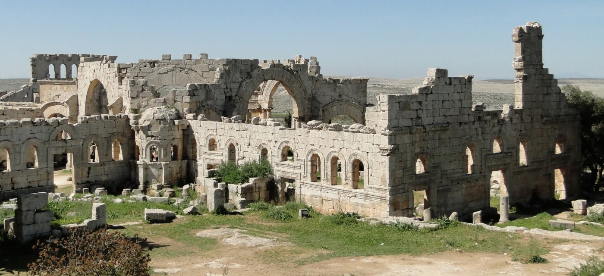
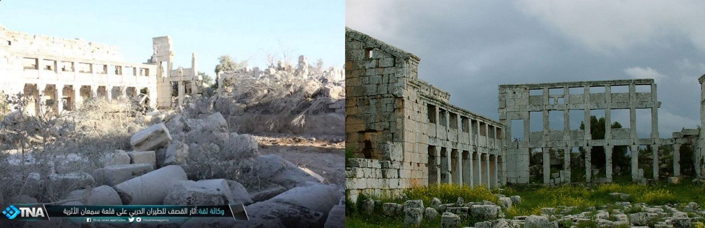
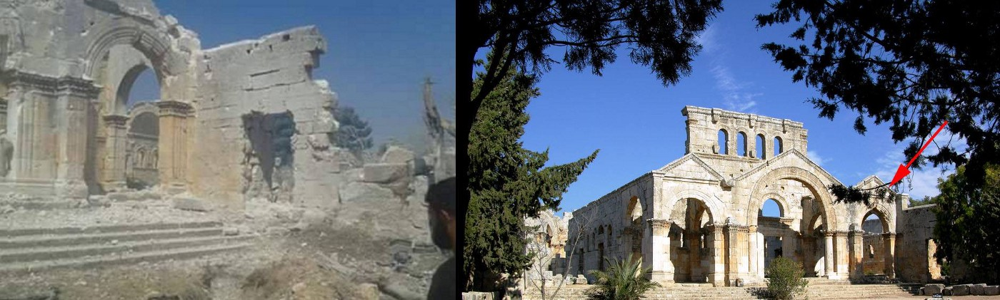
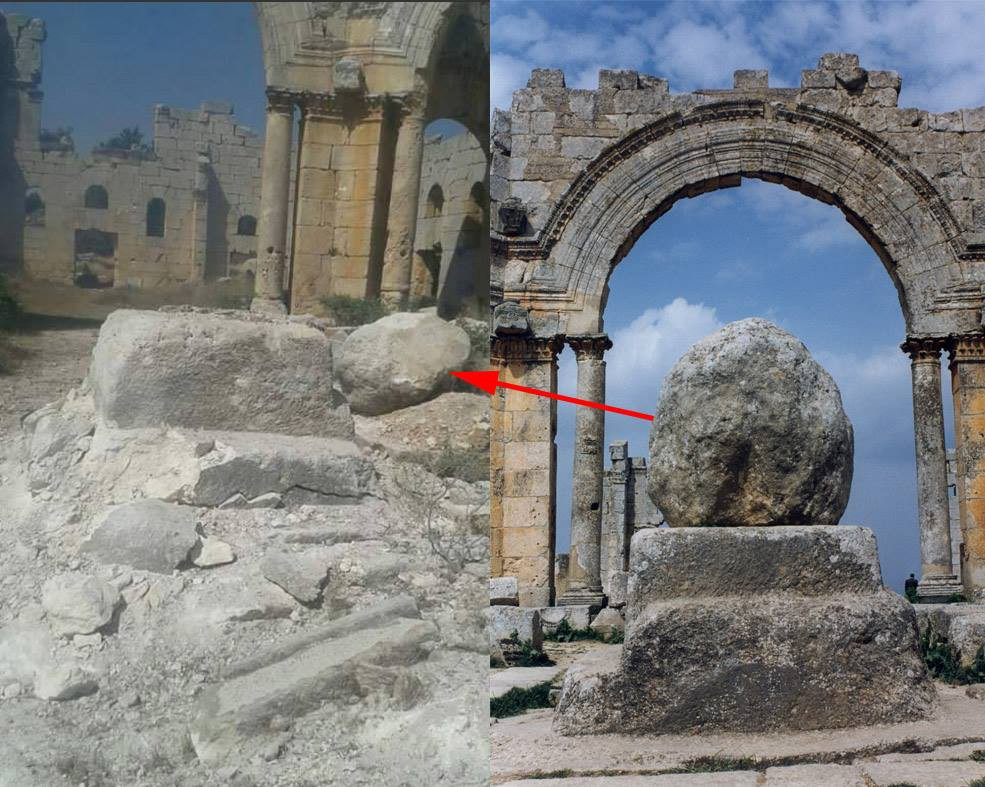
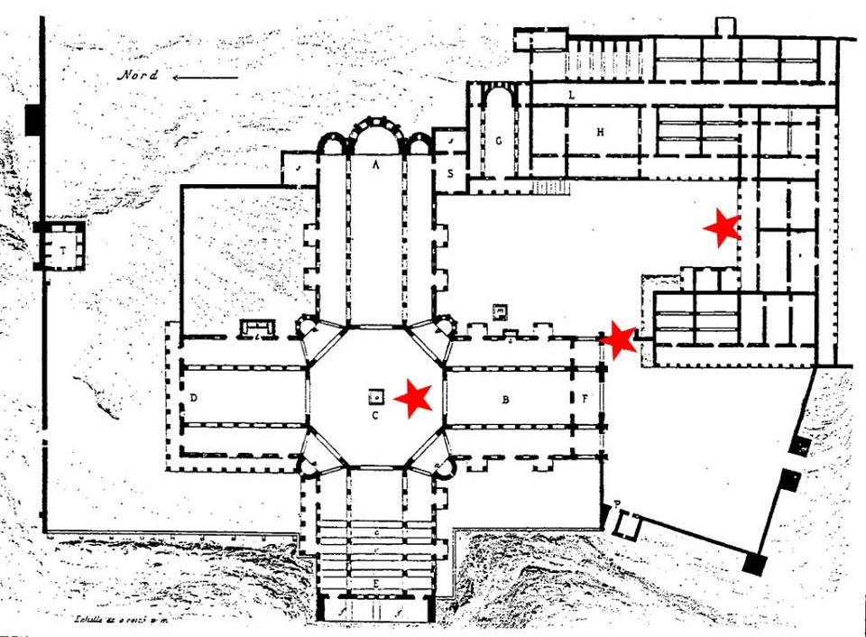
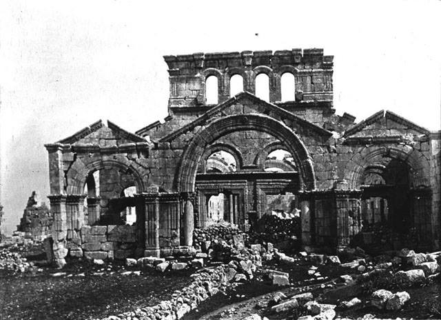

### AYS report: UNESCO World Heritage site of Qal’at Se’man damaged in a Russian airstrike

> Better known as the Church of Saint Symeon Stylites, Qal’at Se’man is one of the earliest dated buildings in the limestone massif stretching between Aleppo and Idlib\. The building is entirely unique in the history of medieval Christian architecture, writes byzantine art historian Shannon Steiner 

The Church of Saint Symeon Stylites photographed on 5 April 2010, before the Syrian uprising; PHOTO: Bernard Gagnon

**Around or just after midnight on Friday, 13 May 2016, [The Day After NGO](http://tda-sy.org/?lang=en) reported that a Russian airstrike hit the UNESCO World Heritage site of Qal’at Se’man, known as the Church of Saint Symeon Stylites\.**

The church is located approximately 30 km northwest of Aleppo in the region known as limestone massif\. The massif hosts a large number of remains of early Christian and Byzantine\-period settlements commonly called the “Dead Cities,” many of which are remarkably well\-preserved and which also have no equivalents elsewhere in the world\. Scholars have counted the remains of up to 700 villages in the area stretching between Aleppo and Idlib\. Qal’at Se’man itself is one of the earliest dated buildings in the massif\.

Our early estimation of the area with most damage: monastery buildings to the east of the main church\.

The church was consecrated in 475 CE/AD, and the entire structure is built around the remains of a column that was once home to the very first stylite saint, Symeon the Elder\. Stylite saints were early Christian monks who chose an extreme form of asceticism\. They lived their lives entirely on the top of tall columns or pillars \(stylos, in Greek\) \. By restricting the movement of their bodies and placing themselves up high, stylites tried to imitate the sufferings of Christ on the cross and attempted to use prayer to combat demons, which were thought at the time to live in the air\.

Significant damage to the eastern\-most pediment of the south basilica narthex facade and damage to the wall adjoining the cloister/monastery\.

Extreme monasticism was characteristic of early Christian communities in Syria, who were known for their special devotion and enthusiasm\. The fourth\-century bishop Theodoret of Cyrrhus once called Syrian monks “the lions of Christendom\.” Theodoret also tells us how pilgrims came from as far away as Britain, Italy, and Persia to meet Saint Symeon and to have him perform miracles\. Eventually the village of Deir Se’man grew around Saint Symeon and his column and became a huge cultural center in Byzantine Syria\.

After the death of the saint, the Byzantine emperor Zeno paid for the construction of a monumental church surrounding the column\. Qal’at Se’man remained a very famous and important pilgrimage site throughout the Middle Ages and well into the present\-day, when it became one of Syria’s most famous tourist attractions\.

Early photo evidence shows significant damage to the column pedestal \(taken from oposite angles\)

The building itself is entirely unique in the history of medieval Christian architecture\. It is made of four basilicas in the shape of a cross with an octagonal space around the column\. Architectural carving in the shape of complex leaf and vine scrolls, shells, crosses, and windblown acanthus plants decorates every surface of the building and is known to be some of the best in the world\.

Red stars indicate our early estimation of areas damaged in the bombing \(no official reports yet\)

When the revolution began in Syria, Qal’at Se’man became an important stronghold for opposition groups\. It has been difficult to track who has had control of it, but it has belonged alternately to the Islamic Front and to Kurdish groups\. These groups have mostly used the church to store food and medical supplies\. At no time was the building ever under the control of ISIS, or, to my knowledge, ever a target for ISIS\.

Monumental façade of the south basilica of Qal’at Se’man, photographed by Gertrude Bell in March, 1905\.

An unknown islamist group filmed a video of women firing rifles in front of the church’s iconic façade in 2015, but neither ISIS nor Al\-Nusra etc\. ever claimed responsibility for it\. This is important, because Russia has justified these airstrikes as fighting against ISIS\. This airstrike cannot have been motivated by any fight against ISIS, because ISIS has literally never been anywhere near this monument\. The airstrike can only have been motivated by the goal of cutting off food and medical supplies to opposition forces\. In the meantime, they have also caused serious damage to one of Syria’s most important cultural heritage monuments, a building that Syrians have lived around and loved and honored for over 1500 years\.

**_For AYS: Shannon Steiner, PhD Candidate in the history of byzantine art at Bryn Mawr College_**

_Converted [Medium Post](https://areyousyrious.medium.com/ays-report-unesco-world-heritage-site-of-qalat-se-man-destroyed-in-a-russian-airstrike-c2ea4d36b8f3) by [ZMediumToMarkdown](https://github.com/ZhgChgLi/ZMediumToMarkdown)._
