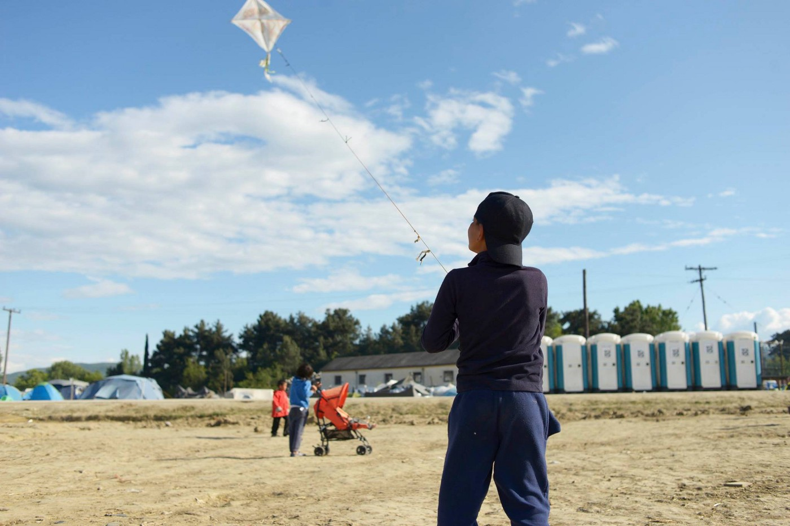
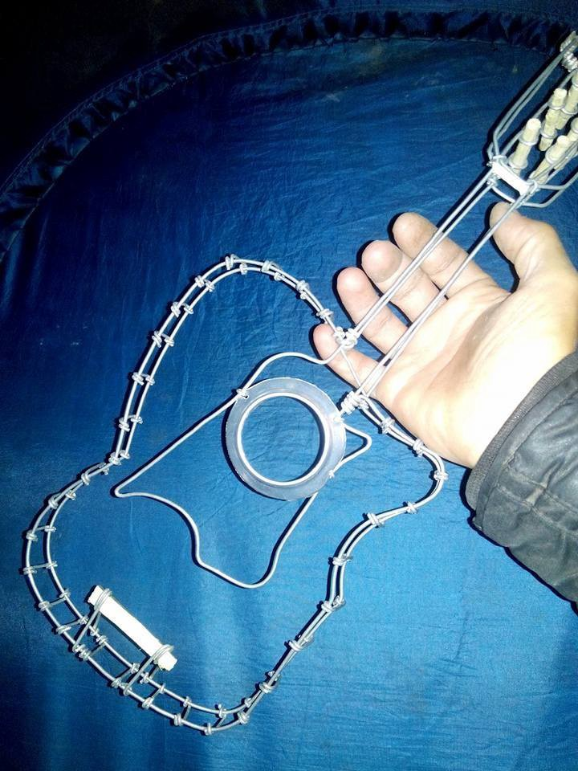
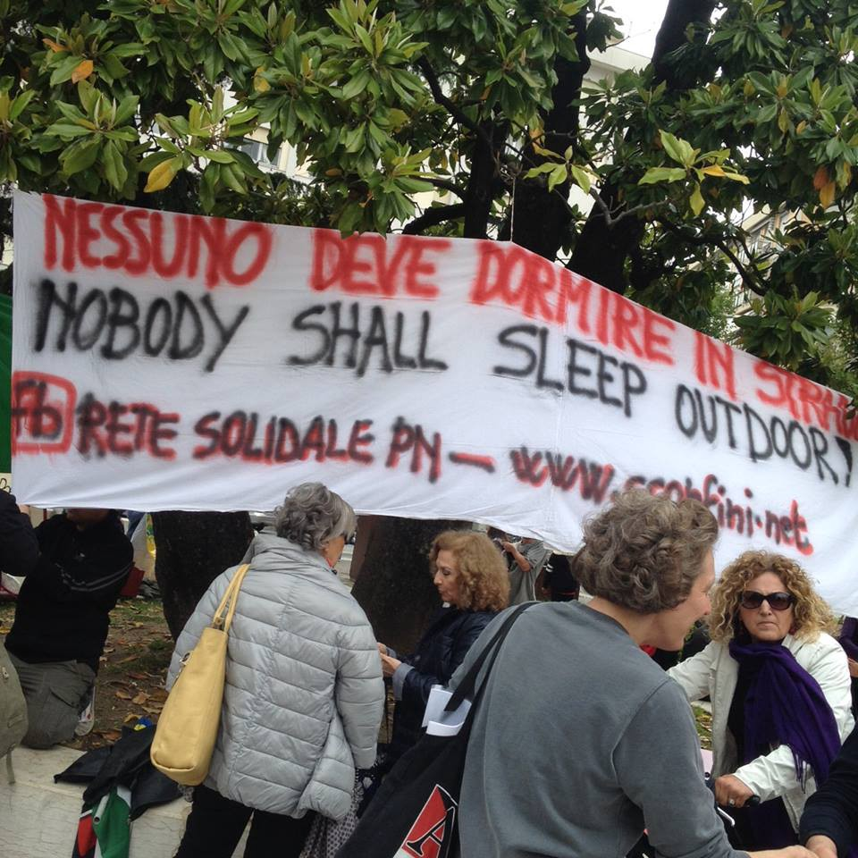
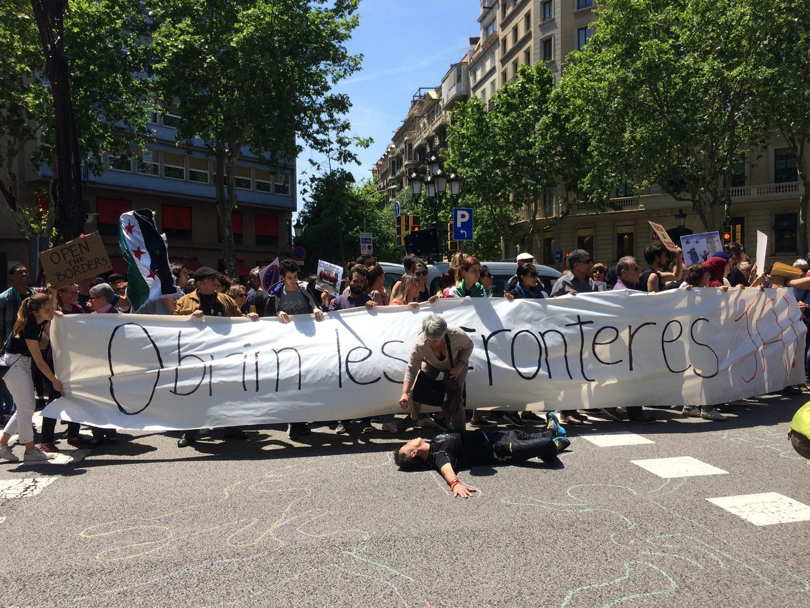

### AYS DAILY NEWS DIGEST 14\.5\.2016\.
#### Volunteers report on the sudden transfers of refugees from Chios to Kos — refugees were confused and apprehensive after being forced to transfer to the new hot spot at Kos island that opened today\. Hotspot in Leros currently hosts to approximately 430 people including many children\. Volunteers at Eiliniko warehouse need help in sorting the main distribution center\. Help Refugees group reports on the worrying situation in the Shatila camp in Beirut where there are 75,000 displaced people, and approximately 40,000 of them are children\. Since May 1st 2016, 200 registered refugees per week are passing through Preshevo center in Serbia\. Disembarkation of the 1,000 people rescued on May 12th is taking place today at four different locations in southern Italy\. Using dubious logic, Vice\-president of the Italian region Lombardia says that the refugees should be relocated to those regions that are governed by the centre\-left parties, rather than to those governed by center right\. Open The Borders March took place in Barcelona today\.

Photo: Aid Delivery Mission — Northern Greece
#### LEBANON

**75 Thousand displaced people residing in Shatila camp\. Approximately 40,000 of them are children\.**

> _Help Refugees group report on the situation in the Shatila camp in Beirut where there are 75,000 displaced people, and approximately 40,000 of them are children\. The camp has been in existence since 1948 when the ICRC set it up to accommodate hundreds of Palestinian refugees\. The camp is about one square kilometer and exceptionally densely populated\. Volunteers report that there are many children in the winding dark streets under the vast tangle of cables and wires that spider\-webbed terrifyingly overhead\. The volunteers have been told that every time it rains people are fatally electrocuted as a result\. Eight people sleep each sleep in very small stone rooms and landlords charge $200 a month\. They also report on a number of fantastic grassroots organizations operating in and around the city, running workshops with women and children from the Shatila camp at the SB Overseas centre\. They are doing amazing work offering catch\-up school to enable children to enter Lebanese public schools, and vocational training for women to empower them and give them financial independence\._ 

#### TURKEY
### Groceries needed by İmece İnisiyatifi Çeşme group\.

> _İmece İnisiyatifi Çeşme group distributes aid to the refugees to meet their basic needs in Manisa center and Turgutlu, and they currently need groceries — rice, lentils, bulgur etc\. If you can help, please get in touch with this group through their FB page — [http://bit\.ly/1Z6wQLn](http://bit.ly/1Z6wQLn)_ 

#### GREECE
### Update on number of refugees in the country\.

> _According to Greek authorities, there are 54,539 refugees stranded in the country, including 8,626 on the islands, 14,444 in Attica region, 2,038 in Central Greece, 319 in Southern Greece, and as many as 29,112 refugees in Northern Greece, including 9,256 still remaining in Idomeni camp\._ 

#### _WEATHER: SAO Weather Forecast for Saturday May 14, 2016 \( \+24h\) for the Eastern Aegean Sea warns about waves up to 1 meter high at Lesvos, Chios, Samos, Leros, Kastelorizo Northand Kos\. Strong winds at Samos and Kos East\._
### No arrivals in Lesvos\.

> _Volunteers at Lesvos Island report no arrival’s to the North of the island, while no information is available for the South\._ 

Photo: Aid Delivery Mission — Northern Greece
### Refugees forcibly transferred from Chios to new detention center on Kos\.

> _Important news is coming in today from the islands of Chios and Kos — volunteers report on the sudden transfers of refugees from Chios to Kos\. According to the volunteers, some refugees in Vial center at Chios were told to go to Kos where the new hotspot — a detention center, was opened today\. To ‘encourage’ the refugees to go the police has cut off the water for the showers and toilets and told them they must sleep outside if they do not go\. Volunteers reported that the refugees were confused and apprehensive after being forced\. Volunteers report that last night 28 Pakistani people arrived to Kos, with many minors among them\. The minors were allowed to stay in a hotel, while the adults were brought to detention\. Today everyone was transferred to the hotspot\. Volunteers have no information at the moment on the conditions in the new detention center\._ 

### Leros hotspot site of volunteer\-authority cooperation\. Volunteers continue to aid in the face of desperate circumstances\.

> _Leros Solidarity Network — Team UK volunteers report on the situation at the hotspot in Leros that currently hosts to approximately 430 people including many children\. Most of these people have been brought to Leros from other overflowing hotspots, or nearby islands\. The LSN team works with the NGO ECHO, which distributes aid at the site\. Leros is unique in that the volunteers are currently allowed to work with the authorities in entering the hotspot to help\. Most other hotspots do not allow entry from volunteers\. PIKPA currently hosts about 103 people, among which are vulnerable groups, including infants and children\. Breakfast, lunch and dinner is provided, as well as various supplies for the babies\. The islanders, many of whom face tribulations of their own in Greece’s economic crisis have been generous in offering baby clothes, nappies and milk\. The volunteers describe the present situation of the camps and sites in Greece as “more desperate than before because refugees are losing hope, waiting long periods of time in limbo with no sight of any solutions”\. The teams are constantly learning how to cope with stress, anxiety and a host of psychological and social problems in refugees\._ 

### Report on isoboxes for maternity wards\.

> _Lighthouse Relief Team reports on the Isoboxes for food storage and for the maternity room where the women will have a place to rest and recover after giving birth that will soon to be put in use\. If you would like to help the LR projects, please visit [www\.seaofsolidarity\.org\.](http://www.seaofsolidarity.org.)_ 

### Fire at Idomeni train\.

> _Volunteers report on a fire in the train where some of the refugees were placed in Idomeni\. The fire is out and fortunately nobody was hurt from the fire\._ 

### Request for content labeling at Eiliniko warehouse\.

> _Volunteers are sorting the main distribution center at Eiliniko in Athens, and they kindly ask for more specific signs on the labels related to the content of the boxes\. They also ask for help in sorting the warehouse\._ 

Photo: Art Against — Greece
#### SERBIA

**200 refugees per week pass through Preshevo\.**

> _Volunteers report that since May 1st 2016, 200 registered refugees per week are passing through Preshevo center\. Volunteers report that these are the refugees who cross illegally to Serbia and then get caught by the authorities\. They are being taken to Registration Center Preshevo where the authorities issue the document that binds the refuges to leave the Serbian territory within 72 hours\. Volunteers also report that 120 refugees arrived to Preshevo just this morning\._ 

### Belgrade Conference agrees on country’s role in protection of refugees\.

> _Participants at the Belgrade conference on asylum seekers in Serbia concluded that during 2015 this country has proved that it could play an important role in the international protection of refugees\. Presenting the results of the report on asylum seekers, representative of the Belgrade Center for Human Rights said that the Office for Asylum approved 30 requests for asylum in 2015\. It was also pointed out that there is a need to regulate the status of the people who do not wish to remain in Serbia for a period longer than three days\._ 

#### ITALY

**1000 people rescued currently being disembarked\.**

> _Disembarkation of the 1,000 people rescued on May 12 is taking place today at four different locations in southern Italy: Augusta, Catania, Crotone and Palermo, and will likely last the whole day\. \(Source: UN\)_ 

### Migrants in Samarate protest conditions, request meeting with the mayor\.

> _28 migrants hosted in the municipality of Samarate in Varese province in Northern Italy protested in front of the Town hall yesterday and today they obtained a meeting with the mayor\. 26 migrants from Gambia and 2 from Senegal report on the difficult conditions they live in — they do not accuse the local authorities for such treatment, but the private agency that should be providing for them— KB srl\. These people have been living in via Ollearo for 11 months and during the last few weeks, they complained of a general lack of health assistance, missing deliveries of food and money last week, and the latest threats and blackmails to switch off light and gas in the facility where they stay\. Their request was to speak with the mayor, because they are starving, and haven’t had anything to eat for four days\. Nevertheless, they expressed their will to stay in Samarate, to work for the community by participating in cleaning and general maintenance\. Two religious communities in Samarate and Verghera will host 8 refugees in the next months — the communities see this as following the evangelic message of Pope Francis\. \(Source: [http://www\.prealpina\.it](http://www.prealpina.it) \)_ 

### Lombardy Region VP demands relocation of refugees to “regions governed by centre\-left parties”\.

> _Vicepresident of the Regional Council of the Italian Lombardy Region F\. Cecchetti, from the right wing party Lega Nord wrote today to the Regional Safety Assessor to ask for a ‘review’ of the decision on the city of Legnano to receive 300 asylum seekers\. These people will be hosted in the ex\-barracks of Cadorna\. Cecchetti and his party have already once prevented the arrival of 500 other people in Milan’s suburbs in a similar manner\. In his written plea to the region and using a dubious logic, he says that the refugees should be relocated to those regions that are governed by the centre\-left parties, rather than to those governed by center right, arguing that a big number of local mayors in those regions oppose the similar decisions by the Ministry of Interior\. \(Source: legnanonews\.it \)_ 

Photo: Rete Solidale Pordenone — protest in Pordenone, Italy

_“Nobody should sleep in the street\! Everybody deserves a life with dignity\! “ These words were the slogan of more than 300 people marching today in Pordenone, demanding the Municipality and the institutions to create a welcoming environment in the community, as well as to manage a situation that is no longer an emergency, but represents normal conditions\. The organization Rete Solidale is thankful to all the associations and individuals who protested today in the streets — the money collected will be spent on the basic needs of the refugees\._
### Committee proposes training of refugees in Genoese restoration projects\.

> _The Committee for Migrants and Anti\- Discrimination and Cultural Association “Liguria nel cuore” presented a new cultural project for refugees\. The project’s representative Aleksandra Matikj reminds us of the agony of these people after having traveled so harshly and so long\. Matikj’s committee has proposed the project of renovation of monuments and small historical fountains in Genoa city\. Refugees are involved volunteering and learning the basics of the restoration work\. The committee intends to give the refugees the tools and skills to follow a career path for their future\. Matikj invites everyone interested in volunteering to contact her at matikj\.aleksandra@gmail\.com and liguria\.genova2014@gmail\.com \(Source: telenord\.it\)_ 

#### SPAIN
### “Obrim Les Fronteres” March in Barcelona

Photo: Refugees Aid Barcelona — March in Barcelona and solidarity with the human beings at the other side of the Fence

> “Obrim Les Fronteres” — Refugees Aid Barcelona organized a March for Opening the this morning in which hundreds of people have sent the message of solidarity with the human beings stranded on the other side of the Fence\. 

_Converted [Medium Post](https://areyousyrious.medium.com/ays-daily-news-digest-14-5-2016-c1bd9a98af23) by [ZMediumToMarkdown](https://github.com/ZhgChgLi/ZMediumToMarkdown)._
