### AYS DAILY NEWS DIGEST 15\.5\.2016
#### More photos show extent of damage to UNESCO World Heritage Site\. Erdogan criticizes European powers’ ‘slavery\-and\-colonial\-era mindsets’ towards refugees\. New detainment camp in Kos urgently lacks proper medical care\. Calls for help for Ritsona as camp suffers extreme water shortage\. Elleniko Baseball Camp is a looming humanitarian disaster as summer approaches\. Macedonia turns back over 11,000 refugees since beginning of March\. Grassroots humanitarian organizations in Serbia build support\. Calais receives much\-needed aid\.

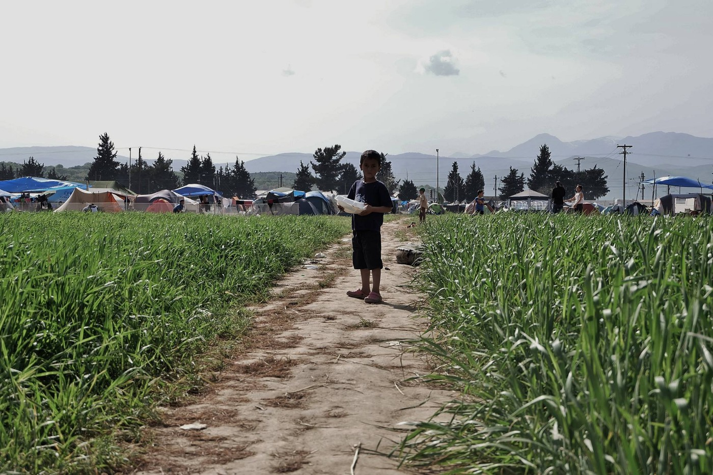

Waiting in Idomeni PHOTO: Nima Yaghmaei
#### SYRIA
### More photos show extent of damage to UNESCO World Heritage Site

Byzantine art historian Shannon Steiner provided updated assessments of the extent of the damage sustained by Qal’at Se’man \(Church of Saint Symeon Stylites\) which was hit in Russian air strikes, [as reported by Are You Syrious\.](https://medium.com/@AreYouSyrious/ays-report-unesco-world-heritage-site-of-qalat-se-man-destroyed-in-a-russian-airstrike-c2ea4d36b8f3#.23bl0uhe7)

The damaged portions include several supporting columns, a facade, and an already\-damaged wall, among others\.

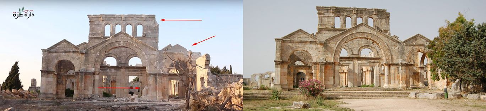

PHOTO: Shannon Steiner

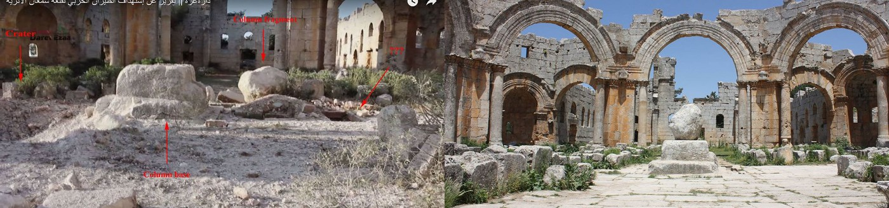

PHOTO: Shannon Steiner
#### TURKEY
### Erdogan blasts European powers’ ‘slavery\-and\-colonial\-era mindsets,’ saying they show more sympathy towards marine life than Syrians

> _In a speech made earlier on Sunday, Turkish President Tayyip Erdogan criticized what he argued was a prioritization of “\[Europe’s\] [security, welfare, and comforts ahead of other people’s survival](http://www.worldbulletin.net/news/172681/erdogan-criticizes-wests-insensitivity-towards-syrians) ,” saying that animal and LGBT rights advocacy receive unfair amounts of Europe’s attention\. This comes nearly a week after Human Rights Watch denounced [instances Turkish border guards beating, shooting at, and shooting](https://www.hrw.org/news/2016/05/10/turkey-border-guards-kill-and-injure-asylum-seekers) refugees attempting to enter Turkey\._ 

#### GREECE
### No photographers allowed in Moria?

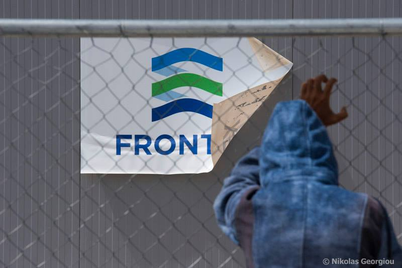

Moria PHOTO: Nikolas Georgiou

> _Volunteers from Lesvos, where refugees are still are residing at the Moria detention facility, report that they are subject to high amounts of oversight by authorities, with incidents of photographers being escorted around the facility and cameras checked\._ 

> _On a brighter note, minors in Moria may be getting a greater chance to stretch their legs as the organization “Coexistence and Communication in the Aegean” has started a program for youth, touring Lesvos island\._ 

### No new arrivals were reported by volunteers on Lesvos\.

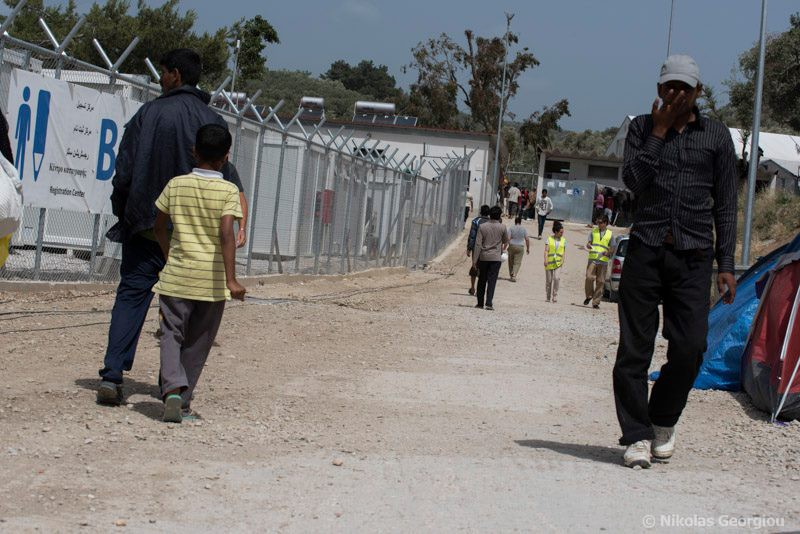

Moria Detention Facility\. PHOTO: Nikolas Georgiou
### 250–300 People trapped in New Detention Facility in Kos: “It’s all army here”

> _In the wake of forcible relocations of refugees from Chios to Kos, conditions for refugees in the new detainment facility are dangerously inadequate\. This has been caused by delays in fully upgrading Kos detainment center into a hotspot, which some say are due to locals protesting the relocation of refugees to Kos\. Benjamin Julian notes that unlike the old facility, the new facility is not open, and refugees report that medical support is severely lacking, despite a great need for doctors\. Yet more reports of camps resembling prisons on the rise\._ 

> “The hotspot is locked,” a refugee that was transferred yesterday from Chios to Kos says\. “We are between 250 and 300 persons, with children\. Our situation is bad, nobody here asked about what we need\. Today two persons went to hospital in an emergency\. One of them the doctor gave the wrong medicine\. All the children were sick and nobody cared\.” 

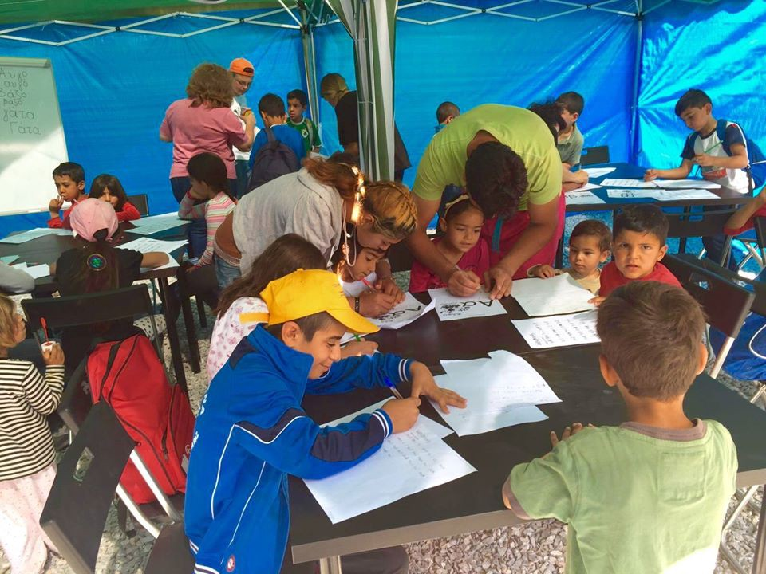

Children at Ritsona Learn Greek\. PHOTO: I Am You
### New volunteer opportunities in Athens

> _Zaatar NGO is opening a shelter for vulnerable refugees and requests volunteers to teach language classes \(Greek, Arabic, Farsi, and others\) and supplies for the kitchen \(boiler, oven, and pans ONLY\. No need for cutlery\! \), bedrooms \(cupboards, small tables, etc, no beds\), hygiene \(cleaning products, shampoo, shower gel, etc\. \), classroom materials \(tables, etc\. \) \. These programs are crucial for ensuring that although refugees are physically stranded, they are not abandoned behind academically\. Interested donors and volunteers can make contact [here](https://www.facebook.com/zaatarngo/?fref=ts)_ 

### Unprotected Elleniko Baseball Camp a disaster waiting to happen

> _As in other camps, volunteers warn about unsafe conditions for those at camp\. Afghans, Iranians, and even some Syrians are staying at the previous Athens airport in UNHCR tents on stoney ground\. All clean\-up and sanitation is done by refugees themselves, and there are few toilets and no hot water, the only potable water coming from bathroom taps\. Only medical care being provided is through MSF, and these teams are thin and over\-exhausted; the schedule for MSF is as follows: Wednesday — Hockey field, Thursday — Arrivals, main building, Friday — Baseball field\._ 

> _The arid and dry conditions are worsened by the lack of proper airflow, meaning that as temperatures rise, so will incidents of heat and sun strokes as shelter is sparse\. General advice to all volunteers in Greece is to become familiar with the signs and methods of treatment for heat\-stroke\. The elements remain the greatest weapon wielded against refugees\._ 

> Volunteers advise that all concerned push for relocation to an actually safe camp\. 

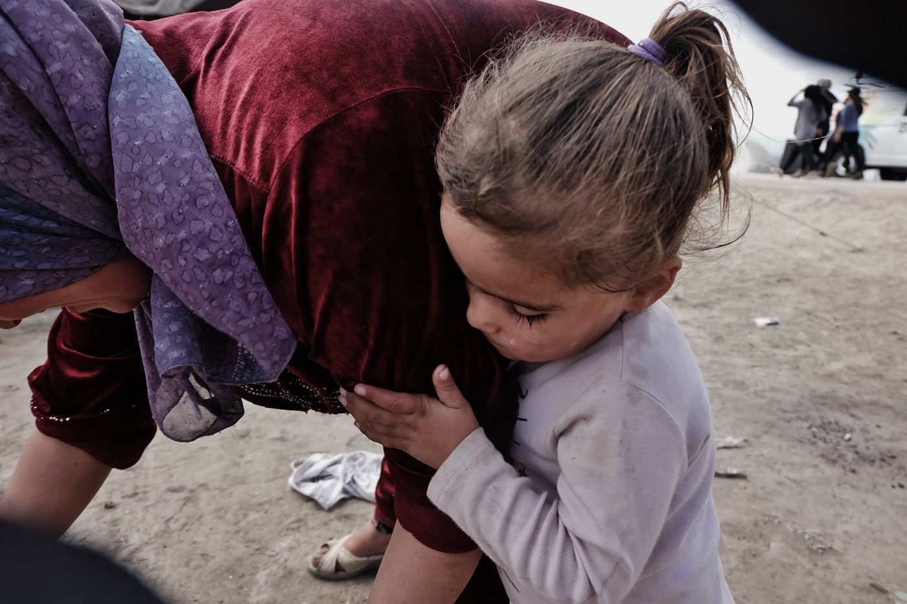

Idomeni\. PHOTO: Nima Yaghmaei
### Volunteers report critical water shortage at Ritsona Camp

> _Some refugees are already showing signs of severe dehydration, volunteer Rando Wagner says, as official water distribution is a shocking one liter per person per day\. As such, volunteers request support to stock up on water as army supplies are not adequate and, despite multiple discussions of the problem, little is being done about it\. You can donate [here](http://gofundme.com/humansasone) \._ 

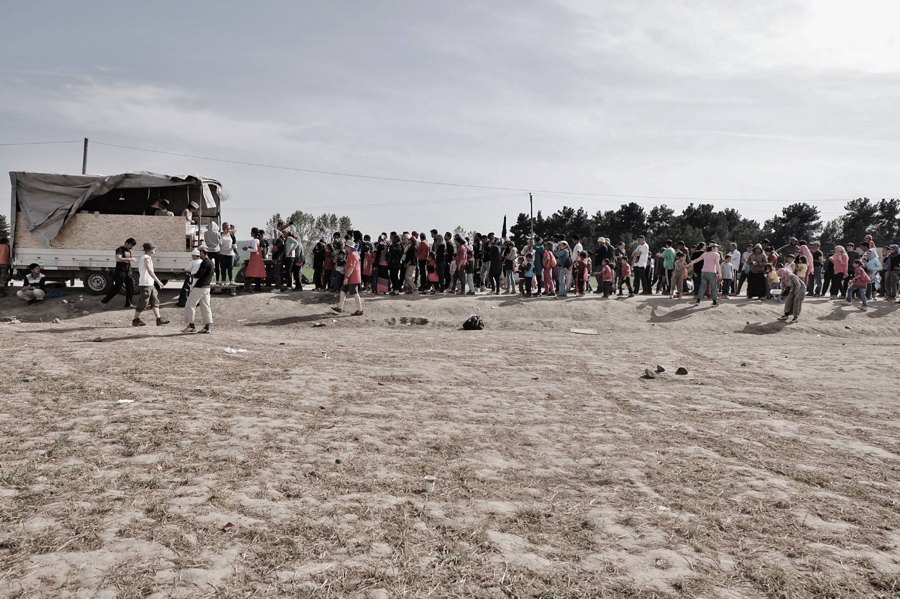

Idomeni Food Distribution\. PHOTO: Nima Yaghmaei

> _Lighthouse Relief and Dirty Girls of Lesvos collaborated on a blanket exchange where residents of Ritsona_ 

> _camp swapped old, dirty, grey blankets for freshly\-laundered, warm, still grey blankets\. As the photos show, it was quite a task that brought together the whole community\._ 

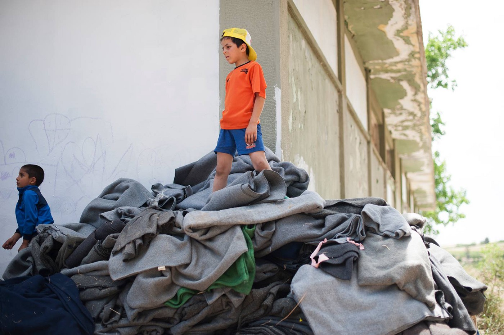

Blanket Swap Event, Ritsona PHOTO: Lighthouse Relief
### 3000 and counting children vaccinated by MSF in Idomeni

> _Reaching three\-fifths of their child vaccination goals in Idomeni, MSF reports that they with the help of volunteers, 3031 children in Idomeni were vaccinated in a massive campaign to take precautions against communicable disease, including pneumonia, in the crowded camp\. As previously reported, the service was greatly welcomed\._ 

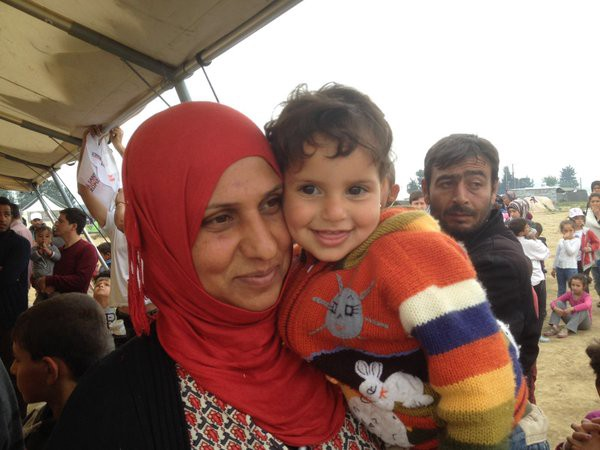

Post Vaccination\. Photo Credit: MSF\_Sea
### Volunteers wanted for mobile refugee clinic

> _Volunteers are needed by Adventist Help \(AH\) which has established a well\-equipped refugee clinic for Oinofyta camp\. AH is working to establish mobile clinics in order to provide rapid response relief at the smaller camps which are generally underserved\. There is also opportunity to partner with dental teams to run their dental program\. Volunteers \(especially midwives, obstetrics/gynecologists, dentists, general practitioners, and paediatricians\) are needed\. There is also need for funding in order to build infrastructure\. Now that cost\-effective options for clinic trucks have been established, this funding can be used in an efficient way\._ 

> _If anyone is interested in joining up, helping sponsor, or know of areas with specific needs please contact at greece@adventisthelp\.org\._ 

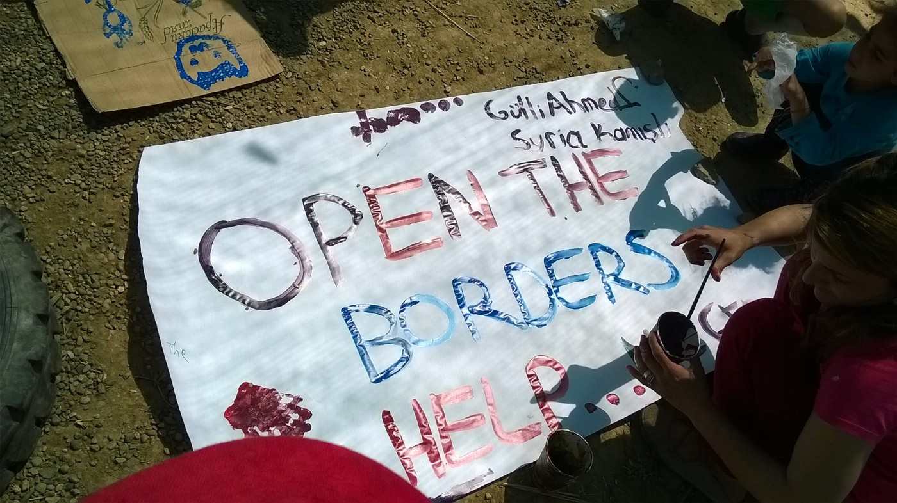

Idomeni Cultural Day Art Project PHOTO: Tamás Zoltán Szüts
#### MACEDONIA
### Over 11,000 Refugees caught and sent back to Greece from Macedonia

> _The Macedonian government reports that due to a multi\-national team of police, military, and other security forces, over 11,000 refugees have been sent back after being caught crossing into or having crossed into Macedonia\._ 

> [_Some Macedonian media outlets_](http://alfa.mk/News.aspx?id=109371#.VzjonhV96YW) _are reporting that EU promises have been largely empty and that the country has been left to fend for itself in the refugee crisis, emphasizing the cost of policing the border\._ 

#### SERBIA
### Serbia arrests four alleged smugglers while aid organizations strengthen and rebuild\.

> [_Balkan Newsbeat has reported_](https://twitter.com/BalkanNewsbeat/status/731839275298398208) _that Serbian officials have arrested four alleged smugglers who were transporting twenty\-three refugees from Bulgaria\._ 

> _In Belgrade, Refugee Aid Serbia \(RAS\), attended the celebration of the Queen’s birthday at the White Palace in order to raise awareness and conduct outreach about the refugee crisis\. Members of the public learned how to write their names in Arabic; there were even temporary tattoos for the more daring\! The RAS team was back in the parks by the afternoon and evening for food delivery\._ 

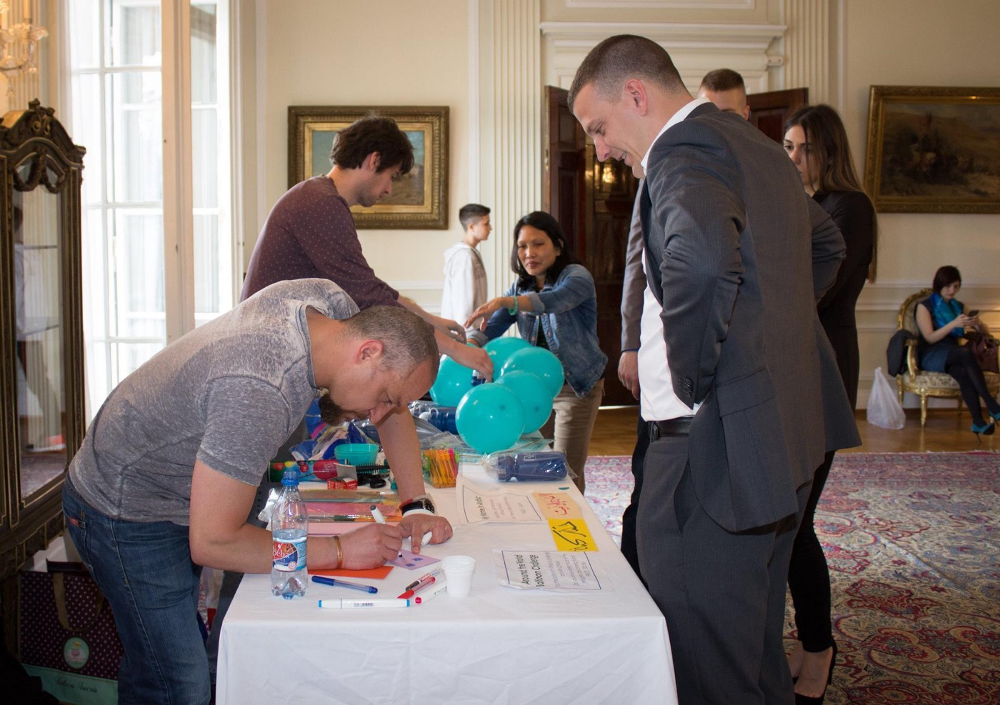

An attendee gets his name written in Arabic PHOTO: Refugee Aid Serbia

> _The work begins again as Refugee Aid Miksaliste began clean\-up work on a new space to replace the one torn down in the construction of the controversial Belgrade Waterfront project\. As if cleaning up a space and to working to reopen distribution wasn’t enough, volunteers from Refugee Aid Miskaliste along with volunteers from InfoPark and Praxis played against a local women’s football team in a fundraiser for refugees\._ 

#### CROATIA
### AYS volunteers take refugees to the public dentist in Zagreb

> _Despite the right of refugees, migrants and asylum seekers’ rights to receive primary, secondary and tertiary medical and dental care within the public healthcare are still not easy to realize\. This is why refugees and asylum seekers realize their right of access to healthcare through emergency care and private doctors, rather than through regular public healthcare\. Additionally, refugees, migrants, and asylum seekers are limited in their access to preventative care, therapy, and diagnostic exams due to the scope of “right to care\.”_ 

> _Education system access is also becoming a problem; despite the right of every child to have access to preschool, elementary school and high school, the education system is not ready to accept the children whose first language is not Croatian, especially those who are older\._ 

> _Today, the volunteers encountered a 14\-year old girl asylum seeker whose family only arrived a couple of weeks ago, who told her story of being inadequately assessed for school, including being administered a test in the Croatian language\. She was frustrated and confused, because she was told that she would attend classes with 11\-year olds\. Children and families generally lack information \(official information was not provided\) on the access to the education system, and AYS volunteers will focus on this in their activities as well\._ 

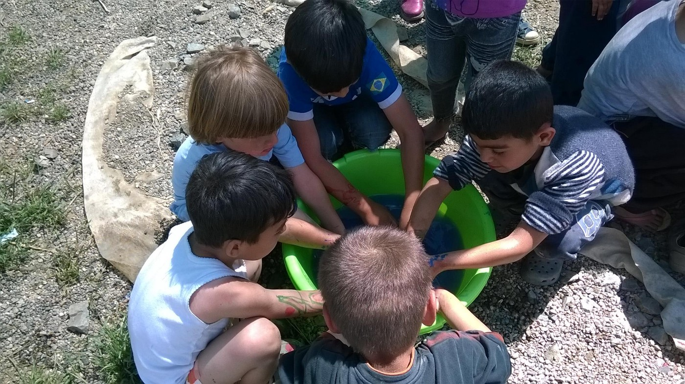

Post Art Activity Wash\-Up, Idomeni\. PHOTO: Tamás Zoltán Szüts
#### FRANCE
### Refugee Crisis Foundation brings desperately\-needed aid to Calais

> _According to Care4Calais, 15 dentists over this weekend were brought by Refugee Crisis Foundation to treat the many dental problems in the camp, they brought a further 15 people to help out with sorting and distribution from the Care4Calais warehouse and donated 500 brand new jogging bottoms, 400 new hoodies and 150 food parcels\._ 

> _All these things and more are still desperately needed\. If you can help please go [here](http://www.care4calais.org) \._ 

_Converted [Medium Post](https://areyousyrious.medium.com/ays-daily-news-digest-15-5-2016-216118cc228f) by [ZMediumToMarkdown](https://github.com/ZhgChgLi/ZMediumToMarkdown)._
