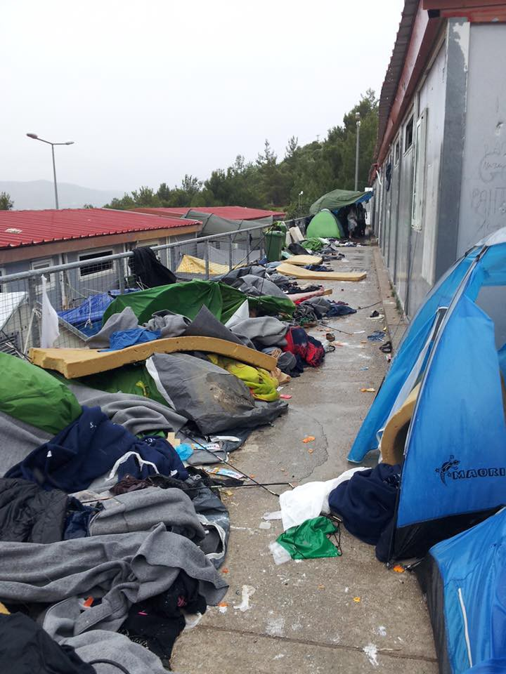

### AYS DAILY NEWS DIGEST 17\.5\.2016\.

#### “They are just pressuring us to go back to Syria and die there”\. Testimonies of refugee living conditions in Turkey\. Pilot refugee village being built in Turkey\. Refugees in Lebanon suffering from many disease and are receiving minimal aid\. Violence erupts in Samos\. New volunteer\-based transit points open for refugees passing through Serbia: Volunteers needed\. Job assistance available for refugees in Germany\.
#### Lebanon
### Refugee medical aid urgently needed\.

> _It is shocking to see how many refugees in Lebanon are left out of the official channels of aid and don’t receive any assistance from UNHCR and other aid organizations\. Some refugees even have to pay rent for the land they build their tents on in informal settlements \(refugee camps\) \._ 

> _Above all, many people need urgent medical aid but have no prospect of receiving it\. The medical situation is very complicated in Lebanon\. Medical care is coordinated by UNHCR but many large NGOs are still struggling to understand the process, even after five years\. Due to the massive amounts of refugees and the decrease in funding as the crisis continues, gaps in medical treatment unfortunately continue to rise\. There are a lot of people who need medical support but do not receive it\._ 

> _At the moment, volunteers in Lebanon have 20 cases that are ongoing and need continued funding\. In addition to this, they have more than 100 pending cases which are not being helped by anyone else\. To help, contact this [volunteer](https://www.facebook.com/igor.kubat) \._ 

Nada \(6\) was born with 4 fingers webbed together on her right hand\. She still needed support to get her last surgery done \. Credits: Igor Kubat

Blindness is one of the most common war injuries\. The reasons for the first boy’s blindness are unknown, while the second was shot in the head while in Syria around 3 years ago\. Credits: Igor Kubat

Left: 15 years old, supported the family by working in a restaurant where he received 3rd degree burns on right leg and stomach and was then fired from his job\. Right: 25 year old female with 3rd degree burns from a household diesel heater on her face and right arm\. Wound became infected with the lack of medical attention\. Credits: Igor Kubat
#### Turkey

> _53 refugees have been brought from Torbali to Izmir to finally be registered and enjoy the right that come with the status\._ 

](assets/b3c949d64177/1*zXAnSzWpI2eICi8sRgekoA.jpeg)

Credits: [**German Alliance for Civilian Assistance e\.V\. — gemeinnützig**](https://www.facebook.com/germanallianceforcivilianassistance/?fref=photo)
### Rebuild the Future Now pilot project: Help build a village for refugees in Turkey\.

> _Rebuild the Future Now \(RFN\) is the name of a new project, by which the [**German Alliance for Civilian Assistance e\.V\. — gemeinnützig**](https://www.facebook.com/germanallianceforcivilianassistance/?fref=nf) wants to improve the situation of Syrian refugees in Turkey in sustainable and permanent ways\. For this purpose, they plan to erect the first RFN Village in the next few weeks\._ 

> _The organization has found a 12,000 square meter site near Torbali\. The plot is a former chicken farm — ideal for these purposes\. There is electricity, water and sewage disposal facilities\._ 

> _They will first build 1,200\-square\-meter\-large main building, so that some 40 families can move straight in, that they may no longer have to hide in the wilderness\. According to their calculations, they need a total of 25,000 Euros for renovation and upgrading\. Further 3,500 Euros will be required per month for the installments of the site\._ 

> _Once the refugees have moved into the main building, they want to start with the construction of the actual RFN Village\. They want to purchase and erect lightweight houses from Asia Prefabrik\. The houses with a size of up to 49 square meters are unbeatably low\-priced: 6,370 Euros is the cost of an entire house\! A total of about 40 of these houses will be needed to accommodate all the families\._ 

> _When all families will have moved into their houses, they will, with the help of various Turkish partners, convert the main building into a production facility, in which the refugees can earn their livelihood\._ 

> _Life and work are the two main pillars of this project, distinguishing our RFN village from all other refugee accommodations\. At the same time, they hope to grant the children a sound education in a private RFN school\. In the MamaHelp Medical Center, they will not only provide the basic medical support, but will also offer mothers a retreat area where they can look after their children in peace and where the willing will acquire basic knowledge in health care\._ 

> DONATIONS welcome:
 

> German Alliance for Civilian Assistance e\.V\.
 

> IBAN: DE45 70020 500 000 985 1700
 

> BIC: BFSWDE33MUE
 

> with the Bank für Sozialwirtschaft
 

> Purpose: RebuildTheFutureNow 

> _With your help, the RFN project becomes possible\. Please [contact](https://www.facebook.com/germanallianceforcivilianassistance/photos/pb.585474061609743.-2207520000.1463102912./679010682256080/?type=3) the Team and help\!_ 

Credits: GACA team
### Educational activities for refugee children\.

> _Since October, [Praxis Initiative](https://www.facebook.com/izmirkapilar/posts/1691505647781663?hc_location=ufi) has been organizing educational activities for refugee children\. The Praxis approach is based on creativity and a philosophy that all children, irrespective of background, have an innate curiosity and a desire to build\. Activities are therefore artistic and encourage children to make decision and take initiative to create visual projects\. As the working language is English, this is also an excellent opportunity for children to expand their English vocabulary and conversational skills\._ 

Credits: Kapilar

Credits: Kapilar

> _Another wonderful volunteer organization cheering children up in Torbali: [İmece İnisiyatifi Çeşme](https://www.facebook.com/%C4%B0mece-%C4%B0nisiyatifi-%C3%87e%C5%9Fme-703040606472643/?fref=photo)_ 

Credits: IIC

Credits: IIC

Credits: IIC
### Syrians returned to Turkey under EU deal report being detained indefinitely in poor conditions and not being allowed to rejoin family members in Turkey\.

> _A group of 12 Syrians returned by plane on the 27th of April who were contacted by telephone said they had simply been detained without clear legal recourse since they arrived in a remote detention center in southern Turkey called Düziçi\. The fate of two other Syrians deported along with hundreds of non\-Syrians earlier in April is unknown\._ 

> “You can’t imagine how bad a situation we are in right now, _” said one Syrian mother detained with her children, who now wants to return to Syria because she sees no alternative\. “_ My children and I are suffering, the food is not edible\. I’m forcing my children to eat because I don’t have any money to buy anything, but they refuse because there are bugs in it\. _”_ 

> _The detainees have also been denied access to lawyers and specialized medical care, she alleged\._ 

> _Like all the interviewed detainees, the Syrian asked to remain anonymous for fear of reprisals, but said she now wanted to return to Syria because she felt that even a war\-zone would be better for her family than the refugee detention centers in [Greece](http://www.theguardian.com/world/greece) and Turkey\._ 

> _Another inmate added: “_ They won’t allow us to leave\. I’m pregnant, I’m not good — what am I doing here? They just say we have to wait _\.”_ 

> _One of the hundreds of other Syrian refugees also detained at Düziçi said that he had been held since 10 February after being seized from his home\. He said he was still unsure of why he was detained, or when he would be released, and doubted any inmate would be freed soon\._ 

> _“_ It’s all just talk _,” said Abu Hassan, a grocer detained with his wife and children, who asked to be known under a pseudonym\. “_ They are just pressuring us to go back to Syria and die there\. _”_ 

Credits: Lefteris Pitarakis
### Volunteers needed in Izmir\.

> _We’re looking for new volunteers to join the ReVi Family in Izmir\! If you’re living in Izmir or are planning/able to come for a minimum of 1 week commitment, please get in touch\._ 

> _Please go though [http://joinrevi\.org](http://l.facebook.com/l.php?u=http%3A%2F%2Fjoinrevi.org%2F&h=sAQEOkCT2) to read about what we do and to see if you’re a fit for our group\._ 

#### Greece
### Violence erupts in Samos as a direct result of failings in the EU/Turkey deal\.

> _Operators on the ground in Samos are witnessing first hand the failings of the EU/Turkey deal\. The ‘1 in 1 out’ theory is not working in practice, with disastrous effects\._ 

> _In Samos there are 1,000 refugees detained in a closed camp built to house just 300 people\. 300 of those detained are children, including some with special needs & disabilities\. Less than 20 people have been transferred off Samos since the deal was signed in March and despite the ‘crack down’ refugees have continued to arrive every day to the shores of Samos, sometimes 50 a day\. As the numbers detained have been swelling, inevitably tensions have been building too\._ 

> _On Friday disaster struck\. At midnight\-following days of tension\-a huge fight broke out between two large groups of single men and the rest of the camp residents, families, women, children and elderly people were caught in the cross fire\. Rather than protecting the camp inhabitants the police locked themselves into their caged area and proceeded to watch as the battle waged for 2 hours\._ 

> _The results were shocking\. 30 people were reportedly taken to hospital, with fractures, broken knee caps, head injuries & smashed teeth\. Mothers and children sustained injuries and innocent people’s tents / homes were completely destroyed & they were forced to flee in terror and break into the hotspot facility below, where they are now squatting safely in the cabins \(where we continue to meet their needs\) \._ 

Credits: Calais Action
### How refugees get by at Idomeni: Testimony from a volunteer’s first day\.

> My first impressions are: 

> \(1\) That the most interesting aspect of the camp is how organic it is, built from nothing but the hands and spirits of persons who have no tangible material or financial possessions or other resources; 

> \(2\) Positive in the sense that I see communities, an economy of refugees selling goods to each other and volunteers in makeshift shops and food stands; and 

> \(3\) Despite these more positive observations, the spirit of the refugees here, and the remarkable efforts of NGOs and independent volunteers to sustain them, the fact remains that there is a very dark side of Idomeni that is undeniable — it also represents the very worst of humanity, of those in authority who allow this place to exist\. 

> The most touching moments were when we approached two refugees making falafel and flat bread \(cooked atop an oil drum filled with burning embers\) \. They insisted on giving us free samples of their foods, which tasted incredible\. 

> _Read more [here](https://www.facebook.com/adamrosser/posts/10207715994129700?hc_location=ufi) \._ 

### The registration of asylum seekers residing in open reception facilities in the mainland will begin in the next few weeks\.

> _The Asylum Service will conduct a pre\-registration exercise for international protection in the mainland from the end of May to the end of July with the financial support of the European Commission \(DG Home\) \. The United Nations High Commissioner for Refugees \(UNHCR\) and the European Asylum Support Office \(EASO\) will support the Asylum Service in this exercise\._ 

> _The pre\-registration exercise will take several weeks to conclude, but all those who arrived in Greece before March 20th, wishing to apply for international protection in Greece and are currently residing on the mainland will be able to pre\-register\._ 

> _The pre\-registration exercise is the first step to apply for international protection in Greece, which could eventually lead to:_ 
 

> _\(i\) examination of the application for international protection by the Greek authorities, and potential recognition of beneficiary international protection, or_ 
 

> _\(ii\) transfer to another EU Member State in the context of Dublin III provisions, or,_ 
 

> _\(iii\) transfer to another EU Member State in the context of the relocation scheme\._ 

> _Before and during the pre\-registration exercise, information will be provided on the available options to those concerned, through leaflets and information teams deployed to the open accommodation sites\. The International Organization for Migration will also participate in order to provide information on voluntary repatriation to the countries of origin to those interested\._ 

> _Those wishing to be pre\-registered must be physically present during this exercise, including any members of their family\. A photo will be taken of each individual during this exercise\. At the end of the pre\-registration an asylum seeker card will be issued for each individual\._ 

#### Serbia
### New volunteer\-based transit points open for refugees passing through Serbia\.

> [_‪YouthForRefugees‬_](https://www.facebook.com/hashtag/youthforrefugees?source=feed_text&story_id=1711782035705829) _is starting a project on the border line between Macedonia and the Republic of Serbia, with three distribution points, which will include information, food supplies, and clothes\._ 
 

> _[‪](https://www.facebook.com/hashtag/umbrella?source=feed_text&story_id=1711782035705829)_ 

> _The project is called [‎Umbrella‬](https://www.facebook.com/hashtag/umbrella?source=feed_text&story_id=1711782035705829) , and the three points will be opened in two shifts 8–22 to all of refugees that pass through territory of the Republic of Serbia\._ 

Credits: Youth for Refugees
### Urgent call for supporting refugees in Serbia\.

> _Belgrade is an important transit point for people traveling across this_ 
 

> _route\. Many people arrive here from Macedonia and Bulgaria and try to_ 
 

> _organize their further travels through Hungary or Croatia\. In Belgrade_ 
 

> _the effects of the border politics are directly visible: Several hundred_ 
 

> _people are stuck here and new groups arrive every day\. Most of them are_ 
 

> _left even without the possibility to get shelter, proper food or_ 
 

> _information\._ 

> _To contrast this development with compassion and humanity, a group of_ 
 

> _transnational activists, established a support structure in Belgrade\._ 
 

> _Right now they have a mobile kitchen to provide people with warm food_ 
 

> _every day and preparing abandoned homes as improvised shelters\. Their_ 
 

> _focus is rather not on humanitarian aid \(that actually should be_ 
 

> _provided by the authorities\) but to cook together with the refugees,_ 
 

> _protest together, and learn from each other\._ 

> _In the next few days much of their group have to leave and only some members will stay in Belgrade\. In order to continue this work they need more people to come to Serbia as soon as possible plus in the long term\. There is a_ 
 

> _flat where you can sleep or take a rest and create new ideas\. If you_ 
 

> _come, consider donations \(money is the most vital since we can buy all_ 
 

> _ingredients in local shops, but used \(smart\) phones would be great\! \) \._ 
 

> _For working together with the local structures it would be best to stay_ 
 

> _for a longer time, at least one week\._ 

> You can contact them either via e\-mail: **refugeesupportserbia [@riseup\.net](https://noblogs.org/members/subeltz%40riseup.net/)** or phone: **\+381 61 202 46 74** \. More info [here](https://openborder.noblogs.org/) \. 

#### Croatia
### JRS Croatia is hiring a social worker and project manager

> More [info](https://www.moj-posao.net/Posao/290346/Strucni-suradnik-za-pisanje-i-pracenje-projekata-za-JRS-SEE-mz/) \. 

#### Germany
### Job assistance available for refugees in Germany\.

> _Refugees and asylum seekers living in Berlin can use a free of charge service to find **job opportunities** in the German capital\._ 

> [**_Work for Refugees_**](https://www.work-for-refugees.de/index.php) _is an online platform that provides free job hunting assistance to refugees\._ 

> _The project was developed by the “Der Paritätische” association, based in Berlin, and the charity Stiftung Zukunft Berlin\._ 

> _The service is accessible in different languages: [German](https://www.work-for-refugees.de/index.php?link=umfrage&lang=0) , [English](https://www.work-for-refugees.de/index.php?link=umfrage&lang=1) , [Arabic](https://www.work-for-refugees.de/index.php?link=umfrage&lang=2) and [French](https://www.work-for-refugees.de/index.php?link=umfrage&lang=3) \._ 

> _To apply for a job, refugee job seekers should state their desired professions, experience, native language and any foreign languages they know\._ 

> _Employers looking to hire one or more refugees can use the website to advertise open job positions, training and internship opportunities\._ 

> _Since the project started, approximately six months ago, [more than 1,400 refugees and 150 businesses have been registered](http://www.tagesspiegel.de/berlin/paritaetischer-wohlfahrtsverband-barbara-john-hilft-fluechtlingen-bei-der-jobsuche/13518440.html) , 21 refugees have found work, 54 are undertaking the application process\._ 

_Converted [Medium Post](https://areyousyrious.medium.com/ays-daily-news-digest-17-5-2016-b3c949d64177) by [ZMediumToMarkdown](https://github.com/ZhgChgLi/ZMediumToMarkdown)._
