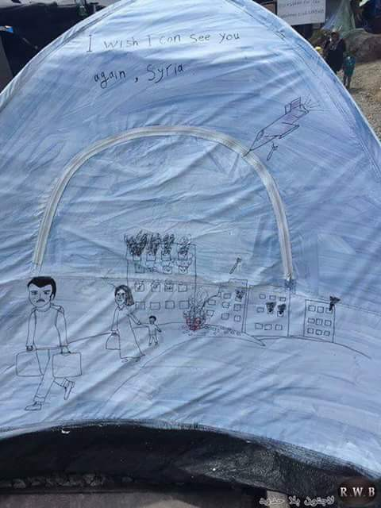
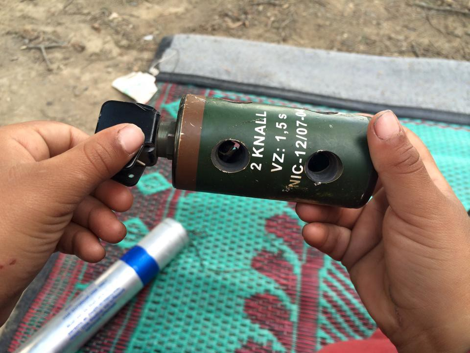
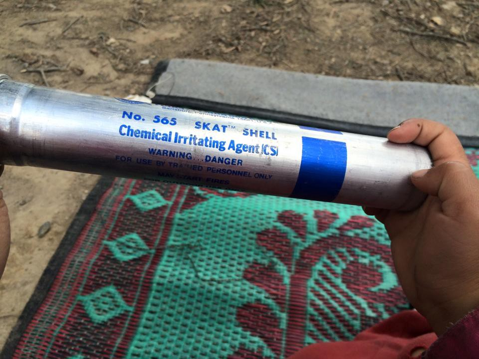
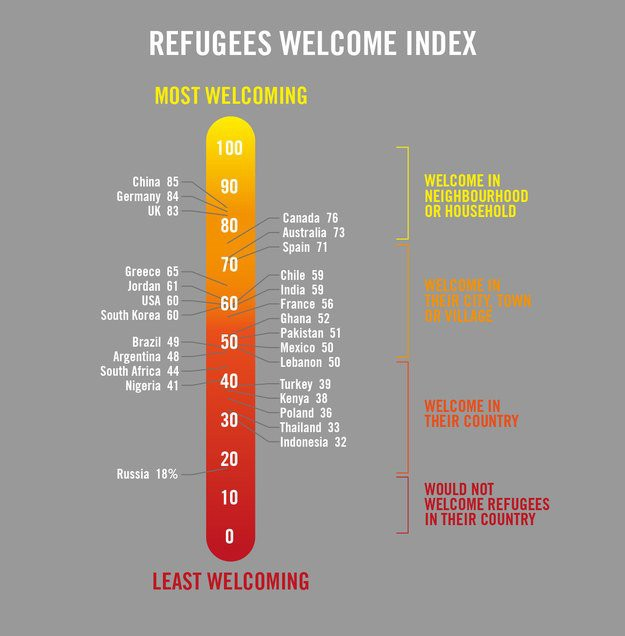

### AYS DAILY DIGEST 19\.05\.2016\.
#### The situation in Idomeni still tense, but calm\. Volunteers are allowed to enter the camp\. Many people were affected by tear gas used by border police at Idomeni yesterday, including pregnant women and children\. Camps on the Greek islands Samos, Lesbos and Chios are “are unsanitary and severely overcrowded”, HRW concludes\. The deadline for Special Immigrant Visa applications from Afghan former military interpreters is May 31st\. Bulgarian government to strengthen the border\. The number of refugees in Serbia is increasing\. Call for action from Hungary\.

### Weather Forecast for Friday May 20th & Saturday May 21st

WAVE WARNING\! Waves: moving generally Northward both days\. Leaving from Turkish coast of Canakkale to Lesvos, waves at your front both days\. Leaving from the west coast of Turkey to the Greek islands, waves at your left both days\. For more, see [News That Moves](https://newsthatmoves.org/en/weather-forecast-35/) \.
#### Greece
### Situation in Idomeni is calm

The situation in Idomeni, a refugee camp for about 10,000 people at the border between Greece and Macedonia, is calm\. Volunteers are allowed to enter again, and MSF reopened its clinic\. Tensions increased yesterday afternoon during another protest in Idomeni\. Out of desperation, refugees tried to push a train car toward the Macedonian border\. That provoked border police, who once again resorted to tear gas\. Some of the people in the camp responded with rocks\. Many people were hurt, including children, who have been living in this improvised camp for a couple of months now\.

Until the late afternoon today, regular volunteers were forbidden from entering the camp\. Only officials from organizations like MSF, Red Cross, IRC, and STC were allowed to enter\. All volunteers were sent back\. Representatives of Borderfree were inside the camp when the protests started\. They stayed there for the duration of the conflict, trying to provide food for people while the food deliveries were being denied at the camp\.

“Our volunteers in the camp — worn out from the night shift — did their best, cooked hummus and tea\. With the food supplies left, a menu was planned for today\. Even refugees brought several parcels with Pasta so that it would be sufficient for everyone\. Women offered to bake the 300 missing flatbreads for tomorrow\. The willingness to help the refugees and the volunteer Organizations is immense and touches us deeply\!”

Greek Reporter published a video from the camp saying that three police officers were injured, along with an unknown number of refugees\.

Volunteers were posting today photos of what was found in the camp after the police action\.

### 100 new arrivals to Greece

There are 54,565 registered refugees in Greece today, including 100 new arrivals\. According to Greek government sources there are currently 9079 people at Idomeni\.
### Unsanitary and severely overcrowded camps

[Human Rights Watch issued a new report](https://www.hrw.org/news/2016/05/19/greece-refugee-hotspots-unsafe-unsanitary) about the refugee situation in Greece which asserts that camps on the Greek islands of Samos, Lesbos, and Chios “are unsanitary and severely overcrowded”\. At the same time, security and reliable protection have become an increasing problem in all three camps\.

Police at these “hotspots,” according to HRW, is failing to protect people during frequent incidents of violence in closed centers\. For example, none of the three centers separate single women from unrelated adult men\. In the words of Bill Frelick, refugee rights director at HRW, present conditions are creating an atmosphere of chaos\.

> “In Europe’s version of refugee camps, women and children who fled war face daily violence and live in fear\. Lack of police protection, overcrowding, and unsanitary conditions create an atmosphere of chaos and insecurity in Greece’s razor wire\-fenced island camps\.” 

The report concludes that Greek and EU authorities:

> “…should take immediate steps to ensure the security and protection of women and children in the hotspots as well as all other residents\. Women, children, and families should be provided with secure sleeping, toilet, and bathing facilities separate from those for single men\. Greece should not detain people in overcrowded and unsanitary facilities\.” 

### Police director resigned due to refugee situation

Greek media are reporting that the police director of Chios, Andreas Damiris, has resigned\. Although he writes in his resignation letter that he is leaving for “personal reasons,” reports indicate that he decided to step down because of the ongoing refugee situation on the island\. According to a piece by local Chios news site “politischios\.gr,” the Police Director decided to step down due to the “profound” conditions on the island, the lack of state support, and poor planning from the police\. Politischios\.gr also mentions that despite the efforts of Damiris’s colleagues to talk him out of his decision, the Police Director is determined to leave and is waiting for his resignation to be accepted\.
### UNHCR pre\-registration program info

The pre\-registration program for people on the mainland will start at the end of the month\. Date to be confirmed\.

The pre\-registration program is the answer to the overload on the existing Skype system\. Asylum Service \(AS\) is over\-stretched and cannot register all asylum claims properly if it is forced to operate quickly\. Pre\-registration ensures that biographical data is registered and that the asylum interview is set for a later date \(full claim submission\) — receiving a decision is the final stage\. More [here](http://data.unhcr.org/mediterranean/download.php?id=1352) \.
### Deadline for Special Immigrant Visa

The deadline for Special Immigrant Visa applications from Afghan former military interpreters is May 31\. For more info see the [link here](https://travel.state.gov/content/visas/en/immigrate/afghans-work-for-us.html) \.
### Help needed

[Refugee aid 786](https://www.facebook.com/regueeaid2015/?fref=nf) is calling for donations and volunteers to assist the many refugees who are being moved out of Idomeni and into other camps\. Visit their [FB page](https://www.facebook.com/regueeaid2015/?fref=nf) to see what is needed and how you can help\.
#### Bulgaria
### Bigger and stronger wall

The Bulgarian government plans to fill the gaps at its borders with Greece and Turkey in order to stop refugees and migrants from entering the country, German newspaper Bildt reports\. The government would, according to the report, consider establishing a fence along certain parts of the country’s the border with Greece\. It also planned to extend the fences along the Turkish border by another 160 kilometers over summer\. The report says that action in the Aegean to tackle smuggling has shifted the migrant route to Western Europe from Turkey through Bulgaria\.
#### Serbia
### Up to 600 people daily in Belgrade

According to Info Park and other organizations working with refugees in Serbia, a number of refugees going through Serbia is still high\. They estimate that at any moment, there are at least 500–600 people in transit in Belgrade\.

The refugees over the last couple of days are predominantly composed of Afghani citizens along with a smaller number of Syrian and Iraqi families with children\. They are mainly coming from Macedonia, via Preshevo, while smaller part comes from Bulgaria, via Stara planina, according to Info Park\.

Most of the refugees spend the night in asylum camp in Krnjaca led by the Commissariat for Refugees and Migration of the Republic of Serbia\.

Info Park and other organizations offering assistance to the refugees in transit, appeal to others in providing food, drinks and other necessary goods, as well as clothes and hygiene packages\.

Info Park said they urgently need the provision of quality meals in the morning hours and children’s clothing of all sizes\. More information is available at the network’s [Facebook page](https://www.facebook.com/Info-Park-885932764794322/) \.
### Call for volunteers

Initiative [Philoxenia](https://www.facebook.com/teamphiloxenia/timeline) calls volunteers for help\. “We need people who can help us with our refugee food relief operation\. In order to continue this work, we need more people to come to Serbia as soon as the possible, preferably for the long term\. We can arrange accommodation\.” For more info, please contact their [FB page](https://www.facebook.com/teamphiloxenia/timeline) \.
#### Hungary
### Appeal for action

“The accused people need support ASAP\! If you are in Hungary or elsewhere and are willing to do something, there are few things that you can do: visit the accused, write solidarity letters, put attention in their case during other actions, monitor the trials, share and publish about this case in your networks and wider, and help with getting reliable legal assistance for all of the accused\. Improve the solidarity campaign\! \(for dates and more information go to [this link](https://noborderserbia.wordpress.com/…/solidarity-campaign…/) \)

There are 11 people on trial in Hunagry now, all accused of participating in the mass riot\. Among them are three vulnerable persons\. Group Free the Röszke eleven\! in their call for action says:

> We want it to be clear, we will not reserve our condemnation of this absurd and violent act for the Hungarian government alone as the most right wing or “evil“ country in EU, like many of the so\-called “democratic”state institutions, NGOs, and mass media do\. The “Horgoš/Röszke” trial reveals the fact that there is a system in which state and police violence is never questioned, and in which money and goods can move freely but while people cannot\. They are only valuable in this system as cheap, illegalized workers or consumers\. No one should be forgotten\! United against all prisons and fences\! 

#### Slovenia
### First arrivals to Slovenia

Official news agency sta\.si reports about the first group of refugees as part of the EU’s relocation scheme last week\. A group of six refugees from Eritrea seeking international protection have arrived in the country via Italy\. They arrived at the Asylum Home in Vič, which began the official process of accepting applications for international protection\. Last week Slovenia received the first group of refugees from Greece under the EU solidarity accord to redistribute immigrants throughout the EU\. Among them are five families with 14 children and four men from Syria and Iraq\.
#### General
### People deserve better governments

The vast majority of people \(80%\) would welcome refugees with open arms, with many even prepared to take them into their own homes, according to a global [survey commissioned by Amnesty International](http://www.amnesty.eu/en/news/press-releases/region/sub-saharan-africa/new-refugees-welcome-index-shows-government-refugee-policies-out-of-touch-with-public-0979/?preview=fjnxwSdf7cjYui2#.Vz3yAWP7bIO) \.

The new Refugees Welcome Index, based on a global survey of more than 27,000 people carried out by the internationally renowned strategy consultancy GlobeScan, ranks 27 countries across all continents based on people’s willingness to let refugees live in their countries, towns, neighborhoods, and homes\. Amnesty International Secretary General, Salil Shetty, said:

> “These figures speak for themselves\. People are ready to make refugees welcome, but governments’ inhumane responses to the refugee crisis are badly out of touch with the views of their own citizens\.” 

### Refugees are bringing prosperity

Welcoming and integrating refugees is an excellent long\-term investment, according to the report “Humanitarian Investment That Yields Economic Dividends”, produced by Philippe Legrain, the Senior visiting fellow at the London School Of Economics and at the European Institute, for the ‘Tent Foundation’\.

According to the findings, “investing one euro in refugee assistance can yield nearly two euros in economic benefits within five years\.” The research predicts that from 2015 to 2020 the public debt in EU countries will increase by 68\.8 billion euros as a consequence of the assistance provided to refugees, social transfers, and unemployment benefits\. However, the cumulative GDP in the same period will increase by 126\.6 billion euros as a consequence of refugees’ economic contribution in the host communities as they start being integrated, working, paying taxes, and spending money\.
Refugees will, therefore, have a positive impact on demography and economy, it finds\.
### A free space in Izmir

We’ve mentioned [Kapilar](https://www.facebook.com/izmirkapilar/timeline) to you before\. It is a freespace, community center, and information point for the communities of Basmane, located in central Izmir\.

Kapılar is a community space for self\-organizing and learning\. All are welcome so that relationships between long\-term locals and newer arrivals to the area can develop\. Activities at the space have included language lessons, music events, children’s shows, community kitchens, gardening projects, and women’s discussion groups\. Decision\-making at Kapılar is participatory and is inclusive of all contributors\.”

If you’d like to participate, you may get in touch with them on their [FB page](https://www.facebook.com/izmirkapilar/?pnref=story) \.
### Announcement
#### Guide to Asylum, reunification, and relocation in Greece is now available in Urdu, Arabic and Kurdish:

[https://www\.facebook\.com/notes/refucomm\-communication\-and\-information\-for\-refugees/important\-information\-and\-advice\-for\-refugees\-pinned\-post\-معلومات\-مهمة\-ونصائح\-لل/246823582336118?hc\_location=ufi](https://www.facebook.com/notes/refucomm-communication-and-information-for-refugees/important-information-and-advice-for-refugees-pinned-post-معلومات-مهمة-ونصائح-لل/246823582336118?hc_location=ufi)

_Converted [Medium Post](https://areyousyrious.medium.com/ays-daily-digest-19-05-2016-96b2b389373) by [ZMediumToMarkdown](https://github.com/ZhgChgLi/ZMediumToMarkdown)._
