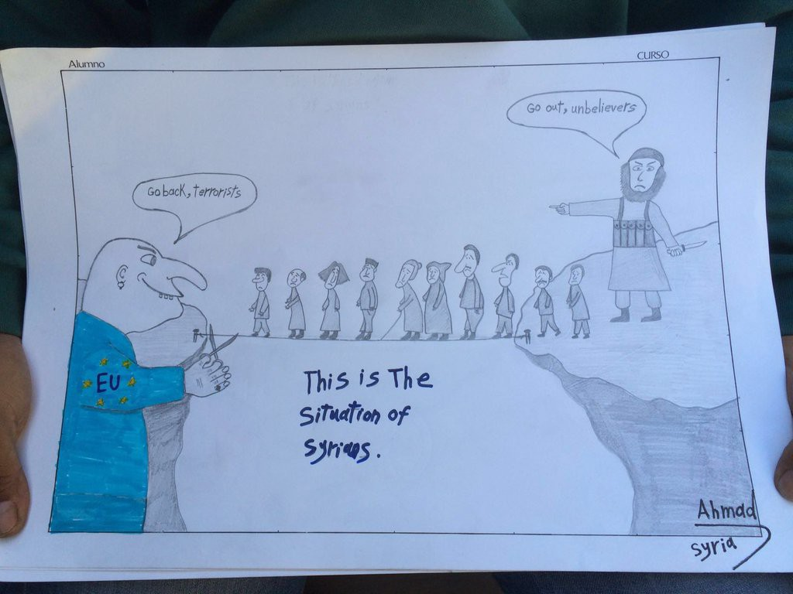
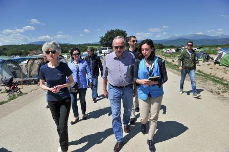
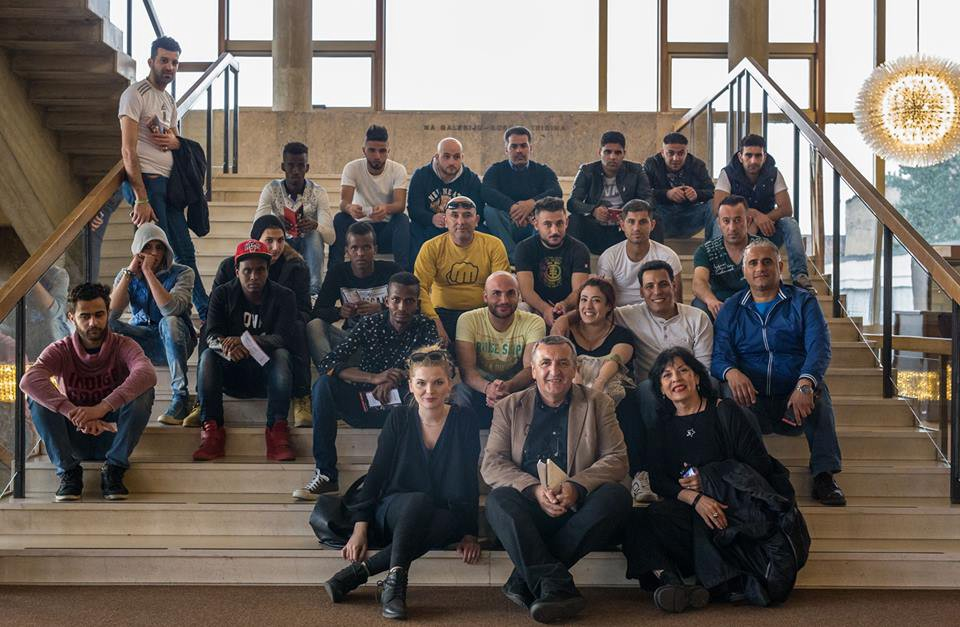

### AYS DAILY DIGEST 20\.05\.2016
#### Greek appeals committee halts deportation of Syrian, ruling Turkey ‘unsafe’\. Greek strike will severely affect border crossings with Macedonia during the weekend\. Hopeless refugees on Chios lost their faith in European governments\. Small numbers of new arrivals on Lesvos\. Idomeni Volunteers continues to support the many thousands of people living in the area\. A delegation of MEPs is visiting Greece to assess migrants’ situation\. German report warns migrant inflow through Bulgaria on the rise\. Refugees returning to war zones from Croatia\. The European Commission awards €56 million in emergency funding to improve conditions for migrants in Greece\. EU ministers introduce an emergency mechanism to suspend countries from visa free travel\. The new Refugees Welcome Index by Amnesty International shows the vast majority of people \(80%\) would welcome refugees with open arms\.

MEPs visiting Greece, Photo by European Parliament / LIBE Committee Press
#### Featured News
### A Greek appeals committee has upheld an appeal by a Syrian refugee against a rejected asylum application, deeming that Turkey is an “unsafe country\.”

> [**_The decision could throw a recent deal between the European Union and Turkey, which foresees newly arrived migrants being returned to Turkey, into disarray if it prompts a wave of similar rulings\._**](http://www.ekathimerini.com/208850/article/ekathimerini/news/greek-appeals-committee-halts-deportation-of-syrian-ruling-turkey-unsafe) 

> _The Syrian national, who arrived on the Aegean island of Lesvos from neighboring Turkey, had appealed for asylum but saw his appeal rejected and faced deportation to Turkey\. However, a committee that rules on rejected asylum applications, deemed that the Syrian should not be deported as Turkey is an ‘unsafe country\.’ The next step is for the Syrian’s asylum claim to be reexamined, a process that will likely take months\._ 

> _The asylum service has examined 174 asylum applications by Syrians on the island of Lesvos\. Of those, 100 were granted asylum and continued their journeys to the Greek mainland\. Those whose applications were rejected also appealed, leaving the appeals committee with dozens of cases to re\-examine amid fears of the impact on the EU\-Turkey deal\. In a related development, the Greek Police, in cooperation with the EU’s border monitoring agency Frontex, deported 51 “irregular migrants” from Greece to Turkey\. The migrants were from Bangladesh, Pakistan, Iraq, Afghanistan, Algeria and other countries\._ 

#### GREECE
### Greek strike will severely affect border crossings with Macedonia during the weekend

> _The daily newspaper [**REPUBLIKA from Skopje reports**](http://english.republika.mk/greek-strike-will-severely-affect-border-crossings-with-macedonia-during-the-weekend/) , Greek customs officers announced a strike during the weekend that will close the Bitola and Dojran border crossings to all vehicles, and will also impose restrictions on the main border crossing in Gevgelija\._ 

> _Passengers will only be allowed to cross the Macedonian — Greek border on foot at the Bitola and Dojran crossings\. In Gevgelija, vehicles will be allowed through, but only in short, 15 minutes slots, in between two hours of closures\._ 

### **Translators urgently needed to bring hope to Chios**

> _Morale in Chios is very low\. In addition to the on\-going hunger strike in Souda camp and terrible living conditions in Vial camp, the recent death of a Syrian refugee who was held in Chios hospital for two months without improvement came as a hard blow to both refugees and volunteers on the ground\. According to many sources, refugees have understandably lost their faith in European governments and most of the big NGO’s, but they still trust the volunteers who have been with them since the beginning\. And now they need your help\._ 

> Imagine living for almost two months in rough conditions with no updates on how you should proceed with your life? As someone who has worked on the refugee crisis since last summer, I’ve witnessed the paradigm of this humanitarian crisis shift from basic humanitarian aid \(which of course is still important\) to a whole new level as the normally transient refugees stay stagnant on the mainland and the islands\. I’ve heard this so many times: “we don’t need food, we don’t need clothes\. Just tell us what is going on\.” _— says volunteer Gabrielle Tan\._ 

> _Gabrielle’s team Action from Switzerland, but also Chios Eastern Shore Response Team \(CESRT\) and their colleagues are now running information and support projects that could bring some hope to refugees stuck on Chios\. They desperately need translators and legal volunteers to reach as many beneficiaries as they can\. Kurdish interpreters are most urgently needed\. If you are fluent in English and Kurdish dialects, but also if you have an excellent legal understanding of asylum system, family reunification and other topics relevant for refugees in Greece, please contact Gabrielle Tan on Facebook\. More Arabic, Farsi and Dari interpreters are also needed for a project run by CESRT on Chios, so please pm CESRT for more information if you are an interpreter interested in volunteering 9–6 for 5–6 days a week\._ 

Photo by MSF Sea
### **Afghans and Syrians can move freely after 25 days on Kos?**

> _Volunteers are reporting, Afghans and Syrians can move freely at the island after 25 days\. “We do not know the reason why it will take this much time\. Until then they have to stay inside the hotspot except for minors and families\.” — according to information by Flying Help e\.V\., a German NGO cooperating with the local aid organization Kos Solidarity — they are in the “usual” hotels where refugees are hosted and supported\._ 

#### 54230 refugees in total are stuck in Greece up to this Friday\. To sum up the daily numbers published by authorities, 4177 refugees are living on Lesvos \(28 arrived last night\), 2368 on Chios, 1089 on Samos, 521 on Leros, 359 on Kos, 63 on Rhodos and on 15 Kalymnos\. That means 8592 in total for the Aegean Islands\. \(8561, 19\.05\. \) Among the 14496 people in the Attica region, 1468 are still staying at the Piraeus Port\. With the 9007 in Idomeni, there are a total of 28730 refugees in Northern Greece\.
### **IDOMENI UPDATE**

> _by [**Idomeni Volunteers**](https://www.idomenivolunteers.info/) — [the self\-organized coalition of independent volunteers, teams and small aid organizations](https://www.facebook.com/idomenivolunteers/) :_ 

> “The government recently declared Idomeni closed and the process of moving people to government camps has slowly begun\. 

> It is unclear, how long people will remain in the informal camps surrounding Idomeni, and so we continue “business as usual” to support the many thousands of people living in the area\. In addition to continuing our existing provisions, we are offering support in many of the government camps where the population of Idomeni will soon reside, and where others have lived for a number of months\. 

> Flexible Volunteers, Resources and Support are needed as much as ever in these changing and dynamic times\. We especially need the help of translators, builders, teachers, drivers, logisticians and child specialists, as well as flexible long term volunteers to offer humanitarian support across the North of Greece\.“ 

### **EU parliamentarians visit Athens in an attempt to assess the situation**

> [**_A delegation of nine MEPs_**](https://storify.com/europarl_en/meps-visit-greece) _\(Members of European Parliament\) from the LIBE committee \(European Parliament Committee on Civil Liberties, Justice and Home Affairs\), led by Péter Niedermüller \(S&D, Hungary\), visited Greece on 17–20 May to assess migrants’ situation on the country’s Northern border as well as elsewhere\._ 

> _On Friday the delegation met the public order and European affairs committees at the Greek parliament\. Delegation members held a press conference in Athens to discuss migration issues, including the EU\-Turkey agreement\._ 

Photo by European Parliament / LIBE Committee Press
#### BULGARIA
### German Report Warns Migrant Inflow ‘Being Channeled Through Bulgaria’

> _The inflow of migrants into Europe is increasingly being directed to Bulgaria by smugglers, German mass\-circulation daily BILD warns, citing a report by the country’s foreign intelligence service\. The text published Friday reads that the development is a result of measures taken in the Aegean to crack down on people smuggling, traffickers increasingly go for land route across the Bulgaria\-Turkey border\._ 

> [**_A massive inflow could turn out to be beyond the capabilities of an underfunded and understaffed Bulgarian police, BILD notes_**](http://www.novinite.com/articles/174563/) **_\._** 

#### CROATIA
### Refugees returning to war zones from Croatia

> _Refugees are voluntarily returning to their homelands after spending some time stuck in Croatia\. This does not only count for those who never asked for asylum \(they were transferred from Slavonski Brod camp to Jezevo detention center and scheduled for deportation\), but also for those who did ask for asylum after the border closed\. Not being happy with their stay in Croatia, some of them decided to find a better future somewhere else\. Out of 62 people who were sent from Slavonski Brod camp to Porin hotel in Zagreb, only 29 remain there\. Others decided to leave, including Syrians, Iraqis and others who are now returning back to a war zone\. Porin recently got a new manager who seems very eager to make their stay there as pleasant as possible, so we are hoping to see many changes for the better soon\. Many refugees also departed from nearby town of Kutina, where families and vulnerable individuals are staying\. Living conditions in Kutina facility seem to be decent, with the exception of toilets which could be much cleaner\._ 

Refugees and AYS volunteers with our host Branimir Pofuk in Lisinski concert hall; PHOTO: Lela Knezevic

> _In an effort to help with integration of those who are still left in Croatia, AYS was finally allowed to officially work in Porin, where we are now developing education programmes, organising daily activities for the refugees, taking them to the dentist or doctor if needed, and even starting a community garden for them to use\. Today we took a group of people from Syria, Iraq, Egypt, Somalia and Algeria to Lisinski concert hall and to a Mahler concert a bit later\. AYS volunteers are also supporting Kutina with donations of clothes and other necessities\._ 

#### GERMANY
### German Ocean Route to U\.K\. via ‬ Cuxhaven

> _Obviously there is a unknown, low frequented, route to England via the Cuxhaven port, where refugees try to enter the ferries\. Since last autumn, authorities have registered an increasing number of attempts, [**Cuxhavener Nachrichten**](http://www.cn-online.de/stadt-land/news/cuxhaven-polizei-greift-immer-mehr-fluechtlinge-im-hafen-auf.html) reports\. Mostly from Albania and Kosovo, the refugees try to get in a truck trailer, which go by ferry to England\. In the beginning it has only been individual cases, the police reports, but during the last three weeks, the situation has escalated\. [**Spiegel Online**](http://www.spiegel.de/politik/ausland/fluechtlinge-bundespolizei-schliess-cuxhaven-route-a-1093251.html) adds that there have been 32 cases overall, involving 60 refugees\._ 

#### FINLAND
### Finland joins many European countries in restricting the space for asylum

> [**_The European Council on Refugees and Exiles \(ECRE\)_**](http://www.ecre.org/component/content/article/70-weekly-bulletin-articles/1484-finland-joins-many-european-countries-in-restricting-the-space-for-asylum.html) _reports: new guidelines issued by the Finnish Immigration Service this week are restricting the requirements for granting residence permits to asylum seekers in the country\. Under the new amendments to the Aliens Act, residence permits on the basis of humanitarian protection will no longer be granted\. Humanitarian protection is normally granted to those applicants who do not qualify for asylum or subsidiary protection; but who cannot be returned to their home countries due to a bad security situation, poor human rights record or an environmental catastrophe\._ 

#### TURKEY
### Europe’s Turkey Dilemma: Migration vs\. Democracy

> _The Middle East refugee crisis and Turkey’s slide toward authoritarianism have put [**the European Union in front of a moral dilemma**](http://www.wsj.com/articles/europes-turkey-dilemma-migration-vs-democracy-1463650200) : Is protecting its borders worth sacrificing long\-term goals of promoting democracy and human rights? The immediate crisis is over the March deal that was supposed to lift visa requirements for Turkish visitors to most of the EU by the end of next month, and provide Ankara with an additional €3 billion \($3\.4 billion\) in aid\. In exchange, Turkey would act to stop the waves of refugees and economic migrants from Syria, Iraq, Afghanistan and beyond\. Turkey has shown it is able to do so, with refugee arrivals in Greece slowing to some 60 a day this month, from a peak of 7,000 a day in October\. But the plan stalled after President Recep Tayyip Erdogan said Ankara wouldn’t fulfill the EU’s long\-standing condition to amend Turkey’s draconian anti\-terrorism law, which is increasingly used to muzzle the media and political opposition\._ 

### **Syrian families forced out of their houses in Istanbul**

> _With the World Humanitarian Summit briefly ahead, several refugee support groups invite to a [**press conference**](https://www.facebook.com/GocmenDayanismaMutfagi/posts/552579681590991) tomorrow in Istanbul because several Syrian families have been forced out of their houses in Istanbul and were brought to detention camps in Osmaniye\._ 

#### FRANCE
### Teachers needed for new school in Calais

> [**_The Oromo people living by Jules Ferry have asked for a school to be built\._**](https://www.facebook.com/groups/CalaisMigrantSolidarityActionFromUK/permalink/1065069280234485/) _With 20 newly arrived unaccompanied minors, they want a space to learn\. We have the materials and builders sorted — the school will hopefully have been built in a month — but we need teachers to come and volunteer to teach English and French\. Any teachers who want to help some refugees who are really keen to learn this summer, please get in touch with [**Jack Steadman**](https://www.facebook.com/notjacksteadman) \._ 

### A fire

> [**_woke up people in the early morning of Friday in Calais camp\._**](https://www.facebook.com/ifty.patel/posts/1291770784170374) _Presumably caused by someone trying to cook, the flames soon burned down three homes and damaged two additional ones\. One person was slightly injured \. There are fortunately no more casualties thanks to the speedy reaction of Sofinee Harun, who is now in urgent need of new fire extinguishers\._ 

](assets/4b91ef51cb6c/1*N47zO6sVOTGc9E-JjASBFA.jpeg)

PHOTO: [**Ifty Patel**](https://www.facebook.com/ifty.patel)
#### BRUSSELS
### The European Commission awards €56 million in emergency funding to improve conditions for migrants and strengthen the registration and asylum process in Greece

> [**_The European Commission has awarded €56 million in emergency funding to improve conditions for migrants in Greece, to increase the capacities of the Greek authorities to register newly arriving migrants and to process their asylum claims\._**](http://europa.eu/rapid/press-release_MEX-16-1871_en.htm) _The funding is supposed to create better conditions for vulnerable migrants and strengthen the registration and asylum process with additional human resources, better IT infrastructure, an increased availability of interpretation and better access to information\. The funding will support different projects: €30 million is awarded to the UNHCR to support the Emergency Response Plan for Greece and strengthen the capacity of the Greek asylum service and of the new Reception and Identification Service; the International Organization for Migration \(IOM\) will receive €13 million to provide assistance to the most vulnerable migrants stranded in Greece; the Greek Ministry of Interior and Administrative Reconstruction and the Greek Asylum Service are awarded a total of €13 million to enhance the efficiency of the asylum process, strengthen the registration process and provide operational support to the Hellenic Police at the external borders\._ 

### EU\-Interior ministers come to an agreement on an emergency mechanism to suspend countries from the visa free travel

> _… e\.g\. if public safety is in danger or countries violate the rules\. This affects Georgia, Kosovo, Ukraine — and Turkey\. Once used this mechanism is valid for six months\. If the situation in the country doesn’t change it can be added to the list of countries with visa requirement\. [**Interior ministers said this is not especially against Turkey but all countries with a visa agreement**](http://www.zeit.de/politik/ausland/2016-05/eu-visa-freiheit-notmechanismus-tuerkei-innenminister) \. Germany and France suggested this mechanism, it has to be verified by the European Parliament\. Meanwhile it is said that visa free travel for Turkey won’t be implemented before October\. It was meant to start on June 30\. Discussions about Turkish anti terror laws are still on\-going\._ 

### The new Refugees Welcome Index by Amnesty International shows the vast majority of people \(80%\) would welcome refugees with open arms\.

> [**_The new Refugees Welcome Index, based on a global survey_**](http://www.amnesty.eu/en/news/press-releases/region/sub-saharan-africa/new-refugees-welcome-index-shows-government-refugee-policies-out-of-touch-with-public-0979/) _of more than 27,000 people carried out by the strategy consultancy GlobeScan, ranks 27 countries across all continents based on people’s willingness to let refugees live in their countries, towns, neighborhoods and homes\._ 

> _The survey shows people say they are willing to go to astonishing lengths to make refugees welcome\. It also shows how anti\-refugee political rhetoric is out of kilter with public opinion\._ 

> _China tops the Refugees Welcome Index, followed by Germany and the UK\. The countries that scored lowest were Russia, Indonesia and Thailand\. Just under half of people surveyed in China \(46%\) said they would accept refugees into their own home\. More than half of respondents in Germany \(57%\) said they would accept refugees in their neighborhood, and a further one in 10 would welcome them into their home\. Almost all Germans \(96%\) said they would accept refugees into their country, with only 3% saying they would refuse them entry\. People in the UK are the second\-most willing to make refugees welcome in their own homes \(29%\) \. On top of that, another 47% said they would accept refugees into their neighborhood\. The vast majority of people in the UK \(87%\) would let refugees into the UK\. People in several countries who have already accepted large numbers of refugees show no signs of flagging acceptance, with Greece and Jordan joining Germany in the top 10 of the Index\._ 

_Converted [Medium Post](https://areyousyrious.medium.com/ays-daily-digest-20-05-2016-4b91ef51cb6c) by [ZMediumToMarkdown](https://github.com/ZhgChgLi/ZMediumToMarkdown)._
