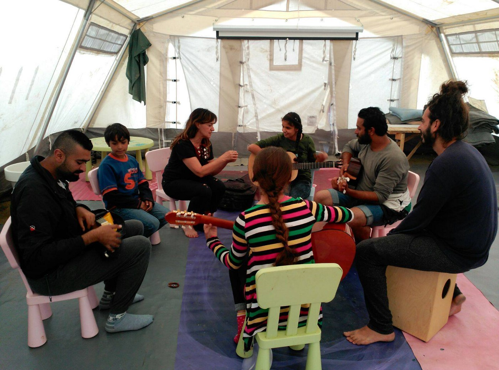
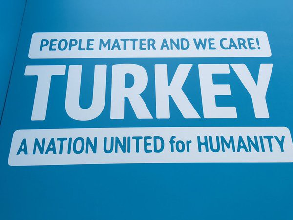
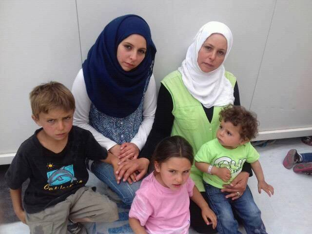
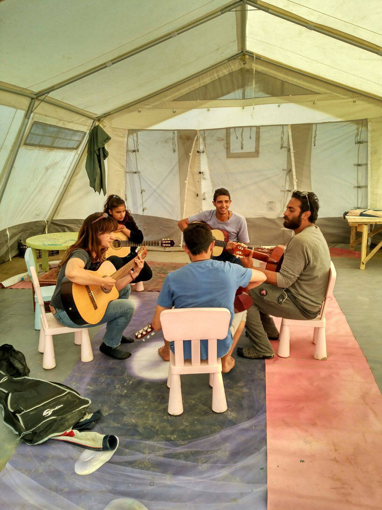
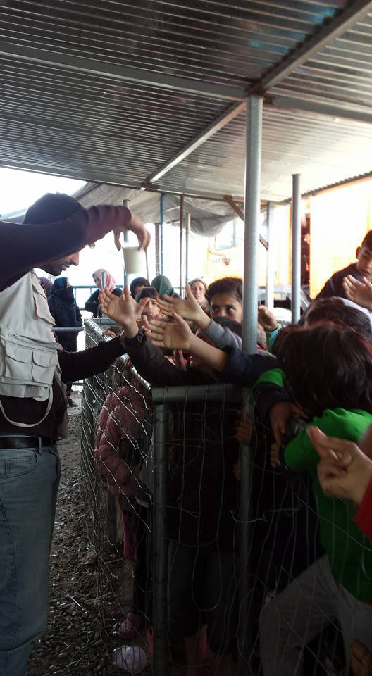
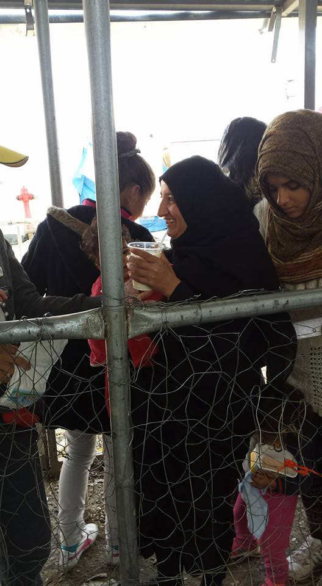
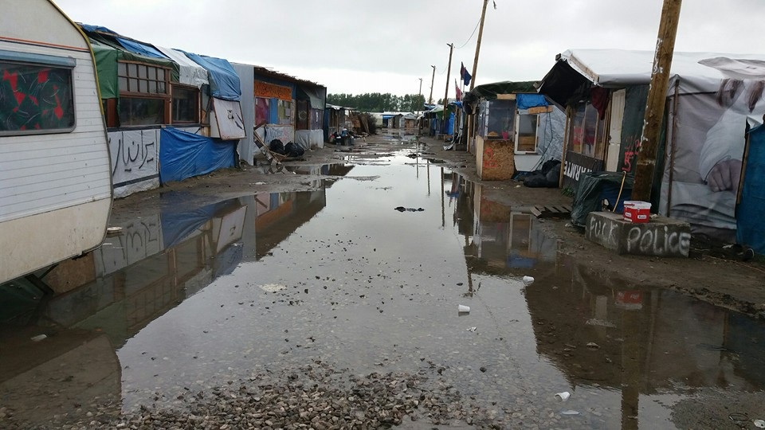
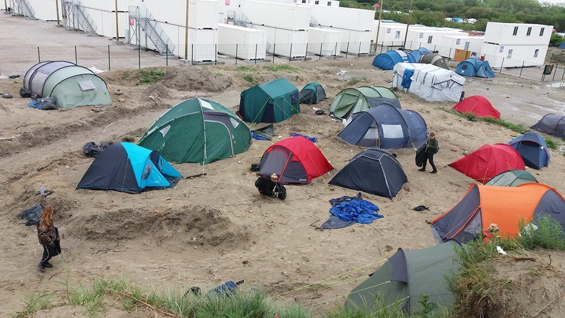

### AYS Daily News Digest 22\.5\.2016
#### U\.S\. Commander checks in on SDF allies on Saturday in “Secret, but not secret” meeting\. World Humanitarian Summit opens, with criticism\. Pre\-registration begins in Greece, end of May\. Nearly 55,000 stranded in Greece: overcrowding pools dangerously\. Chios Hunger Strike: “if we go away, the whole world will be shamed”\. Serious flooding in Greek camps and police restrictions endanger civilians; Idomeni evacuation may commence Tuesday\. Divided Austria may elect first far\-right President\. UK detention center internet access regulations prevent individuals from obtaining crucial information\. Canada Border Services Agency lacks proper oversight, allowing detained migrants and refugees to die in mysterious circumstances\.

Photo credit: Idomeni Cultural Center
#### SYRIA
### U\.S\. Commander checks in on SDF allies on Saturday in “secret, but not secret” meeting

Becoming the highest\-ranking U\.S\. Army General to visit Syria since the beginning of the conflict, [Army General Joseph Votel arrived in northern Syria](http://www.dw.com/en/new-us-commander-joseph-votel-makes-surprise-syria-trip-to-assess-rebel-groups/a-19275519) in an effort to meet with and assess local U\.S\. allies from the Syrian Democratic Front as they launch a campaign to push back ISIS from controlled territory\. Although many media outlets considered the surprise visit to be secretive, General Votel does not agree\. In a controversial decision, General Votel brought members of the press on his trip, saying, “We don’t have anything to hide\. I don’t want people guessing about what we’re doing here\.”
#### TURKEY
### World Humanitarian Summit opens, but will face an upward climb to lofty goals

Today marked the opening of the much\-hailed World Humanitarian Summit in Istanbul, Turkey\. Although the WHS has aims that reach far beyond the refugee crisis and are oriented towards reforming humanitarian aid work, the refugee crisis has only further highlighted the need for serious reform\.The WHS has a star\-studded invite list and an ambitious program, with the [core spheres of action](https://consultations.worldhumanitariansummit.org/bitcache/8ff0c0a06ce6c811821338bebbbb38c53ebafa74?vid=578019&disposition=inline&op=view) being “Leave No One Behind,” “Prevent and End Conflict,” “Respect the Rules of War,” “Working Differently to End Need,” “Invest in Humanity” as well as an extensive set of high\-level meetings and an expo designed to promote innovation in humanitarian aid\.

However, despite these lofty goals there remains skepticism and serious concern about how effective the Summit can be in addressing these concerns, considering the counterintuitive approaches to refugee support such as evicting refugees from neighborhoods in order to make way for a summit to assist them\. The first press conference also kicked off on a rocky note with IRIN News journalist Heba Aly’s [enquiry about the cost](https://twitter.com/connellyandrew/status/734383803934855169) of the Summit being dismissed as “ [not appropriate or relevant at all](https://twitter.com/emilytroutman/status/734383963200970752) \.” Only time will tell as the solutions proposed unfold over the next two days\.

Image credit: Heba Aly
### Volunteer Opportunities, Istanbul Area

The work continues throughout Turkey as the [Yusra Community Center](https://www.facebook.com/yusracommunitycenter/) in Istanbul is looking for volunteers in Balat/Fatih\. Opportunities for long\-time residents and locals are are Turkish teacher, Arabic/English speaker, Arabic/Turkish speaker\. Opportunities for locals and travelers include childcare, children’s art classes, and donation sorting and distribution\.

Please email yusracommunitycenter@gmail\.com and put what you can do in the subject line of the email \(from the 6 options listed above\) \.
#### GREECE
### The end of Skype? Pre\-registration begins in Greece, end of May\.

Greek Asylum Service, UNHCR, and EASO will collaborate on a pre\-registration exercise from the end of May for two months\. This pre\-registration will be available to all residents of open, mainland camps who arrived prior to 20th of March and is designed to address the paralyzing backlog of asylum applications which have left thousands stranded in overcrowded and under\-served camps\. Teams will be deployed at current registration centers in order to conduct the necessary steps in\-person\. Leaflets describing the new system have been distributed in camps in Greece\. The first phase of implementation is designed to accommodate 35,000 individuals, which would put a significant dent in the nearly 55,000 number of individuals currently trapped in Greece\. [Link](http://ecre.org/component/content/article/70-weekly-bulletin-articles/1485-greece-to-start-registration-of-asylum-seekers-residing-in-open-reception-facilities-in-the-mainland.html)
### 54,129 people stranded in Greece: overcrowding pools dangerously

According to the [Greek government](http://media.gov.gr/index.php/%CF%85%CF%80%CE%B7%CF%81%CE%B5%CF%83%CE%B9%CE%B5%CF%83/%CF%80%CF%81%CE%BF%CF%83%CF%86%CF%85%CE%B3%CE%B9%CE%BA%CF%8C-%CE%B6%CE%AE%CF%84%CE%B7%CE%BC%CE%B1/%CF%83%CF%85%CE%BD%CE%BF%CF%80%CF%84%CE%B9%CE%BA%CE%AE-%CE%BA%CE%B1%CF%84%CE%AC%CF%83%CF%84%CE%B1%CF%83%CE%B7-%CF%80%CF%81%CE%BF%CF%83%CF%86%CF%85%CE%B3%CE%B9%CE%BA%CF%8E%CE%BD-%CF%81%CE%BF%CF%8E%CE%BD-22-05-2016) , there are 54,129 refugees in Greece as of Sunday morning, May 22, which is more than 6000 individuals over the maximum capacity of all combined camps in Greece\. Several camps report severe overcrowding, with other camps being under capacity, meaning that rather than overcrowding being distributed evenly across camps, it is, rather, highly concentrated in several areas\. Dramatic overcrowding is documented in Lesvos \(4112 counted, 3500 capacity\), Samos \(1035 counted, 850 capacity\), and Chios \(2407 counted, 1100 capacity\) \.
### Strong weather warnings for Chios, Samos, Leros and Kos through Monday evening, with predictions of strong, gusty winds\.

Image credit: Chios Hunger Strike Facebook Page
### Chios Hunger Strike: “if we go away, the whole world will be shamed…”

> _The Chios hunger strike is in its 6th day with adults participating until their demands are met\._ 

> “…\[W\]e are holding on our opened hunger strike for the 6 day and we will continue until we get what want or go away\. It is our fight between us and all the world, if which country saves us, we and our children will thank it forever, or if we go away the whole world will be shamed because they couldn’t save us,” says one participant\. 

### Serious flooding in Greek camps and police restrictions endanger civilians;

Serious flooding across Greek camps have affected activities and safety, moving all extra activities inside as people struggle to stay dry\.

Photo credit: Idomeni Cultural Center
### Idomeni reports increasing police regulations; possible evacuation on Tuesday

Volunteers in Idomeni camp report the standard weekend appearance of 3–4 police busses with additional civil busses to take people to other camps voluntarily\. However, police are controlling every car and checking contents and volunteer registration\. PRAKSIS left yesterday and will return tomorrow, however ADM was not allowed to enter and deliver 4000 portions of food, putting a heavy strain on other food distribution\. Volunteers report that morning lines for infant formula and milk for babies and young children are hours long\.

CNN Greece reports that Greek police say there will be evacuation of Idomeni on Tuesday, in keeping with the pre\-decided date of May 31st\. With the increase in police monitoring and control of volunteers, this would seem to have some basis, although logistically, this seems very improbable\. Regardless, volunteers and refugees are advised to stay alert through the next several days\.

Photo Credits: Paul Carr
### Idomeni Call for Volunteers

Dolores, an independent medical van in Idomeni camp, is looking for medical practitioners \(students or graduated\) or those interested in medical accessibility to help with coordination\. Shifts are from 10–4pm and 4–9pm\. Long and short term\! CONTACT \+30 694 903 9782
#### AUSTRIA
### Divided Austria may elect first far\-right President

The right\-populist Freedom Party of Austria \(FPÖ\)’s candidate Norbert Hofer is neck and neck with the former Green party leader Alexander Van der Bellen in exit polls on Sunday night\. If Hofer is elected, it would be the first far\-right President to be elected in Austria in recent memory\. In a final campaign speech, Hofer asserted that if elected he would not only be the president of Austria, but, [specifically, “a president for Austrians\.](http://www.telegraph.co.uk/news/2016/05/20/no-nazis-in-the-hofburg-austria-poised-to-elect-far-right-presid/) ”

FPÖ’s rise is largely thanks in part to anti\-refugee sentiment,

> with campaign posters railing that Hofer is the only one who “will stop the immigrants\.” 

Austria led the charge for blocking the Balkan route in late winter, early spring of 2016, and many within Austria celebrated this move [“as a triumph over Angel Merkel’s ‘welcoming culture,’”](http://www.spiegel.de/international/europe/right-wing-populists-in-austria-aim-for-the-presidency-a-1090051.html) according to Der Spiegel\.

Calais “Jungle” Photo Credit: Help4RefugeeChildren
#### UK
### UK Home Office detention center internet access regulations prevent individuals from obtaining information crucial to their cases

Although all detention centers should offer internet terminals in order to enable individuals to access e\-mail and other pages that may be relevant to their cases, The Detention Services Order 04/2016 bans social networks and instant messaging\. Residents say that the ban also includes pages that have crucial information about country of origin which is important to their cases\. As many refugees rely on social networks and messaging to navigate their way to safety, important documents and references may also be on the now inaccessible social media and instant messaging platforms\.
#### CANADA
### Canada Border Services Agency lacks proper oversight, allowing detained migrants and refugees to die in mysterious circumstances

Last Saturday, a man in Canada Border Services Agency custody died, being the third to die in 2016\. “As usual,” reports The Star, “when a migrant dies in custody, the agency refused to reveal his identity and nationality or say whether his next of kin had been notified\. In fact, it sometimes doesn’t even announce that a person has died in custody until the news gets out from other sources and it is forced to confirm it\.”

The CBSA has little to no oversight, detaining thousands of migrants per year, many of whom are refugees who simply lacked proper paperwork or who had their claims denied\. Members of University of Toronto’s Human Rights Legal Program denounce the current approach, saying it violates human rights law\.

_Converted [Medium Post](https://areyousyrious.medium.com/ays-daily-digest-22-5-2016-e377338e8223) by [ZMediumToMarkdown](https://github.com/ZhgChgLi/ZMediumToMarkdown)._
