### AYS DAILY DIGEST More than 2,700 people rescued between Europe and Lybia
#### 24\.5\.2016: Over 400 people, including many children and pregnant women, were rescued by one boat from the Mediterranean sea\. More than 2,000 people moved today from Idomeni\. Attempted eviction of a refugee shelter in Prague\. Help needed in Calais, again\. 191,134 migrants and refugees entered Europe by sea in 2016, IOM estimates\.

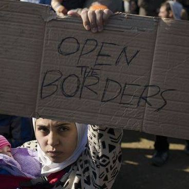

#### Weather Forecast // Wednesday May 25th & Thursday May 26th//
#### WARNING\! HIGH WAVES VARIABLE \+0\.3 TO \+0\.9 METERS WEDNESDAY THROUGH THURSDAY\. Waves over 0\.5 meters are considered dangerous\. The waves are generally moving Northward both days\. Leaving from Turkish coast of Canakkale to Lesvos, waves at your front both days\. Leaving from the west coast of Turkey to the Greek islands, waves at your left both days\. Winds: variable between 7 and 29 kph, with gusts up to 38 kph, blowing mostly Eastward\. Temperature in the Balkans from 9 in Idomeni to 25 at Hungary\-Serbia border\.
#### Mediterranean

**432 people rescued at the sea\.**

> Citizen Rescue Mission team [SOS Mediterranean](http://www.sosmediterranee.fr/journal-de-bord/432-migrants-secourus-le-meme-jour) reports that over 2,700 people were rescued over the last 24 hours between Europe and Libya\. Two alarming rescues occurred this morning when a a boat was rescued with 132 survivors\. Among them were many women and children, including ones who were traveling alone\. One of them, a Cameroonian child of two and a half years with his mother, was found in severe respiratory distress suffering from pneumonia and severe dehydration\. He was evacuated by emergency helicopter by Italian soldiers\. An MSF rescue ship was present to help all the people in distress\. They have not identified other serious cases but as usual, migrants were in states of extreme lethargy\. Most are from West and Central Africa \(Cameroon, Côte d’Ivoire, Guinea Conakry, Nigeria\) \. 

> A second boat carried about 300 people, among them 33 women, three of them pregnant\. 

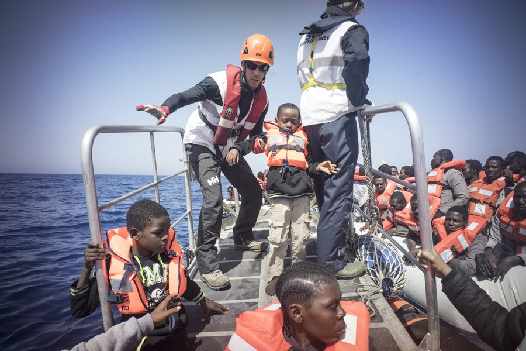

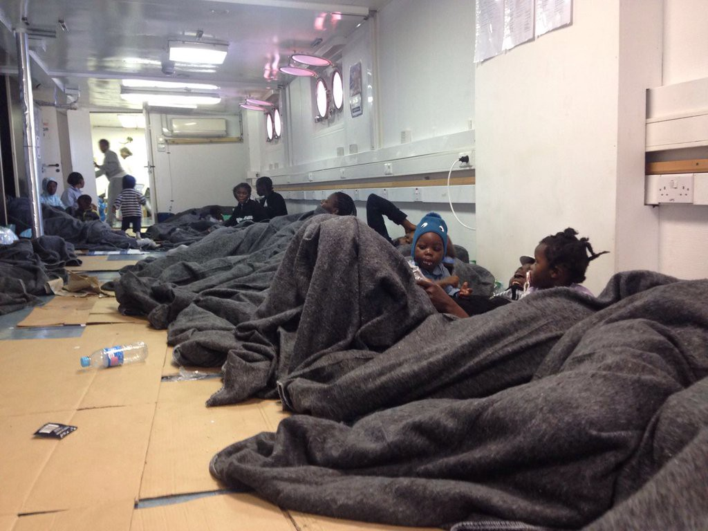

SOS Mediterrain

> Until year ago, the Mediterranean Sea was one of the most prominent routes for refugees trying to reach Europe\. It is estimated that 23,000 refugees lost their lives between 2000 and 2014\. In the first month of 2016, nearly 250 people have died or gone missing\. 

#### Syria
### Fabric of Life by Khaled Barakeh visually documents daily life in Syria\.

> It has been five years since the war began in Syria\. More that 250,000 people have been killed so far in this war, while almost 11 million people have fled their homes\. The Assad government currently controls the capital, Damascus, parts of southern Syria, portions of Aleppo and Deir Az Zor, much of the area near the Syrian\-Lebanese border, and the northwestern coastal region\. Rebel groups, ISIL, and Kurdish forces control the rest of the country\. Rebel groups often fight against one another\. The war has profound effects on Lebanon, Turkey and Jordan where huge number of refugees have settled\. Several rounds of peace talks have failed to stop the fighting\. The Last ceasefire was negotiated in February, but it has only limited fighting in some parts of Syria\. Many people are still forced to live in cities under siege via constant bombardment\. Pictures from the streets of Syrian cities remind one of the Sarajevo siege from 1992 to 1995, as well as the international intervention to stop the war\. [Khaled Barakeh](https://www.facebook.com/khaledbarakeh) , an artist living in Germany, has gathered images of life here into a collection entitled Fabric of Life\. 

> “Photos show different shields, mainly fabrics, that civilians created to protect themselves from snipers’ fire of the Syrian regime forces\.” 

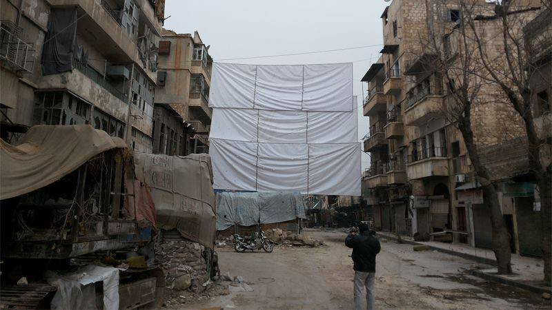

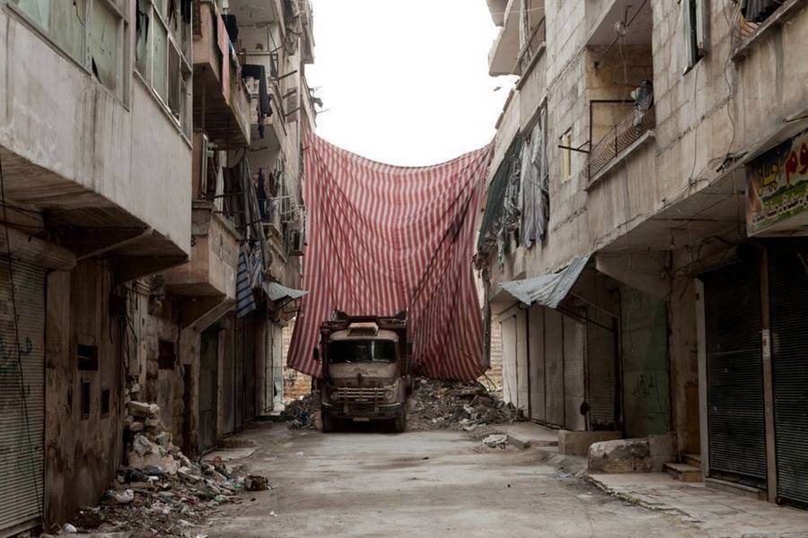

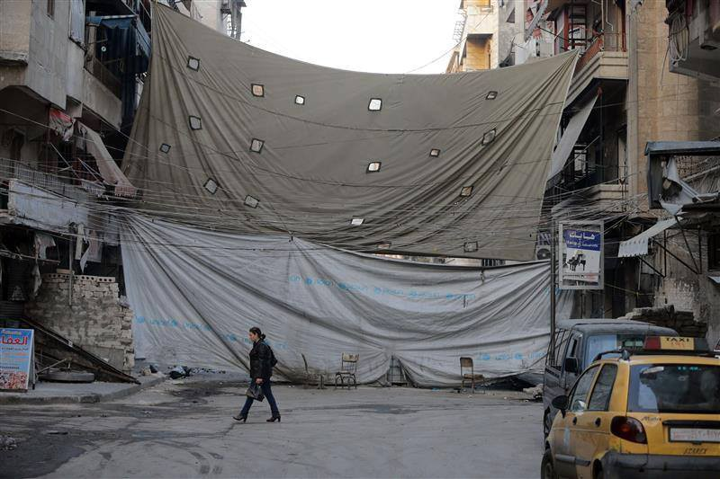

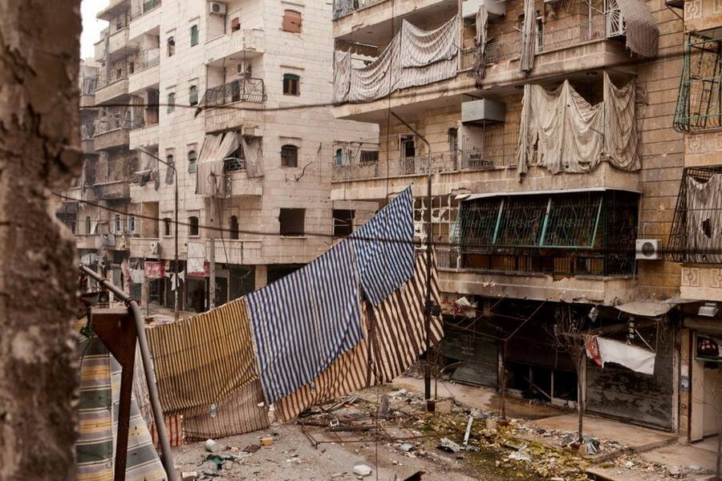

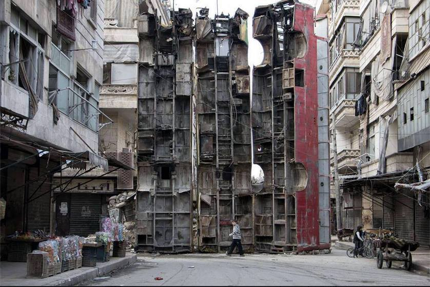

#### Greece

**2000 or so people so far evicted from Idomeni\.**

> After an MSF doctor finished her shift in Idomeni today, she stated “What struck me the most were the blank faces\. People looked like they had lost all hope”\. She was referring to people who were evicted today from the camp where some of them have lived for over three months\. They were hoping the border would open and that they would have freedom of movement\. 

> Early in the morning, police arrived with buses and bulldogs, and eviction began\. Before the evening, about 2,000 people were taken to other camps from Idomeni\. Relocation will continue tomorrow and it should be finished by the end of this month\. Unfortunately, people are being relocated to camps where living conditions are unbearable\. Read more on eviction in Idomeni from an AYS Special\. 

### Journalists banned from Idomeni\.

> The Greek government decided to ban journalists from the camp during the eviction and relocation of camp residents\. Police prevented refugees and volunteers who were inside of the camp from taking pictures\. The opposition party New Democracy has slammed this government decision\. 

> “A six\-kilometer cut\-off is being applied in Idomeni,” the spokesman for the conservative party, Giorgos Koumoutsakos said, commenting on restrictions to all media staff\. 

> “This is a censorship operation that harms the freedom of the press and exposes the country internationally” Koumoutsakos said\. “When there is rule of law, the government should have nothing to fear from free public information”\. 

**29 new arrivals at Greek islands\.**

> 29 new arrivals were registered today in Greece, all at the islands\. According to government sources, there are 54, 124 refugees in Greece now\. Before the relocation at Idomeni, 8,199 were inside the camp\. 

### Strikes in ports and in Athens

> Piraeus Port Organization \(OLP\) and Thessaloniki Port Organization \(OLTH\) employees announced a strike that will take place beginning Thursday, May 26th\. They are protesting against the privatization of the ports\. Sea transport will be heavily affected\. 

> The strike was announced from the Athens public transport system and it will take place for several hours after 11:00 in the morning on Thursday\. Athens’ trams and lines 1, 2 and 3 on the Athens metro system will not be running from 11:00 until 16:00 in the afternoon, while buses and trolleys will not be running between 11:00 and 17:00\. Public transport workers object to the inclusion of the public transport companies in the new privatization fund, opposing the prospect of privatization, and have called meetings to decide their response\. 

#### Czech
### Refugee shelter eviction

> Police in Prague made another attempt to evict people who are squatting at Klinika center, including several refugees\. From Klinika Twitter we learned how riot police came claimed the presence of a bomb in the building\. However, the bomb was not found, but the police entered the center forcibly\. Apparently some people were arrested\. Activist living inside are calling for help\. Follow their twitter account @centrum\_klinika\. 

> The same center was attacked several times this year\. In February, a group of people threw Molotov cocktails at the building\. The attack took place just hours after thousands of people rallied in Prague against Muslims and immigration\. Activists who work at the center said the attackers were neo\-Nazis\. 

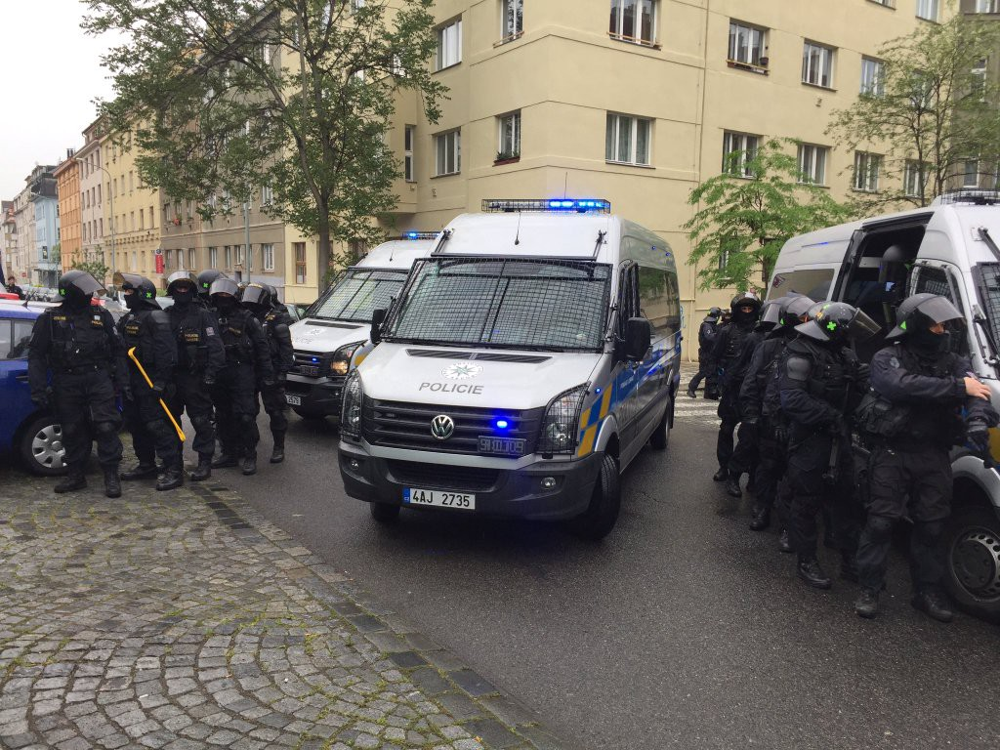

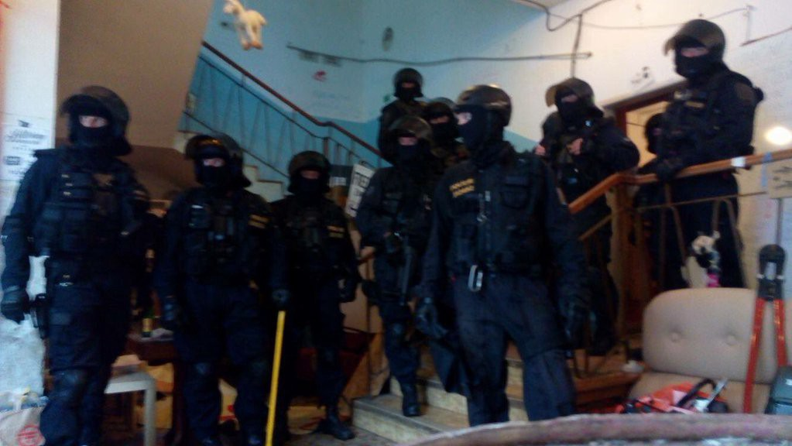

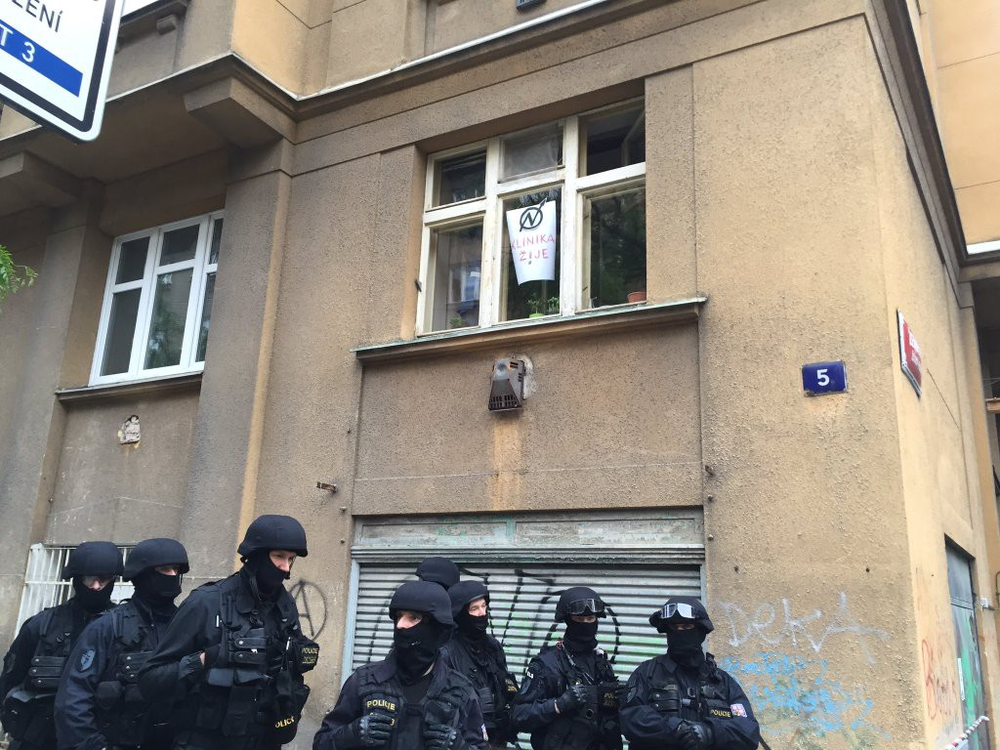

Photo by Klinika Center
#### France
### Urgent help needed in Calais\.

> “Supplies in the Care4Calais warehouse have never been so low\. We are desperate to carry on with our work but we need your help\. The priority needs list on our website is updated every two weeks\. And even if you don’t get it quite right don’t worry\. 

> Please get the message out that the Calais camp is not only still here but we are receiving new arrivals every day\. We urgently need clothes, food and camping equipment\. If you have any questions at all just ask and we will be happy to help you email us at [clare@care4calais\.org](mailto:clare@care4calais.org) \.” 

> They are sending vans to Paris, Lille and smaller camps every week\. Please [go to their website to see how you can donate](http://care4calais.org/donate/) \. 

#### General

**1370 people died in the Mediterranean this year\.**

> IOM estimates that 191,134 migrants and refugees entered Europe by sea in 2016 before the 21st of May, arriving in Italy, Greece, Cyprus and Spain\. Deaths up to May 21st this year stand at 1,370 on all Mediterranean routes, which is 24 percent lower than last year’s total of 1,792 through the same period\. 

_Converted [Medium Post](https://areyousyrious.medium.com/ays-digest-more-than-2-700-people-rescued-between-europe-and-lybia-61a2a1d59f6f) by [ZMediumToMarkdown](https://github.com/ZhgChgLi/ZMediumToMarkdown)._
