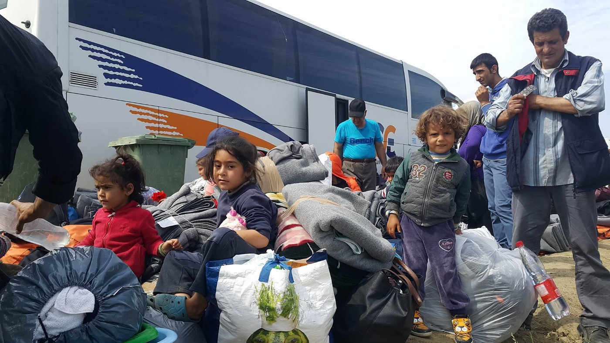
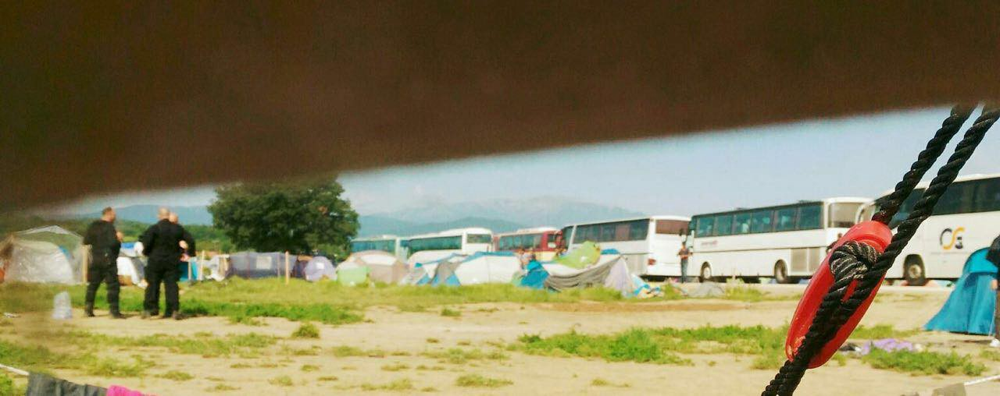
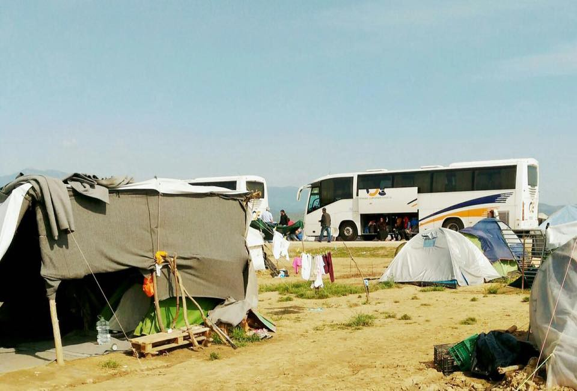
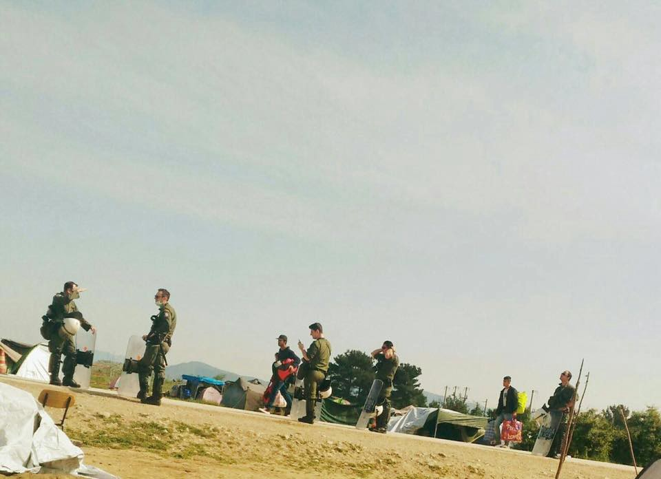
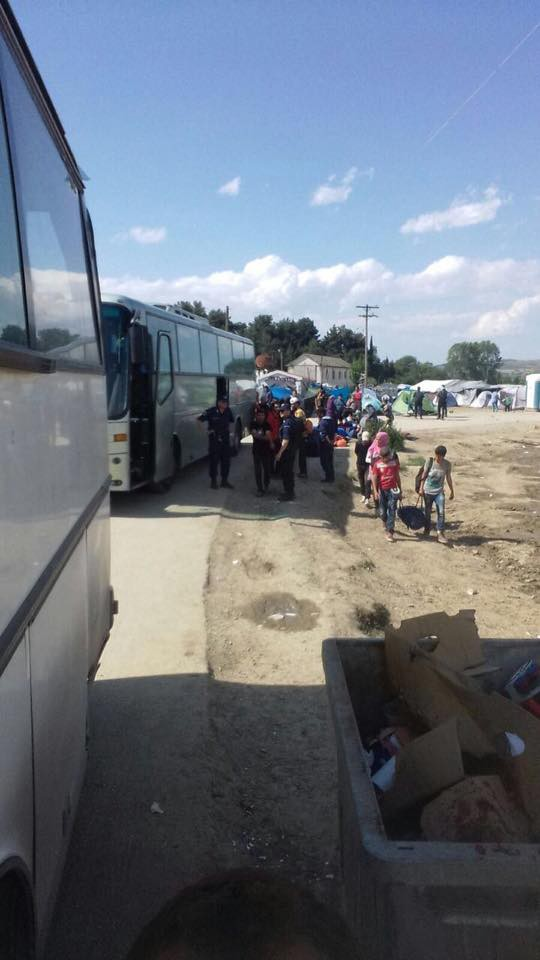
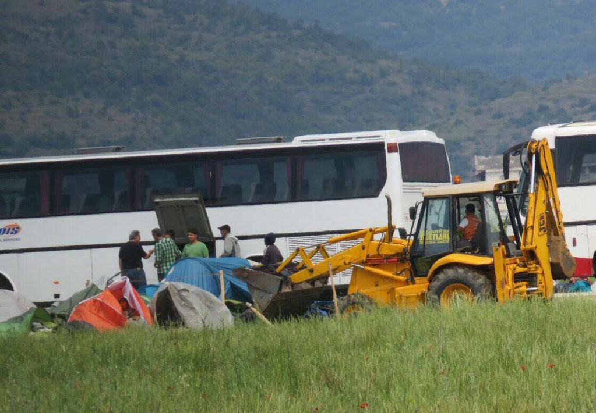
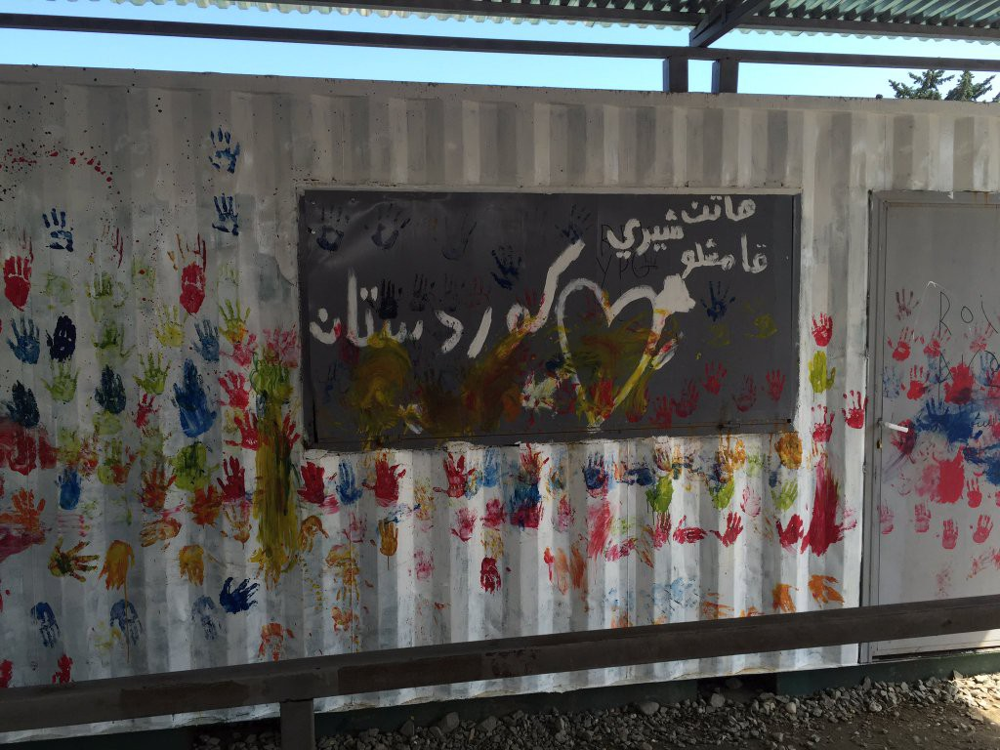

### Idomeni Special: Around 2,000 people moved out from the camp during the first day of eviction

Photo by Anezka Polaskova

After more than three months, the improvised refugee camp in Idomeni, at the Greek — Macedonian border, is closing down\. Relocation of people and destruction of temporary “establishments” started today \(May 24\) around 7am\. By 5pm, about 2,000 people were taken by busses to other camps in Greece\. Some did not want to leave this way, and so started walking by themselves, hoping to cross the border\.

According to Petros Tanos, press officer for the local police, 42 buses that left Idomeni went to camps in the Thessaloniki area and two buses with 96 Yazidi people are going to a camp in Petra, near Mount Olympus\.

Refugees TV

Refugees TV

The Greek government plans to relocate 4,000 people by tomorrow evening, and the entire camp — around 8,000 people — should be empty by the end of May, as announced earlier\.

Around 1,400 police are overseeing the eviction\. Police have acted, more or less, professionally, except in forbidding people to take pictures, including journalists who were present on\-site during eviction\. Only a small number of volunteers are allowed to stay inside, the list of those who do have permission having been already made by the police\. For now, inside the camp are MSF, MDM, PRAXIS, ARSIS, INTERVOLVE, SAMARITANS PURSE, UNHCR, OIKOPOLIS, RED CROSS and HOT FOOD EIDOMENI\.

Even though it was announced that the UNHCR will help with relocation, volunteers are saying their role is not visible today\.

Meanwhile, tents and other temporary structures, like the cultural center or independent schools set up by volunteers and refugees, are being demolished with bulldozers\.

In the late afternoon, a group of volunteers organized protests against the eviction\. They say their protest is directed toward the Europe\. Other that that, everything remains calm, even though there are many people who believe that if they stay at Idomeni, there is a hope that the border will open eventually for them\. Unfortunately, it is not expected that this will happen any time soon\.

During the eviction, police guarded busses that were taking refugees to other camps, dividing people by their nationalities in order to keep people coming from the same countries together in the same camps not only in order to more easily facilitate the asylum process, but also to avoid inter\-nationality hostilities that are occurring occasionally in camps in Greece\.

Greek government decided to move people from Idomeni in order to open the rail\-tracks\. Previously, the Greek minister of Infrastructure and Transportation said that the economic impact of the railway blockade is “dramatic\.” Nevertheless, the impact it had on the over 12,000 people that were stranded here after so\-called Balkan route was closed, is much more dramatic, but not enough to make those responsible — not only Greek government — react humanely, people having been left freezing in the snow and rain, sleeping on the ground, eating only what volunteers were providing, for months\.

Volunteers in Idomeni

](assets/f10d33b84e4d/1*4Es_ap4lSg1yF_7zTZFzVA.jpeg)

Farewell, Idomeni, Photo by [Ana Carolina Moreno](https://www.facebook.com/anacarolinamoreno/)

](assets/f10d33b84e4d/1*WPH3QRHPUjIdXFqPcg792A.jpeg)

Farewell Europe, Idomeni, Photo by [Ana Carolina Moreno](https://www.facebook.com/anacarolinamoreno/)

People, including many children, were living in conditions that are impossible to describe\. Out of despair, people tried on several occasions to cross the borders and continue their journey, but just few of them made it\. Border police were harsh and violent, using tear gas, water cannons and stun grenades in order to stop people from crossing the border\. Many people were injured in this way\. MSF, along with many volunteers from all around the world, were with refugees inside the camp all the time, trying their best to ease their suffering\.

Hundreds of unaccompanied minors were also staying in Idomeni, and a couple of dozen babies were born in Idomeni, under tents\.

People, including these children, are now being moved to various camps throughout Greece, including Kalochori, Oreokastro , Sindos, and Alexandria, and some others, too\. According to info AYS has gathered, Kalochori is one of the new camps located near Thessaloniki, with a maximum capacity of 800 people\. People living here are mostly from Syria and Iraq\. Volunteers in the field are telling us that life conditions in this camp are “unacceptable\.”

> “Tents are dirty and leaking\. There is no clean water for drinking\. The next supermarket is kilometers away\. The area is an abandoned industrial area far off any humane environment\. The residents‘ psychological condition after being evicted is disastrous\.” 

The situation is not much better in Sindos where, according to our info, there is no water but bottled\. Volunteers are trying to secure water filters\.

The situation in Alexandria is better\. Medical care is inconsistent, but it is present\. Sanitation is good and there is drinking water on tap and showers, and there is enough food\.

Greece’ migration spokesman Giorgos Kyritsis said that, though rudimentary, camps where people are relocated, have electricity, running water, telephones, shower and toilet facilities\.

> “Seven of the shelters are in industrial buildings and two are open\-air tent sites\. Tents and office\-style cubicles will be used for the privacy of families\. Some will have air\-conditioning and food will be provided\.” 

One of the volunteers got in touch with an refugee who is relocated to the camp in Sindos\. He complained about the conditions, saying the higiene condition are very bad\. “Like a small jail\.” He also wrote that there is not enough food, and people are sleeping under tents inside a big old factory\. “People sleep in the hangars, there is only one entrance\.”

The new camps will have some restrictions\. Journalist will need to have permission to enter, while all the refugees will be allowed to move freely after being registered\. The new camps are able to house around 6,000 people, but more than 8,000 refugees are believed to be in Idomeni at the moment\. More places are promised to open as the action proceeds\.

After the borders were closed, the EU promised refugees that they would be taken care of and relocated to other countries in Europe\. So far, this has just been an empty promise as, according to figures released by the EU, just 208 refugees have been relocated since 16 March\.

As such, it is clear that moving people from one camp to another is not a solution they are asking for\. Most of the refugees want to go from Greece and are still hoping that the borders will open\. Many are deciding to continue to use illegal crossings or are paying smugglers to take them through the Balkans\. It does not look like there is any solution for this situation, and moreover nobody even mentions taking efforts to stop the wars in the countries where these people are running from\.

_Converted [Medium Post](https://areyousyrious.medium.com/idomeni-special-around-2-000-people-moved-out-from-the-camp-during-the-first-day-of-eviction-f10d33b84e4d) by [ZMediumToMarkdown](https://github.com/ZhgChgLi/ZMediumToMarkdown)._
