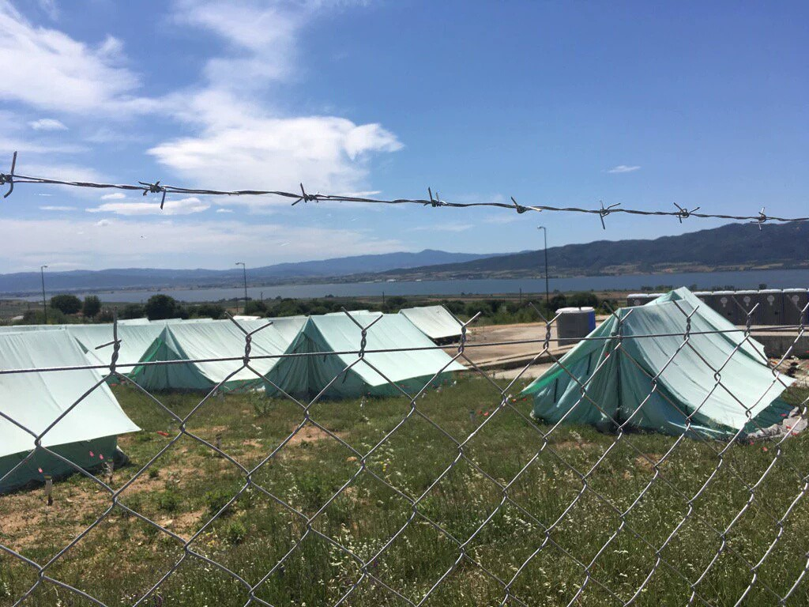
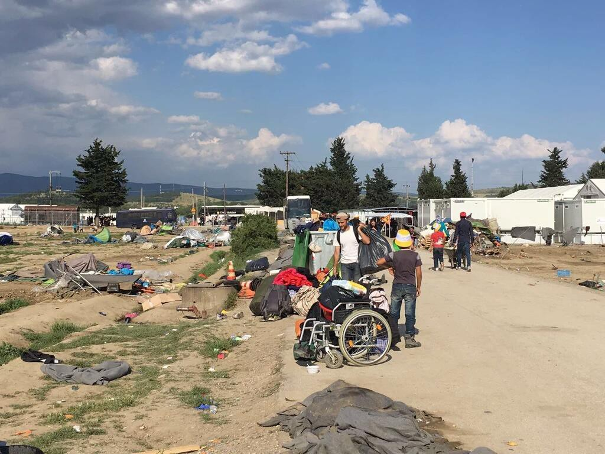
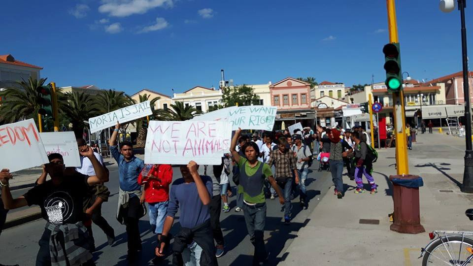
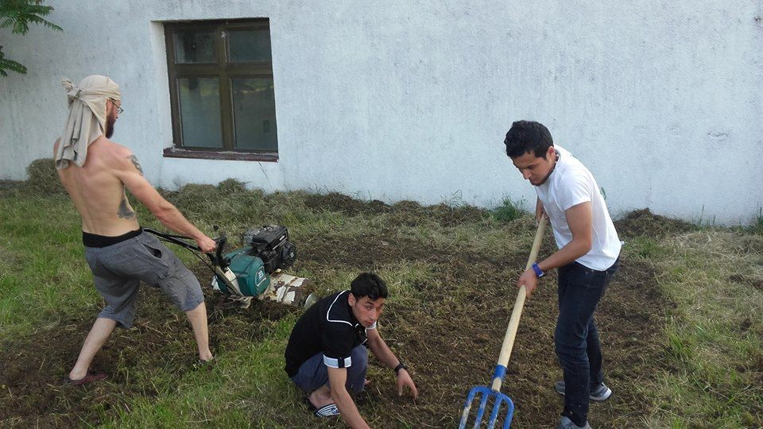

### AYS News Digest — Idomeni evacuation continues
#### 25\.5\.2016: 500 migrants rescued off the Libyan coast today — over 1,000 migrants arrived in Italy and over 1,000 expected tomorrow\. Idomeni evacuation slows down\. New Miksalište center opens soon\. German integration law presented by Merkel\.

New Vagiochori camp\. Photo Credit: Giorgos Christides
#### Turkey
### Drop Earrings, not Bombs

A project called [Drop Earrings Not Bomb](http://www.dropearringsnotbombs.org.) s supports refugee women living in Istanbul by giving them a means to make a living\. They partner with “Small Projects Istanbul”\. The earrings are available for purchase; if paid for in cash, the proceeds go directly to the refugees\. If purchased via Paypal, the proceeds support Small Projects Istanbul’s efforts\. The project says they are also looking for stores that could sell the earrings, adding “the power to support your family financially and put your kids in school is huge, especially here, with the rampant child and illegal labor due to refusal to grant work permits”\.
#### Libya
### Boat capsizes in the Mediterranean

[An overcrowded boat with more than 500 migrants capsized between Libya and Italy today](http://abcnews.go.com/International/boat-carrying-hundreds-migrants-capsizes-libya-killing/story?id=39367863) , shortly after the Italian patrol boat Bettica started handing out life jackets\. A nearby boat was able to call for for a helicopter and rescue boats\. 562 people were rescued while at least five drowned\.
#### Greece
### Idomeni Evacuation

Photo Credit: Paul Carr

The official summary statement of refugee flows indicates that 6,138 refugees remained inside Idomeni after the first day of the evacuation, down from 8,199\. Oreokastro welcomed 216 additional refugees, Nea Kavala 106, Olympous Petra 96, Filipada 90 and Alexandria 54 \. The new Sindos\-Karamanlis building hosts 555 people, Sindos\-Frakapor hosts 422, and Derweni\-Alexil hosts 593\. Some of these “new” camps already hosted refugees, but this is the first time they are included in the official report\.

MSF remains the only medical organization allowed in Idomeni\. In the morning, bulldozers and police continued to destroy and burn tents\.

The second day of evacuation was meant to clear the railway tracks and went much slower than yesterday\. The evacuation was reportedly slowed down in part because refugees refused to go to the isolated Vagiochori camp\. 1,006 refugees were brought to Thessaloniki , Nea Kavala, Kilkis, Koutsohera and Larissa camps\. Many walked away from Idomeni, refusing to join new official camps, with some going to BP station or Hotel Hara, the closest unofficial camps\. The number of refugees in Idomeni is therefore probably much lower than official numbers\.

Several people have been reporting dirty and unhygienic conditions, as well as a general feeling of imprisonment\. The situation varies from camp to camp and a full assessment is still pending\.

MSF says those that remain are anxious about what will happen to them\. Those with chronic diseases worry about whether they will be able to get access to medical care and medication\.

[News that Moves](https://newsthatmoves.org/en/aid-organizations-urge-suitable-shelter-for-idomeni-evacuees/) reports that Doctors Without Borders expressed concern about the lack of information provided by the authorities to people being evacuated, while UNHCR and the IRC urged the Greek authorities to provide adequate shelter\.

Volunteers organized protests later in the evening over the evacuation, blocking the highway for around half an hour\.

Photo Credit: MSF
### Volunteer digest

As the situation in Idomeni changes, we will continue to update the volunteer digest\. If you are looking to volunteer, please consult this [spreadsheet](http://bit.ly/LatestVolCalls) \. If you are looking for volunteers, please fill out [this form](http://bit.ly/REQUESTFORVOLUNTEERS) \.
### Access to healthcare for refugees

[News that Moves](https://newsthatmoves.org/en/access-to-free-public-healthcare-for-asylum-seekers-in-greece/) says that recognized refugees, people with subsidiary protection, and stateless people have free access to pharmaceutical and healthcare in hospitals and medical centers all over Greece, regardless of their financial situation\. The following services are free of charge:
- Hospital admission and care
- Pharmaceutical treatment, specifically medicine prescribed by a doctor
- Emergency health care
- First aid for anyone who needs it\.

Asylum seekers with a “protection card” — given to persons who have applied for asylum, or are waiting for an interview or appeal — have free access to hospitals in Greece, but have to pay for any medical tests \(e\.g\. gastroscopia, blood\-tests, ultra\-sounds etc\. \)
### Moria protests

Refugees marched in Lesvos today, protesting against the living conditions in the Moria detention center\.

Photo Credit: No Borders
#### Bulgaria
### Decrease in number of “illegal migrants”

[Novonite](http://www.novinite.com/articles/174605/Bulgaria+IntMin+Reports+30++Drop+in+Number+of+Illegal+Migrants+in+2016#sthash.UgjErwTZ.dpuf) reports on Bulgarian Interior Minister Rumyana Bachvarova’s comments that the number of illegal migrants detained in Bulgaria this year has decreased by nearly 30 % compared to 2015 and that groups attempting to cross from Bulgaria into Serbia are smaller than before\. Bachvarova also says that Bulgaria’s active efforts at the border are preventing the emergence of a new migrant route, adding that the fence at the border with Turkey is nearing its completion\.
#### Serbia
### New Miksalište center opens soon

Refugee Aid Miksalište got the award for the “ _Contribution of the Year to Europe”_ from the European movement in Serbia\. This is the perfect opportunity to announce that Refugee Aid Miksalište will open the new Miksalište center on June 1st, a facility that will act as a “welcome point” for refugees passing through Belgrade\. This comes after the “old” Miksalište space was demolished by the city to develop the “Belgrade Waterfront” project\. Help is needed until then to sort, distribute and transport items to the new building\. You can contact them directly through their [website](http://refugeeaidmiksaliste.rs/act-now/) \.
#### Croatia
### AYS expands its activities

After obtaining official permission to work in the Porin Centre for asylum seekers in Zagreb, the AYS team is spreading its activities on many new levels\. Two fantastic events happened today\. Our volunteers planted a vegetable garden next to the Porin centre, allowing asylum seekers to grow tomatoes, peppers, chilli peppers and strawberries\. The Žitnjak primary school also invited refugee children to participate in their annual performance for parents\. One girl from Iran played guitar and a little choir made of kids from Iran Afghanistan and Somalia sang\. They were warmly welcomed by students, teachers and parents\.

Photo Credit: Karolina Rugle
#### Germany
### New integration law presented by Merkel

Merkel presents the new integration law as a ‘milestone’, underlying both supportive and the punitive elements of the bill\. These are the highlights of the new law\. For more details, please check out [DW’s article](http://www.dw.com/en/merkel-presents-new-refugee-integration-law-as-milestone/a-19281722) \.
- The government intends to create some 100,000 “one\-euro jobs” — work schemes that were designed for the long\-term unemployed, typically paid by a government subsidy of between 1 euro and 2\.50 euros an hour\. Newcomers can have their benefits reduced to the bare minimum if they refuse to work\.
- Refugees will be allowed to apply for training courses after three months, whether or not their asylum applications have been processed\. If they have been in Germany for 15 months, they can also apply for money for job training programs\. Refugees who are enrolled in a job training program will automatically be given legal resident status for the duration of the program\.
- Refugees will be given permanent residency after five years instead of three — but only if they have learned adequate German and secured their own living\.
- Regional governments will be allowed to determine where refugees may settle for the next three years\.

#### Italy

**1053 migrants arrive in Palermo**

[A patrol vessel arrived in Palermo today](http://palermo.repubblica.it/cronaca/2016/05/25/news/migranti_canale_di_sicilia_soccorsi_sbarchi_guardia_costiera_libia-140551481/) with 1,053 migrants from Senegal, Mali and Ivory Coast, including 260 unaccompanied minors\. The municipality says it is overstretched and asks for support from the church\.

**1017 migrants expected tomorrow**

Meanwhile, [1,017 migrants are expected to land in Salerno tomorrow](http://www.metropolisweb.it/news/salerno-in-arrivo-altri-mille-migranti/10562.html) , rescued by other boats\.
### Italian Admiral defends operation Sophia

After today’s shipwreck and recent rescue missions, [Admiral Enrico Credendino defends operation “Sophia”](http://www.ilfattoquotidiano.it/2016/05/25/migranti-si-rovescia-barcone-con-500-persone-al-largo-della-libia-7-vittime/2763804/) and says it is a a moral obligation to rescue people\. He also says that “to tear down the smugglers’ business model”, Libya needs to be stabilized and have a trained coast guard\.
### Humanitarian corridor opens

[Humanitarian corridors open for one thousand people](http://www.lastampa.it/2015/12/16/vaticaninsider/eng/world-news/santegidio-humanitarian-corridors-open-for-one-thousand-people-7F1BrNhUFKY1CqirpOULcM/pagina.html) , allowing refugees from Lebanon, Morocco and Ethiopia to travel to Italy on “humanitarian visas”\. The idea is to allow entry to refugees classified as “vulnerable”, in other words, single women with children, potential victims of human trafficking, elderly and disabled people, individuals with serious conditions, or who are recognized as refugees by the UNHCR\. The transport, accommodation and legal costs will be covered by three associations, the Community of Sant’Egidio, the Federation of Evangelical Churches in Italy and the Waldensian Table, opening the door to an official sponsorship system for refugees\.

_Converted [Medium Post](https://areyousyrious.medium.com/ays-news-digest-idomeni-evacuation-continues-c62090d33878) by [ZMediumToMarkdown](https://github.com/ZhgChgLi/ZMediumToMarkdown)._
