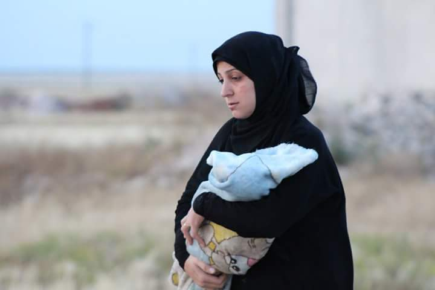
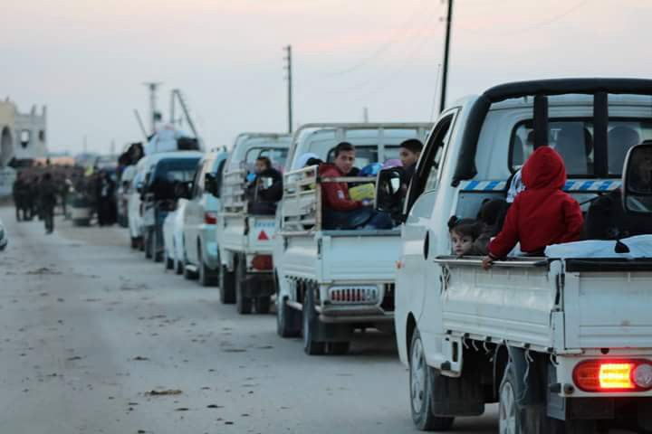
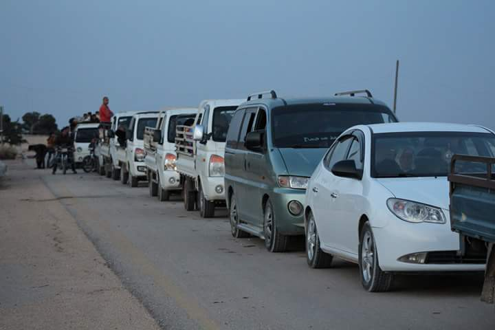
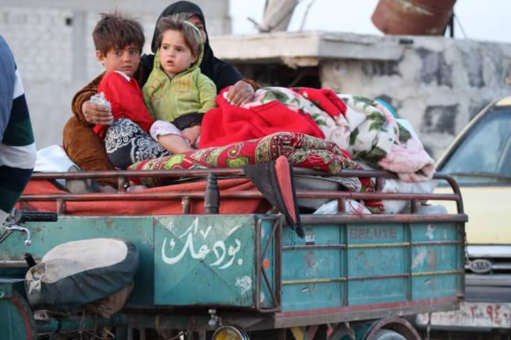
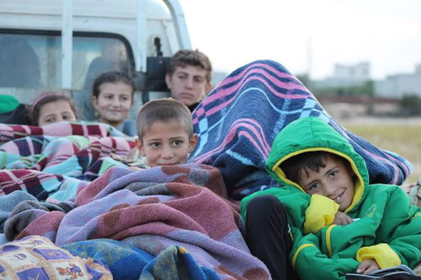
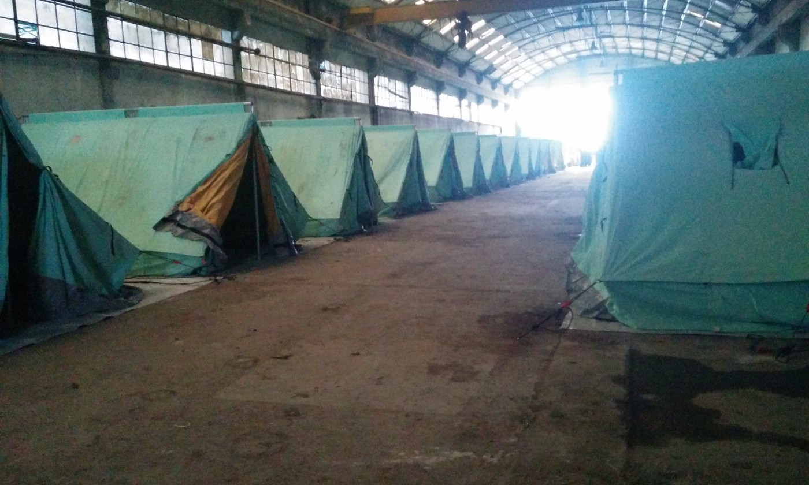
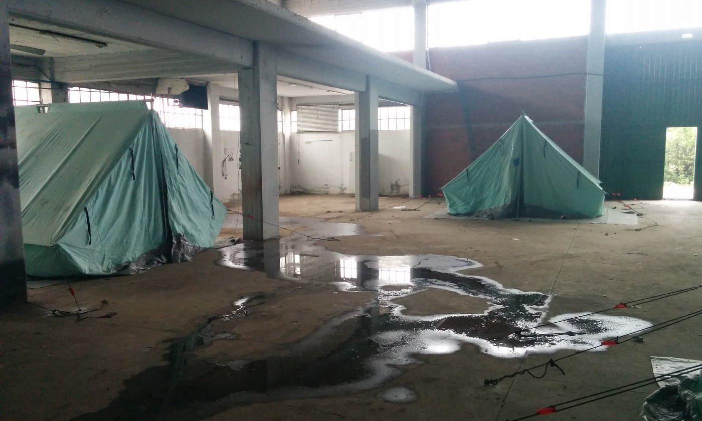
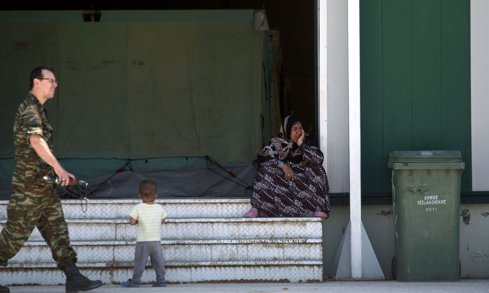

### AYS DAILY NEWS DIGEST 28\.5\.2016\.
#### A refugee has committed suicide in Larissa, Greece\. Aware of the growing prospect of the EU\-Turkey deal breaking down, refugees are already looking for new routes into Europe this summer\. A volunteer joins refugees’ hunger strike in Chios\. Super\-rich Swiss village opts for £200,000 fine instead of accepting 10 refugees; Oberwil\-Lieli’s right\-wing mayor denied it was a racist decision\. Anti\-Islam protest descends into violence in Australia\.

A mother fleeing ISIS with her baby\. Credits: Ferhad Mossa\.
#### Syria

**6124 people recently fleeing ISIS\.**

> _6,124 displaced people from Mareá, Al Sheikh Issa and other villages in Aleppo countryside fled to Afrin in the last 72 hours escaping from ISIS which controlled 12 villages yesterday and got closer to Azaz\._ 

The flight of refugees before ISIS\. Credits: Ferhad Mossa

Credits: Ferhad Mossa

Credits: Ferhad Mossa
#### Libya
### Refugees rescued from the boats which capsized yesterday claim that around 400 are missing\.
#### Jordan
### Jordan detains Syrian refugees in Village 5 “jail”\.

> _“Village 5” is a fenced\-off compound within the UN\-run Azraq camp, some 80 kilometres east of Amman\. The camp holds several thousand metal shelters, laid out in a regimented grid of dusty dirt tracks behind 10\-foot high barbed\-wire fencing\. With almost nothing to occupy their time, refugees spend days queuing for food rations, carrying pumped water around, and trying, often without success, to escape the heat\. The approximately 12,700 Syrian refugees living there are prevented from leaving by the fence\._ 

> _Jordan, which hosts more than 650,000 registered Syrian refugees, considers the refugees a security concern — in January King Abdullah [**said**](http://http//cnnpressroom.blogs.cnn.com/2016/01/13/king-abdullah-ii-of-jordan-on-syrian-refugees-we-cant-ignore-them-and-just-keep-refugees-isolated/) that members of IS were known to be at the berm\._ 

> _The fears are based both on the chaos of the berm and where Syrians have come from to get there — Aleppo, Homs, Deir Ezzor, and areas in the northeast that are either controlled by IS or necessitate a journey through territory it controls\._ 

 news](assets/4215d9f1d6b8/1*-qsPdcw0c4JmqkiqqLK1Iw.jpeg)

Credits: [IRIN](http://www.irinnews.org/special-report/2016/05/27/jordan-detains-syrian-refugees-village-5-%E2%80%9Cjail%E2%80%9D?utm_source=IRIN+-+the+inside+story+on+emergencies&utm_campaign=f27cfab73e-RSS_EMAIL_ENGLISH_ALL&utm_medium=email&utm_term=0_d842d98289-f27cfab73e-15673869) news
#### Turkey
### Refugees in Turkey already searching for new routes to Europe\.

> _Turkey\-EU migrant deal has apparently paid off and European leaders seem to be satisfied with the decreasing number of people crossing the Aegean Sea to Greece\. However, keeping Europe migrant\-free using Turkey’s help may come to an end in the wake of exchanged ultimatums between Brussels and Ankara\._ 

> _The EU is not willing to grant Turkish citizens visa\-free travel by early July until Turkey revises its anti\-terrorism laws, straining ties with Ankara\. President Recep Tayyip Erdoğan is not eager to deliver on the EU’s demand at a time when security forces are waging a tough war against the PKK terrorist organization in the country’s southeastern provinces\._ 

> _“If there will be no outcome \[of visa liberalization\] as of June 30, the readmission agreement will not be ratified in Parliament,” Erdoğan asserted on Tuesday, giving a warning to the 28\-nation bloc\. He had previously alarmed Europe, saying Turkey would let refugees through its borders to Europe\. “Buses and planes are not there for nothing,” he said\. Erdoğan has given a deadline to Brussels to call off the deal unless visa liberalization is realized\._ 

> _With the deal on the brink of collapse, Daily Sabah spoke to refugees in Istanbul\. “Aware of the growing prospect of the deal breaking down, refugees are already looking for new routes to Europe this summer”\._ 

#### Greece
### Evacuation of Idomeni continues\. Volunteers needed to help remaining residents\.

> _The evacuation of the Idomeni area is halfway complete— the main site is now completely closed, but the populations at Hara, BP and EKO still remain and we continue to support them as usual\. People from Idomeni have been taken to many different “government structures” or “military camps” and volunteers are now also working with authorities, military generals, new NGO structures and teams and community groups to offer support in these varied and geographically spread spaces\. There are also many people — around 3,900 — formally unaccounted for, and volunteers are also working to support these communities\._ 

> _There is a need for volunteers to assess needs and restructure our support in this new context, and to build on their collaboration, connect with others, and to prepare ourselves for the new challenges\. This might involve constructing new long term teams, developing training, and moving infrastructure\. Volunteers and teams will still be needed, especially long term volunteers\._ 

> _Skills they currently need include Translation, Building and Trades, Logistics People, Warehouse Teams, Admin, Coordinators and Drivers\. They also will need people for longer term support projects such as education, health and community projects\._ 

> _Join the volunteer teams in Greece\!_ 

](assets/4215d9f1d6b8/1*wLi3l_4R6drMf_XicyjE_w.png)

A drawing of Idomeni by a refugee\. Credits: [Geo Messmer](https://twitter.com/GeoMessmer)

> _Images of the evacuation_ 

](assets/4215d9f1d6b8/1*8Py2UTBT1KDBKLAO5P1TXw.jpeg)

The end of Idomeni, Europe’s largest refugee camp since WWII and an embarrassment to the values that the EU pretend to hold so dear\. Credits: [**Ignacio Marin**](https://web.facebook.com/ignaciomarinphotography/?fref=photo)

](assets/4215d9f1d6b8/1*vUUwTPEUZ0HHPnbE7rKh5A.jpeg)

Broken personal objects lying on the ground, the immense silence of what used to be a rather noisy place\. Credits: [**Ignacio Marin**](https://web.facebook.com/ignaciomarinphotography/?fref=photo)
### Migrant commits suicide in the center of Larissa\.

> _A young migrant took his life in the center of the city of Larissa, in central Greece\. According to local media, the man was found to have hanged himself from a tree very close to one of the main streets of the city\. According to locals, the young man was allegedly wandering around in the area a couple of hours before the incident begging for food and saying he had not eaten anything for 5 days\._ 

### A volunteer joins refugees’ hunger strike in Chios\.

> _Today marks the 12th day of the hunger strike for 10 women and 8 men in [Chios](https://web.facebook.com/hashtag/chios?hc_location=ufi) \. One Polish volunteer has now joined the hunger strike in solidarity with the refugees\._ 

### UNHCR concerned at conditions in new refugee sites and urges that alternatives be found\.

> _UNHCR is seriously concerned about sub\-standard conditions at several sites in northern Greece where refugees and migrants were evacuated this week from the makeshift site at Idomeni, and urges the Greek authorities, with the financial support provided by the European Union, to find better alternatives quickly\._ 

> _UNHCR agrees that the makeshift site at Idomeni on the Greek border with the former Yugoslav Republic of Macedonia, where refugees had been staying in abysmal conditions, needed to be evacuated, and notes that this has been completed without the use of force\. However, the conditions of the some of these sites to which the refugees and migrants are transferred fall well below minimum standards\._ 

> _Some of the refugees and migrants who had been living in Idomeni have been moved into derelict warehouses and factories, inside of which tents have been placed too tightly together\. The air circulation is poor, and supplies of food, water, toilets, showers, and electricity are insufficient\. Refugees transferred by bus from Idomeni received little information about conditions at the new sites and the duration of their stay there\. UNHCR remains concerned about families being separated during their transfer\. Spontaneous arrivals of refugee families, some of whom left Idomeni on foot, have been reported at a number of the sites, which are already overcrowded\. Poor conditions at these sites are compounding the already high level of distress of refugee families, fueling tensions within refugee populations and complicating efforts to provide required assistance and protection\._ 

> _UNHCR is in close contact with the Alternate Minister of Interior in charge of Migration Policy and proposes that the improvements it had suggested for some of the sites envisaged could be made as a matter of priority\._ 

### Protests grow as Greece moves refugees to derelict warehouses ‘not fit for animals’\.

Tents are pitched on filthy concrete floors at the warehous in Sindos\. Photograph: Phoebe Ramsay

A woman sits on stairs inside a new camp for refugees and migrants set in an abandoned factory in Sindos\. Photograph: Sakis Mitrolidis

> _Some moments from the Sindos camp\. Most of the people are Syrian nationals\. They will have to stay in those halls for the next several months\. The tents accommodate 5–8 people\. 600 people share 40 toilets and 14 showers\. Cooking is not allowed in the camp\. More than a third of the total inhabitants are children, of which 50% are not even 2 years old\. 2 women are in their 9th month of pregnancy\. And Europe does not find a solution\._ 

](assets/4215d9f1d6b8/1*9-LsAcLvqD3ELnmAFi1atA.jpeg)

Credits: [**Christine Brand**](https://web.facebook.com/profile.php?id=100006360828533&fref=photo)

](assets/4215d9f1d6b8/1*Lr8vwGm7s4KU5lGwtDPtSw.jpeg)

Credits: [**Christine Brand**](https://web.facebook.com/profile.php?id=100006360828533&fref=photo)

](assets/4215d9f1d6b8/1*IAX1EqqeOBoDS8FmZc29pw.jpeg)

Credits: [**Christine Brand**](https://web.facebook.com/profile.php?id=100006360828533&fref=photo)

](assets/4215d9f1d6b8/1*bl_u5-XZIE1A29MkPINdSg.jpeg)

Credits: [**Christine Brand**](https://web.facebook.com/profile.php?id=100006360828533&fref=photo)

](assets/4215d9f1d6b8/1*cOAKl5G6Z02Vr_a_aPu3SQ.jpeg)

Credits: [**Christine Brand**](https://web.facebook.com/profile.php?id=100006360828533&fref=photo)

](assets/4215d9f1d6b8/1*BSkZTxxz0sk5Ia8bdjEqRg.jpeg)

Credits: [**Christine Brand**](https://web.facebook.com/profile.php?id=100006360828533&fref=photo)

](assets/4215d9f1d6b8/1*0RptYqnHw7lMuckUa5W3Bg.jpeg)

Credits: [**Christine Brand**](https://web.facebook.com/profile.php?id=100006360828533&fref=photo)

](assets/4215d9f1d6b8/1*cKyRL9n9O2_3d0fRIgp0Bw.jpeg)

Credits: [**Christine Brand**](https://web.facebook.com/profile.php?id=100006360828533&fref=photo)
### Rumours suggest Hara, Greece, will be evacuated tomorrow\.
#### France
### A refugee dies trying to escape Calais\.

> _This Saturday morning, an Afghan migrant \(26\) has been hit by a truck on the A16 in the direction Calais\-Dunkirk\. He died instantly\. Another migrant was knocked down and injured his knee just a few minutes later\._ 

> _Including the death of this young man who lived in the “jungle” of Calais, at least 26 crefugees died in the region trying to reach England since June 2015\. “The victim was part of a group of fifty people who placed branches on the A16, in order to slow lorries and hide in one of them trying to reach England,” said the authorities\._ 

#### Switzerland
### Super\-rich Swiss village opts for £200,000 fine instead of accepting 10 refugees\.

> _A Swiss village, one of the wealthiest in [Europe](http://www.independent.co.uk/news/world/europe) , has refused to take in its government imposed quota of asylum seekers, voting to pay a fine of £200,000 instead\._ 

> _The residents of Switzerland’s alpine resort Oberwil\-Lieli, where there are 300 millionaires among a population of 2,200, voted “no” in a referendum over whether to accept just 10 refugees\._ 

> _Swiss government proposals had outlined a quota across its 26 counties in order deliver on promise to take 50,000 asylum seekers across the country, but Oberwil\-Lieli voted by 52 per cent to 48 to reject the refugees\._ 

#### Australia
### Police arrest seven as violence breaks out between anti\-Islam and anti\-fascist groups in Melbourne\.

> _Police in Australia have used pepper spray to separate more than 300 angry protesters as anti\-Islam and anti\-racism groups clashed in the streets of Melbourne\._ 

> _Seven men were arrested in Coburg, a northern suburb of Melbourne on Saturday after anti\-Islam protesters, some of whom were draped in the Australian flag, began fighting with their rivals\._ 

> _TV Footage showed protesters using Australian flags to beat other demonstrators, before police moved in and used capsicum spray to stop the violence\._ 

> _Attacks against Australia’s Muslim community have increased in recent years partly due to the rise of the Islamic State of Iraq and the Levant\._ 

> _In November, a survey by the Western Sydney University found that Muslims in Australia experience racism three times the national average\._ 

_Converted [Medium Post](https://areyousyrious.medium.com/ays-daily-news-digest-28-5-2016-4215d9f1d6b8) by [ZMediumToMarkdown](https://github.com/ZhgChgLi/ZMediumToMarkdown)._
