### DOUBLE ISSUE: Are You Syrious — Disasters on Sea and Land

26\.05\.2016–27\.05\.2016

> A Letter from the Team: We at Are You Syrious are deeply sorry for the delay in release of the 26\.5 Digest\. We always endeavor to deliver the top content on time, but sometimes technical issues and the need to fact\-check can make that tricky\. We apologize for this lapse in on\-time delivery and offer to you a nice plump digest\. 

#### 27\.5: 400,000 people are estimated to be restricted in receiving humanitarian aid in Syria, NGOs report\. 165,000 refugees are trapped between ISIS and Turkish border\. 240 job vacancies open to Syrian refugees in Turkey\. Estimated 3,900 asylum\-seekers have disappeared from Idomeni, their arrival not being registered in other official camps\. Mytillini: quest for justice unites all as hundreds protest\. CHIOS: “We want somebody to listen to us and care for us\.” Mediterranean: 45 bodies recovered and dozens more feared dead in shipwreck disasters\. 35 unaccompanied minors are stranded in Slovenia\. Anti\-refugee propaganda continues to escalate dangerously as new laws threaten deportations and pushbacks in Hungary\. 1602 refugees have been officially relocated to the United Kingdom\.

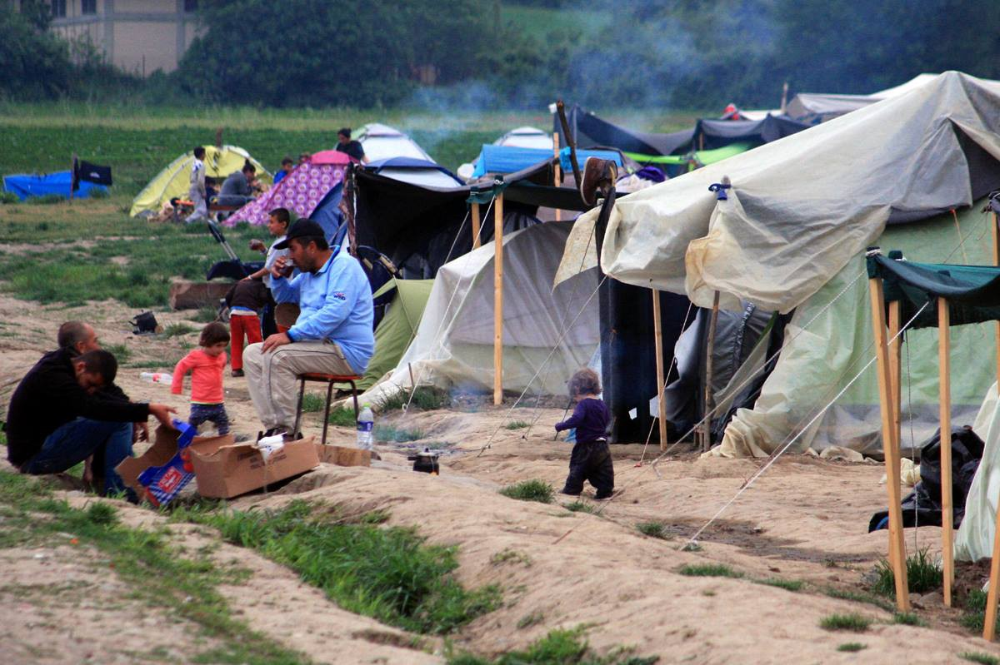

Photo Credit: Thierry Birrer
#### SYRIA
### 400,000 people are estimated to be restricted in receiving humanitarian aid in Syria, NGOs report

Up to 400,000 are virtually besieged by both government or rebel groups, with upwards of having limited accessibility\.

> “Of the one million people that we have planned and have tried to reach by land in May, we’ve only so far reached 160,000,” Jan Egeland of Norwegian Refugee Council said\. 

The UN [made a call for greater access to populations in need of humanitarian aid](http://www.aljazeera.com/news/2016/05/syria-160526162935029.html) , saying that even in cases where official government approval had been granted, access was still dangerously limited\. The UN already conducts humanitarian airdrops to civilians in territories controlled by ISIS and is considering implementing similar airdrops in government\-controlled territory if necessary permissions are not acquired\.
### 165,000 refugees are trapped between ISIS and Turkish border

The ISIS assault on Azaz has driven out an additional 45,000 people who have joined those living in makeshift camps, barely out of the clutches of ISIS, [reports Human Rights Watch](https://www.hrw.org/news/2016/05/27/dispatches-isis-advance-traps-165000-syrians-closed-turkish-border) \. This brings the total number of refugees pinned between the Turkish border and ISIS encroachment to 165,000\. ISIS airstrikes have claimed dozens of lives in the surrounding area\. Several of refugees have been shot at when attempting to escape across the Turkish border\.
#### TURKEY
### 240 job vacancies open to Syrian refugees in Turkey

Dutch companies in Turkey are also considering Syrian refugees when looking to fill vacancies, [Minister Lilianne Ploumen of Foreign Trade announced](http://www.nltimes.nl/2016/05/24/dutch-companies-give-jobs-syrian-refugees-turkey/) \. Currently there are 240 vacancies that are open to refugees\. The current vacancies include jobs in the metal industry, construction and logistics\. Ploumen called on Dutch entrepreneurs and Turkish companies to follow this example and provide employment for Syrian refugees\.
### Social psychologists are organizing a seminar spanning May 28th\-29th titled: “War and Migration”

The event will tackle critical issues relating to migration and mental health, and may be of interest to local psycho\-social care providers\. It will take place at Bornova Uğur Mumcu Kültür Merkezi\. More information on the event can be found [here](https://www.facebook.com/events/493816967469230/) \.
#### GREECE
### One boat with fifty people landed in the South of Lesvos

[Remar S\.O\.S](https://www.facebook.com/Remarsos/?hc_location=ufi) \. is in need of volunteers to help in a RefugeeAid Project in Lesvos from June 1st through June 15th, 2016\.

They are looking for volunteers who can join them for a minimum of 7 days\. Work will consist of handing out food, cleaning, and food preparation,contact them at [info@remar\.ch](mailto:info@remar.ch)

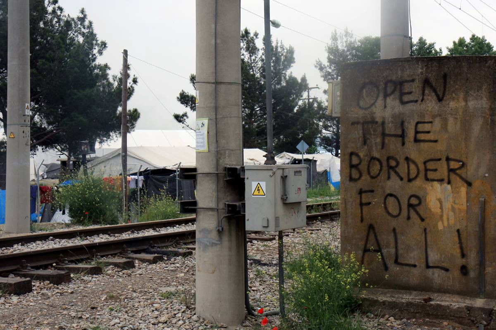

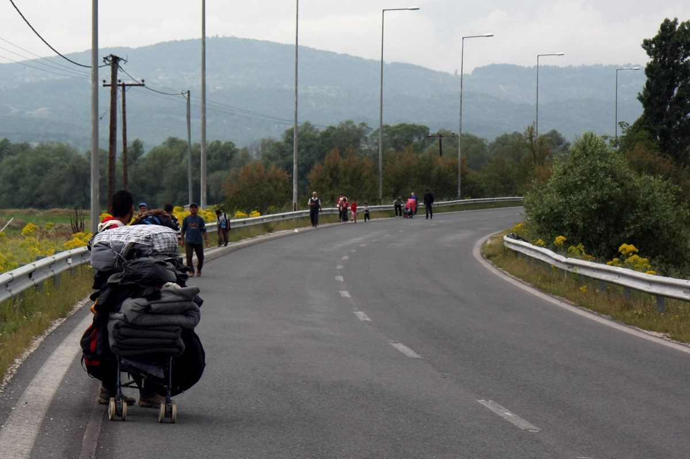

Photo Credits: Thierry Birrer
### 3,900 asylum\-seekers have disappeared from Idomeni, their arrival not being registered in other official camps

From numbers calculated using the Greek government’s daily refugee flow numbers, 3,900 refugees are estimated to have disappeared from Idomeni without relocating to new official camps\. With many camps remaining dangerously overcrowded, “ [Scores of tents](http://www.reuters.com/article/us-europe-migrants-greece-idomeni-idUSKCN0YH1KL) ” have appeared near the town Evzoni, many of the residents seeking out smugglers, Reuters reports\. Many refugees have refused to go to official camps due to the outbreaks of violence resulting from overcrowding and poor conditions\. And with reports like those from SINATEX CAMP of no showers, no internet, no food, and five toilets for 200 people, they cannot be blamed\.

UNHCR has already condemned conditions in the new camps that refugees from Idomeni were relocated to\. In a press conference, UNHCR urged Greek authorities to urgently bring amenities up to humanitarian standards and, where this is impossible, to relocate refugees\. “UNHCR remains concerned about families being separated during their transfer\. Spontaneous arrivals of refugee families, some of whom left Idomeni on foot, have been reported at a number of the sites, which are already overcrowded\. Poor conditions at these sites are compounding the already high level of distress of refugee families, fueling tensions within refugee populations and complicating efforts to provide required assistance and protection\.”

Volunteers confirm that Idomeni is empty, but some volunteers are preparing a lawsuit against authorities, due to the destruction of a lot of equipment as they weren’t given a chance to collect it, neither were authorities cooperative in any way\.
### Mytillini: quest for justice unites all as hundreds protest

On the 26th, three days of protest culminated in hundreds of people gathering in front of the port and marching, uniting refugees of different nationalities, demanding freedom, volunteers reported\. After the main protest, the gates at the port appeared unguarded, spurring on a hopeful charge toward the ferries to Athens\. However, it was not to last as the police and military met their march, evicting all participants from the port\. Volunteers hope that this act of unity will not be quenched here and that the disparate groups can remain united in their quest for freedom\.

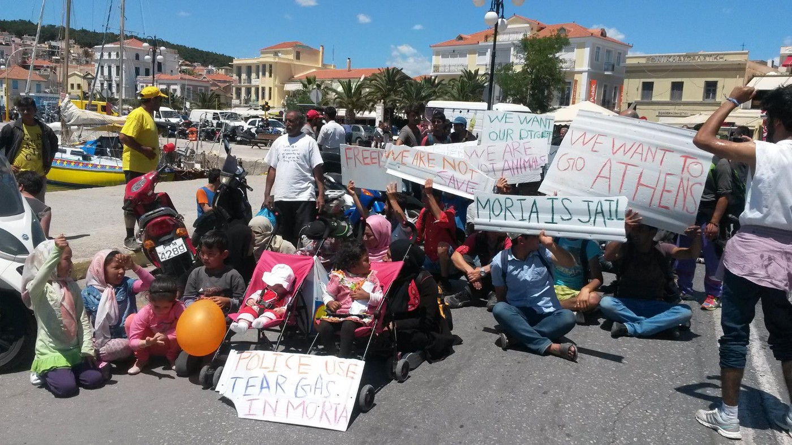

Photo Credit: NoBordersKitchen
### CHIOS: “We want somebody to listen to us and care for us”

The hunger strike in Souda continues with refugees stating that they do not wish to die in protest, but, rather, to be heard\.

> “We want somebody to listen to us and care for us\. In Europe, time is considered extremely valuable\. So, why is our time not also considered valuable?” said one hunger\-striker\. 

The hunger strike entered its 11th day on the 27th\.
### German aid organization “Mobile Flüchtlingshilfe” in search of mid or long term volunteers at Fillippiada Camp

You can contact them [here](https://www.facebook.com/MobileFluechtlingshilfe/posts/1736081089945557) \.
#### CENTRAL MEDITERRANEAN
### 45 bodies recovered and dozens more feared dead in shipwreck disasters

On the 26th, a boat with 500 Syrian and Iraqi refugees sank about 70 km North East of Zuwara, Libya\. Rescue and recovery efforts are ongoing\.

While Idomeni camp is evicted and the Aegean route is blocked: Another mass dying as direct consequence of EU migration politics?

Today early morning at 5:25 am CET the [WatchTheMed Alarm Phone received a distress call](https://www.facebook.com/watchthemed.alarmphone/posts/1734729510134618) coming from a satellite phone: two big wooden boats, carrying approximately 1000 refugees had started from Libya and their calls to MRCC Rome remained unanswered\. Since then the activists of the Alarm Phone stayed in direct contact with the boat communicating with them in Arabic and regularly updating the MRCC Rome about the situation and especially their GPS\-position\. The second boat sank and that hundreds of people are in the water and drowning\.

On the two big boats mainly refugees from Syria and Iraq were on their way to find safety\. Until middle of March they came mainly via the Aegean Sea, a way that is now blocked by the EU and their new Turkish partners\. Another time it is proved that to block refugees leads only to more dangerous trips and to more death\.

The Italian Navy [speaks about 16 rescue operations and more than 1900 people](http://www.timesofmalta.com/articles/view/20160526/world/around-80-migrants-feared-drowned-in-the-mediterranean.613361) in total were rescued on Friday alone, bringing this weeks total to over 10,000 rescued\. As of 27\.05, 45 bodies have been recovered, but the death toll is expected to climb\. One pregnant woman gave birth shortly after being rescued, naming her son after the Russian captain of the ship that rescued her, Alex\.

[Sea\-Watch 2 was still assisting the recovery of dead bodies](https://www.facebook.com/seawatchprojekt/videos/1722414734643267%20) that are meanwhile scattered in a wide area due to the wave movements\.
#### SLOVENIA
### 35 unaccompanied minors are stranded in Slovenia

Unaccompanied minors are in need of proper accommodation under Slovenian statutes that require a special facility, according to NewsThatMoves\. Twenty\-five of them are over fifteen and around ten are under fifteen years of age\.

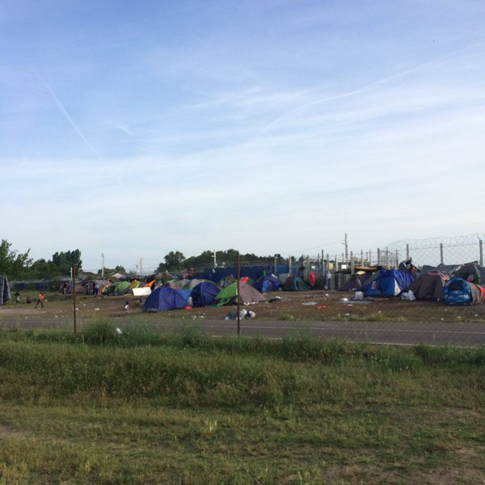

Serbian\-Hungarian Border\. Photo Credit: Andrew Connelly
#### HUNGARY
### Anti\-refugee propaganda continues to escalate dangerously as new laws threaten deportations and pushbacks

Political tensions and propaganda continue to escalate as camp conditions only worsen in Hungary, reports Migszol\. György Bakondi, security advisor to the Ministry of the Interior, labeled refugees trapped in camps “criminals” on state television\. Furthermore, Hungarian Parliament is discussing a new law to return anyone “found within 8km of the fence” to the transit zone\. Not only would this endanger the lives and freedom of refugees in the future, it also has the potential to worsen the conditions of the transit zone camp on the Hungarian\-Serbian border where hundreds of people have been trapped for weeks with minimal aid\. In a further troubling development, the government is attempting to resume Dublin\-based deportations of refugees\. It is recommended that all volunteers read [Migzsol’s full report here](http://www.migszol.com/blog/updates-on-the-asylum-and-migration-situation-in-hungary-may-18th-may-24th) which summarizes all crucial political developments\.

IOM and UNHCR are present on the Serbian side of the fence at these transit zones but access to refugees is highly restricted from all reports\.
#### UNITED KINGDOM
### 1602 refugees have been officially relocated to the United Kingdom

Of these, more than one\-third [have been relocated to Scotland](http://www.theguardian.com/world/2016/may/27/scotland-welcomes-third-of-uk-syrian-refugees-resettlement) \. Only thirty\-three have taken up residence in London\. The Home Office of the UK expects to accommodate a total of 20,000 refugees in the coming year\.

Refugee Action have started a campaign to increase the availability of free English classes for refugees and asylum seekers\. Funding for ESOL was cut a few years back and adult asylum seekers are not eligible for some classes unless they can pay half their fee\. You can learn a bit more about their research into ESOL provision and support their campaign [here](http://www.refugee-action.org.uk/support_us/campaign/join_a_campaign/let_refugees_learn) \.

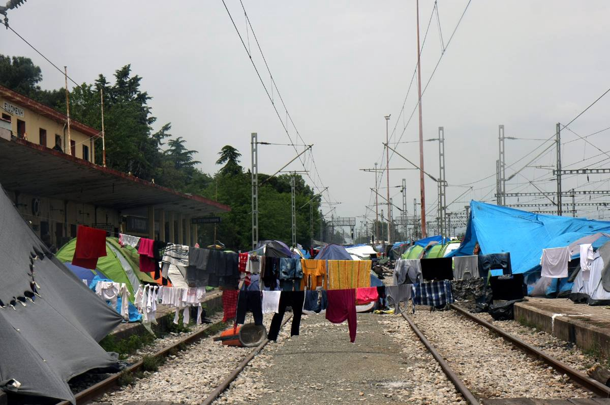

Photo Credit: Thierry Birrer
### **AYS DIGEST: 26\.05\.2016**
#### Syria: UN convoy delivers crucial aid to 10,000 trapped residents\. CHIOS: two attempt suicide\. Detailed report: the third day of evacuating the makeshift camp in Idomeni\. Child refugees in Greece have been out of school for 1\.5 years on average\. Ritsona camp building a library\. The second big fire within a week destroyed just over 227 shelters and 7 meeting places in Calais\.
#### SYRIA
### UN convoy delivers crucial aid to 10,000 trapped residents

[A UN relief convoy has delivered vital food](http://www.unhcr.org/news/latest/2016/5/573ec29d4/convoy-unhcr-aid-reaches-besieged-syrian-farm-town.html) , medicines and other aid to some 10,000 residents cut off in Syrian farm town without power and running water for more than three years\.

The 29\-truck convoy packed with items including cooking oil, flour, lentils, tarpaulins and cooking utensils this week reached residents of East Harasta, a rich agricultural heartland just 11 kilometres from the Syrian capital, Damascus\.
### Syrian doctors speak out

What it’s like to be one of the few doctors left in war\-torn Syria

> “We’re still working, but the whole staff is afraid of a repeat of what has happened with the \[other hospitals\],” Dr\. Abo El Ezz, a general surgeon in Aleppo\. 

The five\-year civil war in Syria has killed 400,000 Syrians, injured countless others, and displaced half of the country’s 22 million residents\.

[It’s also completely ravaged the country’s health care system](https://www.statnews.com/2016/05/26/doctors-war-torn-syria/) \. Helicopters drop barrel bombs filled with shrapnel and nails onto hospitals\. Doctors report they don’t have enough coffins to bury the dead\.

Airstrikes have made seeking treatment for common injuries like broken bones all but impossible, doctors say\. Patients in Syria feel incredibly hesitant to seek care at a hospital\.

The doctors left in Syria are a hodgepodge of survivors\. In Aleppo, one of the largest cities in the region, there were fewer than 25 general physicians and 27 surgeons as of July 2015, according to the Syrian American Medical Society, a humanitarian group\.

Since then, attacks have continued to tear Aleppo apart\. The number of doctors left in Syria has surely fallen since then, Parsons said\.

Many of the doctors aren’t being paid anything close to a normal salary\. Financial aid from nongovernmental organizations goes to patient care and supplies, first and foremost; salaries fall to the bottom of the priority list\.

> “They’re working days without sleep, without eating, while they watch the destruction of their communities,” said Sirkin\. “They have to make the very difficult decision every day if they’re going to go into work and risk being killed, or stay home with their families, or flee\.” 

Experts say many doctors aren’t even fully licensed — they’re medical students who have had to learn on the job\.
#### GREECE
### CHIOS: two attempt suicide

Two young men from Afghanistan attempted suicide by hanging themselves in the Vial detention center\. One of them was seriously injured\. Ambulance brought both to hospital\.

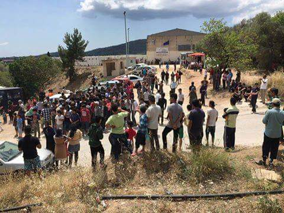

Photo Credit: Benjamin Julian
### The third day of evacuating the makeshift camp in Idomeni

At the last day the number of inhabitants in the camp was considered to be around 8500 persons\. After the first day ca\. 2000 people were moved to official camps\. Reportedly about 1000 on the second day\. As like all official camps in Greece \(despite of the detention centers\) are open, many people are too scared of getting into “military closed camps\.” They flee on their own\. Roughly 1500 reached the EKO gas station near Polykastro\. Some hundreds at “Hotel Hara” and nearby BP gas station a few kilometers away from the \(former\) Idomeni camp\. There are even reports about other hundreds people fled across the border to Republic Macedonia\. More and more are also registered in the city of Thessaloniki\. According to estimations there would be even half of the people in the Idomeni camp moved on by themselves\.

The [Spanish medical team Alivio Dolores](https://www.facebook.com/aliviodolores/posts/172250699839878) has been 2 restless months in the Idomeni camp with an amazingly dedicated medical staff and volunteers who worked tirelessly making sure we were always open and providing quality care to all the people\. As MSF were the only medical group allowed in camp Dolores had to stay closed or we would all be escorted out of camp/arrested\. Bomberos, a Spanish group of medical staff and firefighters were thrown out of camp the night before last\. Their medical tent is now in ruins with masses of medical supplies wasted\.

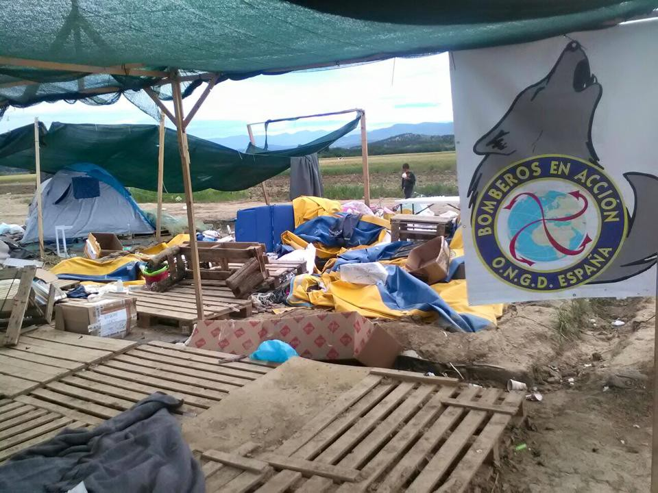

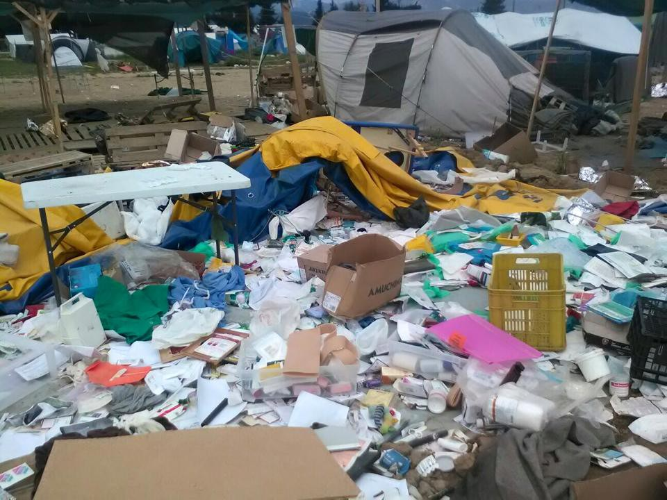

Photo Credits: Alivio Dolores
### Anxiety and Depression in Elliniko Camp in Athens

Every morning, two vehicles belonging to Médecins Sans Frontières \(MSF\) [draw up in front of one of the three stadiums](http://www.msf.org/en/article/greece-anxiety-and-depression-elliniko-sports-stadium) that make up the sporting complex of Elliniko, in a suburb of the Greek capital, Athens\. Built on a former airfield, the stadiums were put up for the 2004 Olympic Games\. Now they house men, women and children who fled their countries in search of safety in Europe\.
### Child refugees in Greece have been out of school for 1\.5 years on average

Child refugees stranded in Greece have been out of school for an average of 1\.5 years, [according to Save the Children](http://www.ekathimerini.com/208900/article/ekathimerini/community/child-refugees-in-greece-have-been-out-of-school-for-15-years-on-average) \.

The study conducted by the charity ahead of the inaugural World Humanitarian Summit found that Syrian child refugees have been out of school for an average of 25\.8 months, while Afghan child refugees spent an average of 10\.7 months out of the classroom\.

“Children who have risked everything to reach Europe are now wasting the best years of their lives, in refugee camps, in detention centres, and behind border fences and walls,” said Helle Thorning\-Schmidt, CEO of Save the Children International\. “Many know nothing more than conflict, violence, forced displacement, and their current deplorable conditions which offer little hope for their futures\.”
### Ritsona camp is building a library\!

As part of our Education Support Program, I AM YOU are bringing a library to the children of Ritsona camp\. We will be supplying it with furniture and books in various languages in collaboration with independent volunteers and other NGOs\. The library will provide a quiet space for children to read and learn\.

Construction has begun with a newly weather\-proofed flooring built from breeze blocks and pallets and a large tent\.

The library will be decorated in a barnyard rustic theme\. Here you see I AM YOU’s creative masterminds Peter constructing shelves out of wooden pallets, and Erin sewing bunting and cushions for decorations after they put up the tent with Liz\. We love our creative team and can’t wait for the big reveal this weekend\.

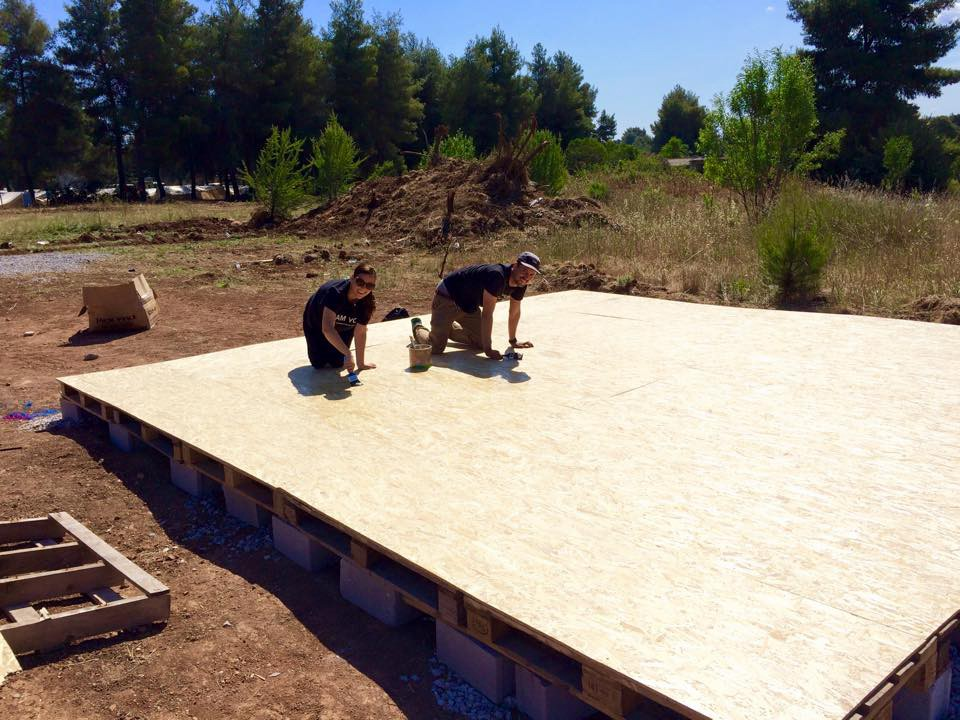

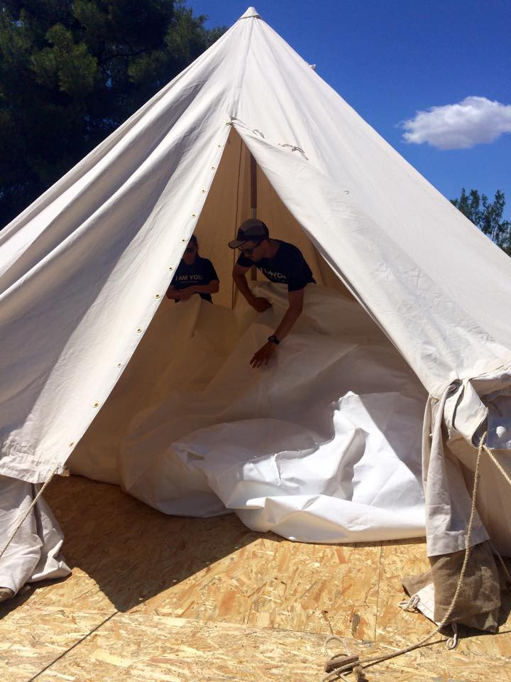

Photo Credit: I AM YOU\.
#### FRANCE
### The second big fire within a week destroyed just over 227 shelters and 7 meeting places in Calais

Like a miracle, no casualties have to be reported\. Heartbreaking pictures from long\-term volunteer Ifty Patel, who safely survived the catastrophe\.

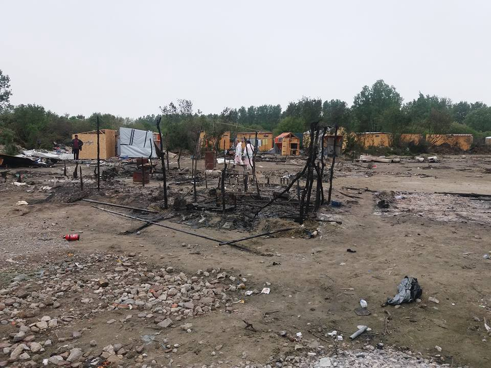

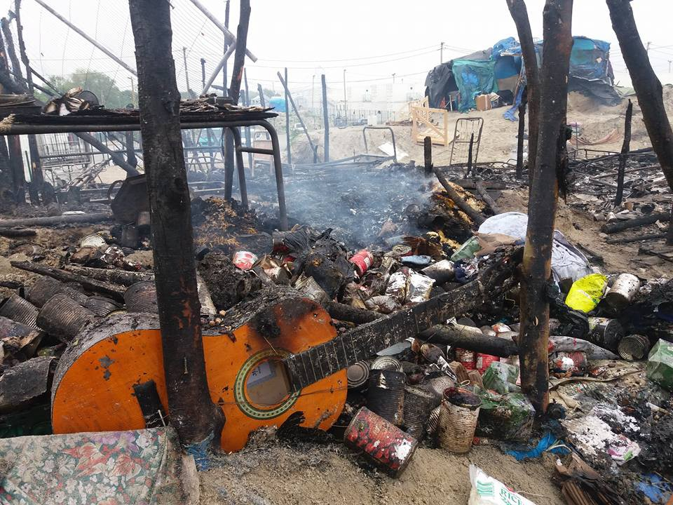

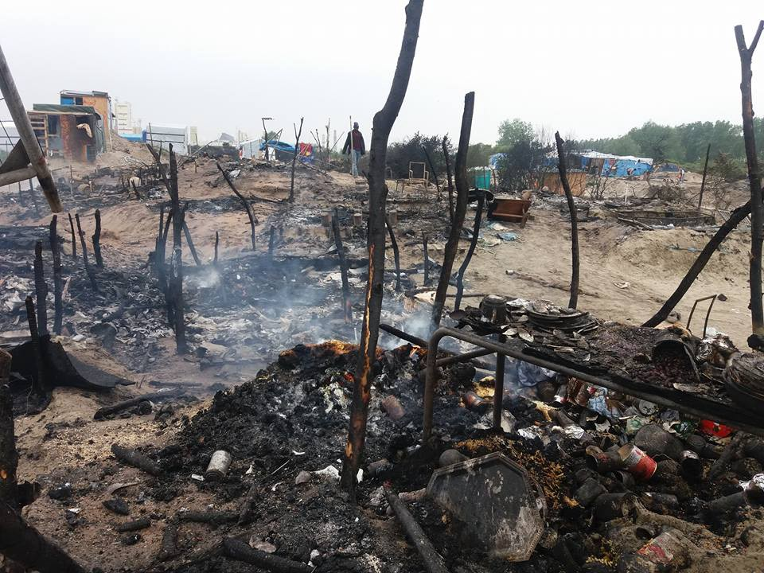

Photo Credit: Ifty Patel

VIDEO

It will take a massive effort to rebuild what has been lost, so please consider donating to one of the calais efforts\. One of the kitchens can be found [here](https://mydonate.bt.com/fundraisers/calaiskitchens) \.

With this dramatic and tragic turn of events, the internet access provided by Refugee Info Bus is only more crucial\.

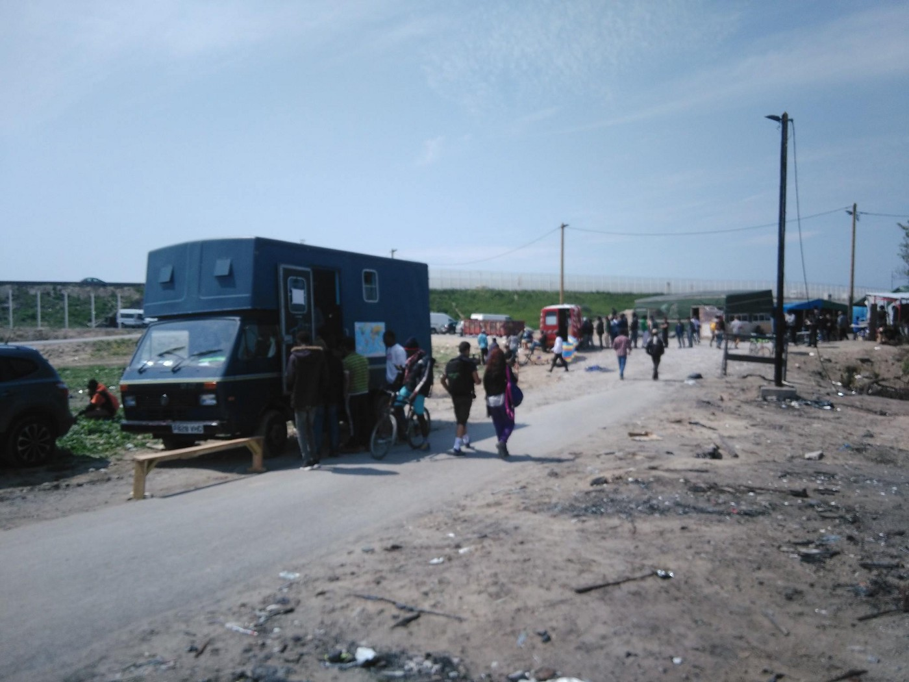

Photo Credit: REFUGEE INFO BUS

_Converted [Medium Post](https://areyousyrious.medium.com/double-issue-are-you-syrious-disasters-on-sea-and-land-407750b79f99) by [ZMediumToMarkdown](https://github.com/ZhgChgLi/ZMediumToMarkdown)._
