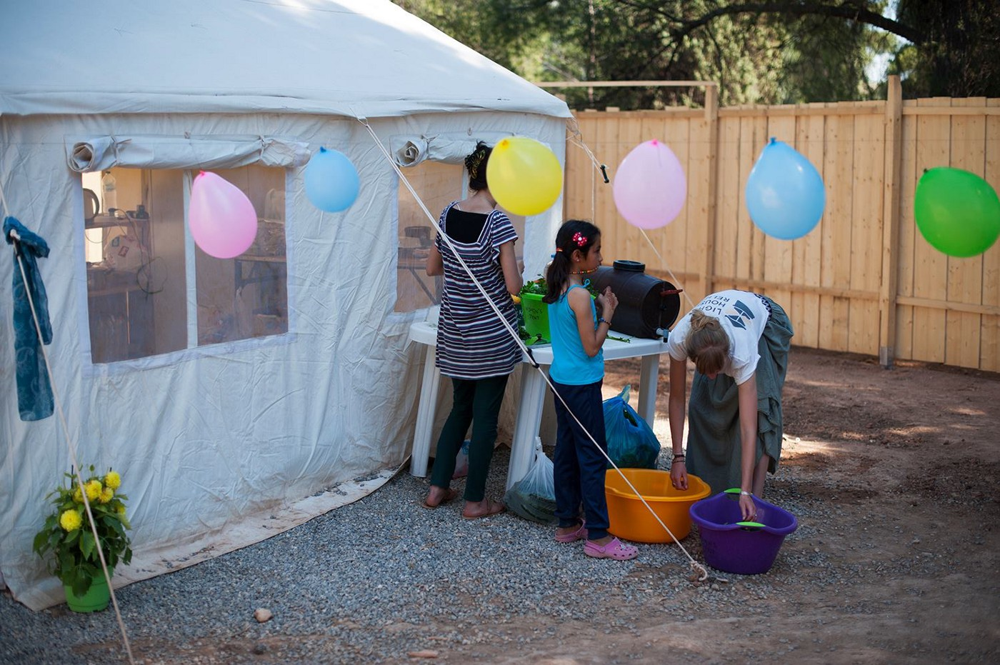

### AYS DAILY DIGEST: The deadliest week in the Mediterranean for more than a year
#### Over 700 discovered bodies in Mediterranean last week\. The Mediterranean route is open again\. The refugee camp in Idomeni does not exist anymore, and the last volunteers left today\. Female Friendly Space opened in Ritsona camp\. Bulgaria arrested 96 people who were trying to cross the border and deployed the army at the border with Greece\.

Idomeni, Photo by Phoepe Ramsey
#### Good weather in front of us\. According to the forecast made in a collaboration between Sao and United Rescue Aid, wind force on Monday will be 2–3Bf \(low\-medium\) \. Wind direction is SouthEast\-East\. Waves: 0\.5m\. Very humid, thin clouds\. //\+24 Hours: Temperature: 19–29°C\.
#### FEATURE STORY: Mediterranean Route is Active Again\.

> More 700 people died in three shipwrecks in the Mediterranean this week\. According to the Medicines Sans Frontiers, this number could be as high as 900\. The numbers however are estimates based on survivor testimonies\. ”We will never know exact numbers”, Medecins Sans Frontieres tweeted\. This was the deadliest week in over a year\. In all three incidents, many people were saved, but survivors claim there are bodies in the sea\. At the same time, 14,000 people were saved\. These numbers are showing that better weather conditions led to an increasing number of people trying to cross the sea from Africa to Europe\. This route became the main refugee route, again, after the Balkan route was closed\. 

> “It is very difficult to prevent people from doing this\. In our view, what needs to be done is to offer legal alternatives to the most vulnerable refugees to travel to Europe\. The reason why people are undertaking these dangerous journeys is because they have no choice,” William Spindler, a UNHCR spokesman for Europe, said\. 

> Today, some 600 survivors arrived in Calabria on Italy’s southwest coast, while others were due to be taken to the mainland port of Taranto and to Pozzallo on the island of Sicily\. 

> The refugees using this route are paying hundreds or thousands of Euros to make the crossing from Libya to Italy\. This week’s arrivals included Eritreans, Sudanese, Nigerians and many other West Africans\. Apparently, most of the boats are leaving from Sabratha, Libya, where smugglers are ruling\. People are piled onto unsafe rubber boats or old fishing vessels\. 

> “We see many victims of violence and torture among the people we rescue on our boats\. Europe, provide safe passage” Medicine Sans Frontiers Sea twitted\. The organization has a boat in Mediterranean and works along others trying to rescue people\. 

Photo by MSF

> “It’s time that Europe had the courage to offer safe alternatives that allow these people to come without putting their own lives or those of their children in danger,” Tommaso Fabri of MSF Italy said\. 

#### Greece
### Idomeni’s story is over\.

> “We believe that the story of Idomeni, as we knew it in the last two months, has finished”, Coordination Management Body of the Migration Crisis spokesman Giorgos Kyritsis said in an interview with ANA\-MPA news agency\. He also said that the evacuation of other refugees’ camps “in the wider region” will be carried out in “the same peaceful way”, giving no details about when the relocation will start and what camps will be included\. Kyritsis admitted that conditions in some of the camps where people from Idomeni were relocated are not in a good condition, saying “we trying to get better”\. He also said that the Education Ministry provides programs that will provide education for all the child refugees stranded in Greece\. Kyritsis called on the EU for more assistance in order to offer help to all the refugees in the country\. And, according to government sources, there were 52,707 refugees in Greece today\. 

> In the meantime, the last volunteers left Idomeni and police have re\-opened access to the place\. Phoepe Ramsey, a volunteer with On The Ground, was with the last volunteers to leave the place\. [She wrote on her FB](https://www.facebook.com/PhoebeOnTheGround/photos/pcb.826674080799931/826659017468104/?type=3&theater) about the emptiness of this place where at one point was placed over 15,000 people\. 

> “Butterflies flitted, surreally, through the fields of too\-bright blooming poppies adorned with blowing plastic bags\. In the areas where the tents have been dismantled, all that’s left are geometric patterns of water channels, the remnants the March downpours; charcoal blackened fire rings; carefully placed stones used for weighing down tents in the heavy wind\. The scars of subsistence inscribed on the sunbaked bare earth\. Everywhere, was the poignant evidence of the care people have put into building their homes here for the last three months\. A rock garden, a heart shape formed out of gravel, outlined with the carefully cut lids of pop cans\. A trellis manufactured from broken tent poles, guiding a climbing plant over the entrance to a shade structure made out of UNHCR blankets sewn together\. A red plastic children’s chair, the broken fourth leg replaced with an aluminum fence pole and wire\. Wind chimes made out of beer cans\. A discarded kite made out of a scrap of nylon tent fabric\.” 

We are bringing you some of the photos Phoebe took in Idomeni\.

### Female Friendly Space in Ritsona\.

> Lighthouse Relife inaugurated a Female Friendly Space in Ritsona camp this weekend\. The center is running for weeks, but now the official opening party was organized after volunteers and refugees put up a fence which offers some rare privacy for women in the camp, and creates a safe communal area away from many of the hardships of camp life\. There are several ongoing activities in the FFS, like English classes every day, yoga class, massage and all sorts of pampering\. Inside the FFS, there is also Mother\-Baby Centre focused on pregnant women, mothers, and babies\. Breastfeeding support is also provided, and volunteers are distributing hygiene products, baby milk and supplementary food for pregnant women\. 

Photo by Lighthouse Relife

Photo by Lighthouse Relife

To support work of the Lighthouse Relife [visit their website](http://www.lighthouserelief.org/donations.) \.
### Volunteers needed in Lesvos\.

> Volunteers, age 21 to 65, are needed on Lesvos in Kara Tepe camp\. If you are interested, contact [Humanitarian Support Agency on their FB page](https://www.facebook.com/groups/Humanitarian.Support.Agency) , where you will find more info and their Induction pack for volunteers and application form\. 

#### Bulgaria
### Army deployed at the border with Greece\.

> The Bulgarian government deployed the army to the border with Greece after the arrest of 96 people who tried to cross the border on Friday night and early Saturday\. Among them are many women and children\. Bulgarian authorities are planning to return them to Greece\. The government decided to deploy servicemen from the land forces to help border police in guarding the border with Greece\. In their official statement, the government denied any notion of conflict between police and refugees, even though media claimed that it occurred after arrests\. Detainees are from Afghanistan, Syria and Iraq\. 

#### Italy
### Cemetery for Refugees in Calabria\.

> Roberto Amerusa, a mayor of Tarsia, a small city in Calabria, Italy, initiated a campaign to build the cemetery for victims who lost their lives in the attempt to cross Mediterranean\. “Dedicating a part of our territory to the burial of these victims is simply an act of great humanity,” says [Amerusa for Al Jazeera English](http://www.aljazeera.com/indepth/features/2016/05/italy-plans-cemetery-refugees-drowned-sea-160512142231665.html) \. Amerusa says citizens were initially skeptical about the idea but have come round to it\. A detailed outline of figures puts the projected costs at 4\.3 million euros \($4\.8m\), with Tarsia seeking co\-financing from the Calabria region and Italy’s interior ministry\. 

> A total of 8,632 people have died or gone missing trying to reach Europe by sea since the start of 2014, according to UN\. Many of the bodies were never recovered\. 

_Converted [Medium Post](https://areyousyrious.medium.com/ays-daily-digest-the-deadliest-week-in-the-mediterranean-in-a-year-636a7ef79677) by [ZMediumToMarkdown](https://github.com/ZhgChgLi/ZMediumToMarkdown)._
