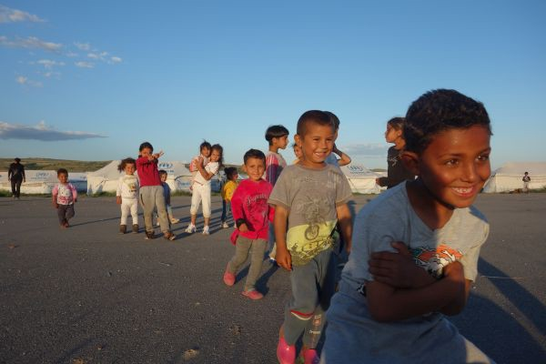

### [AYS DAILY NEWS DIGEST 30\.5\.2016\.](ays-daily-news-digest-28-5-2016-4215d9f1d6b8)
#### Many more are coming through Mediterranean route — deal with it\! , UN chief tells the EU, all the while UN seems to be backing out of the aid airdrops to besieged cities in Syria\. Hostility towards new arrivals of the coast of Greece\. Greek government plans to move settlements around gas station near Idomeni\. New donations needed, with old ones put to good use\. Number of refugees rising in Italy and Serbia with Hungary reinforcing its fences\. Heightened hostility towards refugees and volunteers in both Austria and Germany\.

 in [Cherso](https://twitter.com/hashtag/Cherso?src=hash) takes shape\. If you want to help, see links below\. Photo Credit: IHA\.](assets/ad04e40b392a/1*xAnsub7tKsSLzfZvQtyy9g.jpeg)

[Cultural Center](https://twitter.com/hashtag/CulturalCenter?src=hash) in [Cherso](https://twitter.com/hashtag/Cherso?src=hash) takes shape\. If you want to help, see links below\. Photo Credit: IHA\.
#### GENERAL
### **Millions more coming — deal with it, UN chief tells EU**

As the new number of arrivals from Libya show, it is more than obvious that we are to expect an even bigger influx through this dangerous route\. Yesterday, Michael Moller, who heads the Geneva office of the UN, said that Europe should deal with the fact that millions are coming and will not be stopped since they are leaving their countries because they have no choice\. Moller accused EU officials with “complacency and lack of leadership” who left Europe unprepared for the mass influx of migrants\. “What we have been seeing is one of the biggest human migrations in history,” Moller, a Dane, said in an interview\. “And it’s just going to accelerate\.”
#### SYRIA
### **UN might not be sending aid airdrops to besieged cities in Syria**

UN seems to be backdropping on the deal reached in April, a deal made by International Syria Support Group \(ISSG\) on 17 April in Vienna that stipulated that from 1 June if Bashar al\-Assad’s government continued to block World Food Programme aid and prevent land convoys reaching besieged areas, UN will start dropping food from planes\. As this date is approaching guardian reports that it seems that UN is having second thoughts concerned about safety of the planes flying over airspace controlled by Damascus and Moscow\. Jo Cox, the Labour MP who has raised the issue of airdrops most consistently, said: “If the words of the foreign secretary and the international community don’t turn to action, if we don’t see aid getting in by road or by air, then we’ve reached a new low making empty promises to starving children\.”
#### GREECE
### **97 new arrivals to Greece today**

Number of people stuck in Greece remains pretty much the same with 52, 871 people living in camps all around the country\. There were 97 new arrivals today with 50 on Lesvos and 47 on Samos\.
### **Hostility towards new arrivals by Maltesian Frontex\. Volunteer report**

Platanos refugee solidarity team from Lesvos is reporting on new arrivals being held floating in the sea by Frontex\. Here is their report in full: Last night we were informed of a boat approaching skala accompanied by Frontex and Proactiva\. The dinghy carrying around 50 people was stopped by the maltesian frontex 200 m from the harbour\. For more than 45 minutes they were kept drifting on the water, away from volunteer help and medical assistance, whilst ground frontex units arrived to the harbour to detain them\. Despite the fact that many people were wet and travelling with young children, police deprived them of any form of support, even denying access to the UNHCR officer present\. The maltesian frontex were notably hostile and aggressive towards the refugees, they put them in line and made them walk uphill 300 m to the coastguard bus, whist keeping all the volunteers at distance\.

In particular, one frontex cop pushed one doctor who tried to examine one toddler who was not responsive\. Tension sparked and the cop was saying “the kid is alright, back away, back away\!”\.

It’s the first time we witness the police keeping refugees at sea for so long in order to exclude the front line support, it’s the first time we witness violence against doctors, it’s the first time we see authorities remembering so passionately that these people are “illegal” and therefore they only need police “treatment”\. Shame\.
### **Dire condition in new camps in northern Greece**

As we have already reported, the conditions are dire in the new camps established in northern Greece and supposed to accommodate people that were moved from Idomeni\. UNHCR has reported these condition being substandard, while today European Commission spokesman Margaritis Schinas said that authorities are working on improving things\.
### **Greek government plans to move people from gas stations near Idomeni**

Meanwhile, more people are supposed to move to the above mentioned facilities as Kathimerini reports: “The Greek government plans to move refugees from the gas stations near Idomeni in northern Greece, where they are currently camped\. “Around 1,500 refugees will be evacuated from the gas stations near Idomeni in the following days,” said Giorgos Kyritsis, Spokesperson of the Coordination Body for the Refugee Crisis\.

Same newspaper is reporting that in one of those camps a Syrian refugee has been hospitalized after being stabbed in the thigh during an argument\. “The refugee was stabbed on Sunday afternoon during an argument with a group of migrants, thought to be of Kurdish origin, at a refugee center in Polykastro\.” The victim is in a stable condition in Kilkis Hospital\.
### **Drop in the Ocean team would like to thank everybody who donated for their efforts in Greece and more donations needed\.**

Nea Kavala camp\. Action of printing and distributing pictures of people from the camp honoring their personalities brings smile to many faces\. Photo credit: Aktionsrb\.

In better news, Drop in the Ocean team posted a thank you note to all of those who donated for their activities in the Nea Kavala camp\. There is a lot that solidarity resourcess made possible there so take a look at wonderful pictures [http://bit\.ly/1X9bYXP](http://bit.ly/1X9bYXP) and do not stop donating\.

Also, our friends from IHA are building new cultural centre in Chierso, if you want to help follow the link [http://bit\.ly/1sXAiiJ](http://bit.ly/1sXAiiJ) and contact them
#### HUNGARY
### **Hungary reinforcing its fence due to higher numbers of people coming to it’s southern border\.**

There is an increase of people on Serbia/ Hungary border with Hungarian officials using this as an excuse to reinforce its “anti\-migrant” fence, The daily number of illegal entries had risen from 70–90 to 100–150 since Idomeni was evacuated, a government official said\.
#### ITALY
### **Number of refugees in Italy on the rise — government urging for distribution of responsibility**

Due to large numbers of refugees arriving in Italy, both with a huge influx last week and existing numbers, an urgent message spread from the Italian government tries to manage the huge amount of migrants arrived in Italy during the last week\. The government urges every province to receive and host 70 migrants each, so to avoid further burden upon regions and municipalities\. This fair distribution involved also Friuli Venezia Giulia, a special\-status region usually excluded from the migrants’ quotes\. Italy is slowly filling up all of its capacities and is going to need more soon\. Italian intelligence officers are reporting, as suspected that thousands are waiting in Libya to be transferred to Italy\. As we have reported before, this route is once again opening up with last week’s numbers proving it\. Search and rescue operations are not ready for such an influx\.
### **More refugees arriving in Bologna**

Yesterday, 225 asylum seekers arrived in Bologna, after the voyage from North Africa and 1,200km from Catania by bus\. They are now hosted in ex CIE in via Mattei\. Other 400 people are attended in the same place in the next hours\. So far, Bologna received 1,200 people, almost 7,000 are hosted in the whole region\.
### **Two smugglers arrested**

Two men have been stopped with the accusation of causing the death of 45 people on the route to Sicily\. The two smugglers have been identified through the migrants’ witnesses, who reported a diet of bread and water, physical and sexual abuses\. Among the landed people, also a raped sixteen\-year\-old pregnant girl\. The price was 1,200 Libyan dinars\.
### **UNICEF reports on huge number of unaccompanied minors crossing the Mediterranean route**

UNICEF’s Coordinator Marie\-Pierre Poirier stated that “most part of the unaccompanied children using this route are unaccompanied adolescents, who faced terrible abuses, and they risked their life in every part of their journey”\. During 2016, an average of a thousand children per month have arrived in Italy, but the organization is expecting an increasing in their number\. Based on forecasts of the summer arrivals, UNICEF will soon start an operation with the Italian government and its partners to support their protection\. The content varies from monitoring the standards of the receiving procedures towards minors and unaccompanied minors \(after negative reports from Sicily, Calabria and Campania\), their social inclusion and integration
#### AUSTRIA
### **Neo Nazi youth arrested while claiming to attempt to shoot refugees in Northern Austria**

Austrian police commandos arrested a suspected neo\-Nazi allegedly planning to “shoot dead” asylum seekers\. The 20\-year\-old man allegedly “repeatedly told friends that he wanted to ‘shoot dead all asylum\-seekers with his shotgun’ at a refugee centre”, police in Upper Austria state said in a statement, reported AFP\.
#### GERMANY

As Politico reports, violence against refugees and volunteers in Germany has escalated since the beginning of the refugee crisis, German Interior Minister Thomas de Maizière told the German Funke Media Group Monday\. Since the start of this year, 449 attacks on refugee shelters have been registered, 82 of them involving violent crimes\. Another 654 crimes against asylum\-seekers were registered, of which 107 were violent\.
### **Increased number of asylum requests from Chechnya and North Caucasus**

We scarcely report about refugees from Russia, but as it seems there is an increase of refugees from Chechnya and North Caucasus in Germany\. Comparatively this is not a high number, but the figures are high with over 2000 asylum requests over the last year\. Some German news outlets saw this increase as some kind of Moscow ploy, which was momentarily demanded by the German government\. Such a statement is just one of the attempts to create a narrative of conspiracy when it comes to refugees\.
#### UK
### **English channel is just as dangerous as the Mediterranean crossings**

Refugees trying to cross the English Channel are just as likely to die as those who have perished in the Mediterranean, a former chief inspector of the UK’s border force has warned\. His warning follows the rescue of 18 Albanians, including two children, from a sinking boat off the Kent coast on Saturday night\. Two British men, aged 33 and 35, have been charged with immigration offences\.

_Converted [Medium Post](https://areyousyrious.medium.com/ays-daily-news-digest-30-5-2016-ad04e40b392a) by [ZMediumToMarkdown](https://github.com/ZhgChgLi/ZMediumToMarkdown)._
