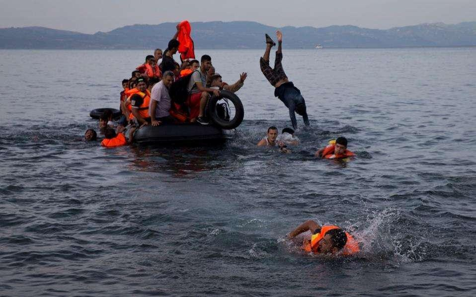
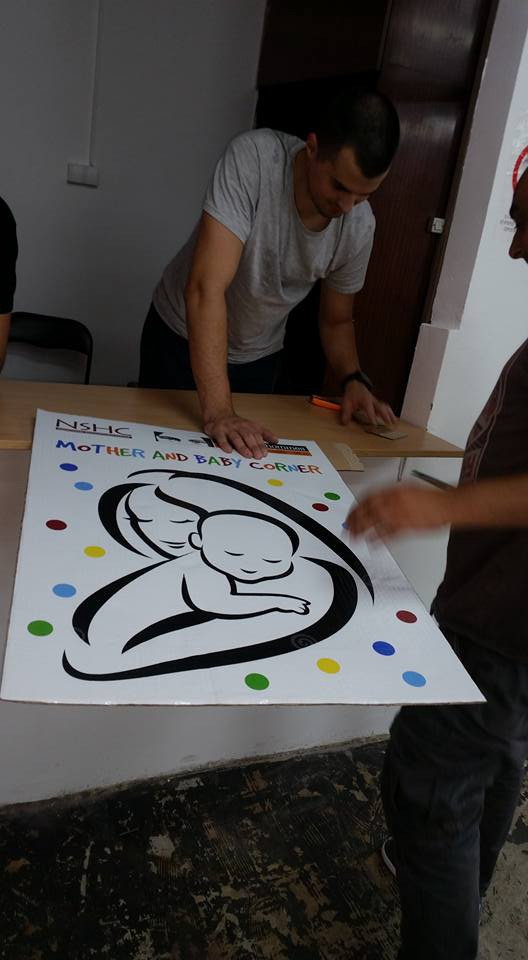
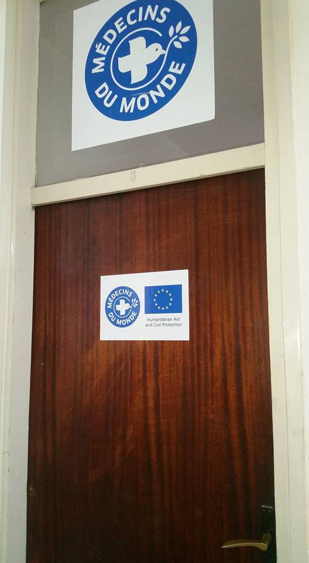
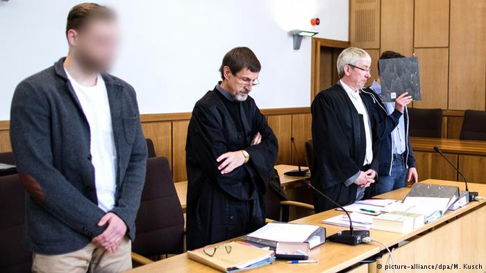

### AYS NEWS DIGEST 31\.5\.2016\.

](assets/1e5a27b1b995/1*1mpKpoLSXI3uyW9n6cI0tA.jpeg)

Credits: [**İmece İnisiyatifi Çeşme**](https://www.facebook.com/%C4%B0mece-%C4%B0nisiyatifi-%C3%87e%C5%9Fme-703040606472643/)
#### International Organization for Migration estimates more than 1,000 people dead or missing in Mediterranean over last week\. Doctors Without Borders Refuses EU Funds Over Turkey\-Migrant Deal\. New refugee centres to open in the capital cities of Serbia and France\. German fireman admits in court to setting fire to refugee house\. Czech Prima TV station told reporters to depict refugees as a risk and a threat or they would be fired\. Four Syrians injured in attack at Nea Kavala refugee camp; Pakistani man shot\. Uptick in migrant arrivals raises concerns on Greek islands\. Russian airstrike on a hospital in Idlib, Syria\. Inmates in Syrian Prison Fear Reprisal After Revolt\.
#### Syria
### Russian airstrike on a hospital in Idlib

> _More than 30 civilians reported dead\. Over 250 injured\._ 

> [**_Suhayla Sibaai_**](https://www.facebook.com/suhayla.sibaai?fref=nf) **_says:_ “** Can you imagine receiving this picture from your colleagues right before you’re about to lay your head down to go to sleep? At nightfall in Syria their reality is more horrifying than your worst nightmare\. More than 30 civilians are reported dead after this latest massacre by Russian airstrikes on civilians in the city of Idlib”\. 

](assets/1e5a27b1b995/1*qAEA6nf2ARXRt4sJ5JYB6w.jpeg)

Credits: [**Suhayla Sibaai**](https://www.facebook.com/suhayla.sibaai?fref=photo)
### Inmates in Syrian Prison Fear Reprisal After Revolt

> _Inmates who seized control of the main prison in the Syrian city of Hama feared a massacre on Monday night as security forces massed outside and the city’s police chief, trapped inside, tried to mediate between them and the government of President Bashar al\-Assad\._ 

> _Among the inmates’ demands were the release of political prisoners and an end to arbitrary trials\._ 

> _The revolt began last week when its leaders, who say they are mainly civilians arrested for protesting against Mr\. Assad’s government, took one of the Syrian opposition’s main grievances — the country’s notoriously brutal penal system — into their own hands\._ 

> _“We are in danger, and we appeal to all the people, anyone who has a conscience, to stand by us, to help us,” one prisoner pleaded in an audio message\._ 

> _Inmates said they took over the prison last week, for the second time in less than a month, seizing several hostages but soon freeing all but the police chief, Maj\. Gen\. Ashraf Taha\. They said he had volunteered to stay with them until a deal was made\._ 

> _On Monday, they said that they had gone three days without water or food and that many were falling ill\._ 

> _But they said they were holding out for a broad deal to free all of them and to allow international monitors into the prisons\. They called for the United Nations Syrian envoy, Staffan de Mistura, and the global powers to push for the enforcement of [Security Council Resolution 2254](http://www.un.org/press/en/2015/sc12171.doc.htm?version=meter+at+1&module=meter-Links&pgtype=article&contentId=&mediaId=&referrer=https%3A%2F%2Fwww.facebook.com%2F&priority=true&action=click&contentCollection=meter-links-click) , which calls for the protection and release of detainees\._ 

> _Otherwise, they said, they feared they could be killed or face other reprisals for the revolt\._ 

#### Libya
### EU ships in Libyan waters would undermine Tripoli government

> _The U\.N\. \-backed government in Libya has not invited European ships into its territorial waters to help stop people smuggling because this could harm efforts to broaden support for the fledgling government, its envoy to Rome [said](http://www.reuters.com/article/us-europe-migrants-libya-diplomacy-idUSKCN0YM1QH) on Tuesday\._ 

> _Ahmed Elmabrouk Safar, ambassador to Rome for Fayaz Seraj’s Tripoli\-based Government of National Accord \(GNA\), told reporters foreign warships within sight of its coast “would not help Libyan stability”\._ 

> _“Inviting foreign military and naval forces in Libyan waters could be seen as an important security\-led step which might cut down on the number of people who are crossing over the Mediterranean, but would it help in unifying the country in the current phase?” the envoy said\._ 

> _The Tripoli government, established in March, is still struggling to assert its authority\. It does not control the entire country, including much of the coastline\. Armed groups hold real power on the ground and in the east there is a separate government that has not accepted the GNA\._ 

> _This is allowing people smugglers to operate in relative impunity\. Last week some 880 migrants may have died in three separate shipwrecks, while more than 13,000 were rescued at sea, the U\.N\. Refugee agency said on Monday\._ 

> _The European Union has deployed warships to fight people smuggling off the coast of Libya and Italy has its own naval force in the area, but they have not been invited by the Seraj government into territorial waters, which would allow them to stop migrant boats before they reach the open sea\._ 

> _Libya still lacks resources to fight smuggling alone, including a navy or coastguard fleet, Safar said\. Tug boats are being used to stop some migrant boats, he said\._ 

> _What is important for a long\-term solution to the smuggling is that the Seraj government build a national consensus so that it can eventually enforce territorial control, and EU training and boats so that it can field its own coastguard fleet, Safar added\._ 

#### Turkey
### Doctors Without Borders Refuses EU Funds Over Turkey\-Migrant Deal

> _The international aid organization Doctors Without Borders has decided to refuse all future European Union funding as it protests the bloc’s recent migrant deal with Turkey\._ 

> _The decision follows a May 13 open letter from the group that called the agreement, under which people arriving on Greek islands are to be returned to Turkey, an “historic abdication of \[the EU’s\] moral and legal responsibilities\.” It also described the official welcome offered by Europe to those stranded in Greece as “shameful\.”_ 

Dutch Dr\. Erna Rijnierse, left, of Doctors Without Borders greeting a woman about to leave the ship “Aquarius” as more than 380 migrants arrive in the port of Cagliari, Sardinia, on Thursday, two days after being rescued near the Libyan coast\. _PHOTO: AGENCE FRANCE\-PRESSE_
#### Mediterranean
### International Organization for Migration estimates more than 1,000 people dead or missing in Mediterranean over last week

> _Will continue happening until more is done to streamline asylum applications abroad\. Current system is not working\. “For so many deaths to have occurred just in a matter of days and months is shocking and shows just how truly perilous these journeys are,” [said](http://www.unhcr.org/news/latest/2016/5/574db9d94/mediterranean-death-toll-soars-first-5-months-2016.html) UN High Commissioner for Refugees Filippo Grandi\._ 

> _“Thus far 2016 is proving to be particularly deadly\. Some 2,510 lives have been lost so far compared to 1,855 in the same period in 2015\. **” T** he odds of dying on the crossing are as high as one in 81 and getting worse\._ 

Credits: Ekathimerini
#### Greece
### Four Syrians injured in attack at Nea Kavala refugee camp; Pakistani man shot

> _Four Syrian refugees were rushed to hospital in northern Greece late on Monday after allegedly being attacked by a group of around 10 Iraqi nationals at a camp in Nea Kavala, in yet another incident of violence between migrants living at cramped facilities that have come under fire for substandard living and safety conditions\._ 

> _Two of the injured men, aged 17 and 18 respectively, were discharged from the Kilkis hospital after receiving first aid, while the other two, aged 20 and 35, were being treated for stab wounds and said to be in stable condition\._ 

> _In a separate incident, a 29\-year\-old Pakistani man was shot during a row with a compatriot at the Hara Hotel on the outskirts of Kilkis, which is also serving as a refugee and migrant center\. The man was injured in the shoulder blade and is being treated in a local hospital\._ 

> _Police are investigating both incidents\._ 

### Uptick in migrant arrivals raises concerns on Greek islands

> _A recent spike in refugee and migrant arrivals from Turkey onto Greek shores is raising concerns among authorities on Greece’s eastern Aegean islands, Skai reported on Tuesday, also quoting sources saying that hundreds are gathered on the coast of Izmir waiting to make the passage that will bring them into European Union territory\._ 

> _According to Skai, 160 migrants and refugees have landed on Lesvos in the past five days, marking an increase after a few weeks of almost no arrivals, bringing the total number being hosted on the island to just under 4,000 and stretching resources\._ 

> _In Samos, recent arrivals have come to 64, bringing the island’s total to 954, according to government sources\._ 

> _The total number of migrants and refugees awaiting processing on the islands of the eastern Aegean on Tuesday was 6,627, authorities said, adding that the country total reached 52,674\._ 

> _The recent uptick in arrivals suggests that Turkey has relaxed the terms of a deal it signed in March with the European Union to control inflows in exchange for accession talks, sources told Skai\._ 

> _The same sources over the weekend reported sightings of buses unloading migrants and refugees at a central square in Izmir, as well as large numbers of small boats along the coast\._ 

### New makeshift camps spring up around Idomeni
### Together for Better Days has launched a new [website](http://togetherforbetterdays.org/)

> _Originally, the group started assisting refugees in Moria registration center on Lesvos\. After the transformation of Moria to a detention center following the EU\-Turkey deal, the group closed down and relocated their activities to the mainland of Greece\._ 

> _They are looking for volunteers, you can apply [here](https://docs.google.com/forms/d/1n02q0s_D4uKlSWSM13ML-VfDkQN7eggpUbsPTk4Sa0o/viewform)_ 

### Summary statement of refugee flows in Greece, May 31, 2016\.

> _Here_ 

#### Serbia
### New aid centre for refugees opens tomorrow

> [_‪Miksalište‬_](https://www.facebook.com/hashtag/miksali%C5%A1te?source=feed_text&story_id=1716549251895774) _2\.0 opened at the new location in [‪Serbia‬](https://www.facebook.com/hashtag/serbia?source=feed_text&story_id=1716549251895774) ’s capital, Belgrade, after the original [‪‎refugee‬](https://www.facebook.com/hashtag/refugee?source=feed_text&story_id=1716549251895774) aid centre was demolished\._ 

> _The new centre, which begins its operation tomorrow, is situated at 15 Gavrila Principa Street, north of the train station\._ 

](assets/1e5a27b1b995/1*ZhfxUEnMPV-Xk7KsJUxlJg.jpeg)

Credits: [**Refugee Aid Miksalište**](https://www.facebook.com/RefugeeAidMiksaliste/?fref=photo)

](assets/1e5a27b1b995/1*mGGZ9lrFaPsbiXAy67znpA.jpeg)

Credits: [**Refugee Aid Miksalište**](https://www.facebook.com/RefugeeAidMiksaliste/?fref=photo)
### Volunteer testimony from Subotica

> “ In past 8 months we have seen Horgos, Presevo, Dimitrovgrad, Sid and Principovac\. Somehow, what I am seeing here in Subotica is much worse\. Yesterday, around 200 people came to the bus station\. At least 6 families with babies and little kids\. They had no idea where they want or should go\. Or how\. I never felt so hopeless like yesterday\. The camps before were awful, but at least the borders were open and after all that terrible things, refugees had chance to get somewhere, somehow\. Even if without food, water, care… 

> But now, borders are closed\. And people are still fleeing their warring countries and are still coming here\. It seems like there are more and more of them every day\. And there is minimum help here\. One NGO with food packages and Kristof and me handing out tents, mattresses, socks, food, toys to crying kids\. Taxis are taking refugees from just a few minutes outside Subotica, in the middle of night, probably to the entrance of the forest\. 

> There was storm coming yesterday night, lightning on the sky, and in our car on the way back home I could not stop feeling how terrible it must be when you hold your baby in arms and other few little kids in hands and you are left in unknown country on dark unknown place in forest, with no idea where and how to go\.” [**Zuzana Kizáková**](https://www.facebook.com/profile.php?id=100008201950848) 

](assets/1e5a27b1b995/1*t3GbkztKyN7AVS13Txv-0Q.jpeg)

Credits: [**Zuzana Kizáková**](https://www.facebook.com/profile.php?id=100008201950848)

](assets/1e5a27b1b995/1*csNVAFpU-tR4EpXg9SjJ6w.jpeg)

Credits: [**Zuzana Kizáková**](https://www.facebook.com/profile.php?id=100008201950848)
#### Czechia
### Prima TV station told reporters to depict refugees as a risk and a threat or they would be fired

> _The Czech NGO [HlídacíPes\.org](http://www.romea.cz/en/news/czech/hlidacipes.org) \(“Watchdog”\) has testimonies from several sources inside Prima TV stating that the television station’s management gave producers there clear instructions during a meeting on 7 September 2015 about what angle to take toward the refugee “crisis” in its news reporting\. The station’s reporting on the issue took center stage this spring because of [how it chose to report on the arrival of Christian refugees from Iraq](http://www.romea.cz/en/news/czech/czech-republic-maniuplative-television-report-sparks-hatred-against-christian-refugees-from-iraq) to the Czech Republic\._ 

> _After one particular reportage was broadcast there was much discussion over whether one of those refugees had actually compared the accommodation he was offered to a “cowshed”\. There was debate and reporting on whether the interpretation of his words from Arabic had been correct or distorted in some way\._ 

> _Thanks to several months of investigative work, HlidaciPes\.org has acquired information and proof confirming that the management of Prima, together with the chief producers in the newsroom, have long advocated for the refugee issue to be presented primarily as a crisis, problem and threat\. That is the spirit in which reporters are instructed to produce their news reporting\._ 

_The TV Prima building in the Czech Republic\. \(PHOTO: Kacir, Wikimedia Commons\)_
#### France
### Paris mayor announces plans to open first refugee camp in Paris

> _Paris is to open its first internationally recognised refugee camp “in the coming weeks,” its mayor announced on Tuesday, accusing France and Europe of failing to “face up to the migrant crisis”\._ 

> _Anne Hidalgo, Paris’ Socialist mayor, said that the camp, [located somewhere in the north of the capital](http://www.telegraph.co.uk/news/2016/04/16/migrants-armed-with-metal-poles-clash-with-vigilantes-beneath-pa/) , will serve as a day centre for migrants and refugees, but also offer more permanent accommodation to [“those who have nothing\.”](http://www.telegraph.co.uk/news/worldnews/europe/france/11645114/french-police-clear-hundreds-of-migrants-from-paris.html)_ 

> _It will be up and running within a month to six weeks\._ 

#### Germany
### German fireman admits in court to setting fire to refugee house

> _A fire safety officer and his friend have confessed in court to starting a fire in a house where several refugees were sleeping\. The men have denied any intent to cause harm but face attempted murder charges\._ 

> _The main suspect in an alleged arson case at a refugee house in the west German town of Altena admitted to a court on Tuesday that he set the building ablaze\. Seven Syrian refugees were sleeping in a ground floor apartment at the house\._ 

> _The prosecution said the man entered the house through the basement and doused the attic in petrol before setting the building alight\. Under German law the accused can not be named in full before being sentenced\._ 

> _As to the man’s motive, he said he had been told that refugees were dangerous, [telling](http://m.dw.com/en/german-fireman-admits-in-court-to-setting-fire-to-refugee-house/a-19296140) the court, “I thought they are all criminals\.”_ 

> _“I was scared of break\-ins, thefts, violence and also sexual assaults,” the 25\-year\-old said on the first day of his trial in the German city of Hagen\._ 

> _He said later he realized that the refugees were actually “terribly nice\.”_ 

_Converted [Medium Post](https://areyousyrious.medium.com/ays-news-digest-31-5-2016-1e5a27b1b995) by [ZMediumToMarkdown](https://github.com/ZhgChgLi/ZMediumToMarkdown)._
