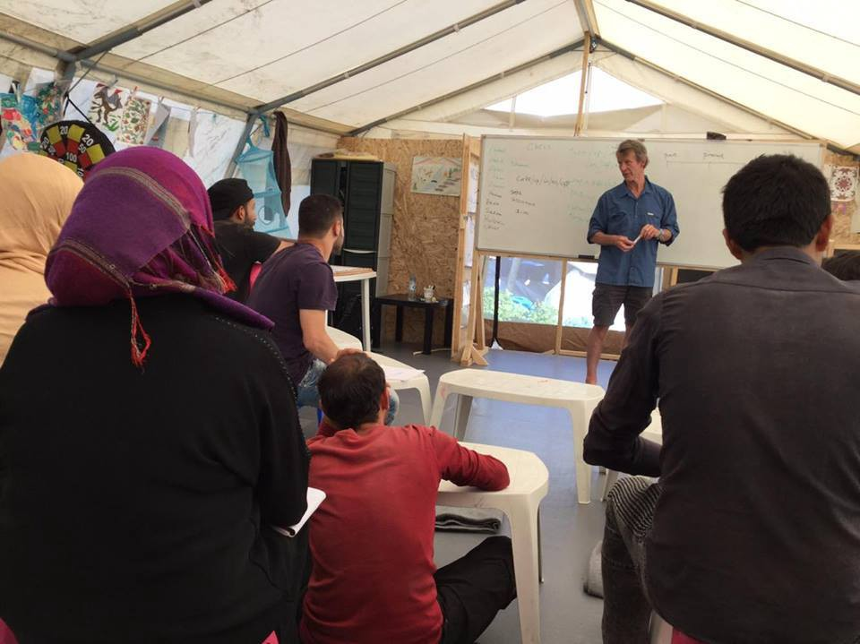
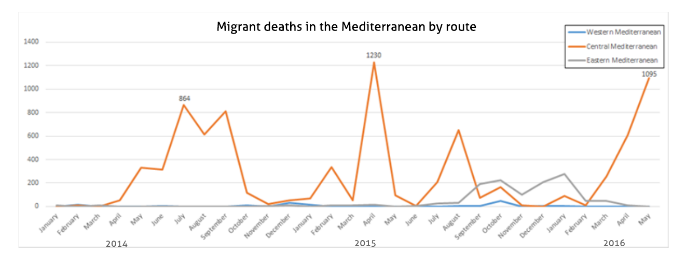
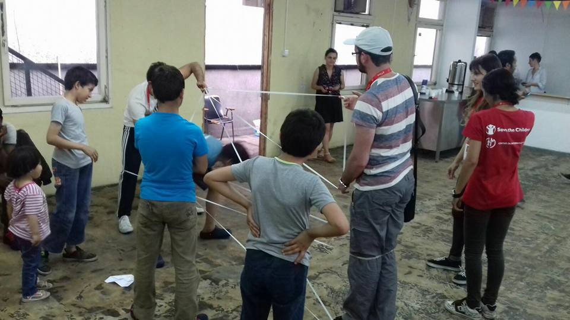

### AYS News Digest — Graveyard in the Mediterranean
#### Statistics show that May 2016 was the second deadliest month on record for refugees attempting to cross the Mediterranean via Libya, with nearly 1,100 dying as a result\. More deaths are likely without European policy changes to allow refugees to reach Europe in alternative ways\!

Source: Eko Project
#### General

**1095 refugees have died in May 2016 while trying to cross the Mediterranean, constituting a massive spike in deaths\.**

May 2016 has been the second\-deadliest month for refugees crossing the Mediterranean since tracking started in 2014\. A total of 1,095 have died en\-route to Europe, [according to the International Organization for Migration \(IOM\) \.](http://weblog.iom.int/mediterranean-migrant-deaths-spike-may#sthash.kAymdQD4.dpuf) The bulk of those deaths took place in the week of May 25 to May 31, totalling 1,085\.

Source: IOM

The deadliest of the recorded incidents took place on May 26 off the coast of Libya, where 500 refugees drowned as their boat capsized\. The Central Mediterranean route \(departing from Libya\) is the deadliest of the sea\-crossings\. Since 2014, there have been over 20 recorded instances of drownings involving more than 100 people\. Exact numbers are often difficult to verify as very few bodies are recovered from the sea, but according to estimates, a total of 2,443 have lost their lives thus far in 2016\. The Mediterranean is the site of nearly 90% of recorded deaths of migrants this year, and because safer methods of travel to Europe are not being offered to refugees, it seems that these easily preventable deaths will continue for the foreseeable future\.
#### Libya

**85 bodies of drowned refugees have washed up in Libya\.**

Near the Libyan city of Zuwara, the bodies of 85 refugees washed up, [reported Reuters](http://www.reuters.com/article/us-europe-migrants-libya-bodies-idUSKCN0YO1ML) \. The bodies were in a heavily decomposed state, and it is difficult to determine when they died, said a Red Crescent official\.
### As ISIS grows weaker in Iraq and Syria, they are expanding in Libya\.

[Al Jazeera reports that](http://www.aljazeera.com/news/2016/06/report-isil-gaining-ground-libya-160601045240672.html) it has received an advance copy of a UN report detailing ISIS’s movements\. As the group is being militarily defeated in Iraq and Syria, they are looking for new bases, with Libya being an attractive area\. The new Libyan unity government is trying to build a coalition to counter ISIS’s pernicious influence in the country\. Regardless of the outcome, the continued fighting signals an increasing threat to the civilian population, likely meaning an increase in travel on the deadly Mediterranean route\.
#### Syria

**100 thousand refugees are currently stranded on the Turkish border as ISIS advances\.**

In an area of 25 square kilometers in the district of Azaz, 100,000 refugees are stuck while ISIS is only five kilometers away\. Meanwhile, Turkey has shut down its border with Syria, only allowing passage in the case of medical emergencies\. [“We are trying to cope and forget that we have lost our homes, but the reality is that we are trapped in an isolated land, with nowhere to go,”](http://www.msf.org.uk/article/syria-100-000-trapped-in-azaz-between-islamic-state-and-turkish-border) reported Yahia Jarrad, a nurse supervisor in the MSF facility of the district\.

Turkey is currently housing 3 million Syrian refugees, while refusing to refer to them as such\. Instead, they are referred to as “guests”, and those in the country live in very difficult conditions with little access to resources\.
### Four ISIS strongholds are now under attack, making it likely that the group will lose ground\.

Strident attacks against ISIS positions are taking their toll on the group, potentially resulting in serious territorial losses\. As The Guardian reports:

> [_In Iraq, an attack on Falluja, where Isis has been holed up since January 2014, has entered a second week\. In the north, the bastion of Mosul, which is central to Isis’s fate, now seems less formidable after a peshmerga push from the east\. Last weekend, while attention was on Falluja, Kurdish forces seized nine villages that until then had been solidly in the jihadis’ grasp\._](http://www.theguardian.com/world/2016/jun/02/isis-islamic-state-risk-losing-territory-caliphate-syria-iraq) 

> _In Syria, the de facto Isis capital of Raqqa and its surrounds are the scene of fresh clashes and an exodus of refugees that is clearing the city for an inevitable, but not imminent, ground offensive\. And, along the country’s southern border with Iraq, a recently raised unit called the New Syria Army, backed by the US and Jordanian special forces, is asserting itself near a frontier that had been a no man’s land for all other opposition groups since mid\-2013\._ 

### A volunteer was killed in a Russian airstrike\.

Safwan Daboul, a volunteer with the Molham Volunteering Team, was killed on May 31 in Idlib\. Safwan ran towards the vicinity of the airstrike to help with rescue efforts, only to be killed by the second round of Russian bombing\. Rest in peace, Safwan\. More can be found [here](https://www.facebook.com/molhamteam2/photos/a.593083297406146.1073741825.593081240739685/1065213963526408/?type=3&theater) \.

The Syrian American Medical Society \(SAMS\) is working hard to ensure that Syrians have access to healthcare\. This is becoming increasingly difficult in light of the ongoing targeted attacks of Syrian medical facilities, largely by Syrian government and Russian forces, but by some rebel groups as well\. You can follow SAMS’ activities by following their [Facebook page](https://www.facebook.com/SyrianAmericanMedicalSociety/) \.
#### Greece
### Officials have confirmed that the Eko Gas Station is to be evacuated\.

News That Moves has [reported](https://newsthatmoves.org/en/greek-authorities-evacuation-of-eko-gas-station-in-coming-days/) that the Eko Gas Station camp will be evacuated in the very near future\. The news was confirmed by a representative of the Greek Coordination Centre for the Management of the Refugee Crisis\. As many as 1,600 people are currently living in the camp\. This news comes in the immediate aftermath of the evacuation of Idomeni, located a short distance from the station\. The representative reported that the evacuation of Eko gas station will go smoothly, with Idomeni serving as a model\.

The Body for the Refugee Crisis also reported that the expansion of official camps is underway, and that by autumn they will be “real and proper settlements\.” The living conditions of those who have been evacuated from Idomeni however suggests that one should not have too much faith in the authorities’ words\.

After the remaining makeshift camps in Northern Greece are evacuated, there are plans to build new camps in the Attica region to evacuate the refugees currently residing at Piraeus Port and Elliniko Camp\.
### **The Greek Asylum Service will be expanding its operation on the Greek mainland\.**

The Greek Asylum service will be going into camps and carrying out a preliminary pre\-registration of those refugees who would like to claim asylum in Greece, or who would like to take advantage of the family reunification and relocation services to be resettled elsewhere in the EU\. News That Moves, [citing information provided by the UNHCR](https://newsthatmoves.org/en/what-rights-do-i-have-if-i-pre-register-in-greece/) outlines the following rights guaranteed to those who complete the pre\-registration:
- The right to **legally live** in Greece until the Asylum Service has made a final decision on an asylum claim
- The right to **move freely within Greece** , but not to leave the country
- The right for children to **go to school** free of charge
- The right to access **health care** , paying a minimal fee for services and medicine
- The right to stay in one of the **organized sites** in the mainland, free of charge\. If people do not want to be hosted in the sites, they can leave after being pre\-registered and choose to live somewhere else\.

It should be noted that applicants **will not** have the right to work in the country until after their second appointment with the asylum service\.
### Today’s numbers and news of new arrivals\.

Today’s numbers as [released by the Greek government](http://www.media.gov.gr/images/prosfygiko/REFUGEE_FLOWS-02-06-2016.pdf) are as follows: 8,417 refugees are currently in the islands, nearly 1,000 more than the official maximum capacity of the existing camps\. The Attica region is hosting 14,510 refugees, while Northern Greece is hosting 26,840\. Central Greece is hosting 2,262 refugees and Southern Greece has 289, bringing the total number throughout the country to 52,318\.

A boat containing 22 people landed in North Lesvos\. Between 130 and 140 refugees landed on Chios in the morning\.
### Dozens of asylum seekers have been injured in a riot at Moria Camp\. There are also problems at Samos\.

[Ekathimerini reports](http://www.ekathimerini.com/209241/article/ekathimerini/news/dozens-injured-in-clashes-at-lesvos-migrant-camp) that clashes in the morning have left dozens injured after a group of Pakistani refugees accused Afghans of trying to seize control of the camp, with the Afghan refugees alleging that Pakistanis were stealing food as well as sexually harassing women and children\. Fires were set in the camp\.

Meanwhile there are also riots in Samos\. Our sources report that these clashes were between the Algerian and Pakistani residents of the camp\. 6 people were injured and 2 containers were burned down\.
#### AYS
### Help AYS\!

A wonderful person has started a fundraiser on our behalf to keep us going\. We thank him very much and for those of you who could help us, please do so\. We would be very thankful for any and all donations\! You can make a donation at the following address: [https://www\.gofundme\.com/27c89r7c](https://www.gofundme.com/27c89r7c)
#### Serbia
### Mikalište Center in Belgrade has been reopened\! The staff is asking for help in building a library\.

After the tragic destruction of the original Miksalište in April for the building of a luxury residential complex, we are happy to report that Miksalište 2\.0 launched on June 1st\! The new facility is located at Gavrilo Princip St\. 15\. Like its predecessor, the renewed project will serve as a hub for refugees passing through Belgrade, with facilities such as a first aid room, a nursery, a kitchen, toilets, and showers, as [reported by News That Moves](https://newsthatmoves.org/en/help-for-refugees-in-belgrade-miksaliste-2-0/) \. In addition to food distribution, Miksalište is a safe space for refugees where where they can get clothing, medical and psychological help, and help with integrating into Serbian society\. The center will soon offer courses in Serbian and computer classes\. 400 refugees visited the center on its first day\.

The staff of Miksalište is currently asking for book donations to help them build up a library at the facility\. Anyone who would like to help can do so by contacting their [Facebook page](https://www.facebook.com/RefugeeAidMiksaliste) \.

Children playing at the newly reopened Miksalište facility\. Source: Refugee Aid Miksalište Facebook page\.
### The body of a refugee has been found on the Serbo\-Hungarian border\.

The victim has been identified by the media as a 26 year old Turkish man\. He was found stabbed to death in Subotica, and authorities are treating the case as a murder\. No further information is available at the moment\.
#### Hungary
### There is an ongoing protest at Kiskunhalas Detention Center\.

Since yesterday, 300 of the nearly 500 refugees detained in the center have been protesting their extremely limited rights, as [reported by MigSzol](http://www.migszol.com/blog/solidarity-with-the-people-protesting-against-poor-conditions-in-the-closed-asylum-detention-center-in-kiskunhalas-hungary) \. The refugees ask that they be moved to an open camp, receive faster asylum processing, and get better living conditions\. Refugees may be kept at Kiskunhalas for as long as 6 months\. Many report abuse at the hands of guards and insufficient healthcare, food, social workers, and translation\. Their access to the internet is extremely limited, and mobile phones are confiscated\. Most of those in Kiskunhalas had been caught trying to cross the border into Austria\.

300 police officers were deployed in response to the protest, footage of which can be viewed [here](https://www.youtube.com/watch?v=tGi1KLFGJlM) \. The refugees sent a representative with their list of the above\-mentioned demands, which were rejected across the board by the Hungarian government’s chief security advisor\.
#### Macedonia
### Refugees in Tabanovce Camp continue to live in difficult conditions, donations are needed\.

The refugees staying in Tabanovce Camp are having a very difficult time\. The facility is little more than a tent city where refugees cannot even shower\. Many refugees have only one pair of pants, but thanks to the efforts of Charity United Refugee Aid, jeans are being distributed to the inhabitants\. Those wishing to help can do so by giving a donation at the following link: [http://charityunited\.us/donate/](http://charityunited.us/donate/)
#### Germany
### Bundestag passage resolution recognizing the Armenian Genocide prompts Turkey to withdraw its ambassador\.

[Deutsch Welle reports](http://www.dw.com/en/bundestag-passes-armenia-genocide-resolution-unanimously-turkey-recalls-ambassador/a-19299936) that the resolution passed almost unanimously\. This could have serious ramifications for relations with Turkey\. When taken in conjunction with issues surrounding visa\-free travel for Turkish citizens, the controversy may very well spell the end of the EU\-Turkey deal\.
### Three Syrians arrested for allegedly planning an attack\.

[Deutsch Welle reports that](http://www.dw.com/en/german-prosecutors-three-suspected-is-militants-arrested-thought-to-be-planning-attack-in-d%C3%BCsseldorf/a-19300174) the Syrians were arrested in three different states for allegedly planning an attack on the historical center of Dusseldorf\. The attack was allegedly going to be carried out in the name of ISIS\. The alleged plot resembles November’s attacks in Paris, with two suicide bombers detonating themselves in the center and two more attackers set to kill as many people as possible with guns and grenades\. There is no evidence that preparation for the operation had begun, according to federal prosecutors\.

_Converted [Medium Post](https://areyousyrious.medium.com/ays-news-digest-graveyard-in-the-mediterranean-92e6bb2aaf43) by [ZMediumToMarkdown](https://github.com/ZhgChgLi/ZMediumToMarkdown)._
