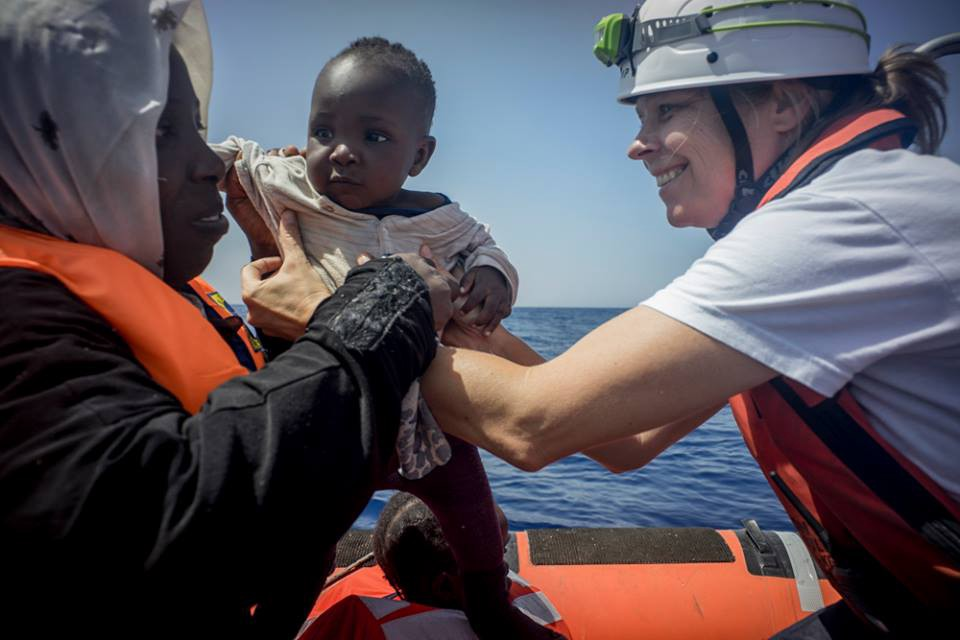
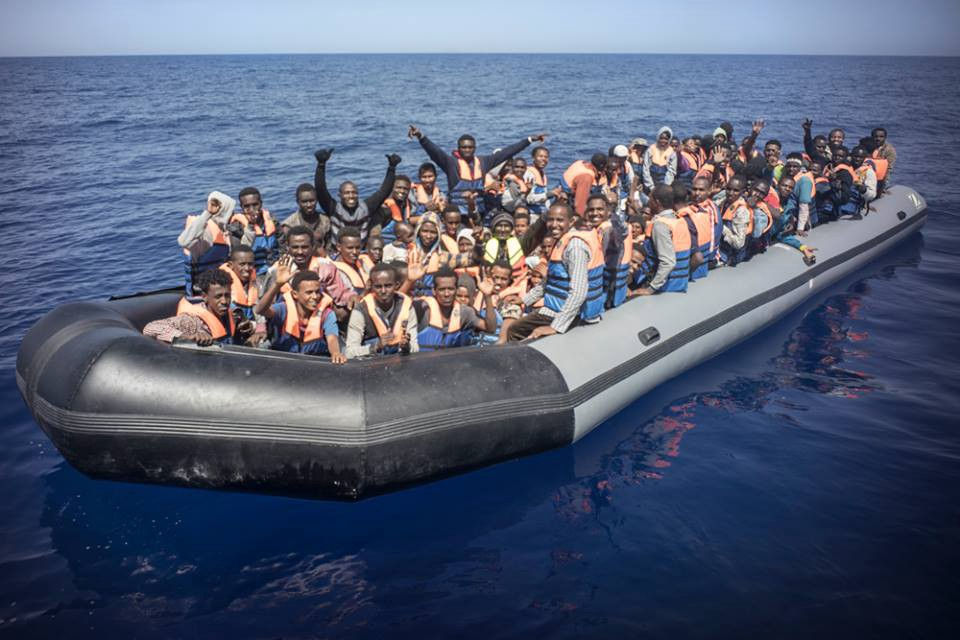
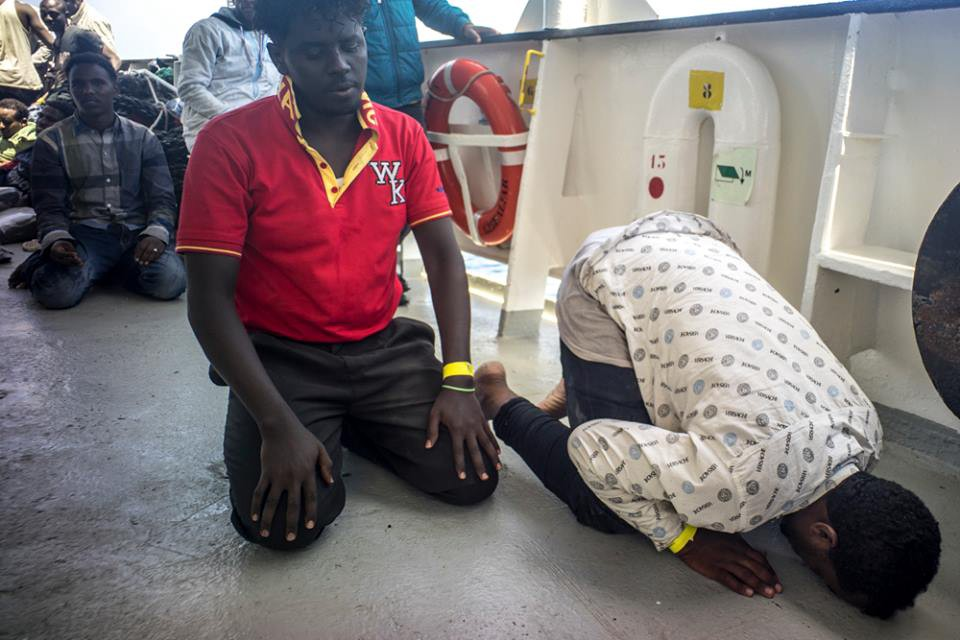
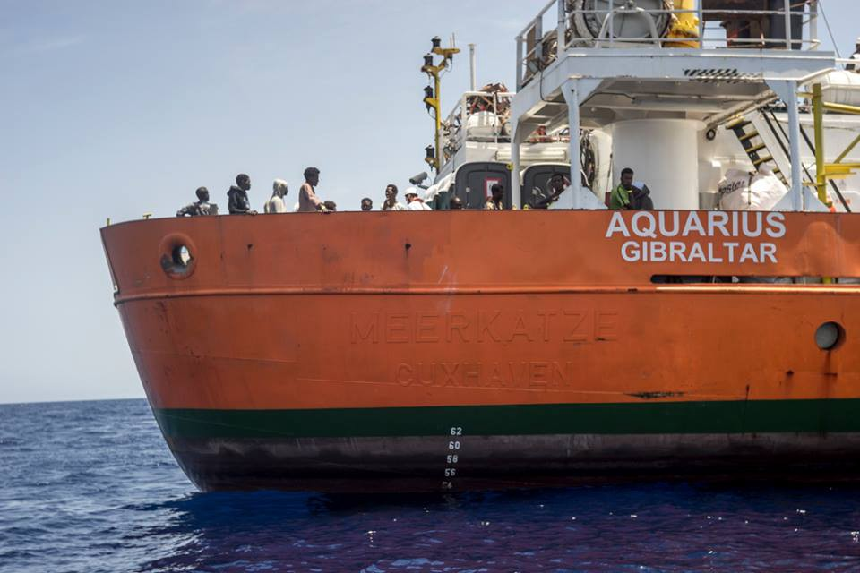
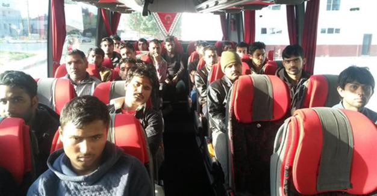
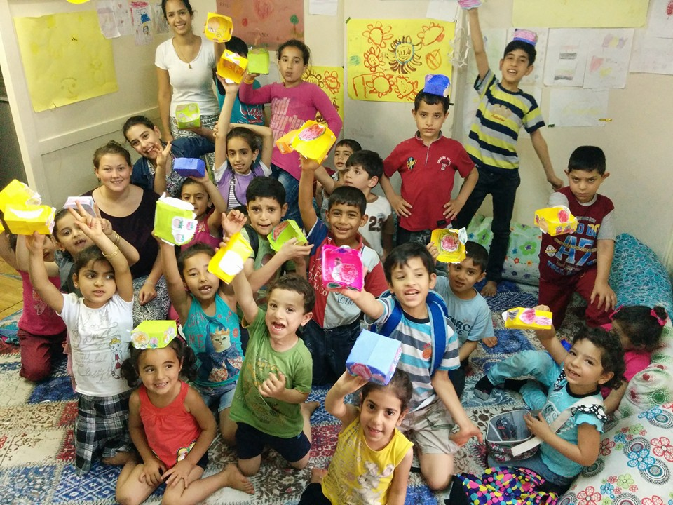
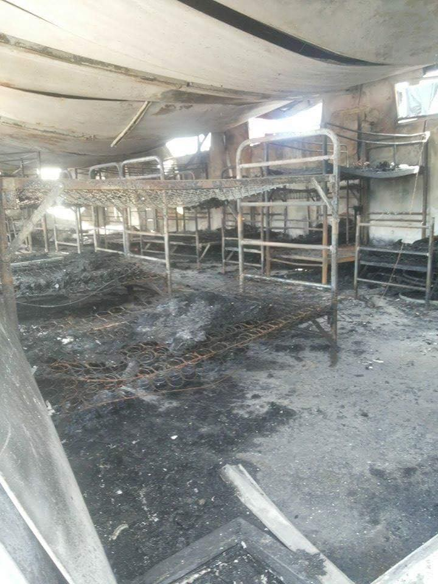

### AYS News Digest: The Crisis Continues

A refugee mother and her baby as they are taken on the rescue ship\. Credits: Yann Merlin/ SOS MEDITERRANEE

A Syrian claiming to be a homosexual will be deported\. 96 refugees saved from drowning this morning\. Red Crescent announces that there are 117 decomposing bodies found in Zuwara Beach, Libya\. Aid reaches besieged population in Syria’s Daraya\. Amnesty International is requesting that refugees NOT be returned to Turkey\. Turkish sergeants detained over human smuggling\. Two refugee deaths at Hungarian border\.
#### General
### First Deportation Following Asylum Rejection in Lesvos

> _The first deportation of a Syrian citizen is going to be carried out on Thursday in Lesvos, after the final rejection of his asylum [petition](http://www.thepressproject.gr/article/95743/First-Deportation-Following-Asylum-Rejection-in-Lesvos) \. The asylum request was rejected on the second, and final degree, while the petitioner has not been called for a vis\-a\-vis hearing\._ 

> **_The Homosexuality Claim_** 

> _A Syrian claimed to be homosexual yet this argument to grant him asylum was also rejected by the committee\. According to the Syrian’s representatives, the EASO employee asked him which were the colors of the Rainbow flag and whether he knew any famous Syrian homosexual\. He answered that he was not active in the homosexual community of Syria and knew no such information as he was forced to hide his own sexual preferences\. Accordingly, his claim, that he was homosexual was rejected\._ 
 

> 
 

> _It should be noted that had his claim been accepted, his deportation to Turkey would have been considered to be unsafe\. Legal circles raise several issues regarding the whole procedure since, according to the prevailing legal status, when an individual states that he or she is a homosexual, there is no legally acceptable way to ascertain or reject his claim; any attempt would be an abuse of his or her human rights and, therefore, it should be immediately accepted\._ 

### 96 Refugees Saved by SOS MEDITERRANEE This Morning

> _During SOS MEDITERRANEE’s 11th rescue operation, their crew was able to rescue 96 people this morning\. The Aquarius is now on its way to Lampedusa, to bring everyone to shore\._ 

Credits: Yann Merlin/ SOS MEDITERRANEE

Credits: Yann Merlin/ SOS MEDITERRANEE

Credits: Yann Merlin/ SOS MEDITERRANEE

Credits: Yann Merlin/ SOS MEDITERRANEE
### The UN Refugee Agency \(UNHCR\) this week launched an online petition asking governments to act to support refugees\.

> [_The **\#WithRefugees petition** asks governments to ensure_](https://newsthatmoves.org/en/unhcr-launches-pro-refugee-petition/) _:_ 

> _every refugee child gets an education,_ 

> _every refugee family has somewhere safe to live_ 

> _every refugee can work or learn new skills\._ 

#### Libya

**117 decomposing bodies found at Zuwara Beach, rather than 80, Red Crescent announces\.**

> [_Until Friday the number of bodies in an advanced state of decomposition found in the Libyan beach Zuwara was counted at 80_](http://www.elmundo.es/internacional/2016/06/02/575084f9268e3eb67d8b459c.html) _\. However , according to Red Crescent humanitarian organization the number of bodies amounts to 117\. Volunteers of the organization believe the individuals died in a shipwreck last week off the coast of Libya, although they cannot be certain\._ 

#### Syria
### Aid Reaches Besieged Population in Syria’s Daraya

> _On June 1st international aid reached the besieged town of Daraya in Rural Damascus, Syria for the first time in four years\._ 

> _Syria Arab Red Crescent \(SARC\) trucks loaded with UN, ICRC and IOM relief supplies left from Damascus to provide assistance in the besieged areas of Daraya and Moadamieh in Rural Damascus — less than 8 km southwest of Damascus\._ 

> _The inter\-agency convoys delivered critical life\-saving assistance\. An estimated 4,000 people will benefit from the supplies in Daraya and 22,500 people in Moadamieh\._ 

> _IOM delivered primary health care equipment and supplies to support the health unit in Daraya, as well as 25 wheelchairs for children and adults\. Another 15 wheelchairs and 25 pairs of crutches were sent to Moadamieh\._ 

#### Turkey
### Amnesty International is requesting that refugees are NOT returned to Turkey

> _Amnesty International is urging the European Union to “immediately halt plans to return asylum\-seekers to Turkey” from Greece under the EU\-Turkey deal, “on the false pretense that it is a ‘safe country’ for [refugees](https://newsthatmoves.org/en/amnesty-international-stop-returns-to-turkey/) \.”_ 

> _According to a briefing from Amnesty International that was published today, asylum seekers and refugees currently in Turkey are indeed **denied effective protection** there\._ 

### Turkish sergeants detained over human smuggling

> _Two sergeants and one specialized sergeant have been detained, along with 11 others, for allegedly carrying out human smuggling activities in the western provinces of İzmir and Aydın on [June](http://www.hurriyetdailynews.com/turkish-sergeants-detained-over-human-smuggling-.aspx?pageID=238&nID=100006&NewsCatID=509) 1\._ 

> _The detention of the 14 suspects, also including local municipality personnel, came as gendarmerie forces conducted simultaneous raids in the Söke and Didim districts of central Aydın, and in İzmir\._ 

Credits: Doğan News Agency
### ReVi Group makes fruit baskets with Refugee Children in Izmir

#### Bulgaria
### BBC: 50–200 migrants smuggled through Bulgaria per day

> _In the hands of smugglers, migrants disappear after entering Europe and resurface only briefly — in [Sofia](http://www.standartnews.com/english/read/bbc_50__200_migrants_smuggled_through_bulgaria_per_day-11485.html) and the Serbian capital Belgrade\. The Bulgarians say “only 50” a day are smuggled through Bulgaria, an EU member since 2007\. Another — Serbian — source suggests the number is closer to 200 a day, BBC reports\._ 

> _Between 200 and 400 have been arriving daily further north in Austria since the beginning of the year, after crossing Hungary\._ 

> _At the weekly video conference calls of all countries involved, Bulgarian and Macedonian officials quarrel over who is letting them through\._ 

> _If Bulgarian authorities can produce convincing evidence that migrants came through Turkey — bus tickets, currency, biscuit wrappers — they can be returned within five days, or 12 days if they appeal against extradition and if their asylum request is rejected by Bulgaria\._ 

#### Greece
### Greek rescuers respond to capsized migrant boat off island of Crete

> _Greek rescuers have saved more than 300 people from a capsized boat in international waters south of the island of [Crete](http://www.dw.com/en/greek-rescuers-respond-to-capsized-migrant-boat-off-island-of-crete/a-19304128) \. It was unclear where the migrant boat was launched or where it was heading\._ 

> _Greek coastguard boats, helicopters and four nearby ships came to the aid of a “significant number” of people stranded after their boat capsized about 120 kilometers \(75 miles\) south of Crete in international waters, Greek authorities said Friday\._ 

> _At least four bodies were retrieved and more than 300 rescued\. The death toll was expected to rise as rescue operations continued to search for at least another 300 believed to have been on board\._ 

### Frontex and Greek Coastguard change attitude after resistance

> _Another boat landed yesterday morning at Skala harbor accompanied by a Frontex vessel\. After the public outcry over the incident of May 29th, where Frontex and the Greek coastguard kept refugees away from front\-line support and medical assistance, yesterday they changed their stance, allowing volunteers to offer help to the refugees\. Around 30 people from different countries got changed at the harbor of Skala before getting taken by the coastguard buses to Moria\._ 

> _Reports against the abusive behavior of Frontex\-Greek coastguard on the 29th of May went viral and were shared largely on local and national press\. It is assumed that this is the reason for them being so eager to cooperate yesterday\. No human right was ever “granted” without struggle\._ 

### Unfulfilled promises and uncertainty causing increased frustration

> _Refugees say they feel frustrated and deceived because they are yet to be registered for asylum, despite Greek authorities offering assurances they would be registered if they moved to formal [camps](https://newsthatmoves.org/en/unfulfilled-promises-and-uncertainty-causing-increased-frustration/) \._ 

### Six injured in migrant clashes on Samos island

> _Greek police say clashes have broken out between rival ethnic groups of refugees and other migrants at a detention camp on the eastern Aegean Sea island of [Samos](http://www.ekathimerini.com/209286/article/ekathimerini/news/six-injured-in-migrant-clashes-on-samos-island) \._ 

> _Police say six people have been injured and 25 detained\. About 1,100 people are held in the facility\._ 

Credits: Calais Action
### Numbers of Refugees in Kos

> _\- Arrivals 2/6 & 3/6 : 24_ 

> _\- Departures 2/6: 0_ 

> _\- Presence : 465, of which 325 \(217 adults & 108 minors\) are residing at the Hotspot and 140 \(27 adults & 113 minors\) elsewhere\._ 

> _Kindly note that the presence is simply a calculation based on figures of arrivals and departures and can only serve as an estimation\._ 

#### Serbia
### Two deaths at Hungarian border

> _In the last 48 hours there were two tragic incidents on the Hungarian\-Serbian border\._ 

> _First, a dead body was found near Subotica, with wounds from stabbing\. Apparently \(although unconfirmed\), Turkish documents were found so it is not clear if the individual was a smuggler or a refugee\. Given the scarcity of information provided by Serbian authorities, we doubt if we will ever find out what happened\._ 

> _The second incident involves an Afghan man disappearing during an attempt to cross the river Tisa, east of Horgos\. The river makes a border between Hungary and Serbia and a big Afghan family in a small boat was intercepted by Hungarian border police who threw stones at it in an attempt to prevent them from crossing to their side\. A few persons from the boat, including women and children, fell into water but were saved\. Unfortunately one adult is missing and most likely he drowned\._ 

> _This is the last and most drastic case of violence occurring on the northern border of Serbia against refugees that includes beatings, dogs, teasers and other use of electricity\._ 

### Subotica experiencing another surge of refugees

> _There are more and more refugee families with children arriving at the bus station in Subotica these days, heading to borders\. They come before midnight and kids are tired, sad, often crying, and sleeping on the floor\._ 

> _Volunteers ran out of toys\. If by any chance some of you could donate small toys, small plush animals — used, that you have at home, they would be very grateful\. A single toy can stop kids from crying and make them smile\._ 

> _Also, this group of independent volunteers based in Serbia are re\-opening their fundraiser, previously used to provide support to Dimitrovgrad and Preševo to provide support to local efforts to relieve refugees near the Hungarian\-Serbian border\. For those who cannot provide material aid, this is one way to help support their efforts\. Money collected from the beginning of June to beginning of July will be specifically ear\-marked for Hungarian\-Serbian border relief\. Help [here](https://www.gofundme.com/qc54ns3g) \._ 

#### United States

**4700 Syrian refugees approved resettlement to U\.S\. according to Homeland Security chief\.**

Syrian refugee children play as they wait with their families to register their information at the U\.S\. processing centre for Syrian refugees, during a media tour held by the U\.S\. Embassy in Jordan, in Amman, Jordan, April 6, 2016\. Credits: REUTERS/MUHAMMAD HAMED

> _The United States has approved 4,700 Syrian refugees who are awaiting resettlement to the country, while an additional 7,900 are awaiting security review, U\.S\. Homeland Security Secretary Jeh Johnson said on Thursday\._ 

> _Johnson, speaking to a homeland security advisory panel at the Department of Homeland Security, was defending against critics who say the Obama administration is falling behind meeting its goal of bringing in 10,000 Syrian refugees into the country by the end of the fiscal year 2016\._ 

_Converted [Medium Post](https://areyousyrious.medium.com/ays-news-digest-the-crisis-continues-5ae78fe07c2e) by [ZMediumToMarkdown](https://github.com/ZhgChgLi/ZMediumToMarkdown)._
