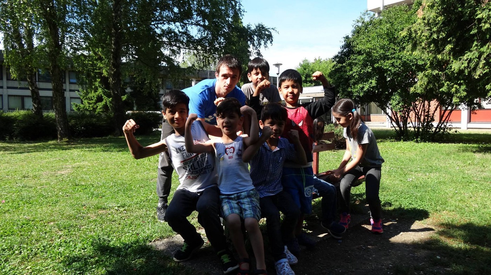
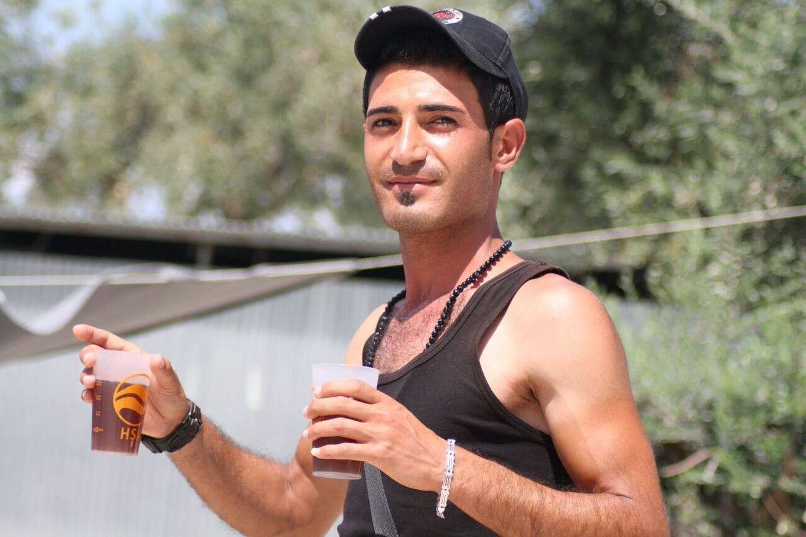
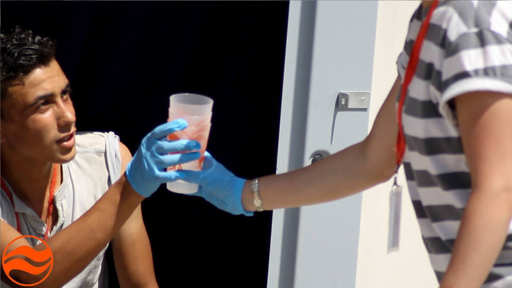
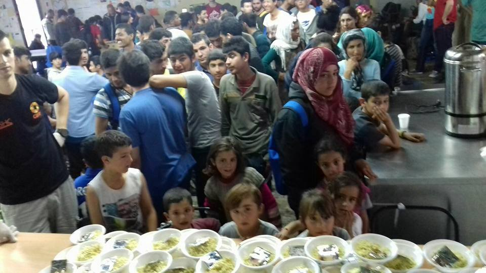

### AYS DAILY DIGEST — Another big refugee wave in the Balkans region
#### While the so\-called Balkan Route remains officially closed, more people are finding their way across the Balkans\. More people are in Bulgaria as well as Serbia\. In Belgrade, volunteers are asking for help while exhausted and dehydrated people are arriving in significant numbers\. At the same time, Austria’s right wing politician suggests that the EUshould keep refugees offshore rather than allow them on to the continent\. Meanwhile, no signs of peace in Syria\.

Youngest members of Porin sports group, coached by Marko Deša of AYS
#### Feature Story
### Ramazan Mubarek/رمضان كريم/Ramadan Kareem

> Tonight, when the moon appeared in the sky, the month of Ramadan began for all Muslims\. The first Sehr \(meal with which the fasting begins\), and the first day of fasting, is on Monday, the 6th of June\. Too many people will spend this Ramadan far away from their homes, sleeping in tents, in inhuman conditions, far away from their families and friends\. Volunteers and NGOs, intergovernmental organizations alongside many others, are joining to provide food and spend time, or share a meal, with those who are fasting\. 

> For people in Istanbul, local municipalities will organize mass public Iftars, evening meals, consisting of soup, stew, pudding, and juice\. All over Greece, in different camps, food will be provided\. Greek NGO Praksis will start serving food as early as 3:00 am in camps where they are present\. They will serve Iftars, too\. 

> Medical teams in the field will have night shifts while Médecins Sans Frontieres has issued guidelines to its staff regarding the appropriate behavior to adopt during the Ramadan\. 

> In Germany, refugee accommodation centers are planning to work long evenings to cater all those who are fasting\. “We will open our canteens especially between 9:30 and 10:30 pm, cook the midday meal all over again and put together food packs to eat before dawn,” Ole Heldberg, a 28\-year\-old chef, working at the Neumuenster reception center in the north\-western state of Schleswig\-Holstein told German media\. “Virtually all of our 490 refugee accommodation centers in Germany, housing some 140,000 refugees are making arrangements of some kind for Ramadan,” German Red Cross spokesman Dieter Schuetz says in Berlin\. The center is also making communal rooms available for people to break their fast at sundown in groups of family and friends as they would in their home countries\. 

> Last year, UNHCR provided meals for all those who fasted at many places where their teams were present, and we hope they will continue doing so this year\. Also last year, the United Nation’s World Food Program launched an online non\-profit initiative [ShareTheMea](https://twitter.com/ShareTheMealorg) l\. This year, an updated version of the app is available which includes Arabic\. The organization’s goal this year is to support the 1,400 refugee children between the ages of three and four in Beirut\. If you’re a smartphone user, all you have to do is download the app \( [iOS](https://itunes.apple.com/en/app/sharethemeal/id977130010?mt=8) or [Android](https://play.google.com/store/apps/details?id=org.sharethemeal.app&hl=en) \) and donate something as little as $0\.50 to help provide food\. 

> The month of Ramadan has 29 days and ends with the holiday Eid el Fitr\. Muslims around the world will fast every day during Ramadan, from sunrise to sunset\. Fasting means abstaining from food and drink\. It is a time of self\-examination and increased religious devotion, as well as a time of getting together with friends and family to share a meal\. During Ramadan, Muslims are urged to devote to prayers, recite the Quran, help the poor, and refrain from misbehavior\. 

> The [Hamariweb\.com](http://hamariweb.com/islam/balkan_ramadan-timing16502.aspx) provides the complete monthly schedule of Sehrs and Iftars, according to cities, for all those who are spending this month far away from their homes and families\. The schedule is set for a different file as Hanafi \(Sunni\) and fiqa Jafria \(Shia\) \. 

> The refugees owning a smartphone can download a free prayer times [application called Al\-Moazin](https://play.google.com/store/apps/details?id=com.parfield.prayers.lite&hl=en) \. 

#### Syria
### New casualties in Aleppo

> Horrific news from Syria\. According to activists from the [Syrian Observatory for Human Rights](http://www.syriahr.com/en/) , at least 53 people, including children, have been killed in government air strikes in Syria’s Aleppo city, [Al Jazeera English reports](http://www.aljazeera.com/news/2016/06/air-strikes-kill-dozens-syria-aleppo-160605111131963.html) \. Rebels also hit government\-held parts of Aleppo leaving injured and several casualties\. The Observatory also said that since May 31st, at least 74 people were killed in air strikes\. 

#### Turkey
### The end of the EU\-Turkey deal?

> German media, quoting Turkish pro\-government media, are reporting that the deal between Turkey and the EU is suspended\. The Turkish government threatened several times now that this would happen if the EU did not grant visa\-free travel for its citizens, as it is set in the deal\. The news about official suspension came from the “government close sources” of the newspaper Aksam and news agency AB Haber\. 

> Representatives of the Turkish government threatened that all relations with the EU, including the customs union deals and the migrant readmission agreements, could also be suspended\. 

> The EU signed an agreement with Turkey in March to stem the flow of refugees and asylum\-seekers to Europe\. According to this deal, Turkey should take back all the asylum seekers and refugees who have crossed the Aegean Sea to reach Greece\. In return, Ankara was promised financial aid, the lifting of the visa regime and progress in its EU membership negotiations\. Turkey set the end of June as a deadline for the 28\-member bloc to scrap visas\. The EU officials claimed that it is nearly impossible to meet the deadline from the very beginning\. At the same time, Turkish government claims they met the EU’s criteria for visa\-free travel\. 

> Human rights activists, among others, claims the Turkey — EU deal is unacceptable and contrary to the international law\. 

#### Greece
### Open assembly and free education at City Plaza in Athens

> According to the official sources, 52,002 refugees are present in Greece today\. Many of them are living in degrading conditions, lacking basic needs\. Volunteers are present at almost all camps doing their best to help\. 

> Group [Skillshare Athens](https://www.facebook.com/skillshareathens/?fref=nf) announced leadership opportunities in City Plaza, Athens where this organization is currently delivering language lessons\. Their next step is to deliver a workshop program\. They are looking to begin this over the next few weeks — led by, and for, the residents\. 

> “We’re welcoming any volunteers who would be up for helping out\. Our thoughts are that as a volunteer, you would see the workshop through from conception to delivery, supporting the workshop leader through activities such as gathering interest in the workshop, sourcing materials, and managing logistical delivery on the day\. Even if you are in Athens just for a week or two, this will give you the opportunity to see a project though from start to end, and to meet the amazing people that make the City Plaza what it is\.” 

> Visit their FB for more info\. You can also learn more about [open assemblies that are taking place in the City Plaza](https://www.facebook.com/sol2refugeesen/) \. 

### Reusable cups and tea for all at Kara Tepe

Photo by HSA

> [Humanitarian Support Agency](http://humanitarian-support-agency.org) \(HSA\), an international non\-governmental, non\-profit and non\-affiliated organization, primarily serving at Kara Tepe in Lesvos, initiated a beautiful action providing all residents of the camp with a durable 10\-year reusable recycled plastic cup\. HSA Tea hut is a central meeting point at Kara Tepe camp and extremely popular but can result in a lot of waste\. 

> “We are dedicated to reducing our environmental impact and this latest investment will save over 100,000 disposable cups per month\. HSA provides an average of 100,000 cups of tea every month to Kara Tepe camp residents\. We will distribute 24/7 during the Ramadan and increase our monthly provision up to 200,000 cups\.” 

### New strikes in Greece

> For all of you traveling to and through Greece, be alert of workers strikes\. 

> Starting on Monday morning, staff on the Athens fixed rail transport networks — metro, electric railway, and tram lines — will begin a series of warning work stoppages over the next two weeks, protesting over the decision to give public transport companies to the new privatization fund and delays in the signature of a collective agreement\. 

> Urban Rail Transport \(STASY\) staff have announced work stoppages on the following days and times: 

> _Monday, June 6 from the start of the shift until 10:00_ 

> _Wednesday, June 8 from 12:00 to 16:00_ 

> _Friday, June 10 from 22:00 to the end of the shift_ 

> _Monday, June 13 from the start of the shift until 10:00_ 

> _Wednesday, June 15 from 21:00 until the end of the shift_ 

> _Friday, June 17 from 12:00 to 17:00_ 

### Pre\-registration delay

> The process of pre\-registration did not start even though it was scheduled for the end of may\. According to the plan, it should end by the end of June\. There are no detailed info about delay of the process\. The plan is that teams from the Asylum Service visit sites where refugees and migrants live on the Greek mainland\. The purpose of pre\-registration is to give all the refugees an opportunity to ask for asylum\. Depending on the individual case, it is also possible to ask to be transferred to another European country or join a family member in another European country\. Pre\-registration is only the first step for those wanting to apply for asylum in Greece, ask for family reunification or for relocation to another European country\. The next steps are another appointment at the Asylum Service office, followed by a longer and more detailed interview\. [Find details about the process on UNHCR site](http://data.unhcr.org/mediterranean/download.php?id=1429) \. 

#### Weather Report

East Aegean weather reports for potential passengers and volunteers\. A collaboration between [@SAO and United Rescue Aid](https://sao.ngo/weather) \.
#### Bulgaria
### Up to 5,000 refugees tried to enter Bulgaria this year

> According togovernment data, the number of refugees detained while trying to cross into Bulgaria increased by one\-fifth in May\. Statistics released by the Interior Ministry show a surge in numbers of people detained on the border between Bulgaria and Turkey, inside the country, or on the frontier between Bulgaria and Serbia\. In May, police arrested 169 people as they were entering the country, only 34 of them on the border with Greece\. At the same time, it is estimated, up to 5000 tried to cross in the first 5 months of this year, most of them claiming to be from Iraq or Afghanistan, followed by those from Syria\. 

#### Serbia
### Help needed in Miksaliste

Photo by Misaliste, Belgrade

> Another alarming message from Belgrade and Refugee Aid Miksaliste where more and more people are coming\. Today, over 600 people, mostly Syrians, arrived, all of them exhausted and hungry after the long journey\. A couple of people were taken to a hospital because they were dehydrated\. Among those who arrived today were a huge number of children\. Volunteers in Miksaliste are calling upon all those who can help to join them in Belgrade\. Clothes for women and men are needed, but also children of all ages and other supplies; shoes, underwear, socks, backpacks, instant coffee, milk, tea, sugar\. 

#### Croatia
### Sport groups organized in Porin

> AYS is expanding our activities in Porin hotel in Zagreb, where refugees are staying\. Apart from emergencies such as taking them to a dentist and/or doctor, we organise picnics, going to concerts \(both pop and classical music\), art galleries, theatre plays etc\. Inside Porin, we have set up a community garden \(first tomatoes are already growing\! \), and we are preparing various educational and recreational activities\. Yesterday we had a volleyball tournament between AYS volunteers and the refugees, which was super fun\! 

AYS vs Porin wolleyball tournament

> Regular sports groups have started today, ran by Marko Deša of AYS, ex Kick\-boxing world champion and a professional sports coach\. Kids are divided in two mixed groups based on their age \(5–10yr, 10–17yr\), with no segregation based on gender, ethnicity or religion\. Grown\-ups will start going to a nearby gym with support of our trainer Dino\. Tennis and football practices will also start soon\. 

> We hope this will be the first step in the long process of integration\. 

#### Austria
### Austrian proposal to keep refugees away

> Austria’s foreign minister has suggested that the EU’s refugees be interned offshore rather than allowed on to the continent\. Minister Sebastian Kurz, speaking for daily Die Presse, stated that the EU should consider Australia’s model, which is to turn back or send people to internment camps in the Pacific Ocean countries of Nauru and Papua New Guinea all the people trying to enter the country by boat\. At the camps, people are being held indefinitely while their cases are processed\. This system has been criticized by human rights groups\. Austria allowed some 90,000 asylum seekers in last year\. However, they hardened asylum conditions this year\. 

#### General

Ai Weiwei in the Museum of Cyclaid Art

> Ai Weiwei’s exhibition is showing from now until October 30 in [the Museum of Cycladic Art](http://www.cycladic.gr) \. It is his first major exhibition in Greece, and it includes a new work created especially for this museum\. Among the works on display are Ai’s “Divina Proportione” \(2012\), “Mask” \(2011\), “Cao” \(2014\) and “Grapes” \(2011\) \. The museum will be donating 10 percent of all exhibition proceeds to Doctors Without Borders and METAdrasi, two NGOs that are currently assisting refugees in Greece\. 

#### AYS
### Help AYS\!

> A wonderful person has started a fundraiser on our behalf to keep us going\. We thank him very much and for those of you who could help us, please do so\. We would be very thankful for any and all donations\! You can make a donation at the following address: [https://www\.gofundme\.com/27c89r7c](https://www.gofundme.com/27c89r7c) 

_Converted [Medium Post](https://areyousyrious.medium.com/ays-daily-digest-another-big-refugee-wave-in-the-balkans-region-cad07639006c) by [ZMediumToMarkdown](https://github.com/ZhgChgLi/ZMediumToMarkdown)._
