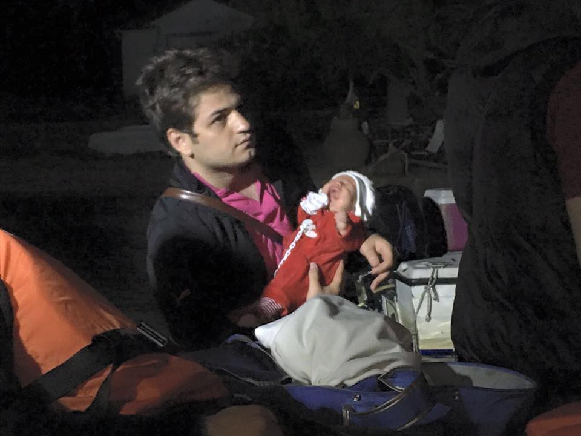
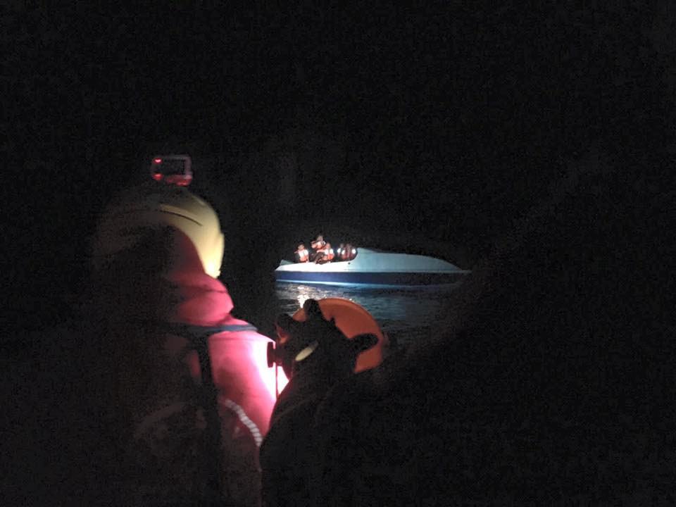
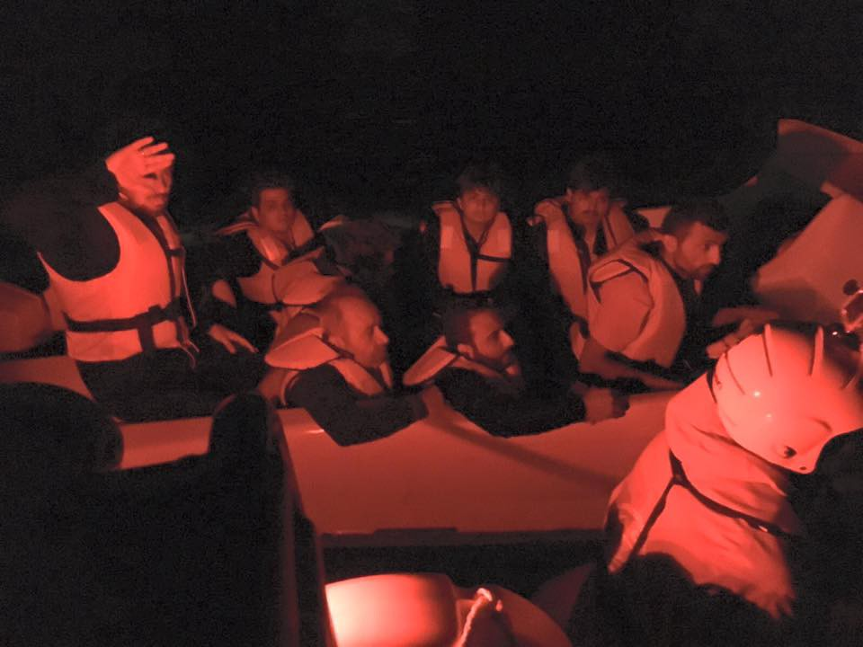
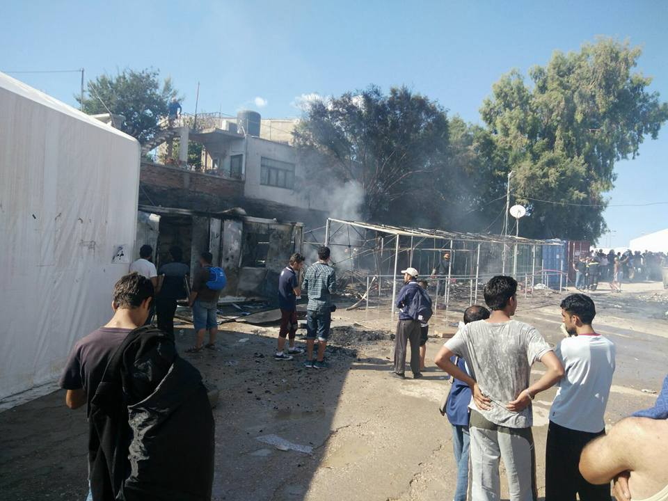
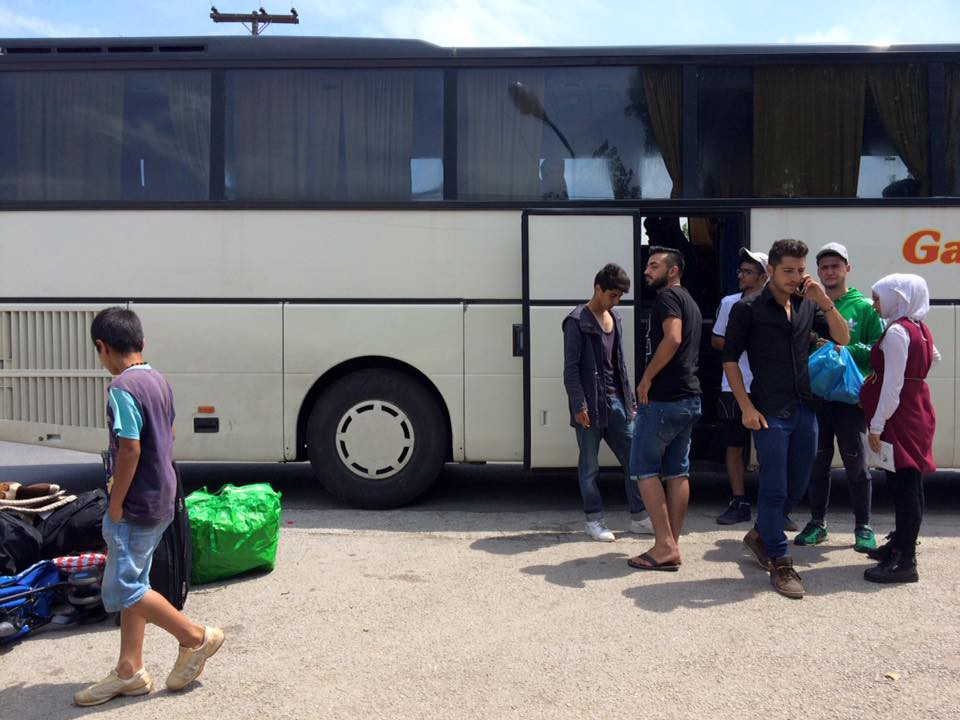
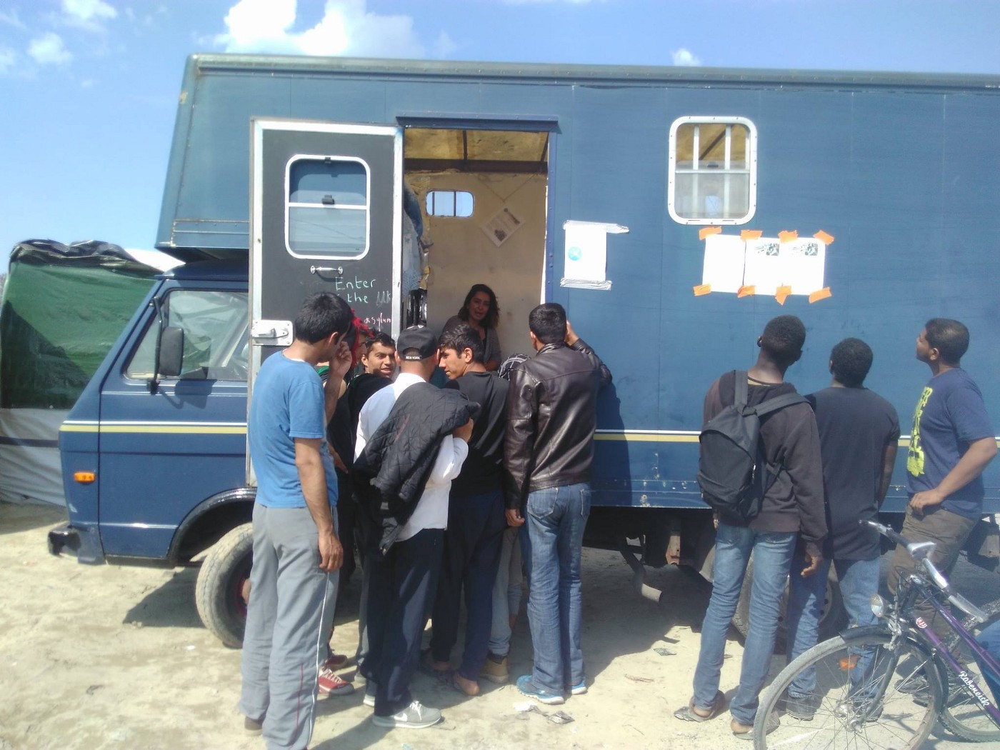
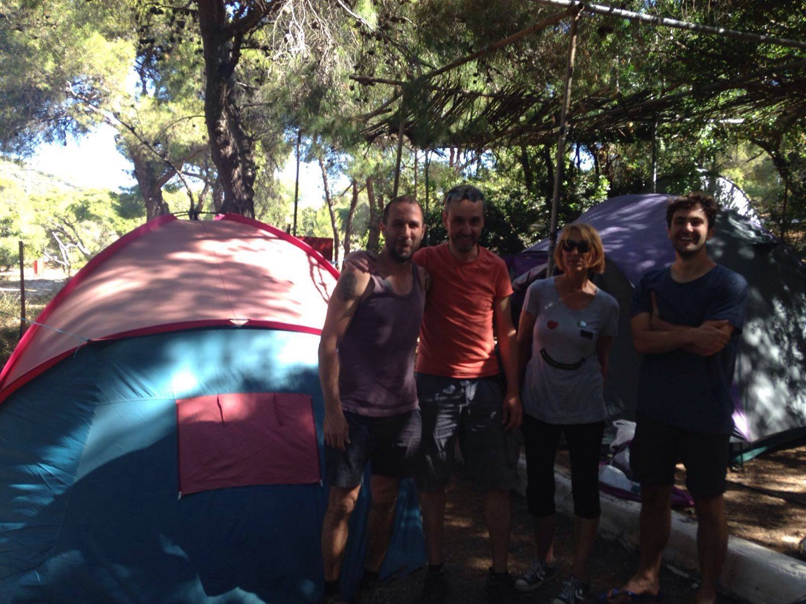
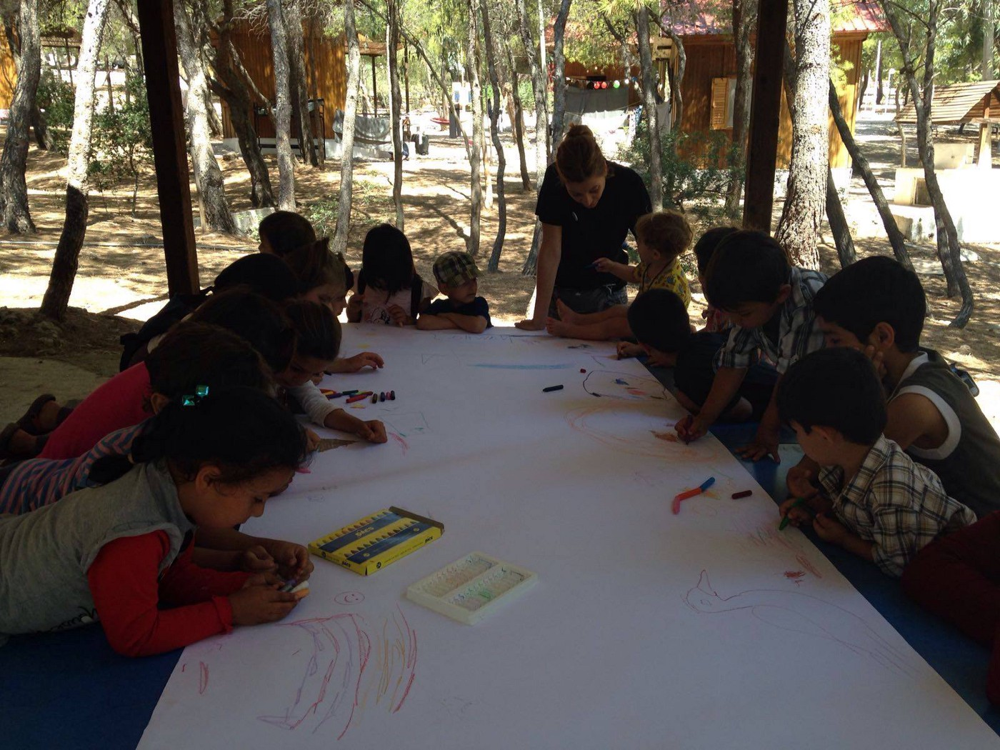
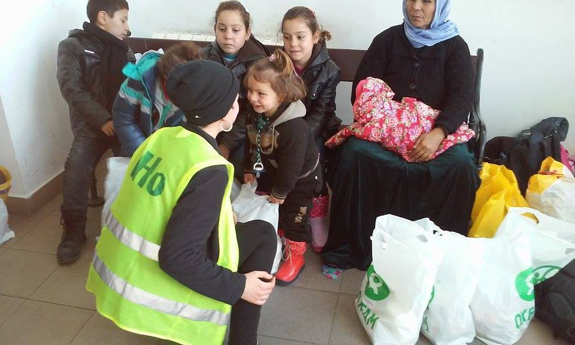

### AYS DAILY DIGEST — Refugees afraid for their security in camps
#### Increase number of incidents are reported in camps around Greece\. Refugees are asking protection and safety\. Today’s riots in Souda camp are just one of the examples\. Relocation from Hara soon to began\. Volunteers are needed in Subotica, again\. As war in Syria, Sudan and Iraq, again, is raging, more refugees are running away from their homes looking for peace\. The children drown in Euphrates River while trying to escape war\.

Photo by Proactiva
#### Weather Forecast for Tuesday 7 June and Wednesday 8 June
#### MID\-MEDITERRANEAN — LIBYA TO ITALY SEA ROUTE
WAVE WARNING\! Waves: Swells up to 1\.1\+ meters on Mid\-Mediterranean route\. Waves moving generally Westward both days\. Leaving Tripoli area, waves will be on your right\. Winds: Variable, between 5 and 15 kph, gusts up to 25 kph, blowing Westward both days\.
SEA SAFETY: Waves over 0\.5 meters are considered dangerous///LESVOS & ISLANDS: Lesvos & nearby Turkish coast, mostly sunny Tuesday through Wednesday, temperatures from 18C / 27C\. WAVES: RISING FROM 0\.1\+ TO 0\.9\+ METERS TUESDAY INTO WEDNESDAY\. Waves: Moving mostly Southward\. Leaving from Turkish coast of Canakkale to Lesvos, waves at your back both days\. Leaving from the west coast of Turkey to the Greek islands, waves at your right both days\. Winds: Increasing from 6 kph overnight Tuesday to 41 Wednesday evening, gusts up to 60 kph, blowing mostly Southward both days\.
Further north in the Balkans, Tuesday through Wednesday, mostly sunny, a few showers in Serbia and Croatia\. Low 11C Šentilj, Slovenia, high 26C FYROM\-Serbia border\.

Weather forecast in a collaboration between [@SAO](http://twitter.com/SAO) and [United Rescue Aid](https://sao.ngo/weather) \.
#### Iraq
### Dangerous road from Fallujah

At least three children and an elderly man drowned in the Euphrates River over the weekend as they attempted to flee the Iraqi city of Fallujah\. At least 200 people have successfully crossed the river using inflatable rings or makeshifts rafts made up of refrigerators and tires, [the International Rescue Committee reports](http://www.rescue.org/press-releases/children-drown-hundreds-fleeing-fallujah-risk-lives-crossing-euphrates-river-31159) \.

The IRC’s Iraq Country Director, Aleksander Milutinović, said:

> “The world has become used to seeing refugees risking everything by crossing the open sea and are now seeing reminiscent scenes at the Euphrates River\. From dawn to dusk, desperate Iraqis are risking their lives by crossing the river by any means necessary\. The Iraqi authorities urgently need to provide safe passage for all those fleeing Fallujah to ensure their lives aren’t further placed at risk\.” 

50,000 civilians are still thought to be trapped inside the city of Fallujah\.
#### Greece
### 17 new arrivals to Lesvos

According to the official sources, no new arrivals were registered in Greece over the last 24 hours\. However, volunteers from the Spanish group [Proactiva Open Arms](https://www.facebook.com/proactivaservice/) , are reporting about a boat with 17 people, including 3 children, one of them only month and a week old, arriving at Lesvos last night\. All are from Syria\.

Photo by Proactiva

Government sources identified 52,578 refugees and migrants on the Greek territory on Monday\. According to the Refugee Crisis Management Coordination Body’s figures, 27,002 of the refugees are in northern Greece, 14,568 are hosted in the region of Attica, 8,430 on the Greek islands and 2,578 are hosted in different areas in central and southern Greece\. Refugees and migrants in central Greece reached 2,295 on Monday, while those located in southern Greece came to 283\.

The Greek government announced today that changes have been made to the type of food distributed in refugee centers due to Ramadan\. The timing of food distribution is also adjusted, the migration ministry announced\. At the same time, the Education and Religious Affairs Ministry has announced that the capital’s Peace and Friendship Stadium \(SEF\) in Neo Faliro and the Olympic Stadium \(OAKA\) in Maroussi will be made available for Muslims wishing to celebrate the end of Ramadan at the beginning of next month\. Groups wishing to use the facilities should forward applications in writing to the board of SEF or OAKA by June 17\. Muslims in other areas of Greece are advised to contact local authorities to find out about prayer areas\.
### Riots and fire in Souda camp

Today in Souda camp on Chios, a group of inhabitants set the fire causing damage to several offices and some tents\. Allegedly, this was their way to demand relocation to Athens\. However, this way of protesting is damaging for all residents who are already in a very harsh situation\. Firefighters and riot police were called\. One firefighter was injured\.

Photo by volunteers in Chios

Due to the fire, probably about 400 people now have no shade or shelter\. EASO were about to start admissibility interviews in Souda this week, but now they have no offices to do that and the asylum procedures, which are required before the Greek authorities can allow the refugees to continue to Athens for the next stage of the asylum procedures, will probably now be delayed\.

Several similar protest occurred over the last couple of week in different camps in Greece\. AYS reported about fires in a hot spot of Moria, Lesvos, and fire at hot sport on Samos\. In Moria, several people were badly injured while hundreds were left without temporary shelter\.
### Moria — security concerns

Frequent incidents of violence are reported at Moria camp, according to the News That Moves\. Refugees are claiming that local authorities are not doing enough to protect them\. Refugees told [News That Moves](https://newsthatmoves.org/en/refugees-in-lesvos-camp-authorities-arent-protecting-us/) that is was the lack of an adequate police presence, the availability of alcohol and the failure of Greek authorities to separate single men from families that had created a dangerous environment at Moria\.

An Afghan man, who identified himself as a leader of the Afghan community at Moria, said it was usually intoxicated single men who caused problems at the site\. “The fight last week broke out when an Afghan and a Pakistani were separating two Nepalis fighting each other, for some reason that is not known yet,” he said\. “But most of the fights are caused by drunk single men\.” Police already admitted there is no enough officer in Moria\.

The Afghan community leader explained that Afghans at Moria had taken security into their own hands by taking turns to act as guards at the entrance to their compound\. “We have two men from us guarding the Afghan family compound 24/7,” he said\. “They change shifts every two hours\. We don’t allow any strangers to enter\. This way we are protecting our families and ourselves\.”
### Relocation from Hara to began soon

According to the [Northern Lights Aid](https://www.facebook.com/Northernlightsaid/?fref=nf) team, this morning busses arrived at Hara camp to transport residents to government\-run camps\. People were invited embark buses voluntarily\. Police announced more buses will come in the following days, and a mandatory eviction is likely\. The situation in Hara remained calm and peaceful today\. We will follow developments\.

Photo by Northern Light Aid
### Pre\-registration to start at mainland

Pre\-registration process is soon to start, according to the official announcement from the Greek Asylum Service\. Their teams will soon visit the sites on the Greek mainland where refugees and migrants currently live\. Asylum Service teams will carry out pre\-registration for those people willing to ask for asylum in Greece, to ask for family reunification or find out about relocation to another EU Member State\.

Everyone is eligible for relocation\. Pre\-registration is necessary in order to access any of these legal options\. For more info, [visit Asylum Service website](http://asylo.gov.gr/en/?page_id=1278) \.
### Information for volunteers

Filippiada Volunteers Info Point / Dråpen I have\- Drop in the Ocean / Pikpa Lesvos / Northern Lights Aid / Project Hope 4 Kids / Nurture Project International / Hope Center / RefuAid and many others are looking for Volunteers to work all over Greece\. For detailed info and contacts, please check in our brand new platform [http://www\.greecevol\.info/](http://www.greecevol.info/) Besides volunteer opportunities you will be able to make your own calls for donations and people and check maps, working tips, news, info for refugees and an endless breathtaking list of useful contacts both for volunteers and coordinators\. Considering it is the trial phase of this project, your feedback is gold for those working on a platform\.
### Refugee Info Bus

Photo by Refugee Info Bus

Today, the [Refugee Info Bus](https://www.facebook.com/RefugeeInfoBus/) was introduced in Calais, a mobile tech hub that is providing free internet for refugees, free multilingual legal information, refugee rights workshops and facilitating refugee led journalism\.

The team that builds the Bus, have renovated an old horse box into a smart, functional space with reliable electricity from an onboard battery bank, powered by solar panels\. Several times a week the team run asylum information workshops on the bus as well as other social places in the camp\.

Help Refugees are proud to partner with the Refugee Info Bus in their essential mobile service providing vital information\.
### Open Cultural Center at Lavrion

The group [Idomeni Cultural Center moved their activities to Lavrion](https://www.facebook.com/permalink.php?story_fbid=1341322595896155&id=1302471973114551) refugee camp in Greece and changed their name to Open Cultural Center\. They are planning activities in other camps too\. For more, visit their website\.

Photo by OCC team
### Strike in state hospitals announced

Another workers strike in Greece\. This time, doctors and nurses at state hospitals, as well as ambulance workers, announced they will walk off the job on Wednesday to protest spending cuts and staff shortages in the health sector\. The union said a demonstration will take place outside the Health Ministry at 11 a\.m\. on Wednesday\.

Hope center in Eftalou on the island of Lesvos\. A formerly abandoned hotel rented by volunteers and transformed into a refugee shelter\. Pictures by Dimitris Pothas here:
#### Serbia
### Serbia is a transit point for refugees

Although over one million people are estimated to have passed through Serbia during the past two years, only 34 expressed a desire to remain during 2015\. Fewer than half that number have sought refugee status so far during 2016, [Balkan Insight reports](http://www.balkaninsight.com/en/article/few-refugees-seek-asylum-in-serbia-05-29-2016#sthash.3FT2oW1S.KuAitzzw.dpuf) \. “It is hard for refugees to stop in Serbia, at the gate of the EU\. They ask themselves why to stay in Serbia when the economic situation here is so bad,” says Radoš Đurović, director of Belgrade\-based NGO Asylum Protection Centre\.

Đurović says refugees get little or no help from the state regarding immigration\. But he is convinced that even if there were more help, refugees would not stay in Serbia\.
### Call for volunteers in Subotica

Photo by IHo

Organization [_I am human_](https://www.facebook.com/imhumanIHO/?fref=nf) invites volunteers to come to Subotica to help them out as there are many people in need on the Hungarian\-Serbian border\. IHo is looking for volunteers to join them in Subotica, starting from June 18th\. Please contact them via [info@iHo\.org\.uk](mailto:info@iHo.org.uk) \.
#### General
### Refugees are continue to flee from southern Sudan

After five years of war in southern Sudan, thousands of refugees are continuing to flee, placing further pressure on already strained resources in neighboring South Sudan, the [UN Refugee Agency said](http://www.unhcr.org/news/latest/2016/6/575176254/five-years-south-sudan-conflict-refugees-still-flee.html#_ga=1.105980800.2083943860.1463497055) \. So far in 2016, more than 7,500 refugees from the region have arrived in Yida in South Sudan’s northern Unity area\. In May alone, nearly 3,000 people reached the area, which is already home to some 70,000 refugees\. With the conflict in Sudan intensifying, thousands more are expected in the coming weeks\. The refugees are mainly from Heiban, Um Doreein and Al Boram counties, in South Kordofan’s Nuba Mountains\. They spoke of escalating violence, including ground attacks and aerial bombardments there\.

> “The recent arrivals also cite lack of food and no access to schools for children as reasons for leaving, especially in and around Um Doreein\. Most people are arriving by the truck while others come on foot or by bicycle, traveling up to seven days,” UNHCR spokesperson Adrian Edwards said\. 

_Converted [Medium Post](https://areyousyrious.medium.com/ays-daily-digest-refugees-afraid-for-their-security-in-camps-37a1c6a78c0d) by [ZMediumToMarkdown](https://github.com/ZhgChgLi/ZMediumToMarkdown)._
