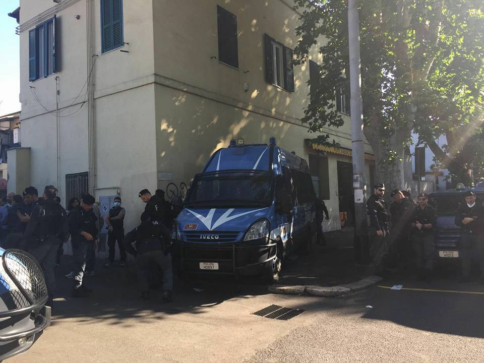
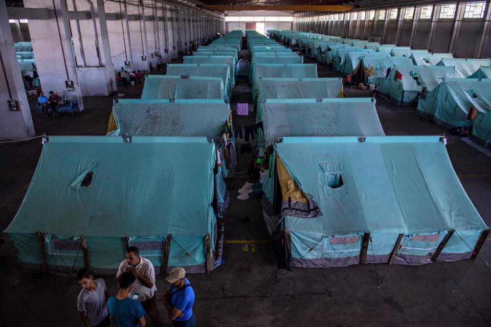

### AYS DAILY DIGEST
#### Data has confirmed that the numbers of refugees coming to Europe has increased\. EU to pay staggering 62 billion euros to countries in the Middle East and Africa for them to halt the migration\. European Court of Justice says EU rules prevent the imprisonment of refugees crossing into the Schengen area while new arrivals in Crete are being held in a closed off detention center\.There has been a fire in Souda camp in Chios, as well as dire condition and fear of more violence in Moria detention center in Lesbos\. Two Syrian refugees are in danger of being sent to Turkey from Greece via failed EU\-Turkey deal\. There have been no relocations of unaccompanied minors in almost two months\. New arrivals in Sicily\. Roma have self\-organized a center for migrants, Baobab is being evicted\. Fires in the refugee accommodation in Sardinia and in a camp in Dusseldorf\.

Eviction of self\-organized center for migrants in Rome\. Photo Credit: Baobab Experience
#### GENERAL
### **An increased number of refugees are crossing via Bulgaria or arriving in Crete\.**

Figures are showing that after two months of the hazardous EU\-Turkey deal implementation and its subsequent failure, there is an increase in refugee flow towards Europe via Bulgaria and via Crete\.
### **The EU is trying to halt migration by bribing the world into compliance\.**

In an effort to halt the unstoppable, EU is trying to broker deals based on the failed EU/Turkey deal with Lebanon, Tunisia, Nigeria, Senegal, Mali, Niger, Ethiopia, and Libya , and as Guardian reports they are also mulling over whether or not to make the same deal with Sudan, the president of which is wanted for war crimes\. To top it all off, the EU is looking for a partner in Eritrea, a country whose government is accused of crimes against humanity by the UN\. Commissioner Avramopoulos says that the EU plans to secure up to €62bn of funding to convince these states to hold back the migration\. EC has reportedly threatened ‘uncooperative partners’ in the migration crisis with ‘positive and negative incentives’ if they do not work sufficiently with the EU in combating the flow of migrants trying to reach Europe\. Countries that do not let migrants cross their country and/or accept to take migrants back will be rewarded\.
#### SYRIA
### Russia pledges support to Assad in recapturing Aleppo\.

Russia informed the US yesterday that it will support Assad with air strikes to reconquer Aleppo and “stop the terrorists conquering areas” foreign minister Lavrov said\. For more on this follow the following link [http://bit\.ly/1Yc9XJn](http://bit.ly/1Yc9XJn) \.
#### GREECE

Where have the refugees gone after the eviction of Idomeni? Photo credit: Ignacio Marin\.
### **Refugees arriving in Crete are reportedly being stripped of their right to seek asylum\.**

According to reports which we have received, there are around 113 refugees from Syria, Iraq, Afghanistan, Iran, Pakistan, and Bangladesh \(including families and children\) who wanted to go to Italy from Turkey but have been caught in a Greece Island \(Crete\) from last several days\.

According to the information received from the island, they are “being kept in bad condition where there is no medical facilities and no good food\. They have been fingerprinted but not allowed to come to mainland and most probably not offered a chance to ask for asylum, but this cannot be confirmed since It is a closed camp\. The refugees are looking for help as they don’t know their legal status and what will happen to them\. It would be great if anyone could help in this regard or to spread the word to the concerned organizations\.” Meanwhile the European Court of Justice says EU rules prohibit the imprisonment of refugees crossing into Schengen area\.
### **No food, no sleep, no rest for refugees in Chios\.**

As time is passing in vain for all those that reach and are stuck in Greece, the situation is getting more horrid by the day\. Volunteers are reporting that the situation in the camps on Chios is “ungodly”\. There is not enough food, and the food that is there is being provided by small organizations and volunteers\. The system is unsustainable\.
### **Fire in Souda camp\. Golden Dawn waiting for those trying to escape the camp\.**

To top it off there was a fire in Souda camp today which burned some tents and NGO containers\. There are no reports of casualties, but as people tried to leave the camp, as reported by the volunteers present, a group of Golden Dawn supporters blocked the entrance and pushed people back\. People working around the camps are calling for help in donation and volunteer work\. They say that UNHCR is largely unresponsive to the dire circumstances at hand\.
### **Two Syrian refugees are in danger of being returned to Turkey under the provisions of the EU\-Turkey deal\.**

Amnesty International reports that two Syrian refugees are the first at risk of being forcibly returned to Turkey under the illegal EU\-Turkey deal, after their asylum applications were dismissed by the Greek authorities\. They are currently in police custody on the Greek island of Lesvos and at imminent risk of return to Turkey, where their safety and protection is not guaranteed\. For more, follow the link [http://bit\.ly/22Kph0l](http://bit.ly/22Kph0l) \.
### **Detention center in Lesvos — breeding ground for frustration and violence**

Médecins du Monde also reports from the Greek islands with an official statement saying that violent clashes in Moria camp in Lesvos, which we reported on last week, are probably going to repeat since the once camp and now a detention center is an unsafe place where refugees are isolated and their mental and physical health is threatened\. They also report that the system of registration which favors Syrians is going to bring on more clashes is a particular risk to vulnerable population in the camp\.
### **No new relocations for unaccompanied minors in almost two months\.**

As for the relocation of the most vulnerable — News That Moves reports that not one unaccompanied minor has been relocated since April 12\. There are unaccompanied minors from Syria, Iraq, Eritrea, Burundi, Central African Republic, Costa Rica, Saint Vincent and the Grenadines, Bahrain, Maldives, and British overseas countries and territories\. Note that the so\-called eligible nationalities for relocation are changing every three months, but currently these are the ones that are\. The EU Commission stated that the process of relocation of unaccompanied minors has to be more efficient, but as it seems no real solution is in sight\. According to UNHCR and Amnesty International observations, due to the time consuming procedures for the appointment of legal guardians in Greece and Italy, and due to the lack of effective information about their rights, unaccompanied children are often not effectively given priority for relocation\.
### **It’s Ramadan and refugees cannot celebrate like they’re supposed to\.**

The conditions on the mainland do not seem better and many reports say that situation in camps does not look good\. This is especially heightened by the fact that the month of Ramadan has started and there is no clean or running water in many places, let alone enough room for dignity and traditions\.
### **Desperate refugees trying to earn money by selling their bodies in Greek cities for little as 2 euros\.**

For the last couple of days there has been more talk about how refugees cope in the Greek cities and as it seems that some of them are forced into prostitution, both male and female by the fact that they can not work legally nor are there any jobs for them there, nor are they receiving sufficient funds to sustain themselves\.
#### ITALY

**390 new arrivals in Sicily\.**

Yesterday 6th June, at 21:30, a Spanish boat full of migrants landed in Porto Torres \(Sardinia\) \. The vessel carried 390 migrants from the Horn of Africa \(Ethiopia, Somalia, Sudan\): 60 children, 126 women, 198 men\. On the way to Sardinia, two migrants have been taken to Sicilian hospitals by helicopter\.
### **Attack by fire in Sardinia\.**

In more news from Italian islands — there has been an attack in Aglientu, a town on the island of Sardinia which hosted a grassroots committee of mayors and citizens asking for a better migration management\. Hotel Santa Maria’s hall has been set on fire by unknown assailants\. The building should have been used to host around 80 migrants\. Antonio Tirotto, leader of the aforementioned committee, has condemned the action and has remarked that the institutions do not feel intimidated by criminals\.
### **Eviction of Baobab center in Rome**

This morning, the tent camp in via Tiburtina \(Rome\), in front of via Cupa, has been evacuated\. It was previously the headquarters of receiving center Baobab, cleared last December\. This evacuation has been led, according to Roma’s police headquarters, “within a wider systemic project aiming to improve the conditions of public order, health and decency of the roman sites hosting migrants\. The Roman questura reports that also the receiving structures of Rome’s municipalities participated in this operation, along with the local and national health units, social mediators and professional translators, in order to provide a correct information about rights and duties of the Italian law\. The migrants involved are 70 among Egyptians, Ethiopians, Eritreans, Somalis and people from other African countries\. The tent camp, which turned in a meeting point for people landing in Sicily and heading to the north of Italy, hosted 170 to 240 migrants everyday, forced to live in borderline conditions, seven sleeping in one tent or in open\-air camp beds and without hygienic services\. On the other hand, collectives working with migrants there were calling for help today to halt this sudden move because they are concerned that the people are not being transferred to a safer place\. We will try and report more on this as we get it\.
#### SERBIA / HUNGARY
### **UNHCR is calling for an investigation into the death in the Tisa river as well as allegations that Hungarian policemen are pushing migrants to the river\.**

A week ago, as we have written here, a man died in the river Tisa on the Hungarian — Serbian border\. Now, as News That Moves reports, UNHCR is calling for an investigation into his death claiming that the man was allegedly “with a larger group of refugees and migrants, who have said that they were pushed back into the river\.” Moreover, UNHCR noted that since May its staff and partners, “have collected information of over 100 cases with disturbing allegations of excessive use of force as people try to cross the border\.” Meanwhile, the Hungarian police released a statement \(in Hungarian\) denying that police officers were throwing rocks at asylum seekers trying to cross the Tisza River on June 1\.
#### BULGARIA
### **Bulgaria needs migrants even if it doesn’t want them\.**

We have seen that Bulgaria is very unwelcoming to migrants to put it mildly, with their officials looking favorably on armed militias roaming the woods in an effort to hunt the refugees, but what we did not expect is that due to migration of their own towards central EU countries, Bulgaria will need to import workers to sustain its economy, a recent survey conducted by the Economic Research Institute with the Bulgarian Academy of Sciences shows\. For more information from this ironic twist of fate, follow [http://bit\.ly/1WDJS6w](http://bit.ly/1WDJS6w) \.
#### GERMANY

**20 injured in a fire in a camp in Dusseldorf\.**

Even though there is no shortage of rain during this European monsoon season, mysterious fires are appearing from Greek to Italian islands all the way to Germany\. It has been reported today that the refugee accommodation in Dusseldorf is also burning\. It’s a hall of the fair, used to house refugees\. According to media reports, 20 people were injured\. [http://bit\.ly/28iwXe8](http://bit.ly/28iwXe8) \.
#### UK
### **If in the UK — know your bible**

Refugees applying for asylum in the UK on the grounds of conversion to Christianity are being interrogated on “bible trivia” by immigration officials, according to MPs\. For more on this cynicism follow [http://bit\.ly/1Zvu6ss](http://bit.ly/1Zvu6ss) \.

Grand facades — Calais\. In the overcrowded Calais ‘Jungle’, waiting for news on filed asylum claims, many people are painting their shelters to brighten up the environment, advertise their businesses, and to affirm their determination to make it across to the UK\. Photo Credit: Doctors Without Borders\.

_Converted [Medium Post](https://areyousyrious.medium.com/ays-daily-digest-916d49c2e7c9) by [ZMediumToMarkdown](https://github.com/ZhgChgLi/ZMediumToMarkdown)._
