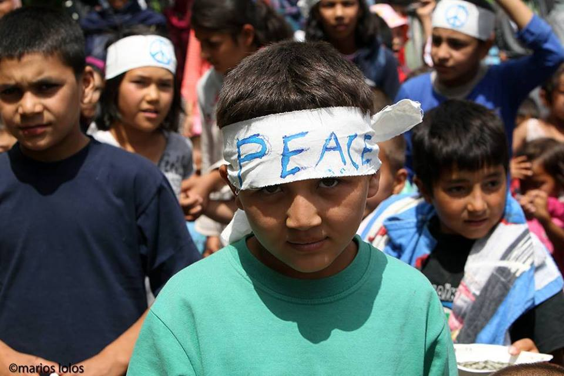

### AYS DAILY DIGEST — Poor Living Conditions in Greek Camps
#### Pre\-registration has started on the Greek mainland\. Desperate situation in Chios for unaccompanied minors\. Greek appeals committee rules in favor of 35 refugees, calls Turkey ‘unsafe’\. Asylum\-seekers in terrible situation outside Hungary’s transit zones\.

](assets/e08900bf0cd1/0*oaQSy1KOdY8nR3rR.)

Photo by [Marios Lolos](https://www.facebook.com/marios.lolos.1?fref=photo)
#### Syria
### Battle for Aleppo

The “Islamic State” retreats from villages in the Aleppo countryside as the Syrian Democratic Forces backed by the international community continue to advance\. The [BBC](http://www.bbc.com/news/world-middle-east-36479415) says that air strikes on rebel\-held areas of Aleppo hit three medical facilities within three hours\.
#### Lebanon
### Volunteers needed in Bekaa Valley

Salam LADC is expanding its social activities with Syrian refugees in the Bekaa Valley, especially its Play with Purpose project which has a strong educational emphasis\. The organization is looking for Arabic/English translators who are motivated to work on a regular and volunteer basis\. You can contact them at volunteeringlebanon@gmail\.com\.

Photo by Salam LADC
#### Turkey
### New refugee services map released in Izmir

The Association for Solidarity with Refugees \(Mülteci\-Der\) has released its [refugee services map](http://multeci.info) \. Its comprehensive database includes organizations which work with migrants, and indicates which types of services they offer\.

**173 refugees died or went missing on the Aegean Sea in 2016**

Turkey has intercepted 30,599 individuals on land or at sea so far this year, and 160,696 since 2007

Map by UNHCR including number of departure points and interceptions
#### EU

**10,000 refugees have drowned in the Mediterranean since 2014 according to the UNHCR**

Mainstream outlets are reporting on comments made by the European Commission Vice\-President Frans Timmermans, who says ‘the EU needs to work with third countries to end deaths in the Mediterranean and bring order to migration flows\.’ This comes after yesterday’s proposal to create partnerships with Jordan, Lebanon, Tunisia, Niger, Mali, Ethiopia, Senegal, Nigeria and Libya to stop migration\.
### NON\-EU Migrants will not face detention for crossing internal Schengen border

[The EU Observer](https://euobserver.com/tickers/133736) reports the European Court of Justice ruled on Tuesday that non\-EU migrants staying illegally in Europe should not face detention on the grounds they crossed an internal EU border, saying that moving within Schengen isn’t a criminal offence\. The ECJ added that migrants staying illegally should be returned to the country from which they came\. The ruling doesn’t affect the UK, Denmark, or Ireland\. [The Guardian](http://www.theguardian.com/law/2016/jun/07/france-wrong-imprison-ghanian-woman-enter-britain-illegaly-eu-court-rules) points out that this comes after a ruling that France was wrong to imprison a Ghanaian woman who had been arrested in France after coming from Belgium with a false passport\.
### List of asylum lawyers available

[News That Moves](https://newsthatmoves.org/en/useful-link-lawyers-available-in-european-countries/) reports on a list that includes phone numbers for lawyers and organizations offering legal aid to refugees\. It is meant for lawyers and legal counselors participating in the European Legal Network on Asylum but can be used by refugees in need of legal support\.
#### Greece
### Substandard living conditions in refugee camps around Thessaloniki

The Idomeni eviction had been presented by the Greek government as being a humanitarian move\. The Greek spokesman for the government’s refugee policy coordinating body Giorgos Kyritsis said that “removing all the refugees from the disgrace which is Idomeni is in their own interest”, adding “a thing like Idomeni cannot be maintained\. It only serves the interests of smugglers\.”

However, the reality in the new camps is not much better\. UNHCR and MSF have already denounced living conditions in these camps\. Moving Europe also visited six of these new places, denouncing the lack of sanitary facilities as well as the inadequate food supply — already, solidarity kitchens have started working in these ‘organized camps’, taking on roles that the state is not handling\.

None of the visited camps have adequate medical care and in case of medical emergencies, some refugees were left stranded at the hospital with no way of coming back except by taxi\. The camps are also isolated and far from supermarkets or social life\. None of the camps provided legal information and most of them did have reliable access to Wifi\. Reports on the individual camps are available on Moving Europe’s [website](http://moving-europe.org/category/balkan-reports/greece/) \. According to official government data, some camps are overcrowded, in particular Softex with 1,321 people despite its maximum capacity of 1,000\.

The living conditions will be even more difficult during Ramadan, as fasting will last much longer in Greece than in the Middle\-East \(due to Greece’s lengthier daylight period\) \. Living in tents under a withering heat will make fasting even harder\.

Children English class for beginners at the Eko station camp\. Photo by: Eko Projekt

These reports focus on the overall situation and it is often easy to forget that individual tragedies are taking place inside those camps\. This [text and its photos](https://www.facebook.com/clement.martz/posts/10209767726656120?hc_location=ufi) perfectly capture what it is like to be uprooted from your normal life and forced to live in a refugee camp\.

Photo by: Clément Martz
### Voluntary relocation from Hara and BP station already started

Buses were sent to Hara and BP station three days ago to start the process of “voluntary” relocation to official camps\. Around 200 people remain at Hara and another 100 at BP\. Yesterday people woke up with the noise of Caterpillar destroying and taking a lot of empty tents\. The “I’m Human Organization” reports that people keep trying to cross the borders, but are pushed back by the Macedonian police\. The eviction of both makeshift camps could start soon\.
### Pregnant women extremely vulnerable

A joint field assessment by the UNHCR, the United Nations Population Fund and the Women’s Refugee Commission says that refugee women often leave hospitals less than 24 hours after giving birth, some having had a Caesarean section\. The assessments show there is very little readily available sexual and reproductive health care\. MSF international president Joanna Liu stated that camps on the Greek islands have “virtually no safeguards” in place, adding that “women fear going to the toilet once darkness falls; mothers beg for milk formula to feed their babies\.”
### Pre\-registration of asylum seekers on the Greek mainland starts today

The government says pre\-registration starts today and offers the possibility to ask for asylum in Greece, family reunification, or relocation to another EU member state\. The process is open to people who entered Greece after January 1st 2015 and before March 20th 2016\. Following the pre\-registration, an international protection applicant’s card will be issued to each individual, which will provide a legal right to temporarily stay in the country, along with access to basic services\.
### Greek appeals committees ruled in favor of 35 refugees, calls Turkey ‘unsafe’

[Ekhaterimini](http://www.ekathimerini.com/209408/article/ekathimerini/news/rulings-back-35-migrants-appealing-deportation) reports that by Monday night, Greek appeals committees had ruled in favor of 35 refugees, ruling that Turkey is “an unsafe country\.” Further rulings in favor of refugees could undermine the EU\-Turkey deal, while arrivals from Turkey could increase as ties between the EU and Turkey are strained over the former’s refusal to reform terrorism laws and Germany’s recognition of the Armenian genocide\. This comes after yesterday’s reports showing that Greece is considering replacing members of an appeal committee that has been slow to deport refugees\.
### Asylum services to be improved in Chios and Samos

The spokesman for the government’s refugee policy coordinating body George Kyritsis says that the now underperforming asylum services on the Aegean islands of Chios and Samos will be reinforced until end of the June\.
### Desperate situation in Chios

Many unaccompanied minors in Chios have said they do not feel safe in the camp and have joined a gang led by a few adults for protection\. There are reports of scars on their arms from self\-cutting\. These unaccompanied minor asylum seekers have no effective legal guardianship\. Meanwhile, Golden Dawn supporters have been demonstrating against refugees outside the Chios city hall\.
### Relocation starts in Piraeus

As the tourist season starts, Greek authorities are trying to empty the Piraeus port\. 300 single men were relocated in a peaceful manner to Elefsina camp today\.

Photo by: Neca Dantas
### Protests over living conditions at the Hospitality Center in Malakasas

Photo by: Marios Lolos

Photo by: Marios Lolos
### Volunteers needed throughout Greece

Plenty of volunteers are still needed all over Greece\. Please check out [http://greecevol\.info/](http://greecevol.info/) for a list of volunteer and supply needs\.
#### Hungary
### Asylum\-seekers in terrible situation outside Hungary’s transit zones\.

[UNHCR expresses concern over Hungary’s restrictive approaches](http://www.unhcr.org/news/latest/2016/6/5756b4374/fearing-rejection-hungarys-cold-comfort-transit-zones.html) and the dire situation asylum\-seekers face outside the transit zones\. It says that only 15–17 people are admitted daily at each zone, leaving hundreds to suffer day and night without any proper support at the EU border and adds that this situation pushes refugees to seek the help of smugglers and travel even more difficult routes\. It says the field at Röszke has a single tap, no toilets, handouts of picnic food while refugees are “plucked, seemingly at random, for their interviews”\. Mental issues are increasing, exasperated by the long wait and separation from family members\.
#### Slovenia
### Slovenska filantropija collects bicycles for refugees

[Slovenska filantropija](http://www.filantropija.org/en/news/) continues to support refugees in Slovenia — they are now collecting adult and children bicycles and are looking for donations\.
#### Germany
### 500,000 Syrians to come to Germany through family reunification

500,000 Syrians currently live in Germany, and each refugee will bring one family member on average to Germany through family reunification according to the Federal Office for Migration and Refugees\. The Office adds that reunification is delayed by significant waiting times in German embassies in Turkey and Lebanon\.

_Converted [Medium Post](https://areyousyrious.medium.com/ays-daily-digest-poor-living-conditions-in-greek-camps-e08900bf0cd1) by [ZMediumToMarkdown](https://github.com/ZhgChgLi/ZMediumToMarkdown)._
