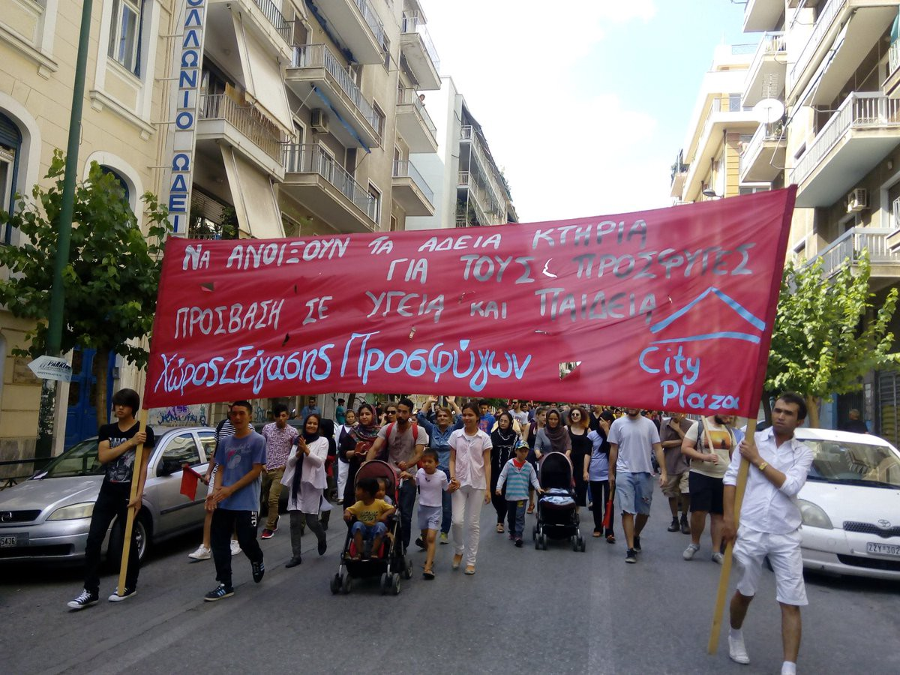
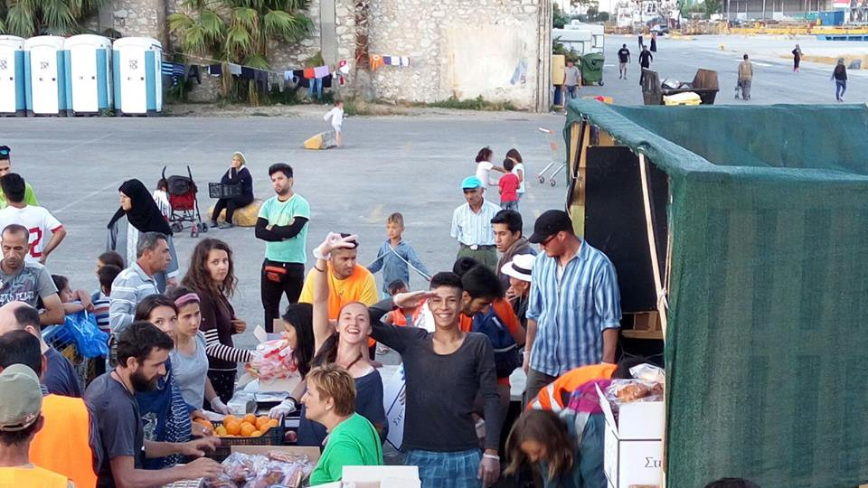
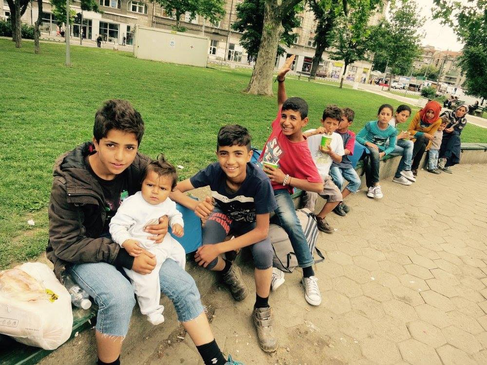
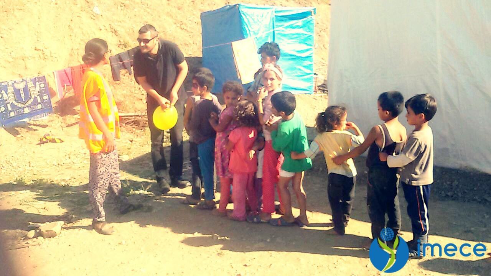

### AYS NEWS DIGEST — Hospitals in Syria remain dreadful
#### There was a close call yesterday when a regime airstrike hit the sidewalk outside of a children’s hospital\. Syrian doctors live in fear that they and their patients will be targeted\. A heart\-wrenching article in the New England Journal of Medicine discusses the difficult decisions which must be made when hospitals are undersupplied and understaffed\. Changes must be made\.
### Regime airstrike hit a street outside of a children’s hospital in Eastern Aleppo\.

The Syrian regime continues to tread the line when it comes to Syria’s hospitals\. [The Syria Campaign reported](https://www.facebook.com/TheSyriaCampaign/photos/a.608812989210718.1073741828.607756062649744/1065339010224778/?type=3&theater) yesterday that when the strike hit the street, the staff rushed to bring the infants downstairs so that they didn’t inhale the dangerous dust\. There were also fears that a second strike might hit the hospital, but thankfully this was not the case\. Although regime and Russian forces are the main offenders, rebel forces have also been known to target hospitals, making the work of doctors precarious regardless of their field of operation\. The children’s hospital is being closed down to make repairs, meaning that today in Eastern Aleppo there remain only 18 incubators for children born prematurely\.

The [New England Journal of Medicine also released](http://www.nejm.org/doi/full/10.1056/NEJMp1603673) a heartbreaking report on the workings of Syrian hospitals and the difficult decisions which must be made owing to intense shortages of supplies and the constant lingering fear of attacks\.

> _If we have two critically wounded patients and only enough blood to save one, we decide which one to save and which to watch die\. What do we say to the family whose child we let die, knowing that we could have saved that life?_ 

> _How do we answer the teenager who asks if he will walk again? He was paralyzed from the neck down\. Shrapnel from a barrel bomb had transected his spinal cord\._ 

> _How do we comfort a mother sitting in a crowded room next to her 12\-year\-old son, his left arm amputated, both legs with exposed muscle, and his abdomen open with a colostomy bag? He had been playing outside on a day he thought there wouldn’t be any bombs dropping\._ 

> _When a father whose 5\-year\-old son was shot in the head by a sniper asks, “Who would kill an innocent boy? Why didn’t he just shoot me instead?” how do we respond?_ 

Attacks on hospitals are a clear violation of international law, but it is unfortunately doubtful that anything will be done to address the situation\.
#### Iraq

**27 people were killed by ISIS suicide attacks on Shi’ite majority neighborhood in Baghdad and at a military checkpoint near the city\.**

[Deutsch Welle reported](http://www.dw.com/en/islamic-state-suicide-bombers-kill-dozens-in-and-around-baghdad/a-19318305) that 22 of the victims were civilians\. ISIS has claimed responsibility for the attacks, which have become a regular occurance as the Iraqi military is making significant gains and pushing back the group from their strongholds in Fallujah and Mosul\.
#### Turkey
### Refugees in Turkey can get advice on their legal rights via SMS\.

[News that Moves reported](https://newsthatmoves.org/en/legal-information-for-refugees-in-turkey-via-sms/) that the service has been in place since August 2015, but it is important to reiterate that such a system exists\. Refugees may send in their questions by texting \+90 534 972 52 94 or by visiting the website [http://nasihatkanun\.com](http://nasihatkanun.com/) \. Turkish lawyers are then consulted and an answer is sent to the person asking the question\. The service also sends out mass texts to subscribing people, giving them tips and recommendations\. Only 7,500 refugees have utilized the service thus far, but hopefully its usage will expand so that people can learn about their rights to help stop the intense exploitation that Syrian refugees often face in the country\.

A demonstration by City Plaza demanding adequate housing for refugees\. Photo Credit: Nasim Lomani
#### Greece
### Numbers

Today’s detailed numbers may be found [here](http://media.gov.gr/index.php/%CF%85%CF%80%CE%B7%CF%81%CE%B5%CF%83%CE%B9%CE%B5%CF%83/%CF%80%CF%81%CE%BF%CF%83%CF%86%CF%85%CE%B3%CE%B9%CE%BA%CF%8C-%CE%B6%CE%AE%CF%84%CE%B7%CE%BC%CE%B1/summary-statement-of-refugee-flows-9-6-2016) \. There are currently 8,286 people in the camps on the islands, with a total of 8 new arrivals as of 7:30AM\. 14,674 are currently in the Attica region, 26,501 in Northern Greece, 2,238 in Central Greece, and 283 in Southern Greece, bringing the total number of refugees in Greece to 58,367\.
### The mental health tolls on refugees are severe\.

Last year, the German Federal Chamber of Psychotherapists reported that as many as half of the refugees making their way into Germany suffer from PTSD and depression\. The conditions in the camps are not easing the refugees’ plight either\. [The Guardian tackles](http://www.theguardian.com/global-development/2016/jun/08/experts-sound-alarm-mental-health-toll-migrants-refugees-depression-anxiety-psychosis) the question in an article highlighting the difficulties of being a refugee, from the often perilous crossings to the difficult realities on the ground once they reach Greece\. Refugees from warzones understandably feel uneasy when helicopters fly overhead, for example, given the bombardment they faced in their home countries\. The trouble is compounded by the fact that there isn’t an effective system in place to provide those in need with counseling and therapy, and by the untackled stigmas of mental illness\. The impact is severe and will be felt for a long time to come\.
### Donations needed to help feed fasting refugees\.

Volunteers distributing food to refugees for Ramadan\. Photo Credit:Help Refugees

The group Help Refugees, in collaboration with a local restaurant called Rakadiko, are helping to feed approximately 1,500 refugees breaking their fast in the Piraeus region\. They are asking for donations to help keep the effort going\. One can donate at [www\.helprefugees\.org\.uk](http://www.helprefugees.org.uk/) \.
### Nurture Project International asks for donations and volunteers to provide support for mothers with young children\.

Call for midwives, breastfeeding supporters, IBCLCs, breastfeeding counselors, lactation consultants, infant nutritionists to provide mothers, infants and young child support in Greece\. Join our team of volunteers today\. We provide baby bathing, infant feeding support, complementary feeding and pregnancy and birth support in our mother and baby spaces\.

We are accepting applications from volunteers who have the qualifications mentioned above and who can come for at least one week or longer\.

Email Volunteer@NurtureProjectInternational\.org for more information and to register today\.

If you can’t volunteer but want to help in some way you can become a sponsor of our work\. We are entirely volunteer run and rely 100% on donations from people like you\. Become a sponsor at: [http://nurtureprojectinternational\.org/become\-a\-sponsor/](http://nurtureprojectinternational.org/become-a-sponsor/)
### Group releases report detailing conditions in refugee centers\.

The report, written in the aftermath of the evacuation of Idomeni, may be found [here](https://medium.com/@AreYouSyrious/ays-special-report-desperate-situation-in-camps-around-thessaloniki-7e49d989ac9e#.rrsu959qv) \. It details conditions on a camp\-by\-camp basis, some of them new ones set up in the aftermath of the evacuations, others old\. The report gives the following prognosis, although it is difficult to make a statement that applies equally to all camps\.

> _Overall we can say that inside the camps there are several needs, in particular: food, hygienic\-sanitary, clothes and basic necessities and information\. We are also interested in discovering how the legal assistance will proceed in regard to the international protection for the refugees\._ 

#### Bulgaria
### An increasing number of refugees are making their way into Bulgaria\.

[News That Moves reported](https://newsthatmoves.org/en/increase-in-irregular-migration-into-bulgaria/) on the statistics, which were released by the Ministry of the Interior\. According to the report, in the week of May 26 to June 2, 400 were apprehended by the police as they made crossings into the country\. May as a whole saw an increase in the number of crossings by 20 percent\.
#### Slovenia
### “Defencing Festival” to be hold on the Slovenian\-Croatian border\.

The festival is slated to take place from June 24 to June 26\. They have issued the following statement:

> _Dear friends, dreamers, rebels, composers of worlds, cosmopolitan diplomats from below, poets of life, autonomous astronauts, shamans of all sorts, breachers of stupid laws and animators of consensus, dear comrades from antiracist, antifascist, migrant, refugee, feminist groups, collectives, networks … all those that swarm and drill so that freedom of movement for everyone will prevail…_ 
 

> _From the territory where ideas of international solidarity and struggle for freedom and equality are mocked and places with dignified history are marginalized and conserved just to be sold off, from the border region where differences upon which we communicate, change and diversify are portrayed as spectre to be hunted with nationalisms, hate, militarization…_ 
 

> _From the territory on which the power of state and capital constructed razor blade fence against refugees and migrants all along rivers, forests and plains, the act that contributed to the closure of Balkan Route and to the criminal deal between EU and Turkey…_ 
 

> _From the territory that nevertheless resists and where the flames of resistance continue to paint the shadows on the slopes of nearby hills spelling “life can not be fenced”\._ 

Their Facebook page may be found [here](https://www.facebook.com/defencing/) \.
#### Serbia

Refugee children in a park in Belgrade\. Photo Credit: Info Park
#### Germany
### Statistics reveal that refugees’ rate of criminality equals that of Germans\.

[Die Zeit reported](http://www.zeit.de/gesellschaft/zeitgeschehen/2016-06/bundeskriminalamt-statistik-straftaten-asylbewerber) the story\. The report, which were released by the Federal Criminal Police Office, show that between January and March the crimes committed by refugees dropped by 18 percent\. It is the first nationwide report of its kind\. A total of 69,000 crimes have been committed by refugees in this period\. 50 percent of crimes were committed against people of the same nationality as the assailant, and half of the crimes happen in the initial accommodations for refugees\. The numbers of murders, manslaughters, and sexual assault cases are quite low\.
### Amnesty International has criticized German authorities over inadequate responses to hate crimes\.

[Deutsch Welle reported](http://www.dw.com/en/report-germany-fails-to-tackle-rise-in-hate-crimes-against-refugees/a-19319098) the story\. “With hate crimes on the rise in Germany, long\-standing and well\-documented shortcomings in the response of law enforcement agencies to racist violence must be addressed,” reported Marco Perolini, the organization’s EU researcher\. The report was issued in response to an increase in hate crimes committed against the refugees\. In 2014, out of 157 investigations launched in response to attacks against refugee accommodations, only 15 resulted in convictions\. 2015 saw 1,031 such crimes, a very sharp increase\. Racist attacks individuals have increased as well, from 693 reported crimes in 2013 to 1,295 in 2015\. Similar patterns are observed throughout the EU as xenophobia is on the rise\.
#### Austria
### Refugee centers in Austria are being attack\.

[The Local reported](http://www.thelocal.at/20160609/thirteen-attacks-on-refugee-centres-in-austria-in-three-months) that there were 13 attacks on refugee centers in the first three months of 2016\. In comparison, 2015 saw a total of 25 attacks, confirming that violence against refugees in the country is on the rise\. Statistics released by the Austrian Interior Ministry show that there have been 1,200 cases in 2014 and 1,690 cases in 2015 of right wing extremist cases\. This same period saw an increase from 750 to 1,150 extremist acts from extreme right wingers\. The situation is reaching a fever pitch in Austria as confirmed by the near election of the far\-right wing Freedom Party of Austria to the Austrian presidency\.
#### Hungary
### Hungary refuses to readmit thousands of refugees from Austria\.

Around 150 refugees arrive to Austria from Hungary each day, and Austria is trying its best to deport them, according to [The Local](http://www.thelocal.at/20160609/migrant-spat-brews-between-austria-and-hungary) \. Refugees cannot currently be deported owing to a court ruling which said that refugees cannot be sent back to Hungary given the inhumane conditions\. Hungary is known for its particularly harsh treatment of asylum seekers\. Austria admitted 90,000 asylum claims in 2015, the second largest number per capita in the EU\.
### Hungarian Helsinki Committee details life in the “Pre\-Transit Zone” on the Serbo\-Hungarian border\.

The report, which details life in Tompa and Röszke, may be found [here](http://www.helsinki.hu/wp-content/uploads/HHC_R%C3%B6szke_Tompa_pre_transit_zone_22April2016.pdf) \. The group visited the area on April 22\. What they discovered was shocking: police extorting refugees, and next to no government support for those waiting to cross\. In Tompa, refugees are not allowed to set up tents\. The UNHCR and MSF, as well as volunteer groups, try their best to meet refugees’ needs, but it is difficult\. Fights often break out because of food shortages\. These conditions are unacceptable and Hungarian government officials ought to be ashamed of themselves\.
#### Italy
### Man thought to be a key figure in the Mediterranean smuggling route extradited to Italy\.

[Newsweek reported that](http://www.newsweek.com/refugee-crisis-alleged-smuggling-chief-extradited-italy-467838) the man is named Mered Medhanie, but is also known by his nickname “The General”\. He was captured in Khartoum on May 24 and transported to Italy on June 7 to face charges\. He is believed to have made large profits by exploiting the plight of African refugees\. Medhanie maximized his profits by sending boats ill\-equipped for transportation which regularly sink, inflicting hundreds of casualties\. Medhanie and Ermias Ghermay, his accomplice, are believed to generate as much as 1 million dollars in profit for each boat of 600 people sent across the Mediterranean\. Medhanie is believed to be responsible for the smuggling of up to 8,000 refugees\. He is being charged with endangering the lives of refugees, inhumane treatment, and transnational smuggling\.
#### France
### Calais group asks for help to give refugees a mosque for Ramadan\.

As it is now Ramadan and refugees want to congregate as per tradition, the current enclosure is not big enough to accommodate them\. If anyone has a wedding marquee or a similar structure no longer in use, please contact [Calais — People to People Solidarity](https://www.facebook.com/groups/CalaisMigrantSolidarityActionFromUK/) \.
#### General

Imece volunteers help to keep refugee children in Turkey occupied\. Source: Imece
### Guardian article details what motivates volunteers\.

The article can be found [here](https://www.theguardian.com/world/2016/jun/09/whats-in-it-for-them-the-volunteers-saving-europes-refugees) \.

> _A few miles west, Güray Yalvaçlı turns his car towards a small hill to get a good view of the beach from where boats cast off\. The shore is deserted, with an air pump the only sign of activity\. The sea is rough today, the Aegean island of Chios only dimly visible on the other side\. “That’s where international waters begin,” says Yalvaçlı, pointing to the sea\. Sometimes, people in inflatable boats jump into the water in a vain attempt to escape the Turkish coastguard\. “The police or the coastguard call me and tell me what they need — food and liquids, dry clothes\. We come and give them what they need,” explains Yalvaçlı, the founder of a 20\-strong volunteer organisation called İmece, based in the resort of Çeşme, 55 miles from Izmir\._ 

> _There have been fewer refugees since the EU\-Turkey deal, which stipulates that those arriving in Greece must be sent back to Turkey\. Yet there will always be those desperate enough to take the risk\._ 

> _Four times a day, Yalvaçlı drives along the same route to check the refugees’ hiding places — but only between 8am and 8pm\. The boats usually set off after sundown\. Asked why his team don’t come after dark, Yalvaçlı shrugs\. “The mafia have weapons — I can’t just show up, not just like that\.” On his daily patrols, though, he can help people avoid extortionate taxi fares by taking them to hospital in emergencies\. Today Yalvaçlı makes phone calls in his car for a woman without a passport who has gone into labour\. He is committing a crime by transporting refugees for smuggling purposes, but the police turn a blind eye in the same way that he ignores the corruption between them and the smugglers\._ 

_Converted [Medium Post](https://areyousyrious.medium.com/ays-news-digest-hospitals-in-syria-remain-dreadful-7ea8876f2e52) by [ZMediumToMarkdown](https://github.com/ZhgChgLi/ZMediumToMarkdown)._
