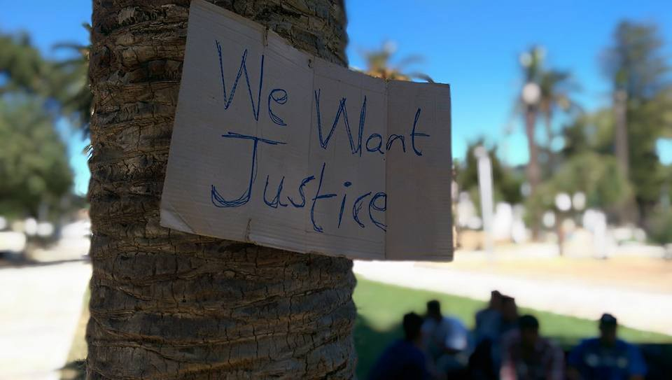
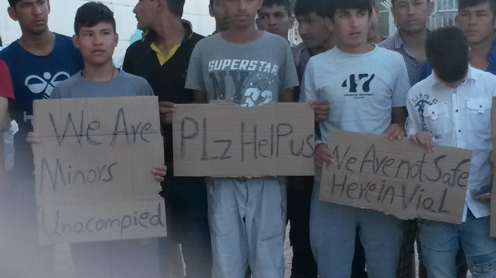
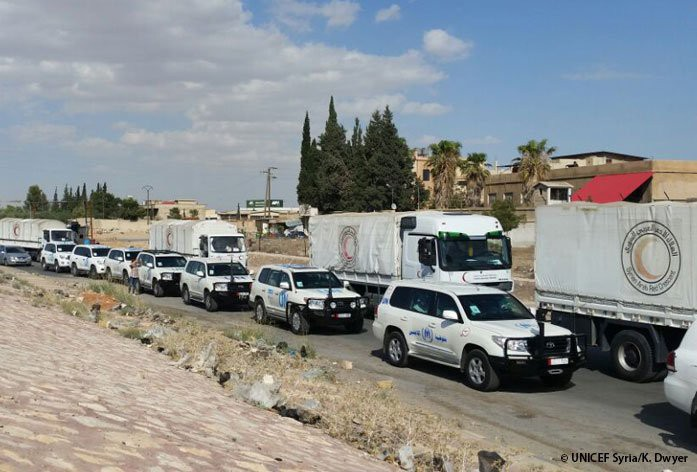
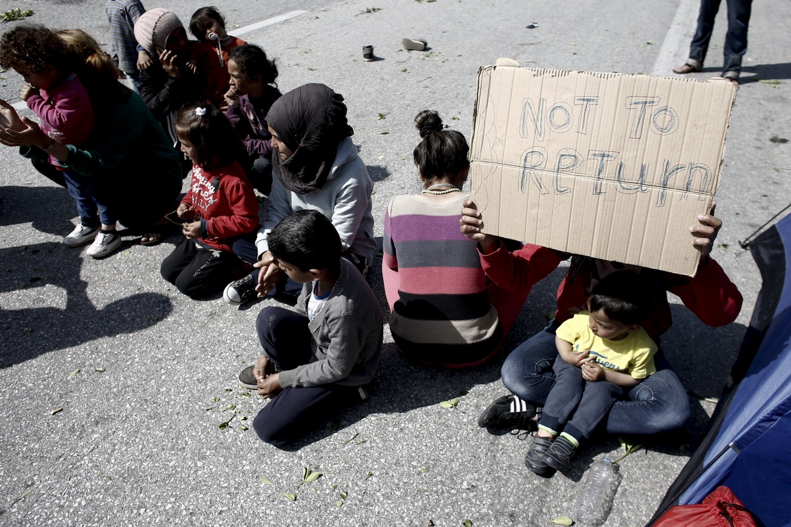
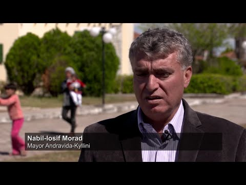
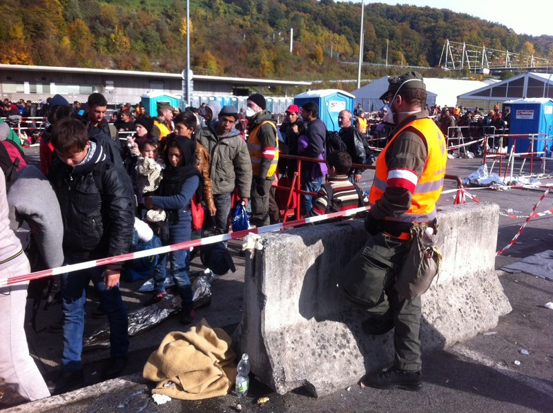
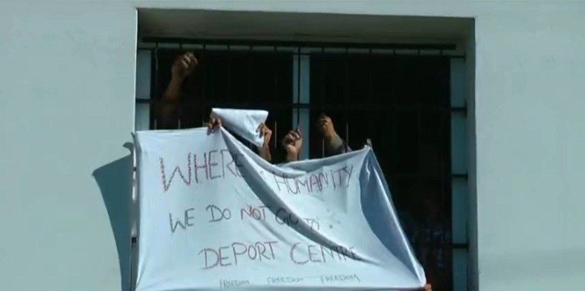
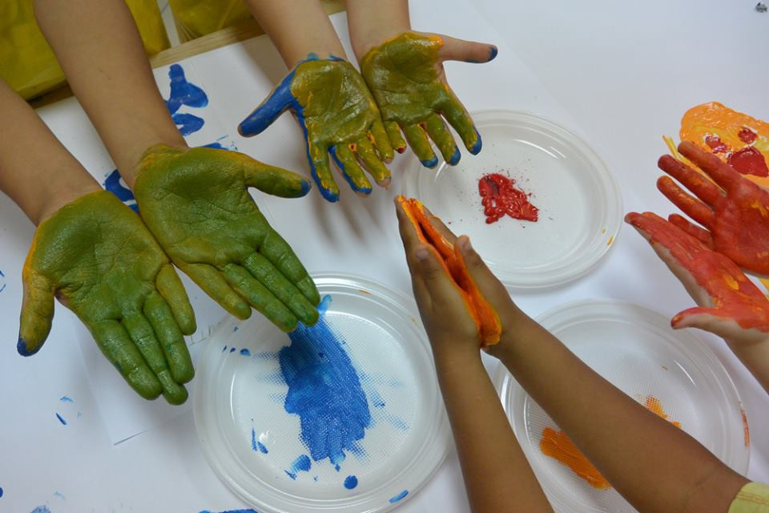
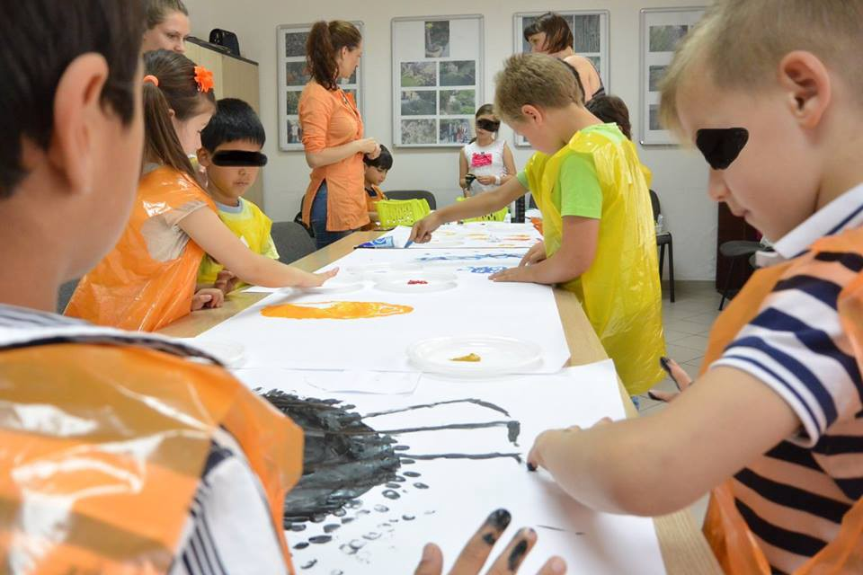
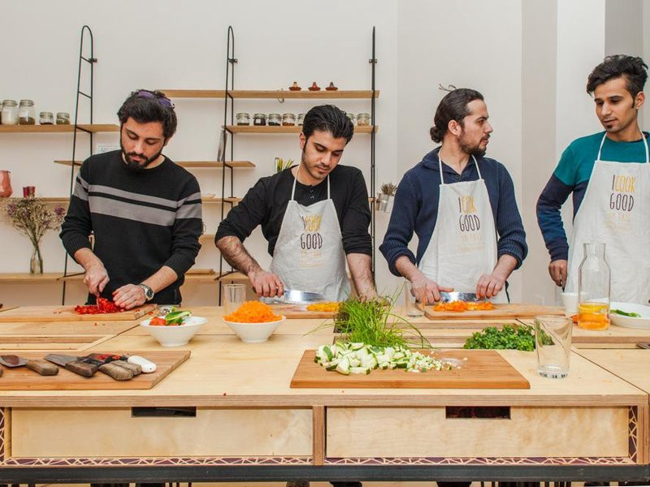

### **AYS NEWS DIGEST — Huge problem of unaccompanied Minors in Refugee Centers\.**

A young refugee’s protest note on Chios; PHOTO: Gabrielle Tan
#### **Special Report on Minors**
### **Thousands of Minor Refugees Stranded Alone in Greece\.**

According to a May 31 report by Save the Children, more than 1\.2 million refugees have headed to Europe since 2015 — the continent’s “biggest wave of mass migration since the aftermath of the second world war\.” They come mainly from conflict\-torn countries like Syria, Sudan, Afghanistan, Somalia and Eritrea\.

The problem has worsened since the beginning of February, when European countries limited the number and profile of those let through\. The formal closure of the route a month afterwards boosted the number of refugees stranded in Greece to 57,000, according to UNHCR\. The U\.N\. refugee agency [estimates more than 30 percent of them are minors](http://data.unhcr.org/mediterranean/country.php?id=83) \.

… Up to the end of May, there have been 1,875 cases, 1,768 boys and 107 girls\. “It is likely the numbers will keep increasing while authorities and organisations identify more of these kids throughout the reception camps,” said [Petrakou](http://www.ipsnews.net/2016/06/thousands-of-child-refugees-stranded-alone-in-greece/) \.

#### A Volunteer’s notes about the minors in Chios:

> **_There are currently approximately 120 unaccompanied minors on Chios, half of them in Vial\. These minors have all exhibited tenacity, grit and courage of conviction by making the dangerous journey from their war\-torn homelands seeking Europe’s protection — alone\. Some of them are as young as 11\._** 

> **_…They are under nourished\. Their sleeping quarters aren’t segregated from adults\. They are constantly being offered alcohol, propositioned by some of the adults, and exposed to regular fights and suicide attempts by the rest of the population that is steadily growing desperate and depressed \(latest one just being this morning\) \._** 

> **_They’ve witnessed their fellow minors being wrongfully deported back home, forced to move to a closed facility on Kos, and generally constantly subjected to harsh treatment from the authorities inside Vial\. Access to medical facilities have been close to none and unexplained detentions of up to ten days at the local police station with no access to basic facilities have been reported\._** 

> **_The lack of protection from the very same authorities who are supposed to protect them leaves them constantly on edge, trusting no one, living in fear, wondering if the next round of banging on their door possibly means deportation or imminent attack by the adults — resulting in many sleepless nights\._** 

> **_…We are running low on mental energy trying to beg the authorities for access to help these kids, and repeatedly being told “no”, whilst also running under this unprepared and incompetent system, trying to catch those who have fallen with a safety net\._** 

> **_Martin Luther King Junior once said: “Our lives begin to end the day we become silent about things that matter\.”_** 

> **_These kids matter\._** 

> **_Help us help the unaccompanied minors on Chios\._** 

#### **Syria**
### **Aid convoys reach besieged towns\.**

[UN](https://twitter.com/OCHA_Syria) and Syrian Red Crescent are continuing their inter\-agency effort to provide humanitarian aid for 40,000 people in Douma, Syria\. Today, food, health, medical, WASH and education supplies were delivered\.

> **While aid delivered to Daraya provides some relief, what is needed is for all sieges to be lifted, said OCHA on Twitter\.** 

#### **Greece**
### **EU advises Greece to recognise Turkey as a safe third country\.**

The European Council urges Greece to recognise Turkey as a safe third\-country, with one diplomatic source telling New Europe that this is something that has been “already confirmed” by the UNHCR\. The Council also urged Greece’s government to explain to the country’s judges that Turkey is safe for Syrians and to review the composition and role of the appeal committees since people from civil societies are not [neutral](https://www.neweurope.eu/article/eu-council-greece-consider-turkey-safe-syrian-refugees/) \.

**Credits: EPA/ Kostas Tsironis**
### **Tourist village transformed into a sanctuary\.**

A Greek summer resort that closed over five years ago as a result of the financial crisis has been turned into a haven for more than 300 [refugees](http://www.unhcr.org/en-us/news/stories/2016/6/57569aea4/greek-syrian-mayor-refugees-bring-tourist-village-life.html) \.

The reopening of the resort as a refugee reception centre is the initiative of the local mayor, Nabil\-Iosif Morad, a Syrian doctor from Homs who has lived in Greece for 25 years\. A Greek citizen through marriage, Nabil\-Iosif is also the first naturalized Greek of Syrian origin elected to office in the country\.

He offered the resort after the Greek Government asked local mayors for help in taking in the 57,460 refugees still in Greece, following border closures along what is known as the ‘Balkan route’ to northern Europe\. More than 1 million refugees and migrants arrived in Europe last year by sea, according to [UNHCR figures\.](http://www.unhcr.org/news/latest/2015/12/5679451d6/million-refugees-migrants-flee-europe-2015.html)

Nabil\-Iosif says at first he started gathering donations of clothing to send to Idomeni, the unofficial camp at the Greek border with the former Yugoslav Republic of Macedonia, where 10,000 refugees lived in squalor for several months this spring\. “But that wasn’t enough\. So I asked whether we could use this space\.”

### **Solidarity with the volunteers and activists in the field: donations needed\!**

Some of the volunteers in the field have been doing their best to supply nutritious food for the refugees in Chios island\. They need our support to continue their wonderful work\.

There are about 3000 refugees on Chios island at the moment\. Many have been there a long time now losing hope and no idea what comes next\.

Drops in The Ocean provide breakfast, the Basque kitchen provides for lunch and the Refugee Street Kitchen provides for soup and such for evening meal\.

To help the Refugees Street Kitchen who cannot continue without help, and who are essentially filling a gap that governmental bodies/ UN should be filling to stop people starving, you can donate to the new fundraising page that is set up by the volunteers:

### **Refugees resorting to prostitution in Athens\.**

A BBC investigation has found young refugees, including teenagers, are resorting to prostitution in the Greek capital\. Most are keen to get to northern Europe but new border rules have left them stranded, with no legal means of earning [money](http://www.bbc.com/news/world-europe-36500635) \.
#### Macedonia
### Disease prevention failing in FYROM Camps\.

Authorities in FYROM are increasing their efforts to prevent the spread of diseases in Tabanovce, one of two refugee camps in the country\.

According to a report from the Center For Public Health in Kumanovo, a town near Tabanovce, presented in the Municipality Council in Kumanovo on June 8, many refugees living in the camp in Tabanovce were reported to be ill in the period between early March and mid May\.

Authorities reported 70 cases of infectious diseases among refugees, 10 cases of chickenpox and 40 cases of stomach viruses\.

Measures are being taken by local health authorities in Kumanovo, including the extermination of rats and other vermin in the camp\.
### 12 new migrant accommodation centers in Central Greece\.

The government has announced the creation of 12 additional migrant accommodation centers in central Greece and its intention to reconstruct shelters at Koutsohero in Larissa, Katsika in Ioannina and Ritsona in Evia — three centers beset with serious structural [problems](http://www.ekathimerini.com/209506/article/ekathimerini/news/govt-plans-12-more-centers-for-migrants-in-central-greece) \.
### More refugees arrive brought to Kos\.

Yesterday 94 refugees were brought to Kos from Kreta, now there are more than 560 refugees at the island\.
### Public Prayer Spaces for End Of Ramadan In Athens\.

Greek authorities have announced they will designate two stadiums in Athens to the Muslim populations currently in the city to be used to celebrate the end of Ramadan, the daily Kathimerini reported\.

According to Greek daily To Vima, the Ministry of Culture and Sports and the Ministry of Interior and Administrative Reconstruction made the decision in “respect of religious freedoms and human rights”\.

Groups interested in the attending public celebrations will get access to the Olympic Athletic Center of Athens \(OAKA\) and to the Peace and Friendship Stadium \(SEF\) \.
### Mixed Feelings In Elliniko As Pre\-Registration Begins\.

Refugees in **Elliniko** expressed mixed feelings about [**pre\-registration**](https://newsthatmoves.org/en/pre-registration-what-are-my-legal-options/) as the first phase of the operation got underway at the three sites this week\.

On June 8, teams from the Greek Asylum Service started issuing **wristbands** to people as part of a process to pre\-register applications for **asylum, family reunification** and **relocation** to another EU state\.

Afghans, who make up more than 90 per cent of the population at the three Elliniko sites, are not currently eligible for the [EU relocation program](http://asylo.gov.gr/en/wp-content/uploads/2016/06/W001-5-Relocation-Poster.pdf) , but may be eligible to apply for [family reunification](http://asylo.gov.gr/en/wp-content/uploads/2016/06/W001-4-Family-Reunification-Poster.pdf) \. Registering for asylum is a prerequisite for applying for [either program\.](https://newsthatmoves.org/en/mixed-feelings-in-elliniko-as-pre-registration-begins/)
#### Serbia
### 300 refugees stuck at the border\.

Approximately 300 refugees stuck at Serbian Hungarian border, Kelebija border crossing\. And same number at Horguš border crossing; in shade of tragic conditions and at the time when Hungarian authorities aloud entry to their territory to only 15 refugees daily\.
#### Hungary
### Hungary refuses to take migrants back\.

Hungary refuses to take back migrants from Austria and points the finger at Greece, arguing that it cannot take back migrants that have crossed other EU member states before arriving to [Hungary](https://euobserver.com/migration/133781) \.

Credits: Eszter Zalan
### UNHCR: Concerns About Hungarian Border Restrictions\.

The UN Refugee Agency \(UNHCR\) has expressed concerns about the conditions refugees face while waiting to cross into Hungary from Serbia through the two transit zones of Röszke and Tompa\.

“We remain concerned about Hungary’s restrictive approaches and the dire situation asylum\-seekers face outside the transit zones\. Currently, only 15–17 people are admitted daily at each zone, leaving hundreds to suffer day and night without any proper support at the EU border,” said Samar Mazloum, head of UNHCR’s field office in Szeged\.
### People in Kormend need to travel 500 kilometres to meet their case officer\.

n May the new tent camp in Kormend was opened, and just like we thought, people keep on disappearing from there\. As expected,the conditions in the camp are very problematic\. Access to legal aid or proper case officers is very limited, and the biggest problem is lack of information\.

We are especially worried of the fact that some people who are staying in Kormend need to travel to Debrecen, a distance of nearly 500 kilometres and a 9\-hour travel by public transportation, to meet their case officers and attend the court hearing regarding their asylum case\. In such absurd cases, the immigration authorities does not provide them with accommodation to stay overnight in [Budapest](http://www.migszol.com/blog/people-in-kormend-need-to-travel-500-kilometres-to-meet-their-case-officer-migszol-update-from-hungary-may-25-june-9) \.

#### Croatia
### Our volunteer enters finals of EU Social Innovation Competition with a project dedicated to refugees\.

Our very own Tamara Puhovski of AYS has made it to semi\-finals of European Social Innovation Competition 2016, with the idea of Citizen Guides, an app that would match refugees with their personal guides to a new society, based on interests they share\.

In this European\-wide platform, EU citizens would create a profile about themselves and commit to a one\-month volunteering contract\. A refugee would then search through the profiles and match with a person who they would like to be their guide\. This would give refugees the opportunity to shadow an EU citizen at work and in their social life, giving them a more personal insight into their new society\. Our entire team is cheering for Tamara and her Citizen Guides project to win the prize, awarded by the [European Commission](http://eusic.challengeprizecentre.org/selected/6/citizen-guides/) \!
### Children know no cultural and language barriers: wonderful workshop in Zagreb\.

People from Živi Atelje DK, Mali Zmaj and Are You Syrious, cooperated and organized to get kids from different countries together and let the magic happen\. 
Once again, they prove to us how you don’t need a shared spoken language to engage, and if you leave your fears at the door, creativity and frienships soar\. 
This is only the beginning…

Credits: Živi Atelje DK
#### Germany
### German politicans want to declare more countries as safe origin countries\.

Parts of the german party “Bündnis90/Die Grünen” \(Greens\) don’t want to support the intensification of the asylum law, declaring Morocco, Tunisia and Algeria as [“save countries of origin”](http://www.zeit.de/politik/deutschland/2016-06/fluechtlingspolitik-maghreb-staaten-gruene-sichere-herkunftsstaaten-asyl) \. Chairman of the green parliamentary group, Kathring Göring\-Eckhardt said to Deutschlandfunk, her Party will not vote for the new laws, when to Bundesrat \(Federal Assembly\) will decide on it, because it is worried about human rights [violations](http://www.deutschlandfunk.de/maghreb-staaten-goering-eckardt-gruene-sieht-keine.447.de.html?drn%3Anews_id=622823) against journalists, bloggers, women and homosexuals\.
### Refugees Are Teaching Germans How to Cook Their Traditional Foods\.

Cooking classes are bridging the gaps between Germans and Middle Eastern [refugees](http://www.smithsonianmag.com/smart-news/refugees-are-teaching-germans-how-cook-their-traditional-foods-180959355/?no-ist) \.

Credits: Laura Fiorio, courtesy of Uber den Tellerrand
### Four men who attacked refugees with sticks are sentenced\.

At Nordrhein\-Westfalia 4 young men between the age of 18 and 20 were sentenced for beating up three refugees at a bus stop with stick and metal covered shoes\. They were sentenced for 9 months of prison — but they will not have to go to prison if they do not commit another crime during the next 6 [months](http://www.spiegel.de/panorama/justiz/heinsberg-haftstrafen-nach-pruegelattacke-a-1096945.html) \.
### Auction in Germany for refugees benefits\.

Until now on ebay 3700€ are the amount of money that will be donated to “Flüchtlingspaten Syrien”, an association that brings refugees from Syria to Germany by paying for their living expenses\. The money is raised by three auctions of “Kinderschokolade” with the signature of the German soccer player Jerome Boateng of the national German team\.

The idea for this funny auction came up after first members of the rightpopulist party AfD \(Alternative for Germany\) complained about Ferrero who put the child faces of the national team \(including the non\-german\-looking members, ofc\) and Gauland, member of the party, insulted Boateng on public media\. Another example how hatred can lead to something good\.

### Investigation: Fight over Ramadan led to blaze at German refugee center\.

Residents of a refugee center in the German city of Duesseldorf set their shelter alight after a fight among Muslim refugees over Ramadan meals, a prosecutor said on Friday, in an incident that is likely to increase unease among anti\-immigrant groups\.

On Tuesday a fire ripped through the accommodation that was home to around 280 refugees on the site of Duesseldorf’s trade fair\. All residents were brought to safety but 24 suffered from smoke [poisoning](http://www.reuters.com/article/us-europe-migrants-germany-fire-idUSKCN0YW0W9) \.
#### Italy
### 2000 Refugees have been saved from the sea on June 9 alone\.

According to the Italian coast guard, 2,000 people have been rescued on June 9 alone, as ships from Frontex and Operation Sophia intervened in 15 different instances to provide help\. UNHCR says 48,000 migrants have reached Italy since the beginning of this [year](http://www.lemonde.fr/europe/article/2016/06/09/environ-2-000-migrants-secourus-au-large-des-cotes-libyennes_4945838_3214.html) \.
#### General
### Audit of UNHCR management of procurement by partners using UNHCR funds April 2016\.

You can reach the report through this link: [www\.foxnews\.com/world/interactive/2016/06/06/audit\-unhcr\-management\-procurement\-by\-partners\-using\-unhcr\-funds\-april\-2016/](http://www.foxnews.com/world/interactive/2016/06/06/audit-unhcr-management-procurement-by-partners-using-unhcr-funds-april-2016/)

_Converted [Medium Post](https://areyousyrious.medium.com/ays-news-digest-unaccompanied-minors-in-refugee-centers-45f54d954542) by [ZMediumToMarkdown](https://github.com/ZhgChgLi/ZMediumToMarkdown)._
