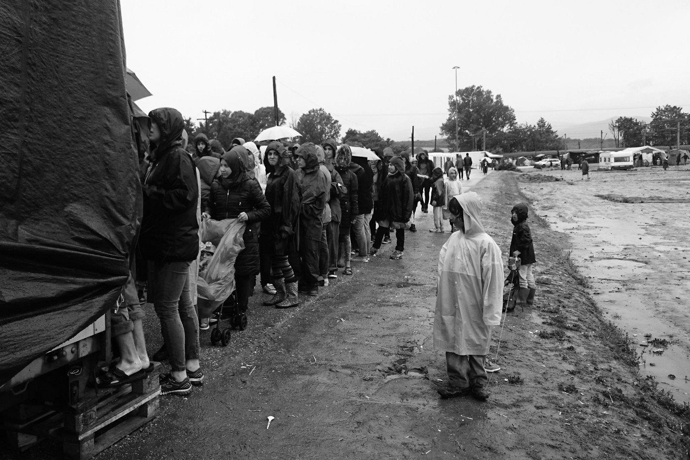
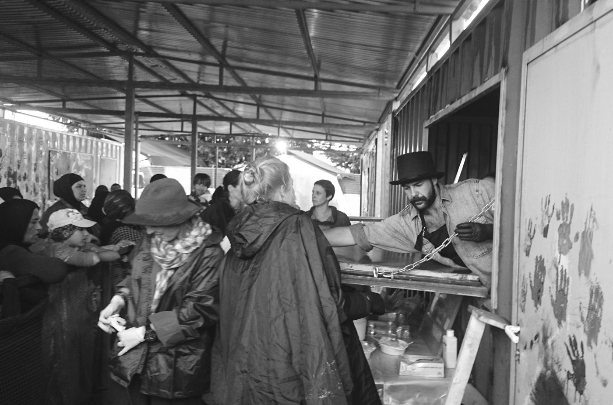
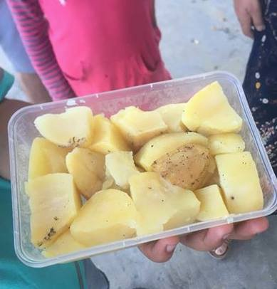
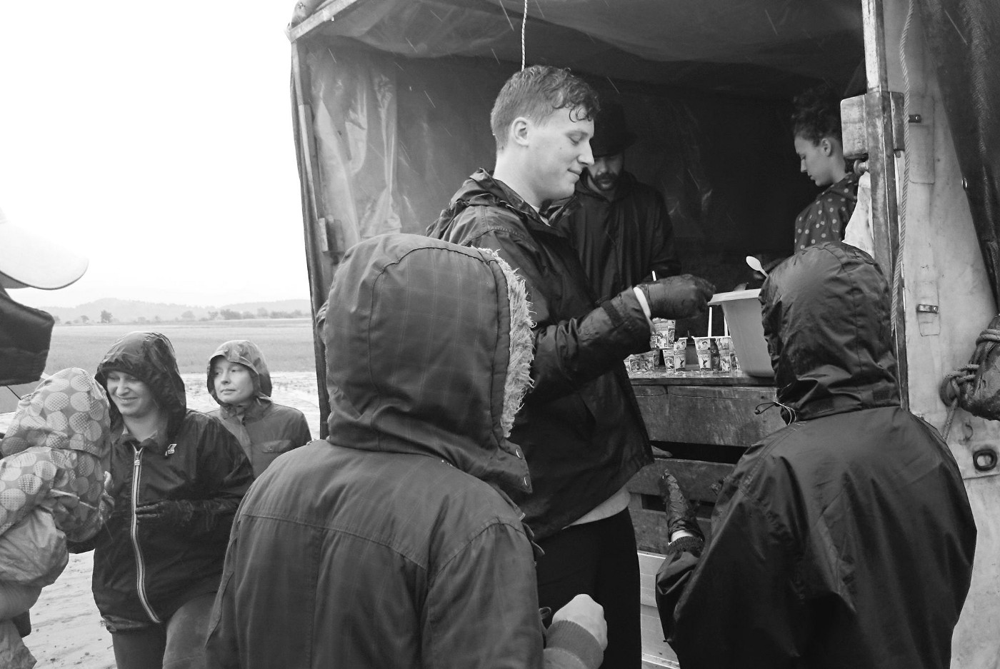
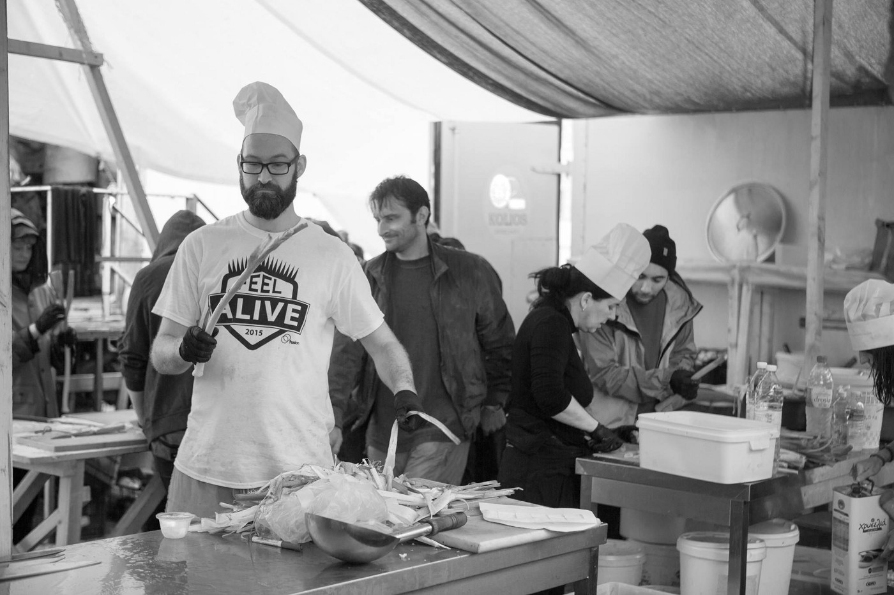

### AYS Daily Digest — Updated Pre\-registration Information for Greece\!

Photo Credit: Vassil Garnizov, Hot Food Idomeni
#### SYRIA
### Bittersweet events in Daraya as finally the food aid convoy was allowed to reach the city, only to be bombed\.

According to the World Food Program, regime forces, shortly after the delivery, began to bomb Daraya which placed severe limitations on distribution of the supplies\. This turn of events has been denounced as an act of [“extraordinary duplicity” on part of the regime](http://www.nytimes.com/2016/06/11/world/middleeast/syria-united-nations-food-aid-daraya.html?_r=0) \.

[Video from activists](http://video.dailytelegraph.com.au/v/468647/SYRIA-Activists-Claim-Cluster-Phosphorus-Munitions-Used-in-Airstrikes-North-of-Aleppo-June-10) in Kafr Hamra document what is alleged to be white phosphorus bombs, which, along with some cluster munitions, were dropped on June 10th, three miles north of Aleppo\.
#### GREECE
### EASO has been controlling the entry of refugees’ lawyers into the Moria camp, who need to specify exactly with whom they are going to talk and about what subject, violating the attorney\-client privilege\.

Furthermore it is often not a Greek civil servant that asks the questions but someone from a private security company or an EASO expert\. Last Tuesday, one of these EASO experts prohibited some lawyers of entering the camp which clearly goes beyond their mandate and violates national legislation on lawyers’ statuses\. This EASO expert was brought to the police station but was released later on\. The lawyers have filed charges and [investigations are ongoing](http://www.emprosnet.gr/.../84207-ntoy-dikigoron-sti-moria) \.

> Volunteers report that that “all of us \[lawyers\] have been threatened with arrest by Easo or the guards”, which has caused them to miss interviews, hearings and appeals\. A limited access area, and Moria itself\. Lawyers have only access to “the limited access area\. It’s a strip of land outside the camp but inside the barbed wire\. It takes an average of 1\.5 hours just to get there\.” 

Regardless of the pressure put on legal teams from EASO, legal assistance and aid remains one of the most powerful ways to affirm the humanity of refugees\. Teams accepting help can be found here by filtering opportunities [with “legal / info”](http://www.greecevol.info/task.list.php) \.

Photo Credit: Vassil Garnizov, Hot Food Idomeni

CalAid has put out a call for teachers and youth workers for a mission they will be conducting in Greece in August\. Although travel and meal costs are not covered, accommodation and a small stipend will be provided for those willing to volunteer the whole month, as per agreement\. Those interested and qualified are encouraged to contact CalAid at [youthprojectgreece@calaid\.co\.uk](mailto:youthprojectgreece@calaid.co.uk) \.
### Proactive Open Arms rescued individuals off of a boat this morning off of Lesvos\.

### Kos camp is located on an old military camp/zone, which makes for a dismal atmosphere\.

Only adding to this is the There is no area to playfor kids, no green, no trees\. Flying Help organized a second fun trip forunaccompanied minors, 11 will join them tomorrow\.
### Correction: there is no official confirmation of the move of Aspri Ammos, but there remains an effort from local volunteers in combination with the announcement of a new close\-by camp on local news\.

_Original: Volunteers and aid workers report that refugees from the camp in Aspri Ammos in Kavala will be moved to a different camp\._

_It is expected that they will be moved to an ex\-military camp at Asimakopoulou and is reportedly a significant improvement over the current camp, being situated at the edge of a city\. It is across the road from a beach and is in close proximity to a super market and other amenities\._
### Volunteers in several locations have reported incidents of serious food poisoning\.

Image Credit: Anonymous

This photo is of rotten potatoes served to refugees in a camp\. In the coming weeks, several volunteers are organizing a move to put pressure on appropriate authorities in order to incentivize finding a solution\. Now more than ever, it is important to ensure consistent, mindful provision of a safe food source\. Several volunteer groups are working to do so here, and if you wish to join them, you can search “cooking / food” [on volunteer opportunities](http://www.greecevol.info/task.list.php) \.
### PRE\-REGISTRATION UPDATE

This pre\-registration update was obtained by tireless efforts of Immigrant Refugee and Support Group in Athens\. Some very helpful answers\!

Volunteers are asked to refer to the documents that are available on [http://asylo\.gov\.gr/en/?page\_id=1278](http://asylo.gov.gr/en/?page_id=1278) \. As this is an exercise of the Greek Asylum Service \(GAS\), these are the documents that should be considered “official”\. The GAS will upload translations as soon as they become available\. On this page, currently the relevant documents are in Greek, English, French and Arabic\. _Please continue to refer to this site only for current and future information\._

Some questions and answers were able to be obtained from a representative\.

_Q: 1\) Clarification of what is meant in the ‘Group 2 category of an ‘informal site’ — what does this mean?_

> Answer: there will be further clarification of this definition in the documents, however for the moment, FYI, Informal sites are all sites that have not been established by the government, such as Piraeus or EKO Gas station\. 

_Q: 2\) in group 3, it says, ‘People who live in hotels, apartments or other buildings in cities or villages outside the sites will be able to pre\-register after the first two groups’ — Who does this group include?_

> Answer: This group includes everyone who is living outside a formal or informal site, including in private accommodation or hotels\. To our knowledge the GAS plans to announce when this group can pre\-register around end of July\. This, timing however, depends on how the pre\-registration in the formal sites is proceeding\. 

_Q: 3\) there are many people who are not on an official or unofficial site nor are they in any of the hotels, apartments, and independent squats — they are living on the streets or outside some of the official camps\._

> Answer: Those are included in the “urban” caseload, i\.e\. group three\. They will benefit also from the pre\-registration exercise\. 

As mentioned, we have been informed that the Greek Asylum Service website is the ‘official’ website for further future information and volunteers are asked to refer to this for updates\.

Photo Credits: Vassil Garnizov, Hot Food Idomeni

### Volunteers needed in Squats and other capacities\.

In order to protect some independent NGO efforts, it is challenging to share information about the grassroots work that is being done across Greece and the route without endangering the refugees or the activists themselves\. Prospective volunteers are encouraged to keep their eyes peeled for new opportunities and be sure in their commitments in order to help make organizers’ lives easier\. One way to help is to support efforts to deliver consistent internet access to those in camps around Greece\. Impact Nomads and Disaster Tech Lab are looking for volunteers to help with that specifically\. See how you can get involved [here](http://www.greecevol.info/task.list.php) \.
#### FORTRESS EUROPE
### The European Commission stalls on new plan for refugees due to some countries disagreeing on implementation or cost\.

The [plan operates off of discouraging further flight](http://www.ilsole24ore.com/art/mondo/2016-06-11/parte-salita-piano-ue-i-migranti-081226.shtml?uuid=ADEP4La) to Europe, as well as strengthening bilateral agreements with 16 countries in order to speed repatriation\. Additionally the EC promises to invest in the countries of origin in order to strengthen economic development\. The current price tag is around one trillion euros, with half being provided by the community budget and the other coming from member states\.

Mogherini [takes a hard line against countries](http://www.tgcom24.mediaset.it/mondo/europa-la-mogherini-avverte-chi-costruisce-muri-contro-i-migranti-rischia-procedure-d-infrazione-_3013769-201602a.shtml) that build walls and barriers to stem refugees\. She stated, “procedures for infraction can take place against the members which do not respect the rules,” translating into the soft endorsement of EU intervention on behalf of the crisis\.
#### SLOVENIA
### Upcoming film festival showcases refugee crisis\.

Those in the region are encouraged to attend Slovenia’s upcoming film festival that is themed on the refugee crisis\. The festival is taking place from the 15th to the 20th of June\. For more details, [please go here](http://www.fmf-slovenija.si/) \.
#### ITALY
### Dozens continue to arrive in Italy, with a significant portion of them being unaccompanied minors\.

These children are limited from the view of journalists and other watchdog entities\. The number of children has climbed over 129% according to a recent study\. For more information on the plight of refugee children in Italy, please explore this [New York Times article](http://mobile.nytimes.com/2016/06/12/opinion/sunday/the-child-migrants-of-africa.html?referer=https%3A%2F%2Fwww.google.fr%2F) \.

[A sailing boat led by three smugglers](http://www.ansa.it/sito/notizie/topnews/2016/06/11/bloccato-veliero-a-bordo-45-migranti_d0868dbb-7b42-4448-baff-059f45404319.html) landed 45 migrants in Campania \(including 20 minors\) \. The migrants are from Afghanistan, Iran, Yemen, Pakistan and Somalia\. The group has been taken to a center\.

In Ventimiglia, about 200 refugees who spent the night in the Church of Sant’Antonio di Roverino, are organizing a silent protest in front of the church entrance\. They should have left the church at 15 o’clock, the church being a temporary respite, but an hour before they said they would have stayed up to the moment a new place will be ready for them\. In the end, they obtained to stay there for other 2–3 days\. Then, theywill be hosted in park Roja, property of the national railways, where hosting units will be built along with containers \.The church was initially supposed to be a very short term solution that looks to be transforming into a long term problem in this case\.
#### GERMANY
### As refugees languish in detention centers, patience runs out as some are turning to lawsuits to speed their case\.

The number of undecided asylum claims is currently at around 460,000 at the end of May\. This number does not include the 300,000 that have not claimed asylum\.

_Converted [Medium Post](https://areyousyrious.medium.com/ays-daily-digest-updated-pre-registration-information-36b91f1bfc) by [ZMediumToMarkdown](https://github.com/ZhgChgLi/ZMediumToMarkdown)._
