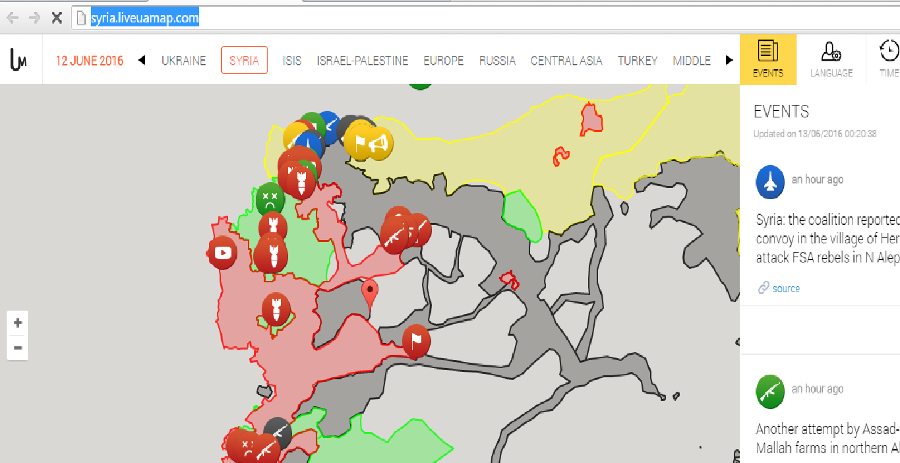
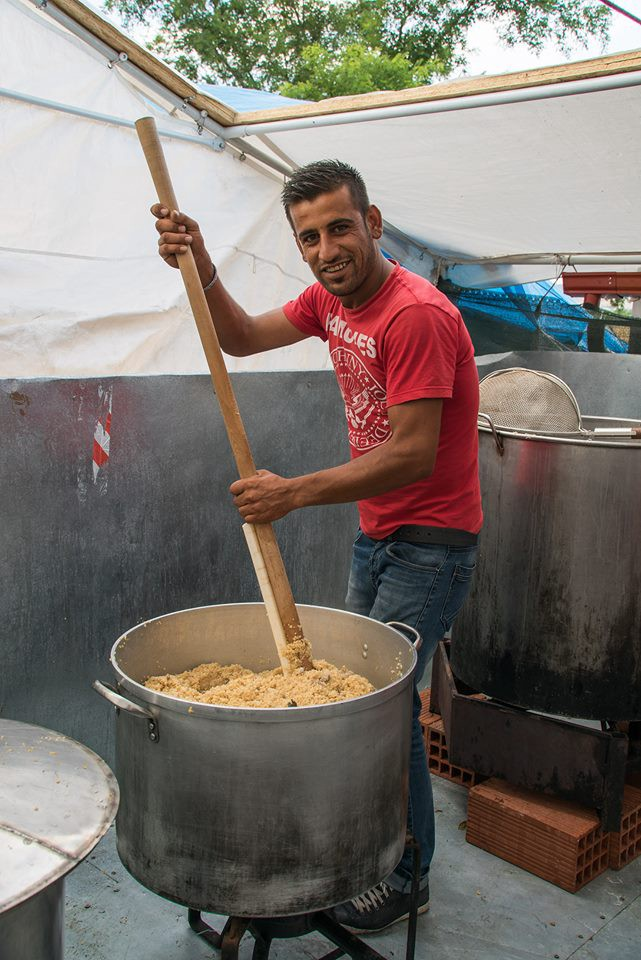
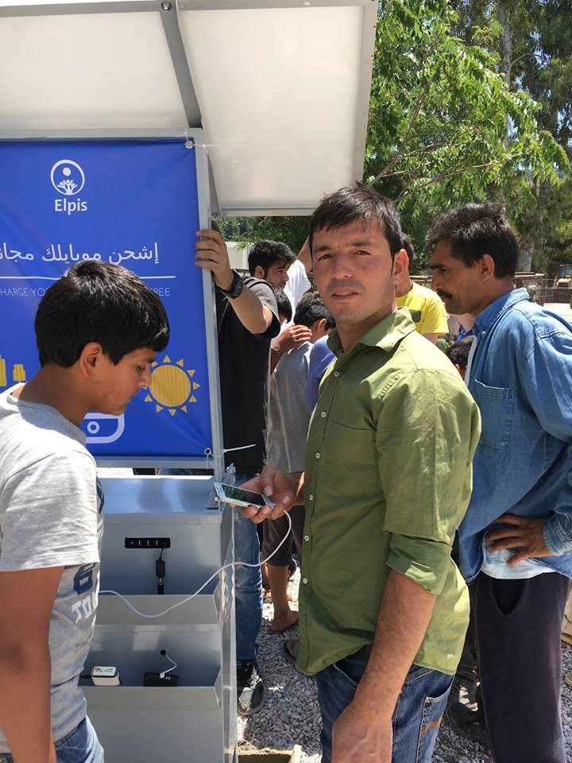
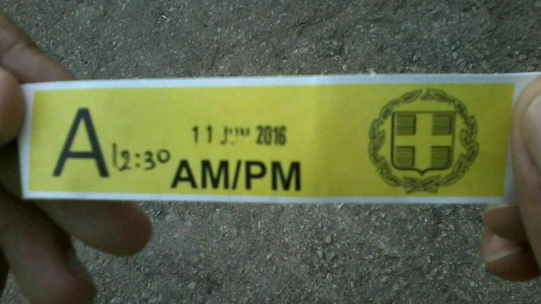
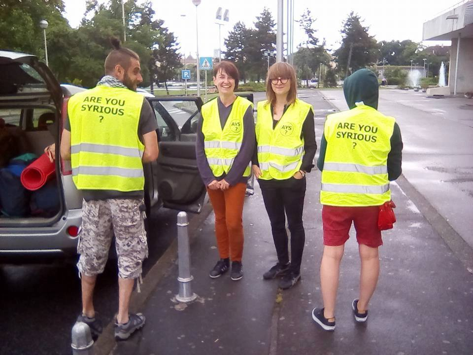
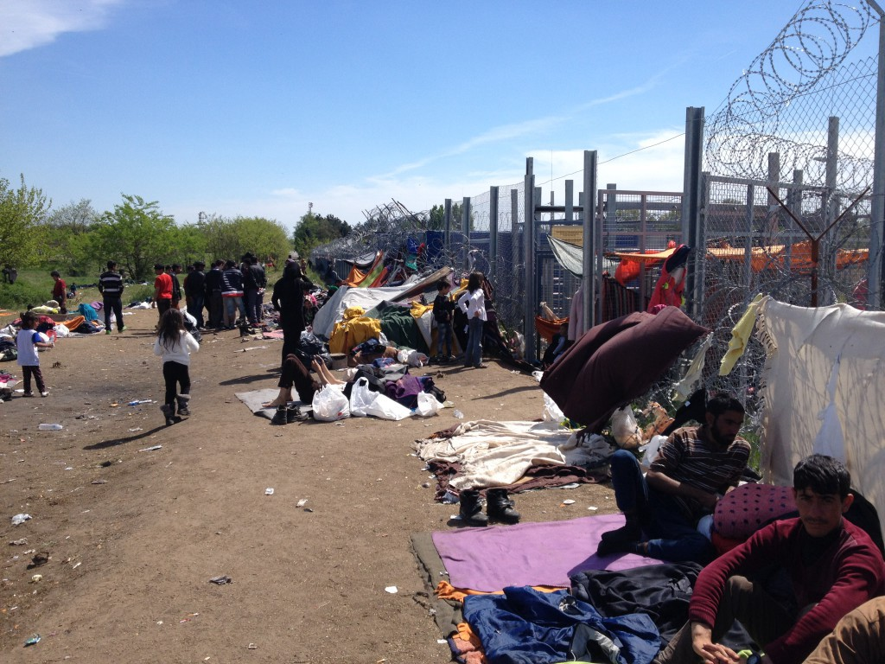

### AYS Daily News Digest 12/06: Where are refugees now?

](assets/166860852dcd/1*GRl1L2KgrMWwV2qiwvODCw.jpeg)

Credits: [**Guillem Cabra Cortès**](https://www.facebook.com/guillemcabra?fref=photo)
#### General
### UNHCR changing aid strategies to reflect current refugee needs

> _Today, UNHCR launched an update of the [Regional Refugee and Migrant Response Plan \(RMRP\)](http://rmrp-europe.unhcr.org/rrmrp/) involving 60 partner organizations and covering the eastern Mediterranean and Western Balkans route\. The RMRP has been revised to take into account the new circumstances on the ground following border closures along the Western Balkans route, and the entry into force of the EU\-Turkey agreement\._ 

> _UNHCR and humanitarian partners have redefined their engagement from a response primarily targeting people on the move, to focusing on a static population in Greece and on protection activities in countries in the Western Balkans, following the border closures along the Western Balkan route\._ 

> _Unmet needs remain significant, as living conditions in the sites in Greece, both on the islands and the mainland, have deteriorated as a result of congestion and the rapid nature in which sites were established on the mainland\. The affected population includes many people with specific needs, such as unaccompanied or separated children, single women, pregnant or lactating women, the elderly, people with disabilities, as well as the sick and injured\. The number of children in these movements has been on the rise, reaching 38 percent of the total arrivals from Turkey to Greece in 2016\. There is a risk that these people will increasingly rely on smuggling and trafficking networks, exposing themselves to greater protection risks, which will be even more challenging to address considering the clandestine nature of the movement\._ 

#### Syria
### A huge massacre in the city of [Idlib](https://www.facebook.com/hashtag/idlibcity?source=feed_text&story_id=590981681061431)

> _The regime bombed a vegetable market with a triple airstrike, killing over 50 people, including children\. The incident happened in a busy market place, where people were buying food for iftaar, the opening of their fast\._ 

> _Syria is burning from [‪‎Aleppo‬](https://www.facebook.com/hashtag/aleppo?source=feed_text&story_id=590981681061431) to [‪‎Idlib‬](https://www.facebook.com/hashtag/idlib?source=feed_text&story_id=590981681061431) to [‪Douma‬](https://www.facebook.com/hashtag/douma?source=feed_text&story_id=590981681061431) ; the entire country is burning\. Unless we offer these children a place to live, they will continue dying\._ 

](assets/166860852dcd/1*ZN-zuFzN3YHys4l6utaHSQ.jpeg)

Idlib is burning\. Credits: [**Abdullateef Khaled**](https://www.facebook.com/BroAbdullateef/?fref=photo)

](assets/166860852dcd/1*NIlxnzrNUpkjW2_pmPNxjw.jpeg)

50 people, including children, were killed today in Idlib\. Credits: [**Abdullateef Khaled**](https://www.facebook.com/BroAbdullateef/?fref=photo)

A [video](https://video-ams3-1.xx.fbcdn.net/v/t42.1790-2/13450560_149939578752528_869051888_n.mp4?efg=eyJybHIiOjUwMCwicmxhIjo1MTIsInZlbmNvZGVfdGFnIjoic3ZlX3NkIn0%3D&rl=500&vabr=278&oh=c1400df8f7ae1a9da1a2c452b9ebf115&oe=575E0151) of the attack\.
### Map of Syrian civil war

[Here](http://syria.liveuamap.com/)

Credits: Liveuamap
#### Greece
### EKO Gas station in Polykastro is to be evicted soon

](assets/166860852dcd/1*FdVS7wF4F-BNsU_Iy4IzTg.jpeg)

Credits: [**Guillem Cabra Cortès**](https://www.facebook.com/guillemcabra?fref=photo)

](assets/166860852dcd/1*aI0eod1s1DEBkmKiWWhGvg.jpeg)

Credits: [**Guillem Cabra Cortès**](https://www.facebook.com/guillemcabra?fref=photo)

](assets/166860852dcd/1*mw6xcPY1XTehCJCedU5uDw.jpeg)

Credits: [**Guillem Cabra Cortès**](https://www.facebook.com/guillemcabra?fref=photo)

](assets/166860852dcd/1*5ev4a_fEZelUWT7KWkGUgQ.jpeg)

Credits: [**Guillem Cabra Cortès**](https://www.facebook.com/guillemcabra?fref=photo)

](assets/166860852dcd/1*lEZAMIxQHsBYyIh9Evi_fA.jpeg)

Credits: [**Guillem Cabra Cortès**](https://www.facebook.com/guillemcabra?fref=photo)

](assets/166860852dcd/1*7uGSL4nt9gRvCyrCH8AuQw.jpeg)

Credits: [**Guillem Cabra Cortès**](https://www.facebook.com/guillemcabra?fref=photo)

](assets/166860852dcd/1*MInv4NxXP7Q7ZxhjfF8NMg.jpeg)

Credits: [**Guillem Cabra Cortès**](https://www.facebook.com/guillemcabra?fref=photo)

](assets/166860852dcd/1*0-XMPoDBJItTNdctU7f8aw.jpeg)

Credits: [**Guillem Cabra Cortès**](https://www.facebook.com/guillemcabra?fref=photo)

](assets/166860852dcd/1*AEGoTHxlul9oyjV0X-OaXg.jpeg)

Credits: [**Guillem Cabra Cortès**](https://www.facebook.com/guillemcabra?fref=photo)
### [Call](https://noborderkitchenlesvos.noblogs.org/call-out/) for support by No Border Kitchen Lesvos in Mytilini, Lesvos

> “We are in heavy need for people who want to cook, deliver food and organise general issues on the island\. 

> The situation on the islands is still difficult\. Thousands are trapped here on their way to the European mainland\. Meanwhile, the conditions in the infamous detention prison in Moria are horrible: People are lacking basic supplies like food and shelter and are object of \(police\- \)violence on a daily basis\. As almost all NGOs have left the island or are gone on “standby”, there are only few support structures left, especially for those refusing to live in a prison and stand the conditions in Moria\.” 

### Students from the University of Edinburgh have developed a solar\-charging station for refugees

The station powers 3600 phones per month \(120 per day\) \. They have already installed two permanent mobile\-charging stations in the Kara Tepe camp in Lesvos and Malakasa, outside of Athens and have 3 more solar\-chargers in production\!

Their hope is to scale this project up to maximize our impact not only in Greece but also across the world where it may be needed\. If you would like to help them with the last push of our crowd funding campaign please visit this [link](https://www.indiegogo.com/projects/project-elpis) \!

](assets/166860852dcd/1*UrcsHt7lyMn0i7YZrMiVkg.jpeg)

Elpis project\. Credits: [**Sam Cortese**](https://www.facebook.com/sam.corte?fref=photo)
### Preregistration has started in Oreokastro and Elliniko

> _The pre\-registration process by EASO, UNHCR and the Greek state has finally started\. One of the announced six pre\-registration hubs is located at the Regional Asylum Office in the industrial outskirts of Thessaloniki\. Refugees are brought to the hub from the camps and “processed” within 30 minutes\. The idea of processing human beings is reflected in the whole setting of the registration process\._ 

> _Moving Europe documented the dire conditions in the camps which are located in industrial zones, remote areas and uninhabited regions\. The practise of keeping refugees away from society and out of public attention is reflected throughout the pre\-registration process\. Refugee are moved back and forth from one industrial area to the next: from the places they are forced to live to the governmental identification and registration hubs — all of this happens shut out of any societal and human reality\. The experience appears like the trading of goods that takes place in this area: being distributed and delivered within these industrial areas by dozens of trucks passing the hub\._ 

> _Yet, the operating staff — from NGOs, EASO and UNHCR — seem to reflect little on the power they have over people’s lives who are treated like “caseloads”\. In that manner, the operating staff is distributing bracelets to the refugees before the transfer to the hub\. The bracelet shows the hour and the day of the transfer to pre\-registration\. One friend staying at Oreokastro camp commented on that: “I was supposed to wear that bracelet for four days\. But I took it off\. How can I go to the city with that bracelet? It is totally conspicuous and embarrassing\.” Apparently the competent authorities and organizations do not keep in mind that the “caseloads” they “manage” are people — people that move and try to find some normality outside of the camp reality\. Our friend L\. continues: “This is used to mark cattle, it’s put into their ears\. Thank God that they haven’t pierced our ears\!”_ 

> _A lot of hope is connected to the pre\-registration process, but at the same time a lot of distrust towards the authorities\. People have been disappointed by broken promises too many times already\. It further remains questionable whether pre\-registration will actually accelerate the procedures to meet the rights and the needs of those stuck\. The options available for the people stuck are limited and besides family reunification, not very promising: Relocation and asylum in Greece are not viable solutions for the majority\. People need to go to places where they can build their own future\. This is probably why IOM offers registration for ‚voluntary returns‘ inside these hubs as well\._ 

> _It appears that the pre\-registration procedure has two main goals: to count the refuges to better control them and to keep people quiet by manufacturing bureaucratic procedures that raise hopes for something to change soon\._ 

> _The pre\-registration started following the estimates suggesting that it will take at least a year before tens of thousands of refugees and migrants stranded on the Greek mainland have submitted their asylum applications, a large\-scale operation was launched last week to speed up the process by pre\-registering the applications of people that entered the country from January 1, 2015, until March 19, the day before an EU deal with Turkey to stem their flow went into effect\._ 

The pre\-registration bracelet\. Credits: Moving Europe
### UNHCR has published a [fact sheet](http://data.unhcr.org/mediterranean/documents.php?page=1&view=list) about their work in Greece for the period of 1 January — 31 May 2016

> _Interesting figures inside\. There is a clear increase in refugee deaths in Greek waters compared to the same period last year\. According to IOM, the total number of refugee deaths is also much bigger than the last year, counting 2,856 deaths in the Mediterranean of 3,444 deaths recorded worldwide this year\._ 

### Five\-member AYS team has arrived to Northern Greece

> _AYS will support our colleagues from IHA and Open Cultural Center in Cherso\. They are bringing donations and will provide all the necessary help to finish up the new cultural center facilities\. Afterwards, they will proceed to bring donations and volunteer in EKO camp, which will need support in its final days before eviction\. We wish good luck and safe volunteering to Ana Dana, Azra, Karolina, Nidzara and Matija\!_ 

Credits: AYS
### Refugees are paying smugglers to take them back home

> _Europe seemed like the promised land, worth risking their lives to reach\. But in a muddy field on the northern edge of Greece, their dreams died\. Now, dozens of Syrian refugees are risking their lives again but in the opposite direction — paying smugglers to take them back to Turkey, and heading home\._ 

> _Each night, groups of migrants and refugees huddle at the railway station of the small border town of Didimoticho, about 3 kilometers \(2 miles\) from the frontier, setting up small tents and waiting for their chance to cross\._ 

> _Among them is Atia Al Jassem, a 27\-year\-old Syrian barber from Damascus who is heading east with his wife and 1\-year\-old daughter after spending months stuck on the Greek border with Former Yugoslav Republic of Macedonia \(FYROM\), watching his hopes of reaching Europe ebb away\._ 

> _“I am going to Turkey, I do not want Europe any more\. Finished,” he says, sitting in a small park near the railway station in Thessaloniki, Greece’s main northern city, where he, his 20\-year\-old wife Yasmine Ramadan and their daughter Legine, who they call Loulou, spend what they hope will be their last night in the country\._ 

> _“We are really tired\. We’re destroyed and I have a baby\. I ask God to help me get back to Turkey,” he says\. “In Syria under the bombs we would be better off than here\.”_ 

### Many refugees continue night\-time excursions through razor\-wire fences into Macedonia, only to be beaten and returned

> _Nightly, under the cloak of darkness, some 200 people set out for the Macedonian border, hoping to make it through the razor\-wire fence and evade the Macedonian border officers who patrol the boundary 24 hours a day\._ 

> _Frontex, the European Union’s border agency, has also patrolled the Greek\-Macedonian border to block the flow of refugees and migrants\._ 

> _They disappear into the dark fields lining the border\. Yet, less than a half hour later, most of them return after being blocked by Greek police\. “This is the routine here,” says Ali\._ 

> _A Greek government spokesperson for refugee affairs was unavailable for comment\._ 

> _Omar Muzin, a 26\-year\-old Syrian from Deir Az Zor, and his pregnant wife arrived at Hara Hotel a month and a half ago\. He claims he has been caught by Macedonian police 21 times after crossing the border fence\._ 

> _“It’s not that I’m stubborn,” he tells Al Jazeera\. “But my wife is pregnant\. What am I supposed to do?”_ 

### There are still 1500 refugees at the port of Pireaus

> _Many of refugees have spent here over 3 months\. Though families were prioritised for relocation, the greatest number of refugees here are still children\. These are all people waiting for relocation to liveable facilities and hopefully a more stable environment than the one provided at the port\._ 

> _Many are still skeptical after the earlier incidents of misinformation and buses leaving for different locations than agreed upon\. Frustration is growing as it becomes clearer that the journey to a safer situation in Europe turned out to be longer than anyone could have expected\. These are people stuck in limbo\. Buses are still arriving regularly and the port is slowly being emptied\. This is nevertheless a difficult task\. Volunteers are working vigorously organising the pickups and informing to the best of their ability about where they are going\. A drop in the Ocean will continue our work in Pireus as long as there is a need\._ 

### Arrivals

Last night 60 people got off at the port of Mythimnas, who were picked up by a Coast Guard boat\. Today, a boat with 35 people reached Skala Sykamnias, while at the same time in the open sea of Mytilene, a Coast Guard boat located a boat with 13 refugees and migrants\.
#### Hungary
### A **consolidated effort of Hungarian authorities to limit the number of asylum\-seekers** entering the country

> **_Refugees fleeing war, terror and persecution have to queue for days or weeks at the entrance of the EU, on the Serbian\-Hungarian border, without food, drinking water, shelter or sanitary facilities, while Hungarian authorities arbitrarily deny them access to EU territory and asylum procedures\. The Hungarian Helsinki Committee visited the two transit zones at this border section and gathered first\-hand information about the situation of refugees queuing to submit their asylum claims in Hungary\._** 

> _The attached short [report](http://www.helsinki.hu/wp-content/uploads/HHC_R%C3%B6szke_Tompa_pre_transit_zone_22April2016.pdf) describes what seems to be a **consolidated effort of Hungarian authorities to limit the number of asylum\-seekers** entering the country and, in the process, create another bottleneck in Europe for people in need of international protection\. While there is only a minuscule number of people admitted daily into Hungary, this is not correlated with the number of arrivals and the growing size of the make\-shift camp appearing at the Serbian\-Hungarian border\. Large numbers of families and children still have to wait for several days in **a place which does not even have the most basic conditions for human stay** \. The lack of information about the procedures, limited assistance and harassment by the Serbian police makes the lives of those waiting stressful and filled with uncertainty\._ 

Refugees stranded at Sebian\-Hungarian border\. Credits: The Hungarian Helsinki Committee
#### Slovenia
### Asylum seekers returned from Slovenia to Croatia against their will

> _The Slovenian Ministry of Interior has launched a process of return for about 10 asylum seekers from Slovenia to Croatia\. These refugees have applied for an asylum in Slovenia, thus we believe it is highly unfair for them to be returned against their will to, what is to them, another random European country\._ 

> _Whether Croatia will accept these refugees, and what will happen to the thereafter is unclear\. Croatia may choose to offer them an asylum, or pass them on further to Serbia\. We appeal to Croatia not to accept these refugees, so they could stay in Slovenia, where refugees have already started building their lives and social networks\._ 

#### Italy
### More than 3,000 [refugees](https://twitter.com/hashtag/refugees?src=hash) were rescued at sea in 72 hours, says Italian coast guard
#### Germany

> _A Gambian refugee is not allowed to work because the company pays under the regular wage of the area he lives in, the Federal Employment Agency decided\._ 

> _The 31\-year old Gambian refugee was looking for a job around his hometown Backnang in Southern Germany and found a company that offered a full\-time job for him\. They wanted to pay 8,90€/hour for the first year because he does not have any education in the field of his new job\. As it is more than the minimum wage of 8,50€/hr in Germany, there should be no problem\. But: as the Federal Employment Agency has to prove jobs for refugees that have no granted asylum, it proved this job offer and decided, he cannot take it, because the wage was under the usual payment of Backnang area\._ 

> _As a reaction two German newspaper readers offered to pay the difference that the Agency demanded from their private money to allow him to work\. The Agency said, they would not mind where the money is coming from so they would agree with a deal like this but the company denied, so the job seeking Mamour Touray is still jobless\._ 

#### USA
### Obama Is Bringing 100 Syrian Refugees Into US every day

> _Over 100 Syrian refugees have been admitted every day in June according to the federal government’s own database from the [**Refugee Processing Center**](http://www.wrapsnet.org/Reports/InteractiveReporting/tabid/393/EnumType/Report/Default.aspx?ItemPath=/rpt_WebArrivalsReports/MX%20-%20Arrivals%20for%20a%20Demographic%20Profile) \. More than 1,000 were admitted in May\. The rate of those admitted has sky\-rocketed when compared to the 3,755 accepted in fiscal year 2015\._ 

_Converted [Medium Post](https://areyousyrious.medium.com/ays-daily-news-digest-12-06-where-are-refugees-now-166860852dcd) by [ZMediumToMarkdown](https://github.com/ZhgChgLi/ZMediumToMarkdown)._
