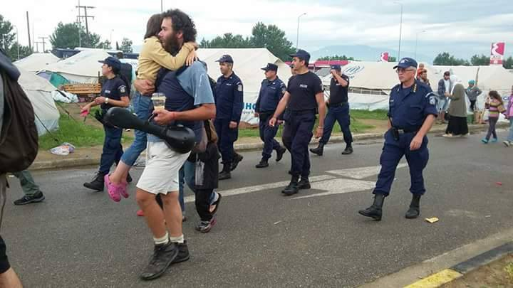
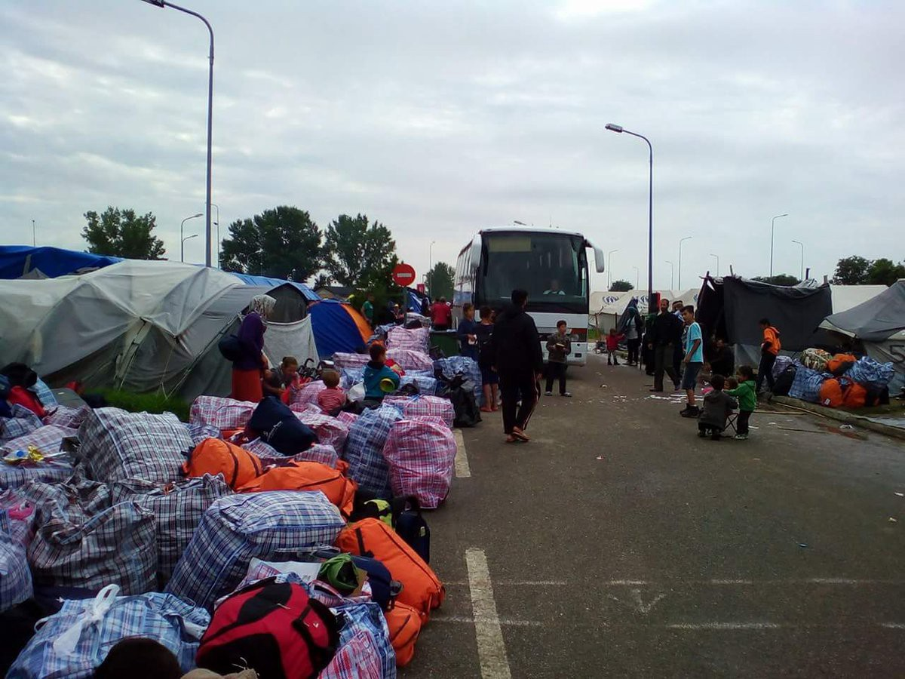
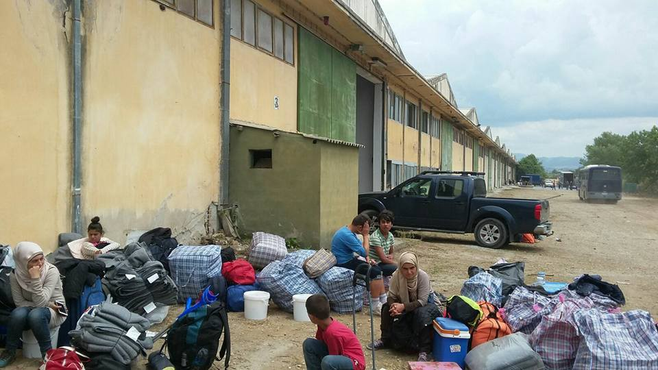
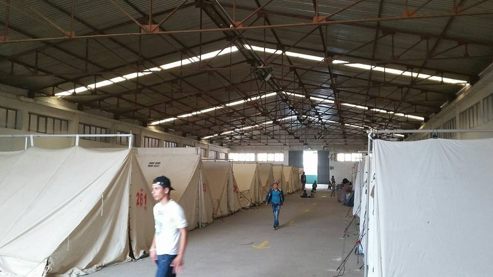
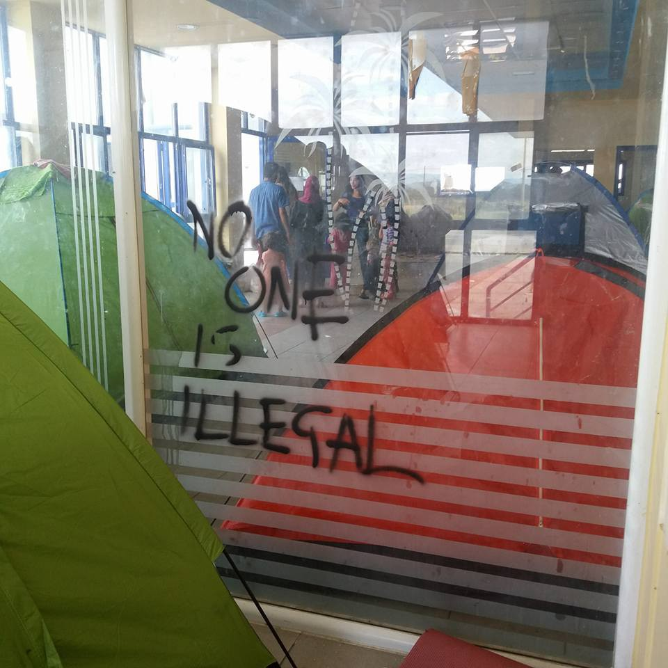
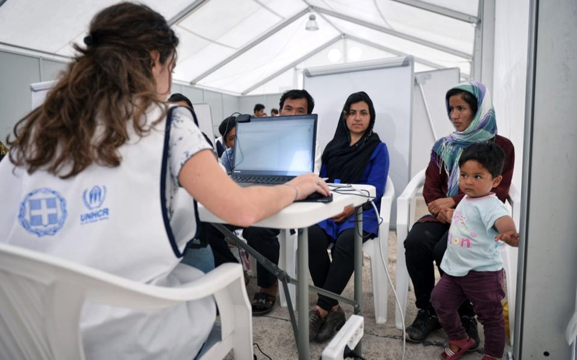
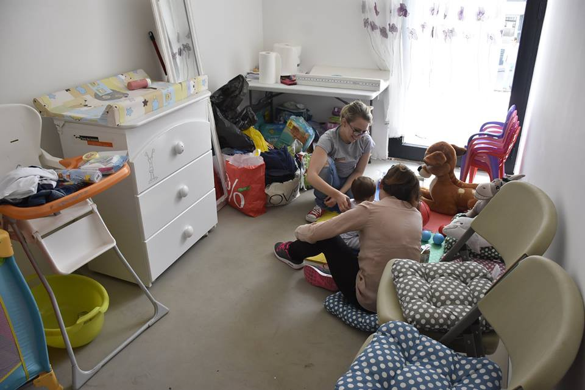
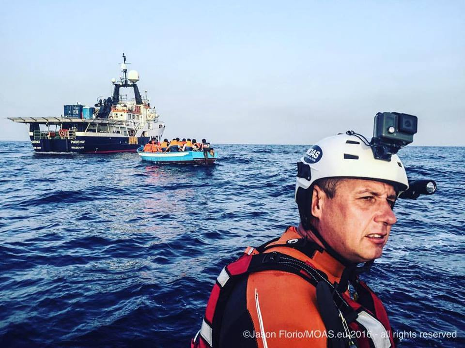

### [AYS Daily News Digest 13/06:](ays-daily-news-digest-12-06-where-are-refugees-now-166860852dcd) Evacuations of makeshift camps around the area of Polykastro

Eviction of Eco camp: volunteers saying final goodbyes to little refugees

Eviction of Eco camp\. Photo Credit: Refugee Care\.
### Evictions of EKO, Hara and BP continue

Following evictions of refugees from Hotel Hara and BP station, evacuation started this morning at ECO gas station without any warning from the police\. The volunteers said the police came around 4 am and told everyone to evacuate immediately\. Final count: 32 buses, around 1,132 refugees evacuated\. People on the ground reported that the Greek police arrested a number of volunteers\. Refugees are taken to Vasilika military camp where no media is allowed in\. [THIS](https://www.google.de/maps/place/40%C2%B030%2705.4%22N+23%C2%B005%2754.6%22E/@40.5002598,23.0921639,15z/data=!4m5!3m4!1s0x0:0x0!8m2!3d40.501503!4d23.098497) is the best known location of the camp\.

Refugees waiting in front of new camp facilities Photo Credit: Hassan Alhomse

The new camp consists of tents inside an old abandoned facility\. According to first reports from site, it has running water and toilets, but it seems there will be not enough for all who come in during today and tomorrow\.

Inside the new camp\. Photo Credit: Hassan Alhomse

This morning, AYS volunteers have visited at least 5 Syrian families and more than 20 very small kids still living under very bad conditions inside a gas station squat near Idomeni\. They would like to go to Athens but they will have to go to one of the camps around Thessaloniki\. Among children, we met a 5 days old baby Ahmed, who was born on site\. AYS will keep supporting refugees throughout the evictions of makeshift camps around Polykastro\.

Five days old Ahmed lives in a gas station squat with his family\. Photo Credit: Nidzara Ahmetasevic, AYS

[Ekathimerini](http://www.ekathimerini.com/209542/article/ekathimerini/news/police-start-evacuating-migrant-camps-in-northern-greece) reports that recent evictions were part of a larger evacuation of makeshift camps around the area of Polykastro\. Around 300 officers were taking part in the operation to relocate a total of around 4,000 refugees from the makeshift camps into state\-run facilities\.

According to Ekathimerini, the operation is about to continue on Tuesday, on another camp close to a different gas station near the exit from the national highway for Evzonoi\. Some 1,936 refugees are living there\.
#### GREECE/GENERAL
### **UNHCR launches update of the regional Refugee and Migrant Response Plan**

[Today UNHCR is commencing an update of the regional Refugee and Migrant Response Plan](http://www.unhcr.org/en-us/news/briefing/2016/6/575a83e68/unhcr-partners-revise-funding-needs-greece-balkans.html) that monitors the eastern Mediterranean and Western Balkans\. Due to the EU\-Turkey agreement and border closures, an update was required\.

“These developments have had a significant impact on the numbers of refugees and migrants arriving, with a decrease in the number of people along the Western Balkans route and an increase in the number of people remaining in Greece\. While the measures adopted have significantly reduced the number of arrivals in Greece, over 57,000 refugees and migrants are currently dispersed across the country in several sites on the mainland and the islands\.”, said UNHCR spokesperson William Spindler\. In this sense, UNHCR and partners have shifted their focus from people on the move to the population already inside Greece, along with protection activities in the western Balkans\.
### **57,194 refugees currently stranded in Greece**

According to the Government sources, at 8AM today there were 57,194 refugees stranded in Greece\. There were 8,464 people stranded on the islands — 3,499 on Lesvos, 1,284 on Samos, 2,514 on Chios, 583 on Leros, 539 on Kos, 39 on Rodos, and 6 on Kalymnos\. The Government reports 14,851 in Attica region\. Further, there are 2,126 people in Central Greece and 283 in Southern Greece \(in Kyllini Andravidas\) \. Finally, the Government reports 26,110 in Northern Greece\. There were 67 new arrivals to the islands in the 24 period ending at 07:30AM this morning, with 37 on Lesvos, 11 on Samos and 19 on Chios\.
### **So far 1,200 refugees pre\-registered in Thessaloniki and Athens areas**

Refugee family getting pre\-registered in a refugee camp\. Photo Credit: Ekathimerini

In an attempt to speed up asylum applications, Greece aims to “pre\-register” 1,400 people a day in its new asylum access system, which means they will be granted the legal right to stay in Greece for one year and to have access to basic services\. The operation began last Wednesday and seeks to deal with the some 48,000 people\. So far, 1,200 people have been “pre\-registered” on several sites in Thessaloniki and Athens areas\. Preregistration in Cherso camp will start on Wednesday and should last for 3 days\.

Refugees will receive an asylum applicant’s card, which means they should get an interview in the next few months with the asylum service\. Pre\-registration is seen as a first step to either relocation, family reunification or application for international protection in Greece\. The program will last for two months and aims to encompass all applicants that came to Greece from January 1 2015 until March 19, 2016, a day before the EU\-Turkey deal\.
### Refucomm searching for translators

Refucomm needs translators to help finish up a web link providing information for refugees in Greece\. For more information, please see [http://bit\.ly/1tn9yIf](http://bit.ly/1tn9yIf)
### **A boat with 200 refugees that sent a distress signal spotted safe and sailing to Italy**

After a passenger on a boat carrying about 200 refugees sent a distress signal off Crete on Monday, the boat was spotted safe and sailing to Italy, [the Greek coast guard said\.](http://af.reuters.com/article/commoditiesNews/idAFL8N1951RM)
#### BULGARIA
### **Bulgarian university offers major study programs in English for refugees**

New Bulgarian University in Sofia offers major study programs in the English language for people granted international protection, refugee or humanitarian status\. See: [http://bit\.ly/25TOFG0](http://bit.ly/25TOFG0)
#### SERBIA

Humanitarian center Novi Sad \(Serbia\) creates with the help of Terre des homes a new space for moms and babies where they can rest and get assistance\. Photo credit: Novosadski humanitarni centar\.
### **IHO moving to the North of Serbia, support and volunteers welcome**

IHO volunteers are moving from South of Serbia to the North and looking for support and volunteers\. To see how you can help, check out the following link [http://bit\.ly/21iP26y](http://bit.ly/21iP26y)
#### ITALY

Yesterday early in the morning MOAS assisted several vessels on the sea near Italy, one of them a wooden boat adrift for 3 days\. Photo credit: MOAS\.
### **More than 2,500 rescued off the coast of Sicily over the weekend, almost 50,000 have arrived in Italy since the start of the year**

More than 2,500 refugees were rescued off the coast of Sicily in Italy over the weekend, many of them from Cameroon, Ivory Coast, Senegal and Togo\. Almost 50,000 people have arrived in Italy since the start of the year with another 2,400 that have either died or gone missing in the attempt, [reports EU Observer\.](https://euobserver.com/tickers/133792)
#### GERMANY
### **Attacks on refugees continue**

Attacks on refugees continue\. In western Germany, a man fired shots with an air rifle at a refugee shelter and lightly wounded a five year\-old girl and an 18\-year\-old, [police said on Monday\.](http://www.thelocal.de/20160613/two-injured-after-man-fires-air-gun-at-refugee-home) Hate crimes and attacks on refugees reached their peak in Germany in 2015 with worrying statistics from German Ministry of Interior stating [more than 1,031 recorded cases of attacks on refugee homes](http://www.thelocal.de/20160523/extremist-violence-exploded-during-record-year-for-refugees) that year\.

At the same time, Berlin is considering stronger legislation against child marriages in light of the concern that, as Angela Merkel claims, migrant children who entered into marriages abroad may be forced to continue living in such marriages upon their arrival in Germany\.

_Converted [Medium Post](https://areyousyrious.medium.com/ays-daily-news-digest-13-06-evacuations-evacuations-of-makeshift-camps-around-the-area-of-6d75a06ecd11) by [ZMediumToMarkdown](https://github.com/ZhgChgLi/ZMediumToMarkdown)._
