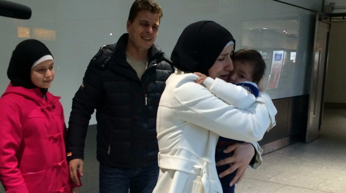
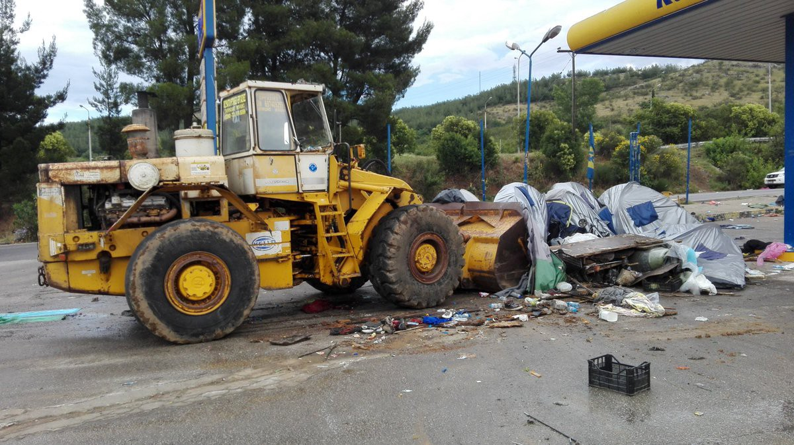
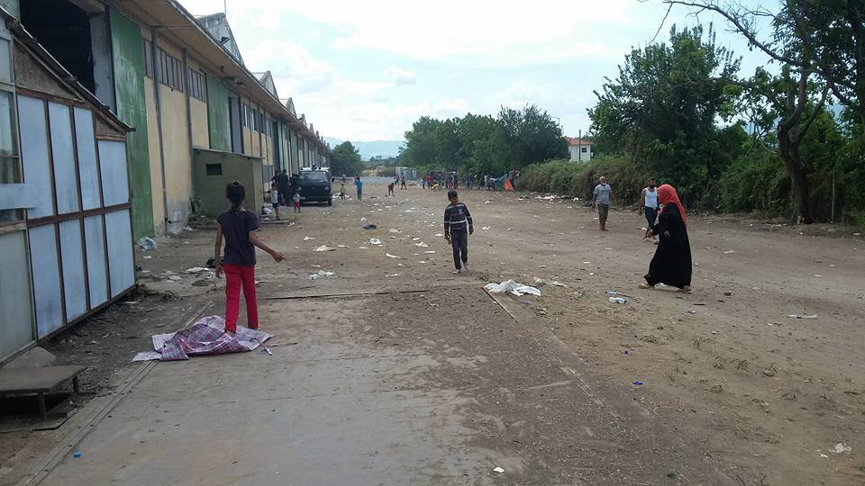
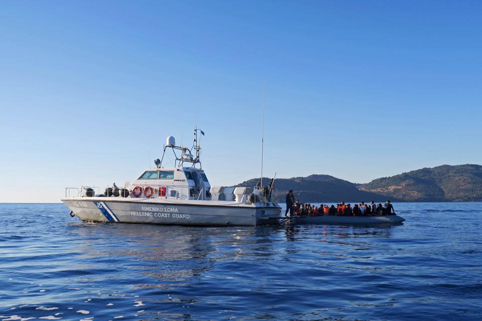
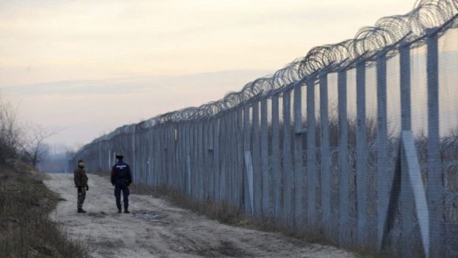
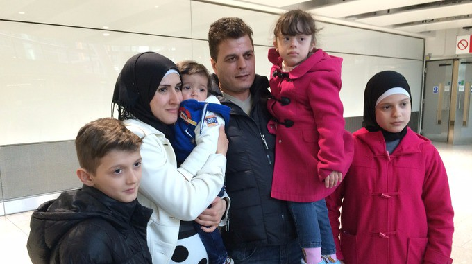

### AYS News Digest 14/06: No place to call home
#### EU envoy in Turkey resigns\. Both Elliniko and Piraeus scheduled for eviction\. Greek government announces significant increase of official accommodation capacities, but volunteers didn’t notice any new tents in camps\. First days in Vasilika camp: scarce food, dirty toilets\. 60 refugees rescued off Lesvos\.

_Rajaa Al Sharki holds her youngest son close after a tearful reunion\._ Credit: ITV Cymru Wales / Alexandra Lodge
#### Turkey
### EU envoy to Turkey resigns after breakdown in relations with Turkish government\. Diplomatic ties between Turkey and the EU continue to worsen\.

> The EU’s top envoy to Turkey has resigned after less than a year in the job following a breakdown in relations with the Turkish government\. 

> Hansjoerg Haber had publically criticised the conduct of the Turkish leadership over a landmark deal to tackle the Mediterranean refugee crisis\. 

> His decision to stand down represents yet another milestone in Europe’s failure to move towards a solution to prevent the deaths and abuse of those fleeing conflict in the Middle East and north Africa\. 

EU diplomat Hansjoerg Haber, then the head of the observer mission to Georgia, speaks to journalists in Mukhrani in 2008 Getty Images
#### Greece
### Suspicious increase in official camp capacities, more areas scheduled for eviction

> Today, our volunteers noticed a big increase in maximum capacities of Greek camps\. According to daily numbers handed out by Greek officials, 17 camps, many of whom have already breached their capacity limits, are reporting sudden increases of their capacities\. According to officials, Samos and Chios gained nearly 2000 spaces overnight, and are no longer overcrowded\. Officials claim Frakapor, Softex, Nea Kavala, Drama, Konitsa, Thermopylae, Eleonas, Agios Andreas, Lavri, and Skaramangas also became uncrowded overnight\. They even added 100 places to Elleniko airport to relieve overcrowding\. Total capacity numbers suddenly grew for 6,000 places, which would mean official camps are now able to accommodate the entire refugee population in Greece\. But, many volunteers from mentioned camps say they haven’t noticed any new tents being built\. If this is true, it means the numbers are “fixed” on paper, while in reality camps are facing more overcrowding as Elleniko, Baseball, Hockey, and Arrivals Camps, as well as port Pireaus, are now in the same category as Hara and BP: cleared for eviction of refugees to new camps \(including the ones that miraculously gained 6,000 places overnight\) \. 

### Hara camp now completely evicted

Bulldozing of a makeshift camp in the North\. Credits: Radio Kras

A [report](https://www.facebook.com/Northernlightsaid/posts/1797999017097387) directly from the Northern Lights Aid:

> Last night we were told by a UNHCR representative that Hara camp and BP camp would be evicted by police today\. 

> After learning this, a few of our volunteers drove to Hara to attempt to save some of the school supplies that we had donated\. Upon arrival to the camp they were stopped and searched by police\. They were told that it is forbidden to be at the camp and that they would only be able to enter again after the camp was completely evicted\. 

> Today police are blocking both the highway and back road going to Hara, which more or less confirms that the camp is currently in the process of being evicted\. 

> Residents of the camps are being brought to undisclosed, government\-run camps surrounding Thessaloniki\. 

> Now that our projects in Hara have abruptly come to an end, we will be shifting our energy to new projects within the government\-run camps in the area\. Many of these camps have very poor living conditions so we will be working diligently to improve the standard of living for the new residents of these camps\. 

Police operation for today included eleven buses with 630 refugees leaving Hara hotel and BP\.

](assets/d7ea8fb01ba7/1*bEtmLEMmFBkc7F8qqesfsA.jpeg)

Eviction of EKO camp\. Credits: [**Hassan Alhomse**](https://www.facebook.com/profile.php?id=100010927244202)
### The first day in Vasilika camp

> According to refugees, the first day in the new camp was terrible\. They say the food is not good, in some cases insufficient and spoiled\. Military food is especially unpleasant after weeks of proper meals served by volunteers in EKO and other unofficial camps\. There are also no supermarkets close to Vasilika where people could buy decent food\. 

> The toilets are the biggest problem\. They are very dirty\. 

> Yesterday, people from the nearby towns crowded near the camp and started to throw stones into the camp, according to refugees testimonies\. The military personnel told us that the people there don’t want the camp in the area\. The police solved the problem in the end, however, after seven hours\. 

](assets/d7ea8fb01ba7/1*TAli6pSuvqzIs1tjGjwbaw.jpeg)

Refugees slowly getting used to the new environment\. Credits: [**Hassan Alhomse**](https://www.facebook.com/profile.php?id=100010927244202&fref=photo)

](assets/d7ea8fb01ba7/1*0jBAUkaN1OwKvvyeGlC3Yg.jpeg)

Daily meal: pasta with some sauce\. Credits: [**Hassan Alhomse**](https://www.facebook.com/profile.php?id=100010927244202&fref=photo)
### 60 refugees rescued by the Hellenic Coastguard near to the coasts of Lesvos today

> Despite closed borders and the notorious EU\-Turkey deal, refugees still attempt the dangerous sea crossing to Greece\. Today, Hellenic Coastguard intercepted an rubber boat and rescued 60 people near the coast of Lesvos\. 

Credits: Frontex
### Jobs for 100 Greek Independent volunteers

Information available [here](http://thepolisproject.gr/agora/item/1770-100-proslipseis-sto-kentro-prosfygon-sti-ritsona) \.
#### Hungary
### Hungarian police can now legally send illegal immigrants back across border

> Yesterday the parliament of Hungary approved a law that allows for people caught within 8km of the fence to be brought back to the Serbian side of the transit zone\. There are also some changes to the way asylum requests are dealt with at the border\. According to Gyorgy Bakondi, Orban’s chief security adviser, this allows for closure of Bicske, the biggest refugee camp in Hungary\. We don’t have more details on the planned time of closure\. The law itself will be effective a week from today\. 

Hungarian\-Serbian border\. Credits: About Hungary
### Information leaflet on Hungarian law finally available

> The Hungarian Helsinki Committee has published a new information leaflet in 10 languages \(English, Arabic, French, Kurdish, Hungarian, Pashtu, Persian, Spanish, Somal\) that can be downloaded [here](http://www.helsinki.hu/en/info-leaflet-for-asylum-seekers-in-10-languages/) \. However, as the Hungarian law has changed again yesterday, expect more updates soon\. 

### Excessive use of police force at Hungarian\-Serbian border

> Since May, UNHCR staff and partners have collected information on over 100 cases with disturbing allegations of excessive use of force as people try to cross the border\. With the new law, situation might worsen\. 

#### UK
### A Syrian family living in Wales have finally been reunited with their one\-year\-old son after being forced to leave him behind in Lebanon

> The Al Sharki family say they had no choice but to leave baby Omar, after an admin error on his passport meant he couldn’t travel with them\. 

> His passport stated he was born in Damascus rather than Lebanon, meaning he couldn’t re\-join his family in Wales until it was changed\. 

> But his parents said they couldn’t afford to do this and turned to The Red Cross to help them\. 

> After more than four months apart, the family are now back together in Cardiff to celebrate baby Omar’s first birthday\. 

> The Red Cross are also calling on the UK government to re\-introduce legal aid to make situations like this quicker to resolve\. 

> We don’t think it should take four months to fix a simple administration error\. We are therefore asking the government to simplify the whole process and bring back legal aid to help families that can’t afford to navigate this process – LARA CUMMING, RED CROSS CHARITY 

_Rajaa Al Sharki holds her youngest son close after a tearful reunion\._ Credit: ITV Cymru Wales / Alexandra Lodge

_Al Sharki family reunited\. \._ Credit: ITV Cymru Wales / Alexandra Lodge
#### Kenya
### After closing Dadaab camp, more time needed to repatriate Somali refugees in Kenya than is currently allowed by the state

> The Kenyan government has ordered the world’s largest refugee complex closed by November\. The UN refugee agency has called for more time to avert “transferring the problem” to war\-torn Somalia\. 

> UN refugee agency chief Filippo Grandi on Monday said voluntary repatriation is the best solution for hundreds of thousand of Somali refugees in Kenya after Nairobi ordered the closure of the world’s largest refugee complex\. 

> “\(Kenyan\) President Kenyatta is quite determined to get through this in a relatively short period of time\. I told the president that in order to mobilize these resources, we need a bit more \(time\),” Grandi said at a press briefing in Nairobi, referring to a November deadline for the complex’s closure\. 

> Nearly 350,000 refugees, mostly from neighboring Somalia, reside at the Dadaab refugee camp\. But only 14,000 Somalis have opted to voluntarily return to their country since December 2014\. 

> Grandi called for international donors to fund infrastructure projects and create jobs in war\-torn Somalia\. Nearly one million people are internally displaced in the East African nation, mostly around the capital Mogadishu\. 

> “We don’t want to help people go back only to become internally displaced; otherwise, it’s just transferring the problem from one place to another where, by the way, it is more difficult to help them,” the UN refugee agency chief noted\. 

> “To create infrastructure in Somalia will take years, but we have worked in many situations in the world where you can do some quick fixes so that some initial activities can start, and that will go a long way in ensuring the sustainability of returnees,” Grandi added\. 

> Kenyan authorities fear militants have infiltrated the refugee complex following multiple attacks across the country claimed by the al\-Qaeda\-affiliated Somali militant group al\-Shabab based in Somalia\. 

> Nairobi reversed an earlier decision to close the Kakuma camp hosting nearly 200,000 refugees, many from South Sudan, the UN refugee agency chief added\. 

_Converted [Medium Post](https://areyousyrious.medium.com/ays-news-digest-14-06-no-place-to-call-home-d7ea8fb01ba7) by [ZMediumToMarkdown](https://github.com/ZhgChgLi/ZMediumToMarkdown)._
