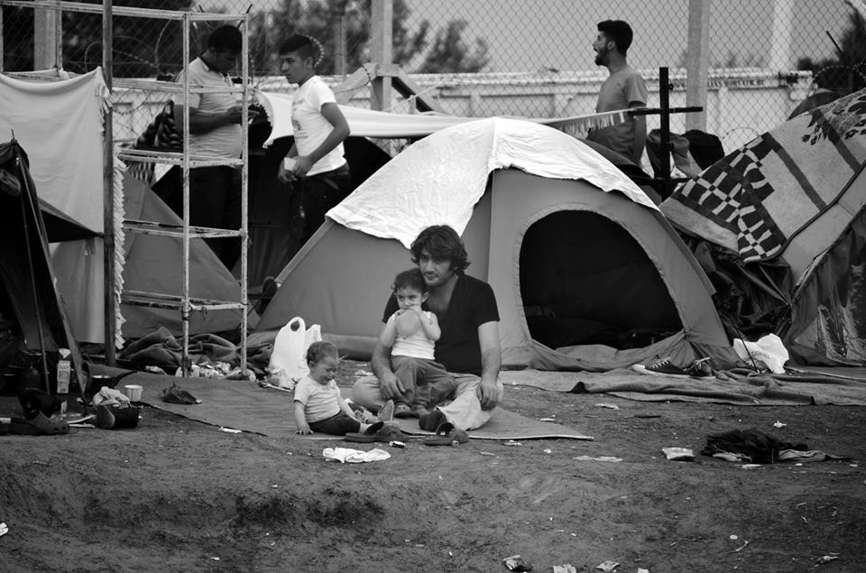
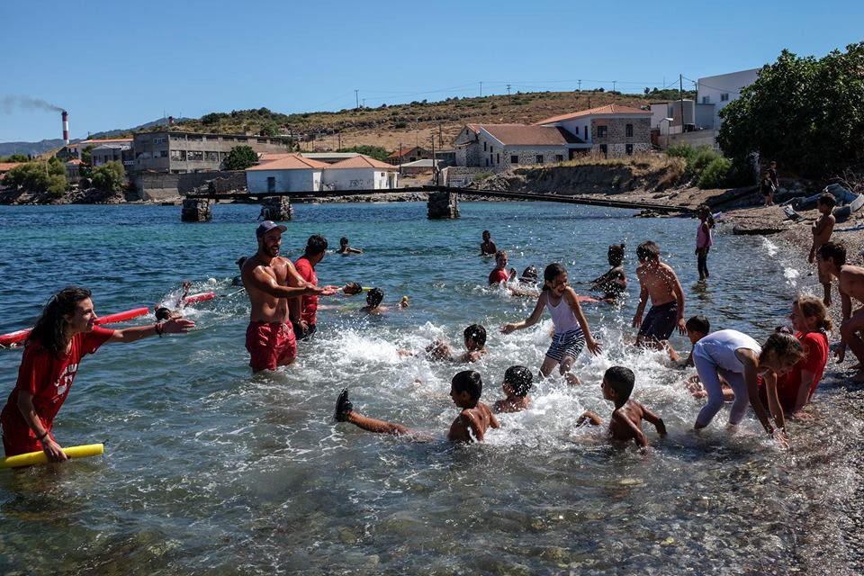
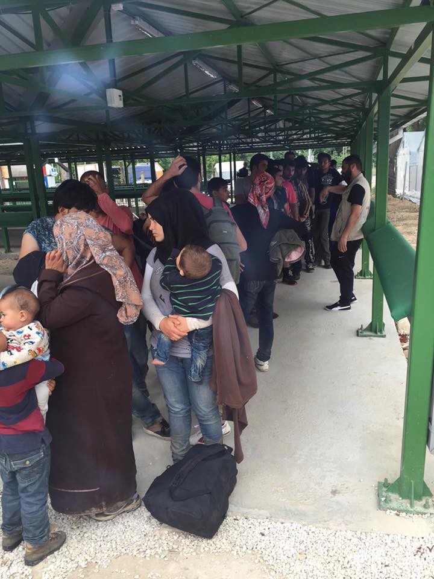
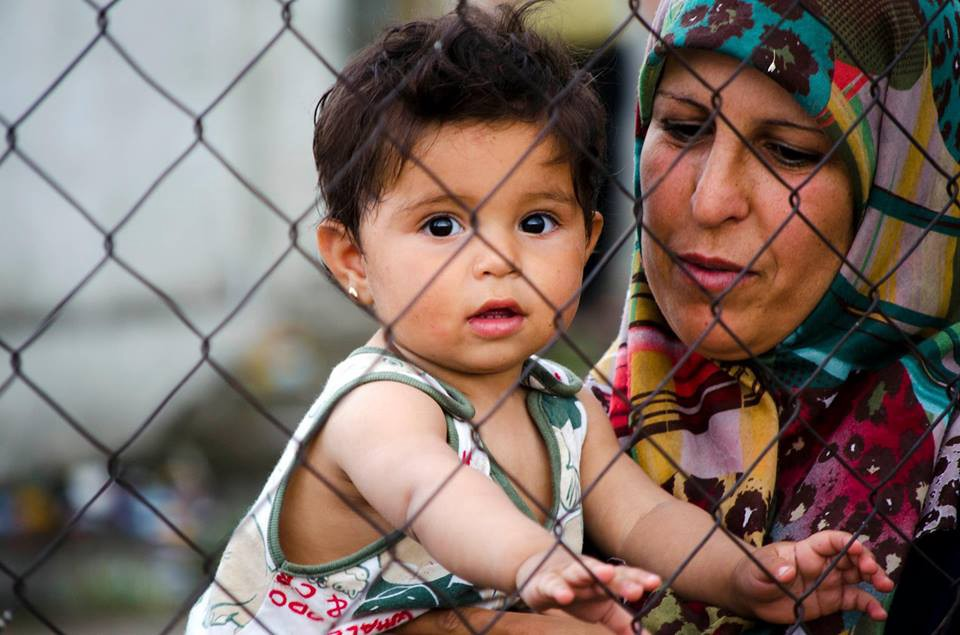
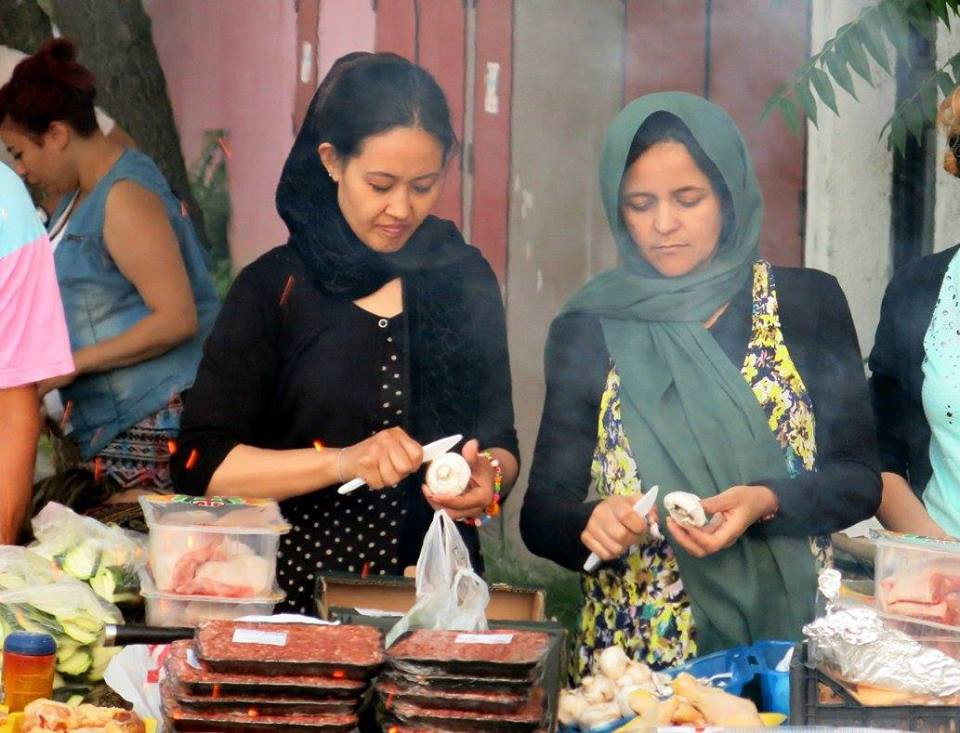
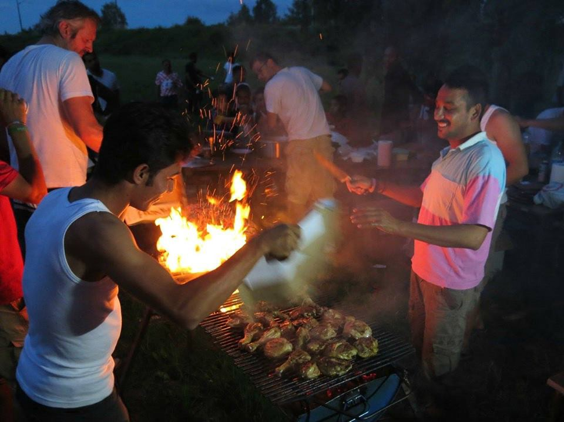
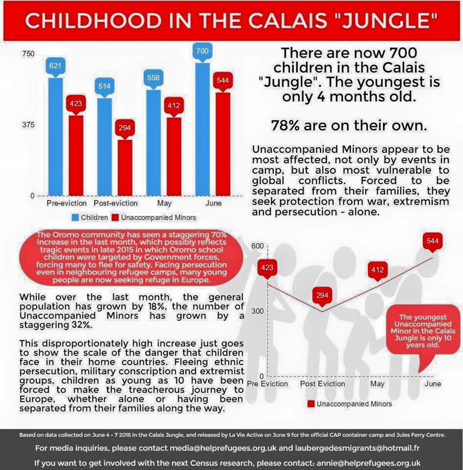

### AYS NEWS DIGEST 19/06 — The Turkish border police has killed refugees once again\.

Refugees trapped on the Hungarian\-Serbian border in Kelebija crossing\. Photo Credit: Valczer Hajni
#### Syria

**8or 11 Syrian refugees were killed today by the Turkish border police as they attempted to cross the border\.**

4 to 6 of the victims were children\. The incident took place at Khirbet al\-Joz in Idlib province\. The Syrian Observatory for Human Rights \(SOHR\) reports that today’s deaths make at least 60 killed by Turkish border guards this year\. Turkey has been shutting down its borders to Syrian refugees for several months now, leaving tens of thousands stranded near the border, living with the fear of potential advances by ISIS and/or the regime which would endanger their lives\.
#### Iraq

**43 thousand Iraqis have been displaced from Fallujah since May 22 as a result of the ongoing struggle to retake the city from ISIS\.**

As the Iraqi army undertakes the liberation of the city, civilians are once more left in the crossfire between the military and ISIS fighters\. Many are residing in unsanitary and deteriorating conditions\. Tents, water, healthcare, and other items are urgently needed\.
#### General
### Watch out for heat stroke\!

This summer is expected to be one of the hottest on record\. Refugees are particularly vulnerable to the risks, given their housing in tent cities\. One can find a list of heat\-related ailments and advice for treatment [here](https://drive.google.com/file/d/0B29cDLHZQ7FYYlhuVGgyWG94WDg/view) \. It is very important that everyone, especially children and old people, stay hydrated and try to remain out of the heat as much as possible\. Electrolyte imbalances may be avoided by mixing 1\.4g of salt, 68g of sugar, and some fruit juice for every liter of water\.
#### Greece
### There have been 41 new arrivals to Greece today\.
### Please help to support Helping Hands on Samos\!

On Saturdays, the entire team meets at the warehouse for a big day of sorting\. Yesterday, we were joined by Matjaz and Sarah, who are here in Samos doing a photography project with the refugees\. Their aim is to take special, dignified portraits of families and individuals to counter the tide of negative and dehumanizing images of refugees en mass that dominate the media\. We were lucky enough that they took a group picture of us while they were with us in the morning\.
In the afternoon a team of us reorganized the clothing distribution cabin which we hope will make the service fairer and more efficient\.
Today three of our team went in to provide tents, clothes, sleeping bags and hygiene items to 41 new arrivals\. They are currently still there 5 hours later, trying to arrange accommodation outside the camp with partner groups on the camp for a very vulnerable family\.
To support the work we do in the warehouse and camp, please visit [www\.gofundme\.com/samos4refugees](http://l.facebook.com/l.php?u=http%3A%2F%2Fwww.gofundme.com%2Fsamos4refugees&h=NAQHUJvBo) \.

Lifeguard volunteers teach refugee children living in Kara Tepe Camp on Lesvos how to swim\. Photo Credit:Fahrinisa Oswald
### English teacher, shoes, and powdered milk are needed at Cherso Camp\.

The teacher must be a woman, and she will be working with Yazidi women\.
#### Serbia
### A large group of refugees has arrived today at Preševo One\-Stop Center\.

Refugees at Preševo\. Photo Credit: Youth for Refugees
### An increase in the number of refugees in Serbia has been confirmed\.

UNHCR Representative in Serbia Hans Friedrich Schodder [has confirmed that](http://www.blic.rs/vesti/svet/soder-brojke-izbeglica-pale-ali-potrebe-vece/fqfw2pq) there were around 1,800 refugees in the country today\. While Serbian borders are officially closed, hundreds of refugees pass through the country every day\. Many of them are traveling illegally, often with the help of the smugglers\. 
“While the \(official\) numbers of refugees have dropped since the border closure, the needs are even bigger now, when we are seeing that up to 40% of refugees are children\. Yesterday we had 200 children on the Serbo\-Hungarian border,” Schodder told Tanjug news agency, adding that the numbers of refugees passing through the country after crossing the Macedonian and/or Bulgarian borders is once again on the rise\. This coincides with the news from Preševo, where volunteers have noted an increase in arrivals, as have their colleagues in Belgrade recently\.

Refugees trapped on the Hungarian\-Serbian border in Kelebija crossing\. Photo Credit: Valczer Hajni
#### Croatia
### 123

This weekend, AYS volunteers threw an open\-air party for the refugees in front of Porin hotel in Zagreb\. We had sport tournaments and games for the kids during the day, followed by the barbecue in the evening\. Many of the residents of Porin joined us in preparing delicious Iftar feast, making it a wonderful weekend for both us and them\.

Refugees and AYS volunteers sharing an Iftar meal in front of Porin Hotel

We are also taking part in organizing the [3rd Tjedni IZBJEGLICAma](https://www.facebook.com/events/1210562015643214/?hc_location=ufi) , which is a festival dedicated to the refugees, with lots of activities to follow\. You can find a schedule \(in Croatian\) [here](http://cms.hr/system/article_document/doc/300/Program_3._Tjedni_IZBJEGLICAma_-_od_subote.pdf) \.
#### Slovenia
### There will be a Refugee Day protest tomorrow in Ljubljana\.

While many volunteers are preparing special events for the World Refugee Day, our Slovenian colleagues have instead decided to throw a protest, saying there’s nothing to celebrate\. The nation’s capital will be the site of a protest in favor of refugees\. “On June 20 World Refugee Day is observed, but there are no causes for celebration\. The illegitimate deal between the EU and Turkey is still in force, Frontex still pushes the endangered people into the sea, and Slovenia is still fenced\. The relocation of people to another EU member state also does not work\. The violent closure of the Balkan route has produced a humanitarian catastrophe in Greece, Turkey, and Syria\. Meanwhile, people in the countries where refugees come from, are still threatened by wars, unrest, and poverty\. Dissenters are oppressed and endangered by the repressive state apparatus and extreme organizations,” wrote the organizers of the event, warning that the rate of approval in Slovenia is among the lowest in Europe\. Statistics show that out of 300 processed applications, only 11% had a positive outcome\. You may find the Facebook page for the event [here](https://www.facebook.com/events/1686509511611937/?acontext=%7B%22ref%22%3A4%2C%22feed_story_type%22%3A308%2C%22action_history%22%3A%22null%22%7D) \.
#### Italy
### There is a petition going around against the Italian government’s persecution of Ospiti in Arrivo\.

The petition, titled, “Arrest us all\!” seeks to defend the organization Ospiti in Arrivo, active in advocacy and welcoming migrants, guilty of having filled the state’s gaps and for having asked inconvenient questions, such as “where do the €300,000 for Italian Red Cross go exactly once CRI receives the sum?” The petition may be signed [here](https://www.change.org/p/governo-italiano-solidariet%C3%A0-ad-ospiti-in-arrivo-arrestateci-tutti) \.
#### France
### Studies by Refugee Rights Data Project and Help Refugees shows the stark realities of refugee women and children living in Calais\.

The report, although it uses a rather small sample size of 27 women, nonetheless reveals that life for women in “the Jungle” are difficult\. Of the women interviewed,

— 42% reported experiencing violence in the camp
 — 81\.5% have experienced police violence since arriving in Calais
 — 73% said that they felt unsafe in the camp
 — 56% reported deteriorating health in the camp

The full report may be read [here](https://www.facebook.com/RefugeeRightsData/posts/1548590078781165) \.

A report was also compiled by Help Refugees, detailing the life of children living in Calais\. It’s findings are aptly summarized in the following infographic:

_Converted [Medium Post](https://areyousyrious.medium.com/ays-news-digest-19-06-turkish-border-police-kills-refugees-once-again-4694b698e92c) by [ZMediumToMarkdown](https://github.com/ZhgChgLi/ZMediumToMarkdown)._
