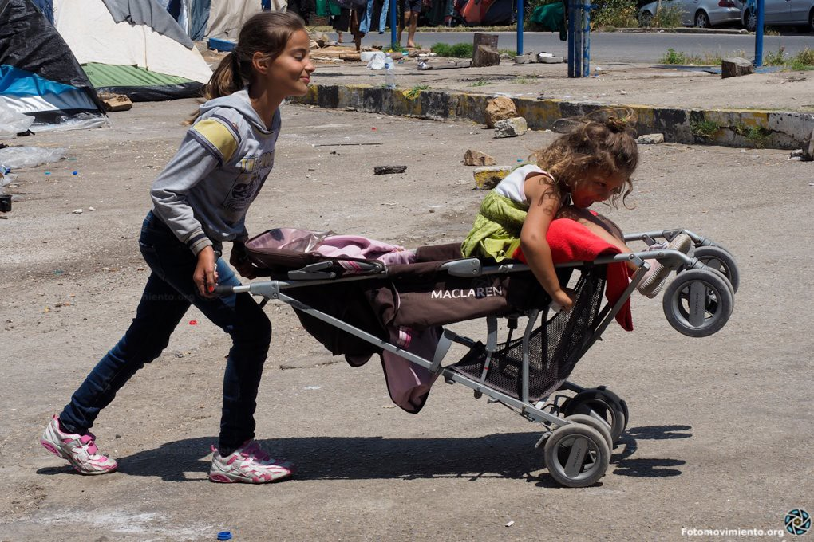
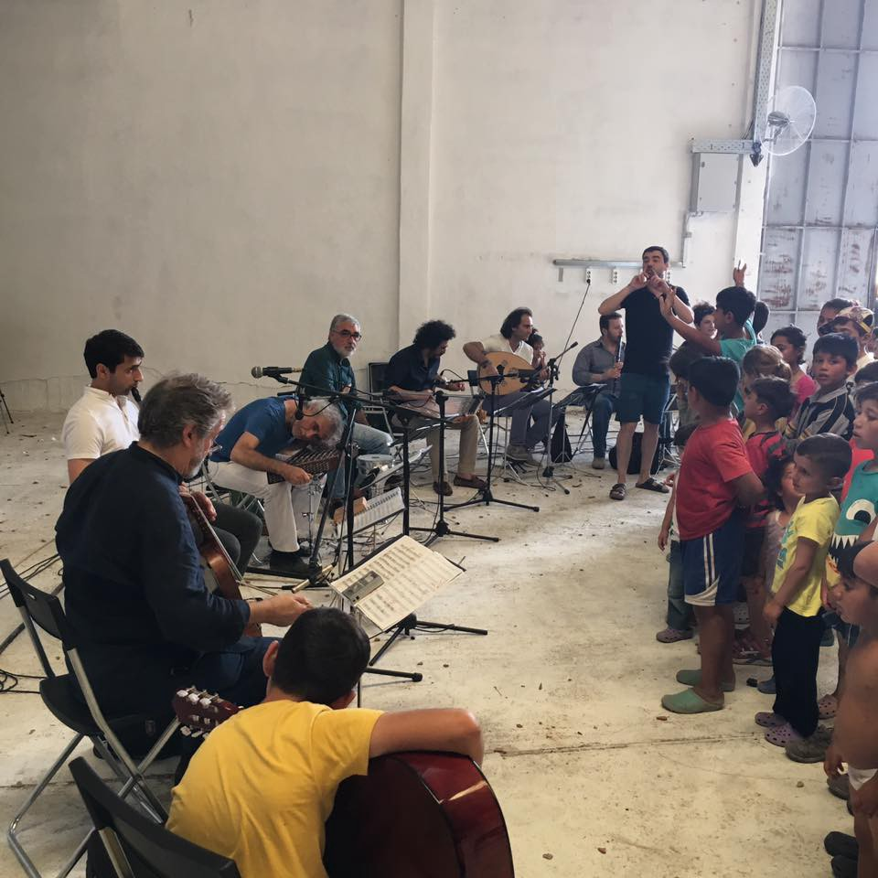
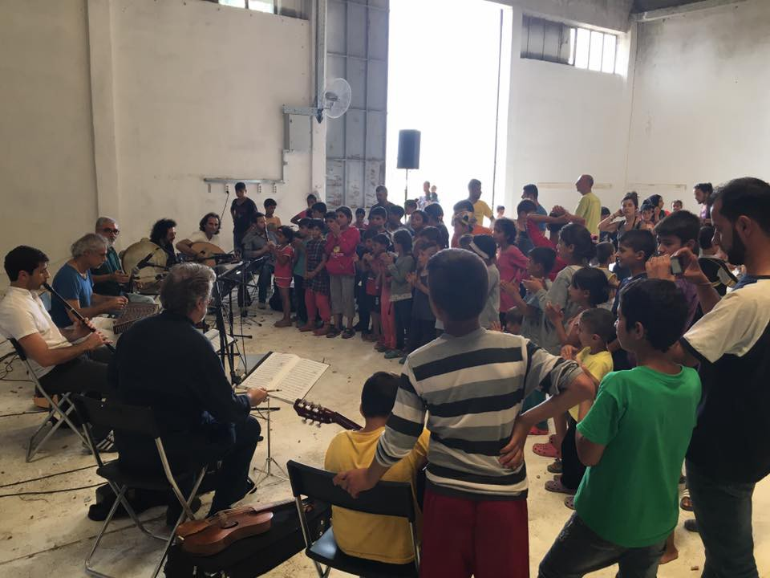
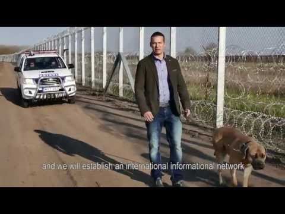

### AYS News Digest 18/6: UN Secretary General fails to raise hopes of refugees stranded in Greece

GPhoto Courtesy of Fotomovmiento 15 M
#### GREECE

> EDITOR’S NOTE Removed reports of changes for Iraqis in July 

> As we are getting conflicted unofficial reports about the possible deadline for registration of Iraqi refugees, we’ll wait until we can get a full confirmation or denial\. We’d like to urge everyone not to spread unconfirmed info as it could lead to unnecessary panic among the refugees\. 

#### LESVOS
### UN Secretary General Ban Ki\-Moon visits the island of Lesvos and offered remarks in Mytilene, Greece today after meeting with several families\.

Courtesy of Ariel Ricker of Advocates Abroad, part of Secretary General Ki\-Moon’s comments can be seen here:

The Secretary General decried the conditions faced by refugees, citing evidence of economic disenfranchisement and sexual abuse\. The Secretary General also called on the international community to do more to prevent the drowning of the “equivalent of two full trans\-continental passenger jets” in the mediterranean every month\.

Despite these encouraging words, though, in the wake of other visits from foreign dignitaries such as Angelina Jolie and Pope Francis, which resulted in little tangible benefit for refugees, most refugees in the area remain unimpressed, reported Ariel\.

> “Most of us stayed in our tents when he \(Ban Ki\-Moon\) came into Moria\. We had hope when the Pope came\. Nothing changed\. We have no hope\. So now it doesn’t matter who comes\.” 

> \- Pakistani Refugee from Moria 

Furthermore, Secretary General Ki\-Moon and Greek Prime Minister Alexis Tsipras came under some criticism on social media following Tipras’s gift of a clearly defunct life\-jacket to the Secretary General\. Whether intended as a subtle critique of the lack of progress being made in preventing refugee deaths in the Mediterranean or not, many feel that the gift — and especially the lighthearted atmosphere around the bestowal of it — was in poor taste, especially in light of recent Mediterranean tragedies\.

#### SINDOS

Reports from Sindos indicate a truly appalling lack of care or adherence to standards\. Those there are not allowed freedom of movement, there is a shortage of water, and food provided is insufficient and low quality\. There is little recourse for those experiencing harm from the heat\. Furthermore, no volunteers are allowed in to alleviate the intense suffering there\.
#### THESSALONIKI

A group of five refugees was intentionally hit by a car near Thessaloniki, their condition remains unknown\. Warning, video is graphic\.

#### VOLUNTEER
### English speakers and teachers wanted\!

The Open Cultural Center operating in Lavrio camp has put out a call for native English speakers for conversation classes as well as qualified teachers to participate in an educational and cultural project\. Those interested are encouraged to send them a message [on their Facebook page](https://www.facebook.com/Open-Cultural-Center-OCC-former-Idomeni-Cultural-Center-1302471973114551/?fref=nf) \.
#### ITALY
### Up to 10,000 minors may have ended up in the hands of the mafia\.

[According to media](http://www.elmundo.es/internacional/2016/06/16/576178b8ca47410c678b45ad.html) , Italian authorities have only been able to locate around 35% of the Somalian minors it had registered\. This is one of the smallest percentages of children “lost,” with Afghan minors nearing 67% and Eritrean children 56% for being lost\. In a troubling turn of events, Egyptian minors which are only 2/3s accounted for, are forced to stay in Italy to “pay back” their journey through illegal work at markets, on behalf of drug deals, or in sex trafficking\. Sex trafficking, specifically, has a particular correlation with Nigerian girls often disappearing once they arrive in Italy and appearing in brothels\.

Music demonstration in Thessaloniki Photo Credits: Chloe Kousoula
#### SERBIA
### Fund has helped over 1,000 refugees avoid smugglers in Serbia\.

The Info Park Vulnerability Fund which targets and assists vulnerable refugees who lack financial wherewithal to make their journey across Serbia to the Hungarian border or to asylum camps is still functioning due to funding from the International Rescue Committee\. The fund has assisted more than 1,000 refugees, keeping them out of the clutches of predatory smugglers\. However [Info Park also reports](https://www.facebook.com/Info-Park-885932764794322/photos/?tab=album&album_id=1024861884234742) that one of the most active and powerful of the smugglers has returned to the park after an absence of a few weeks\. This would indicate that there will probably be an increase in smuggling and possibly trafficking along this part of the route in the future\.
#### HUNGARY
### New transit zone may give “Action Film Mayor” of Hungarian town a sequel\.

[Journalists in Hungary report](https://twitter.com/balintbardi/status/736241765708115968) the new opening of a third transit zone between Serbia and Hungary\. This new transit zone is located near Asotthalom, which may ring a bell to those of you watching the news last year\. The town of Asotthalom is home to mayor Laszlo Toroczkai who hit the headlines in fall of 2015 with a series of action\-packed, aggressive ads warning refugees to not even

Another video featuring Toroczkai features less motorcycling, horse\-back riding, and epic soundtracks, but more overtly disturbing material as it betrays Toroczkai’s true attitudes towards refugees as he repeats familiar\-sounding depictions of an “invasion” of Europe\. The community \(called [Custodela](https://www.facebook.com/custodela/?fref=ts) \) being promoted by Toroczkai in this film is even revealing as post after post repeats disturbing “analysis” of the refugee crisis that paints “European values” as the true victim\.

Unless the mayor has had a change of heart in the last several months, it remains a concern what would indicate insofar as the treatment of refugees passing through the transit zone\.
#### FRANCE
### New statistics released by Help Refugees and L’Auberge des Migrants reports numbers higher than previously thought in the Jungle

Population in Calais “Jungle” refugee camp has [increased by nearly 1000 people](https://www.facebook.com/HelpRefugeesUK/) since the “eviction,” however the actual influx is estimated at 1200 with 200 individuals being accounted for as turnover\. Camps are “far from the ideal, or anywhere close minimum humanitarian standards,” reports Help Refugees and L’Auberge des Migrants\. Of the 6123 people in the camp, around 700 children, the youngest being only four months old\. The two largest countries of origin are Afghanistan and Sudan, accounting for 36% and 32% respectively\. Despite all “official” efforts to close the camp, it is clear that it will remain a feature of the landscape in France for the foreseeable future\. In spite of this reality, the governments and major aid organizations instead turn away and pretend it doesn’t exist, and therefore 6123 souls remain invisible\.
#### UNITED KINGDOM
### French and UK authorities collaborate to prevent emergency aid convoy from passing through to France

Aware of the dire conditions in Calais, a massive aid convoy was organized by several small aid organizations\. However, their humanitarian mission was stopped in Dover as the French border authorities would not let them pass\. The aid convoy of over 250 vehicles was technically stopped by British authorities, but the authorities were operating upon request of the French\. The convoy was specifically targeted, as other cars and trucks were allowed to pass\. Activists protested this blockade as can be seen in the video below\.

The French cited security and terrorism concerns in the wake of the football hooliganism that unfolded in Marseille as British football hooligans and their Russian counterparts trashed the city and attacked each other and civilian bystanders\. Volunteers peacefully protested the blockade outside of the French embassy in solidarity\.

_Converted [Medium Post](https://areyousyrious.medium.com/greece-af9200d458fe) by [ZMediumToMarkdown](https://github.com/ZhgChgLi/ZMediumToMarkdown)._
