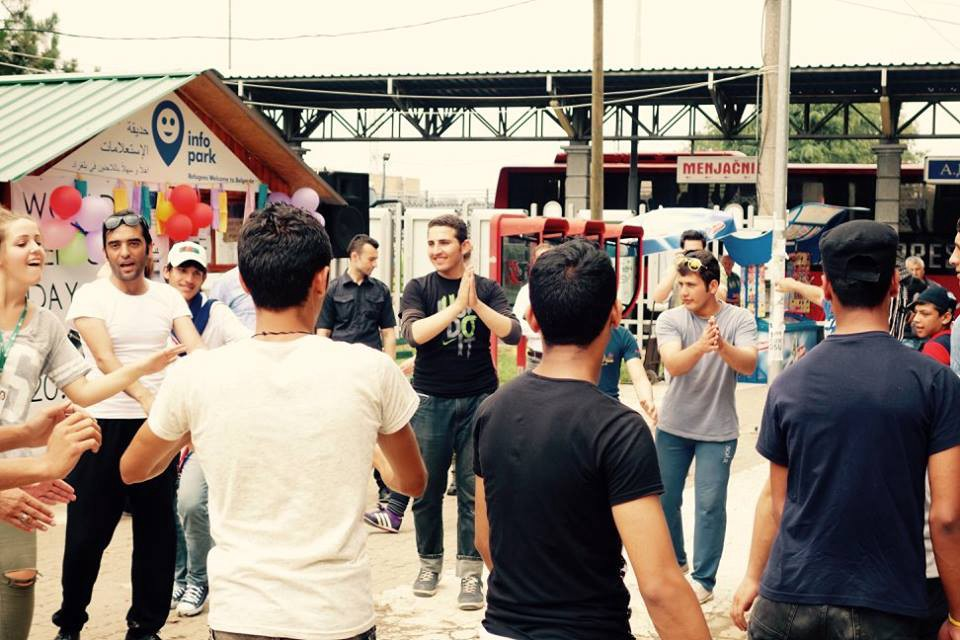
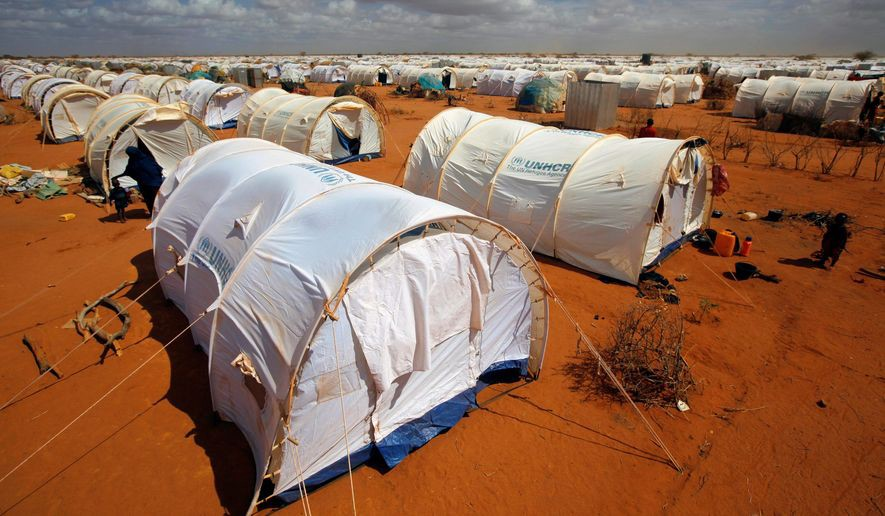
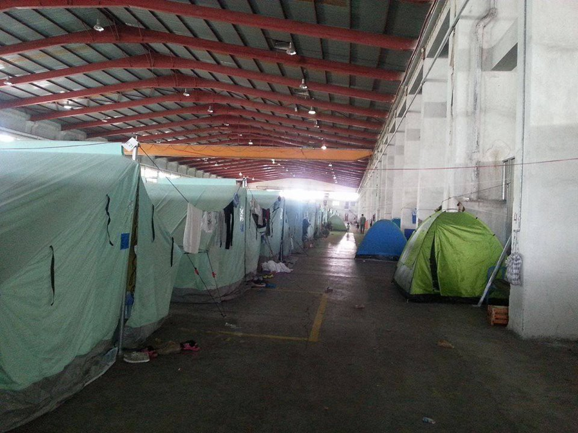
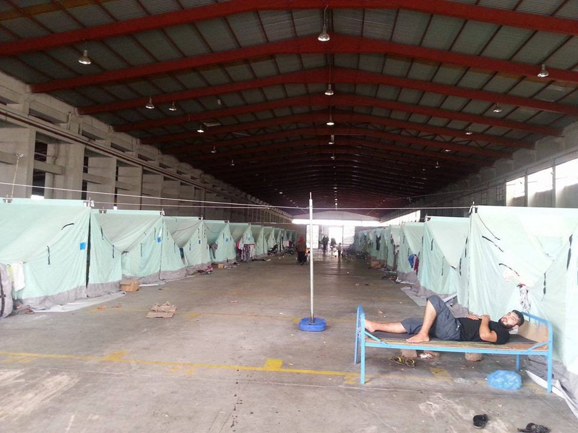
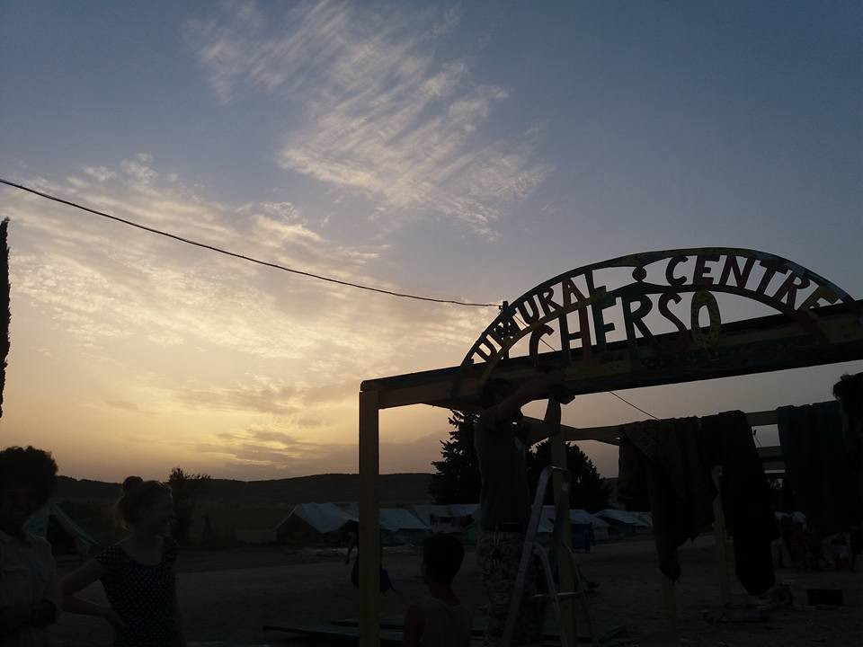
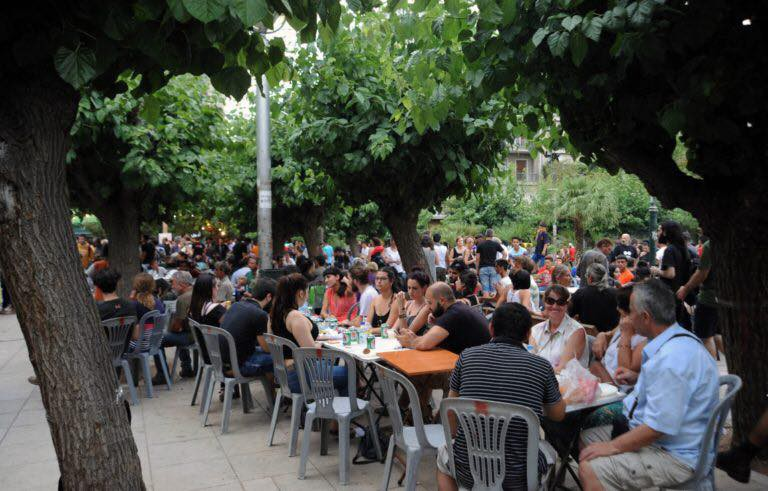

### AYS NEWS DIGEST 20/06 — World Refugee Day

Celebration of World Refugee Day, Info Park, Belgrade\.
#### GENERAL
### **1 out of 113 persons in the world is either a refugee or an IDP**

Today is World Refugee Day, and we’d like to use this opportunity as a reminder of the reality that there are more displaced persons in the world now than any other time in our modern history\. UNHCR just published the data for 2015’s forced refugees: 65\.3 million all around the world, meaning that 1 person out of 113 is a refugee or IDP\. There was been a steep increase of 5 million people last year\. Moreover, Western countries are less able, compared to the end of WWII, to find durable systematic solutions\. In 10 years, UNHCR recorded an increase from 6 to 24 refugees per minute, but the worst datum is the age: 51% refugees are under 16 years old\.

More than 50% of the refugees come from Syria, Afghanistan and Somalia\. 86% of the total amount found shelter in underdeveloped or developing countries, like Turkey, which hosts more than 2\.5 million refugees, followed by Pakistan and Lebanon\. Filippo Grandi, High Representative of UNHCR, has remarked on the rise of movements and parties leading xenophobic programs\. Only around 1 million refugees reached Europe in 2015, according to IOM, aiming to reach Germany and Sweden\.
#### KENYA

Even though today marks World Refugee Day, there are reports on serious threats to close the world’s largest refugee camp, that is camp in Dadaab, Kenya\. By closing the camp, Kenya plans to repatriate all the refugees from Somalia, or in other words: send them back to an unsafe zone\. Currently there are around 320,000 people residing in this camp and many agencies and organizations such as [MSF are urging Kenyan government not to do so\.](https://twitter.com/MSF_Sea/status/744911673698320385) The Kenyan government, on the other hand, is justifying this move as a security issue; a move against terrorism\. It is safe to assume that if and when this camp is closed the movement will affect other areas and bring much more hardship and tragedy\.

Daadab camp, Kenya\.
### **Weather warning: High waves up to 1\.7 meters in Mid Mediterranean between Libya and Italy\.**
#### TURKEY
### **New blog for information and analysis**

There is a new blog released today called HarekAct\. It will publish information that is hard to find in the mainstream media and will report to counteract the politically\-motivated decrease in transparency on the topic\. The blog will publish elaborate analysis, academic papers, and reports from the ground on a regular basis\. They explicitly invite fellow activists, critical academics and journalists to contribute to our blog with their own reports and analysis, to improve our activist cooperation\. For more, visit [http://bit\.ly/28NdB9l](http://bit.ly/28NdB9l)
#### GREECE
### **More and more kids getting sick in the camps around Greece**

With 56,937 people still stranded in Greece and reports of horrid conditions that [people suffer in makeshift camps where children get more and more sick, there was also one victory today\.](http://www.aljazeera.com/indepth/features/2016/06/greek-refugee-camps-children-grow-sicker-day-160618114138667.html)
### **Victory for school kids and against ghettoization of refugees**

Associations of teachers, collectives from City Hotel Plaza in Athens, and many others managed to enroll kids in public school today\. The Coordination of Workers’ Associations, Student Associations and Collectives for Refugees and Migrants call for a mass\-mobilization for the submission of applications to register children in public schools\. They are declaring their determination not to allow the ghettoization of refugee children, despite recent moves by the Ministry of Education and the government\. The coalition states that: “We collect parents’ applications from concentration camps, we, as associations and collectivities, are pushing for their registration by 21 June and in September, for their transport to and from school using buses, for the establishment of welcome classes in all schools, for food and health care for all schoolchildren\. We will be organizing a press conference on the issue very soon\.” For more follow the link: [http://bit\.ly/28Jxo6o](http://bit.ly/28Jxo6o)
### **Drop in the ocean needs help**

Drop in the ocean needs more aid in several locations in Greece, mostly around Athens area and northern Greece: If you can collect and sort, or even ship a large donation of specific items please get in touch with Cicilie at [cicilie@drapenihavet\.no](mailto:cicilie@drapenihavet.no) Needed items: Summerclothes\- all ages and sizes\- remember appropriate lengths, neck cuts, summer shoes — all ages and sizes, Sunhats, sunglasses, Muslim clothing such as hijabs and abaya\.
### **Very bad conditions reported from Oreokastro camp in the North**

People who were residing in front of Park hotel in the North of Greece have been transferred to Oreokastro camp, where refugees from Idomeni were also relocated\. The atmosphere in the camp is reportedly very bad, with strict officers, dull military food and extreme heat\. There’s nothing much to do in the camp\. The first town is 30 minutes away\. We have managed to obtain photos from the site, showing both indoor and outdoor facilities

Oreokastro camp\.

Oreokastro camp\.
### Construction of Cherso cultural center is in full swing and our volunteers are working tirelessly to erect it\.

Chierso cultural center\. Photo credit: AYS\.
### **World refugee day**

While there must have been many receptions today on account of World refugee day in many hotels around the world, with champagne served and speeches given, there were also many wonderful events that made the day brighter for those stuck on the former Balkan route and people working with them\. There were parties around Solidarity spaces in Athens, dancing in the park in Belgrade as well as concerts in Zagreb\. With more displaced people than ever in modern history, this day should serve as a reminder of what our reality really is\. We celebrate all who are on the move and all of those who work and live with people on the move\.

Celebration of World refugee day, Solidarity Space City Hotel Plaza, Athens\.
### **Some Italian officials pushing for more incentives for integration under a “widespread” model**

Also in Italy, in a more formal event Tuscany’s president Enrico Rossi opened the World Refugee Day’s event proposing an agreement to welcome refugees, and binding State, Regions and Municipalities\. “A pact for immigration and receiving is necessary\. In Tuscany, we received 8,000 people out of a population of 3\.7 million inhabitants\. So, we still have space for them, and I hope to open a debate as soon as possible with the State” he stated, adding that it would be convenient to propose incentives for the receiving municipalities\. Nationally, he urges the state to gain back its role of cultural leadership on the three principles of solidarity, welcoming, and democracy\.
#### HUNGARY
### **Call for international support for Roszke’s 11**

Moving Europe calls for international support for people on trial for last year’s events in Roszke/Horgoš 2 border crossing\. On the 27th of this month, trials are about to be held for 11 people in Szeget, accused by the Hungarian government of participating in a “mass\-riot”\. They were brutally beaten and arrested last year on 16th September 2015 at the Serbian\-Hungarian border Röszke/Horgoš 2\. The 11 people accused have been in prison since that day\. One of the accused, Ahmed H\., has been portrayed as the “leader” of the protest only because he was seen talking with a megaphone\. He is accused of coördinating a “terrorist attack”\. His trial will be held separately\. At least three of the accused are especially vulnerable persons\. One is a 64 year\-old half\-blind woman, and another person is disabled and in a wheelchair\. Both of them were injured in the war in Syria\. It is clearly ridiculous to cast these people seeking safety and protection in Europe as a “threat“ to the Hungarian state\. We support this call and demand media attention for the \#roeszke11 trials\.
#### SWEDEN
### **New law on asylum came into effect in Sweden and it doesn’t look good\.**

There has been much talk about new and more damaging law proposed by Sweden legislators and, unfortunately, as of today, they came into effect\. The law stipulates that:

Those who seek and receive asylum are given a temporary residence instead of the previous permanent residency\. It is one of the biggest changes in the new law\. A person who is deemed to be a “refugee” will be given a residence permit for three years, while those who are under “subsidiary protection” may stay for 13 months only\. The residence permit may be extended\. There are also tougher rules in effect when it comes to obtaining a permanent residence permit, which requires that an applicant has a job and is be able to support themselves\. Unaccompanied minors and families with children under 18 receive permanent residency if they applied for asylum before November 24th of last year\. There will be stricter rules for family reunification and family immigration\. The new law will, at least in principle, reserve the right to family reunification for those who obtain refugee status, and no one else\.

_Converted [Medium Post](https://areyousyrious.medium.com/ays-news-digest-20-06-world-refugee-day-9c67cd79e2f5) by [ZMediumToMarkdown](https://github.com/ZhgChgLi/ZMediumToMarkdown)._
