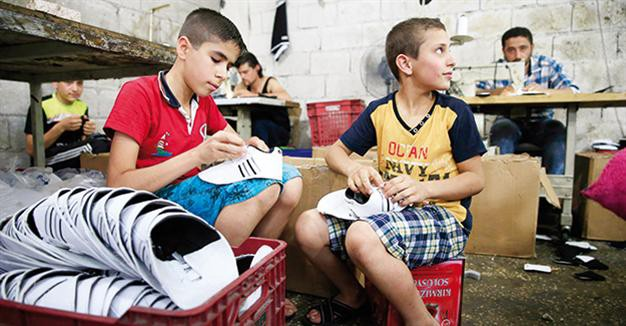
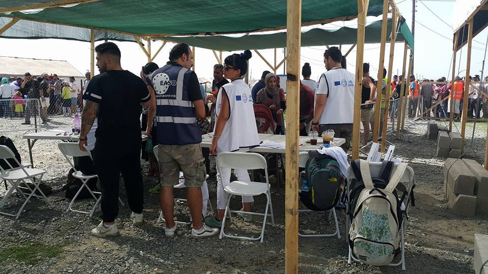
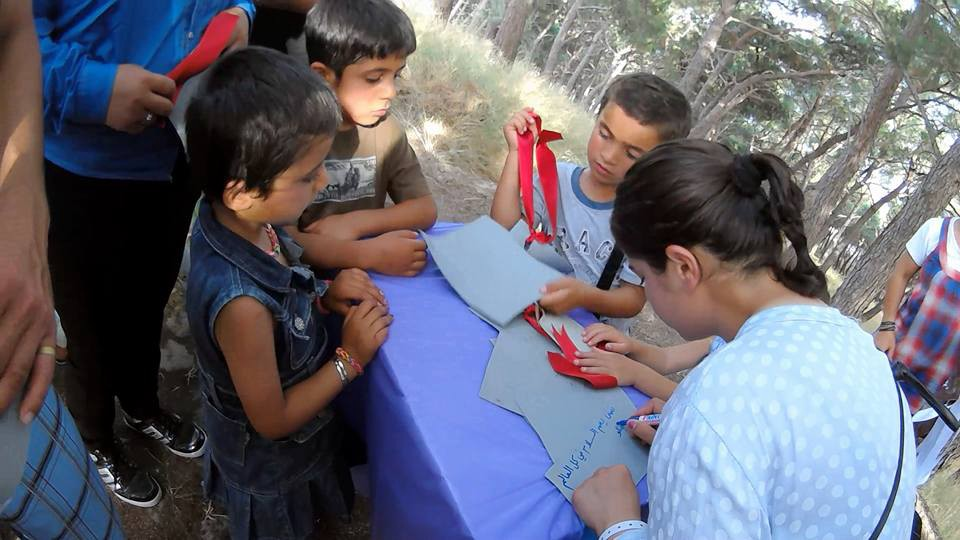
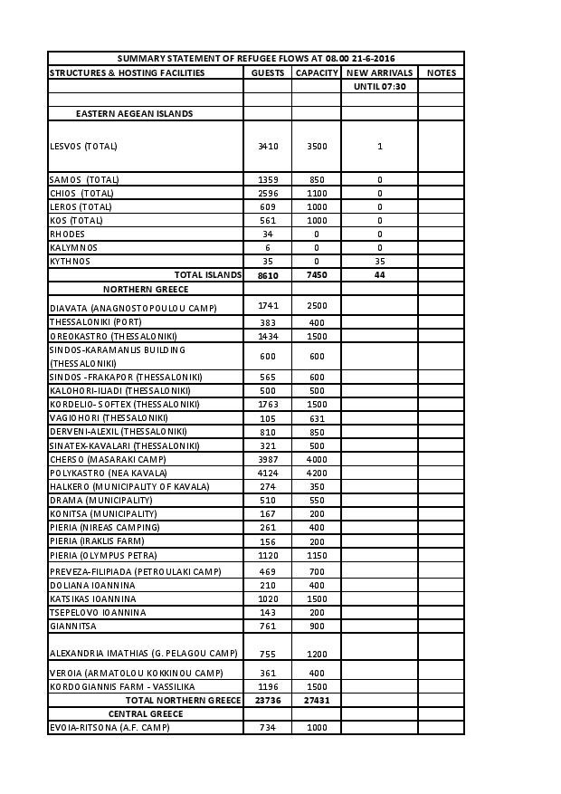
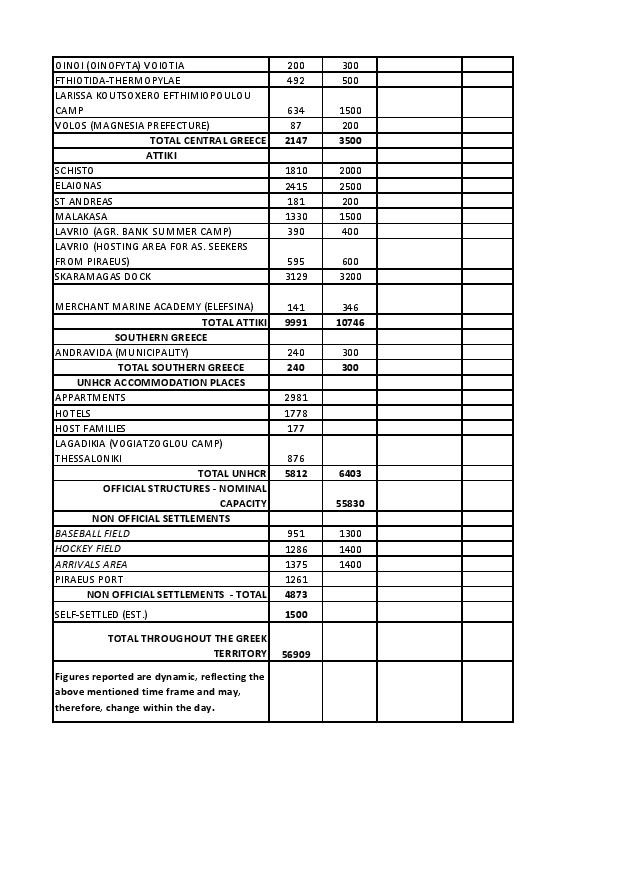
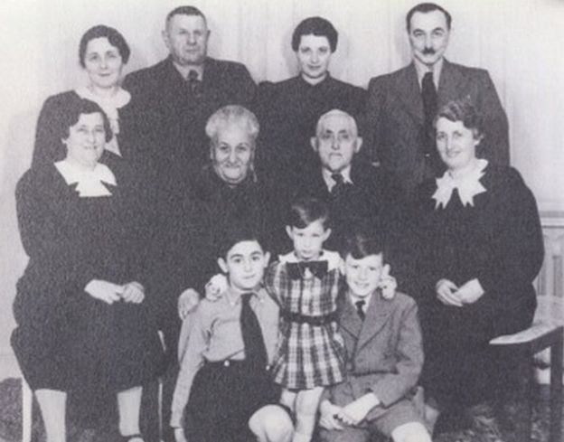

### AYS NEWS DIGEST 21/06: What Happens When Refugees Get To Where They’re Going?

](assets/5429c6ae24b7/1*ErgrPfFgnecopo8hsprB4w.jpeg)

Credits: [**Geo Messmer**](https://www.facebook.com/DaGeo?fref=photo)
#### General
### Trends in refugee flows in Europe

[IOM](http://migration.iom.int/europe/) reports:

> _222,151 arrivals to EUROPE 2016_ 
 

> _214,691 by sea_ 
 

> _7,457 by land_ 

> _2,861 dead/missing — Mediterranean 2016_ 

> _Main nationalities of arrival:_ 
 

> _To Italy: Eritrea, Nigeria, Sudan, Somalia, Ivory Coast, Gambia \(May 2015\)_ 

> _To Greece: Syria, Iraq, Afghanistan, Pakistan, Iran \(May 2015\)_ 

> _To Bulgaria: Iraq, Syria, Afghanistan \(since start of 2016\)_ 

> _Hungary: On the period from 12 June to 19 June, 907 arrivals were registered\. This represents a 6% increase from the previous period\. \(853 arrived on the previous period, from 5 June to 11 June\) \._ 

> _Serbia: On the period from 12 June to 19 June, 317 arrivals were registered\. This represents a 78% increase from the previous period\. \(178 arrived on the previous period, from 5 June to 11 June\) \._ 

> _All other countries on the route have not registered any flow of migrants\._ 

> _Central Mediterranean route:_ 
 

> _Libya: The last DTM identified 264,014 migrants in 316 locations, mainly in Southern and coastal areas\. 3% are hosted in detention centers, while majority take shelter in informal or unofficial settlements\._ 

> _Niger: IOM Niger reported 10% decrease in flows towards Libya through Séguédine since the last reporting period \(31 May\- 6 June\), accounting for 68% of total recorded flows\. Nationals from Nigeria, Gambia, Niger and Senegal compose 76% of this outgoing flow\._ 

#### Iraq
### ISIL ‘loses 2,500 fighters’ in battle for Fallujah

> _Iraqi troops are continuing to battle [ISIL](http://www.euronews.com/tag/isil/) militants in pockets of the city of Fallujah, days after the government declared the centre had been liberated\._ 

> _At the same time Iraq’s elite military force — the counter terrorism service \(CTS\) — says the joint offensive in [Falluja](http://www.euronews.com/tag/falluja/) has killed over 2,500 militants\._ 

> _With the fighting continuing senior military official CTS General Abdul Wahab Alsaidi claims more advances will soon be made and that a push into northern and western areas of the city will soon be complete:_ 

> _“They try to attack our troops to prove their existence, their greatest effort is on the western axis\. When the western axis collapses and the troops reach the Golan neighbourhood, then you will not hear any other gunshots in Falluja\.”_ 

> _A separate military official said most of the remaining militants were foreigners who were not able to hide among residents or sneak into other parts of the country\._ 

> _Meanwhile, aid workers have warned a humanitarian crisis is unfolding around the city amid a civilian exodus\. More than 83,000 people have fled Falluja and 25,000 are said to be on the move\. Among them, an additional 30,000 civilians have fled Fallujah since Friday, overwhelming already packed displacement camps\._ 

](assets/5429c6ae24b7/1*x6NOMITMQ4qQPM6OS8MYtQ.jpeg)

Credits: [**Frédérique Geffard**](https://twitter.com/fgeffardAFP)
#### Afghanistan
### UN General Assembly Security Council report on Afghanistan

> [_Reports_](https://unama.unmissions.org/sites/default/files/n1616020.pdf) _1,851 Afghanis have returned to Afghanistan this year, more than 4 times the number this time last year\._ 

#### Turkey
### A report reveals widespread child abuse and child labor in Turkey

> _A report prepared by the main opposition Republic People’s Party \(CHP\) has shone a light on bitter truths about the conditions of Syrians in Turkey, with children particularly vulnerable to violence, sexual abuse and hunger\._ 

> _The age of many children forced into prostitution by gangs starts at 12 or 13, according to the report prepared under [CHP](http://www.hurriyetdailynews.com/tag/CHP) Deputy Chair Veli Ağababa and also printed as a book\._ 

> _The report says that the state fails to prevent gangs in Turkey from exploiting the helplessness of Syrian women, while it quotes witnesses as saying that Christian Syrians in Turkey are “in fear” due to the activities of some Islamist groups in the country\._ 

> _“Families of 21, with 15 children, try to live on food assistance from neighbors, living in single\-room houses with no bathroom or electricity\. Babies die of cold, while young girls face sexual abuse in the name of so\-called ‘marriages’ in exchange for house rent, or they are forced to become ‘second ’ or ‘third’ wives\. All these things are being overlooked by the state,” the report said\._ 

> _Violence and xenophobia against refugees is also rising in Turkey, it added, also calculating that around half of the refugees in Turkey are under the age of 18\._ 

> _It cited sources as saying that up to 5 percent of Syrian children in Turkey are forced to marry or sold as third or fourth wives\._ 

> _The municipality of Seyhan, a district in the southern province of Adana, concluded in a recent study, also included in the CHP’s report, that around 16 percent of refugee children in the district between the ages of 12 and 17 were “married\.” Some 40 percent of the girls in this category are pregnant, according to the report\._ 

> _The CHP’s inspectors also witnessed children as young as 5 working at textile manufacturers, a sector where child labor is widely abused\._ 

Credits: AP photo
#### Greece
### Pre\-registration starts in Nea Kavala

UNHCR and EASO started the pre\-registration of refugees in Nea Kavala\.

](assets/5429c6ae24b7/1*KnWZFAqbOYFStwF_f_4TEg.jpeg)

Credits: [**Chris Kyle**](https://www.facebook.com/profile.php?id=100005171472798&fref=photo)

](assets/5429c6ae24b7/1*aC1wfl-Uq2JWcs8Q-DidtQ.jpeg)

Cedits: [**Chris Kyle**](https://www.facebook.com/profile.php?id=100005171472798&fref=photo)
### VOLUNTEERS needed: Thessaloniki, Greece

> _ERCI — Emergency Response Centre International is looking for passionate people willing to commit for 2–3 weeks\+ on a daily basis for the first phase of a very exciting project\! If you want to help clean, prepare and set up a great space destined to house some hundred refugees and can be soon/ already are in Thessaloniki, North Greece please drop them a note\! Need: Immediate_ 

> _Please email us at skg@ercintl\.org with your info, CV and availability\._ 

### Images of one Thessaloniki Sindos\-Frakaport camp

](assets/5429c6ae24b7/1*ErgrPfFgnecopo8hsprB4w.jpeg)

Credits: [**Geo Messmer**](https://www.facebook.com/DaGeo?fref=photo)

](assets/5429c6ae24b7/1*eVR8Eh5e8fswE8r-FILLkw.jpeg)

Credits: [**Geo Messmer**](https://www.facebook.com/DaGeo?fref=photo)

](assets/5429c6ae24b7/1*drVJv0YSSjrBrEaNOhKZsA.jpeg)

Credits: [**Geo Messmer**](https://www.facebook.com/DaGeo?fref=photo)

](assets/5429c6ae24b7/1*WaIkPPJWFidDMAilm-0coA.jpeg)

Credits: [**Geo Messmer**](https://www.facebook.com/DaGeo?fref=photo)
### Donations needed in Athens

> _What is needed is the following_ 

> _\-rugs, carpets_ 
 

> _\- 2 trash bins,_ 
 

> _\- cupboard, hangers, book shelves,_ 
 

> _\- beds to grow vegetables,_ 
 

> _\- a stereo, a retroprojector, musical instruments,_ 
 

> _\- curtains \(10\)_ 
 

> _\- toothbrushes, blender,_ 
 

> _\- boxes to sort things,_ 
 

> _\- a big table, a coffee table_ 
 

> _\- locks_ 
 

> _\- lamp bulbs \(economical ones\)_ 
 

> _\- mosquito repellents_ 
 

> _\- anti lices lotion_ 

> _Donations are needed for the Orange House, organized by Immigrant and Refugee Support Group in Athens\. Please get in touch with Freddy Maria Constantinidis or Marina Liaki\._ 

### Celebrating World Refugee Day on Lesbos

](assets/5429c6ae24b7/1*nGw0t76lsc3ETZ5gTkjUTA.jpeg)

Credits: [**Félix Brassier**](https://www.facebook.com/felix.brassier.5?fref=photo)

](assets/5429c6ae24b7/1*wxBWL2iER8agJz3sokG5nw.jpeg)

Credits: [**Félix Brassier**](https://www.facebook.com/felix.brassier.5?fref=photo)

](assets/5429c6ae24b7/1*0fN1cHKoLA0TMM775EbwuQ.jpeg)

Credits: [**Félix Brassier**](https://www.facebook.com/felix.brassier.5?fref=photo)

](assets/5429c6ae24b7/1*Dl9E1jOhYJC2f-o8oNUZYA.jpeg)

Credits: [**Félix Brassier**](https://www.facebook.com/felix.brassier.5?fref=photo)

](assets/5429c6ae24b7/1*HRBEalsCJlUH1c6Xyz0UOg.jpeg)

Credits: [**Félix Brassier**](https://www.facebook.com/felix.brassier.5?fref=photo)
### Summary statement of refugee flows in Greece, June 21, 2016

#### Mediterranean
### Sea Watch is expanding its actions with Sea Watch Air

> _The catastrophic conditions for refugees call for a more efficient rescue efforts and the use of air surveillance\. It will allow us a broader scan of the operational area as well as more structured operations within the network of aid organizations on site\._ 

> _Sea Watch will use an airplane for aerial reconnaissance and collaborate with Humanitarian Pilots Initiative\. The airplane will head to Tunisia tomorrow\. They will need a few weeks there for pilot training and test flights\._ 

](assets/5429c6ae24b7/1*AafMTZYFQgaWeiu4Wx3zyA.jpeg)

Credits: [**Sea\-Watch**](https://www.facebook.com/seawatchprojekt/?fref=nf)
#### Germany
### Difficult life of refugee children in Germany

> _According to the report, refugee children not only have far lower standards of safety, medical treatment and education than their German\-born counterparts, but are also treated very differently depending on their prospects for being allowed to stay in Germany\._ 

> _“Refugee children have often survived horrors and brutal violence\. For this reason they need special protection and care,” said German UNICEF chief Christian Schneider\._ 

> _The report accused the German government of negligence in the face of Europe’s unprecedented refugee crisis\. The organization had already pointed out in 2014, UNICEF said, that the rights of migrant children were not being respected, and the recent influx of refugees has served to make the situation much worse\._ 

> _Not only do refugee youth lack access to the education afforded to German children, the amount of time they have to stay with their families in unsafe and unsanitary first arrival centers has doubled from the minimum three months to half a year\._ 

> _This creates a problem for [children’s integration](http://www.dw.com/en/german-government-to-release-800-million-euros-to-boost-integration-and-social-welfare/a-19331160) when they eventually start school in Germany\._ 

> _UNICEF also took issue with that it called “special facilities” set aside for families with a low chance of remaining in Germany\. The children in these facilities may not go to school nor do they receive any other sort of educational opportunity\._ 

> _The organization called on Berlin to implement refugee children’s rights to be in a safe, a hygienic environment with access to learning and the psychological assistance necessary to many young people who have experienced trauma in their country of origin\._ 

#### UK
### Kindertransport veterans shame Calais

> _Surviving members of the “Kindertransport” that brought 10,000 refugees to the UK on the eve of World War Two have visited the infamous Calais Jungle to meet lone children seeking asylum in the UK\._ 

> _“If seeing is believing, I couldn’t believe the condition of the camp,” says Rabbi Harry Jacobi, 90, as he meets some of the 400 children who call the Jungle home\._ 

> _“This is not a concentration camp… yet I feel so furious\. I am ashamed with the whole of Europe not doing enough for the refugees here\. This camp should be closed tomorrow\.”_ 

> _Earlier this week, the 90\-year\-old rabbi and peer Alf Dubs — two men who were once refugees themselves — travelled to the camp to meet a new generation in peril\._ 

> _They told the boys about their personal refugee journeys\. In turn, the boys tell them what they think will be good about life in Britain — school and playing cricket, like they did at home\._ 

> _The youngsters ask how long they have to wait to get to Britain\._ 

> _“We’re going to do our best, we’re pushing hard to make the government do it quickly,” says Lord Dubs\._ 

> _“It’s a great country\. I hope you get there soon\.”_ 

Rabbi Jacobi on the bottom right\. He would never see his parents again\. Credits: Rabbi Jacobi
#### Weather forecast
### _LIBYA TO ITALY SEA ROUTE_

> _HIGH WAVES: VARIABLE 0\.5\+ TO 0\.8\+ METERS, WEDNESDAY INTO THURSDAY_ 

> _Moving generally Southward both days, waves at your front\._ 

> _Winds: Variable, between 10 and 18 kph, gusts up to 24 kph, blowing Southward both days\._ 

> _SEA SAFETY: Waves over 0\.5 meters are considered dangerous_ 

### **LESVOS & ISLANDS**

> _Lesvos & nearby Turkish coast, sunny\. Wednesday through Thursday temperatures from 23C / 34C\._ 

> **_HIGH WAVES: VARIABLE FROM 0\.4\+ TO 0\.7\+ METERS WEDNESDAY INTO THURSDAY_** 

> _Moving mostly Southward both days\. Leaving from Turkish coast of Canakkale to Lesvos, waves at the back\. Leaving from the west coast of Turkey to the Greek islands, waves at the right\._ 

> **_Winds:_** _From 10 to 16 kph, gusts up to 33 kph, blowing mostly Southward both days\._ 

_Converted [Medium Post](https://areyousyrious.medium.com/ays-news-digest-21-06-what-happens-when-refugees-get-to-where-theyre-going-5429c6ae24b7) by [ZMediumToMarkdown](https://github.com/ZhgChgLi/ZMediumToMarkdown)._
