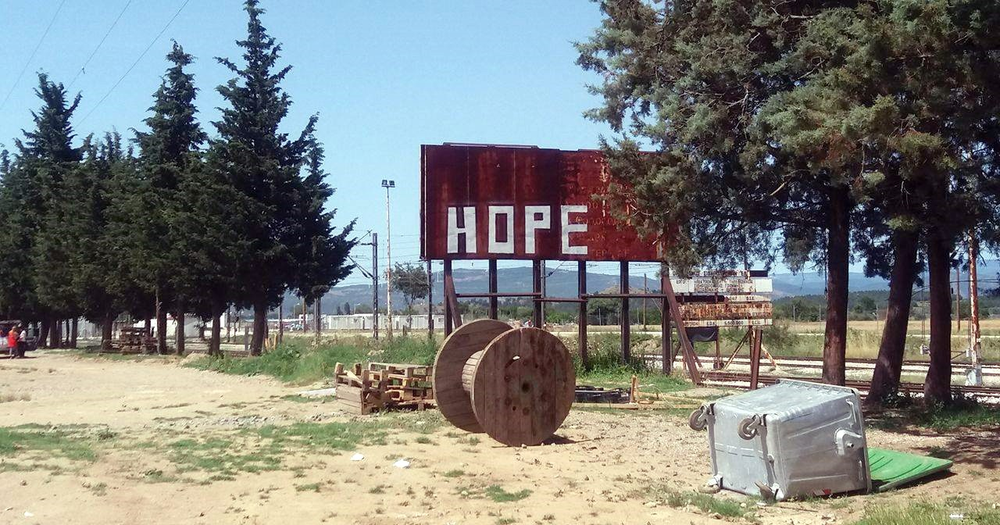
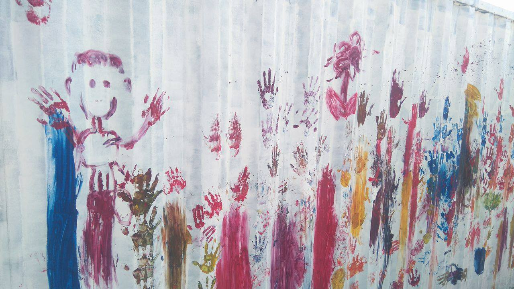
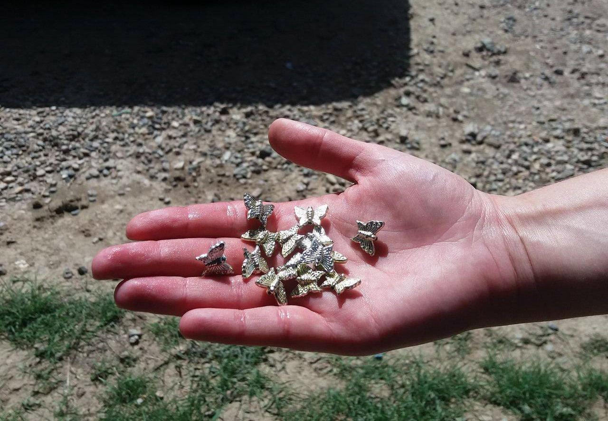
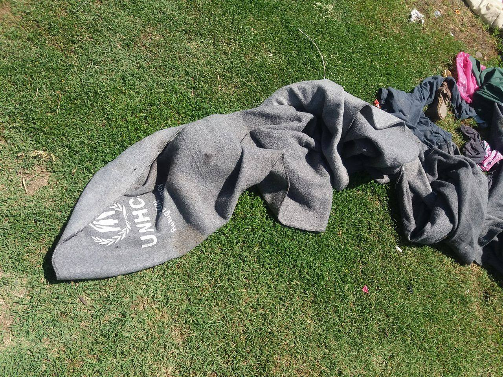
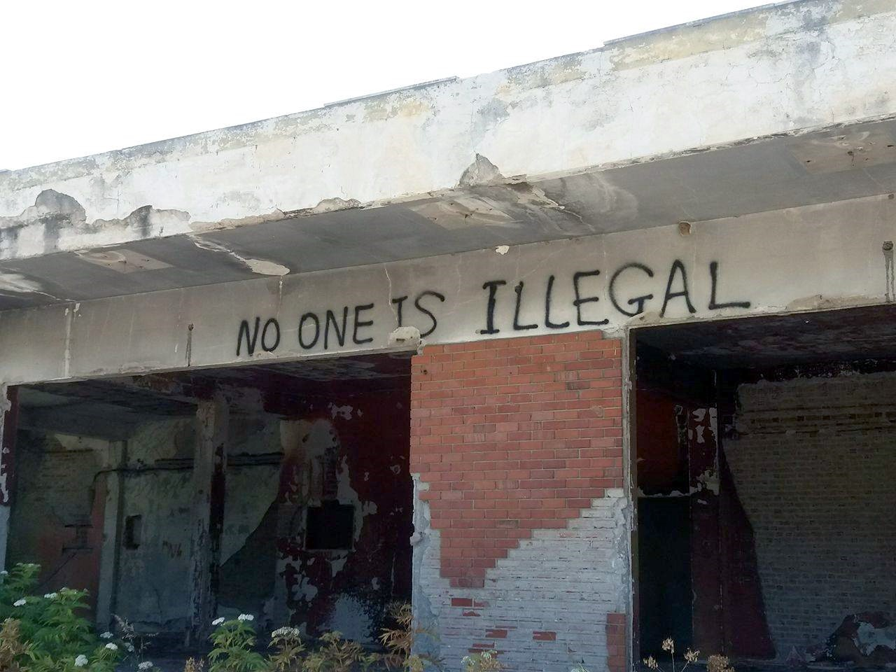
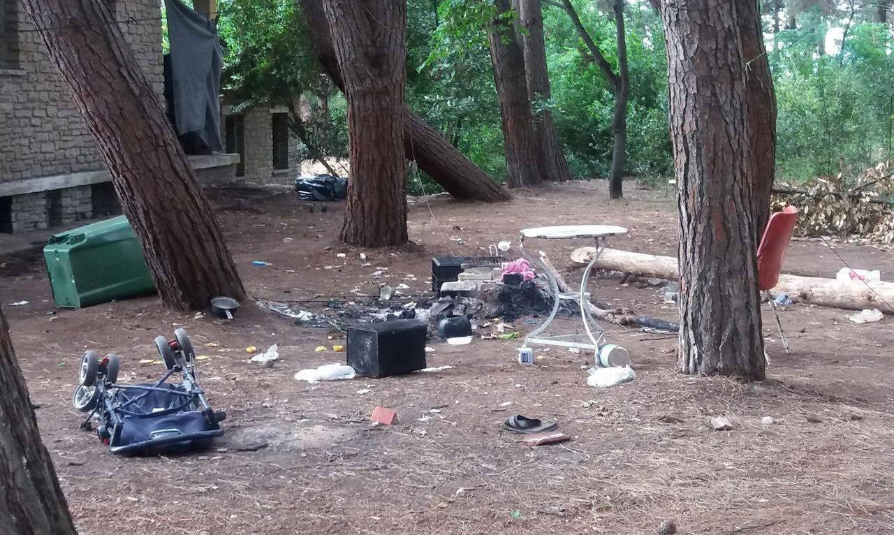

### AYS Special: Why would anyone miss Idomeni?

Empty train tracks near to a place where around 15,000 refugees were left stuck after the border closure\. Photo: Nidzara Ahmetasevic, AYS

Idomeni is a small village near the Greek — Macedonian border\. Hardly anybody lives there, but the entire world knows about this place\. Until just several weeks ago, around 15,000 refugees and migrants lived in the fields at the end of the village, on railways tracks, nearby houses, under the trains, in the trains… After the Balkan route was closed, people who were on their way to western Europe were just stuck there\.

Being not able to move further, without the possibility of going back home, they formed a provisional refugee camp\.

Small handprints are all that is left from hundreds of children in Idomeni\. Photo: Azra Ayyash, AYS

“It was the community,” a Spanish volunteer who spent two months in Idomeni told AYS\. “People were self organised, and mostly volunteers were there to help\. Big organizations were slow and hardly efficient in their response, excluding some of them\.” All of the volunteers we met in northern part of Greece are still talking about Idomeni in a similar way\. They all remember solidarity that existed among people\. If asked to talk about ugly side of Idomeni, everybody will start with bureaucrats and the EU\.

We went to Idomeni in mid\-June\. After entering the village, we passed by several white houses with closed shades and doors, seeing hardly any signs of life\. At the end of the village there is a huge empty space bordered from one side with endless fields, from the other with the railway tracks and barbed wire\. Close to the railway is a huge rusty metal board with the word ‘hope’ written on it with white paint\. People who were here hoped their lives could change when the borders open\. But the borders remained closed up to today\.

Little traces of what used to be an overcrowded, vivid camp full of families\. Photo: Nidzara Ahmetasevic, AYS

Idomeni is the place — and we heard this repeated many times — where the European Union failed\. Camps established for refugees in Greece are places where even the last notion of an EU based on solidarity and humanity, died\.

In Idomeni today there are only couple of Medicins Sans Frontiers containers that will soon be removed\. Three Greek MSF volunteers are guarding what is left\. They greet us with big smiles on their faces, which disappeared after we asked them about refugees who were taken away from here\.

“We lost many friends\. With some of them we are in touch, but for many of them we do not know where they are\. And some were the best people I ever met,” one of them told us\. “There, in the front of you, was Camp one, there was Camp two and there Camp three\. People were literally sleeping and living everywhere around\. And it was hard, but for sure better than in any of newly established camps\.”

Idomeni is also the place where international community failed\. Photo: Nidzara Ahmetasevic, AYS

As many volunteers explained to us, the difference was that people were free to come in and go any when and if they want\. Many volunteers used to come and spend time with refuges, under their tents, sharing meal with them and it created that valuable sense of community\. ‘They are very nice people, some of the best I ever met\. It was nice coming here everyday and being greeted from all sides with ‘hello my friend’,’ volunteers told us\.

Most of the people from Idomeni were taken to government\-run camps, and hardly anybody believes it is a good solution\. Conditions in these camps are almost unbearable\. The big problem, as we were told, is that many people who were together in Idomeni, or other independent camps, became close over the time together and now they are ripped apart, living far away from each other, with limited possibility to move around\. They lost an uncountable amount in countries where they are running from, and then they were again forced to leave people they became attached to\. Government\-run camps are often closed for volunteers or media, guarded by police and army, and the atmosphere inside us rather despair than hope\.

Graffiti in one of abandoned facilities that served ad makeshift refugee camps\. Photo: Azra Ayyash, AYS

Like Idomeni, the EKO station, gas station nearby, was an independent camp until several days ago\. Then, police came and took all the people to different camps\. About 1,500 people lived at this gas station for months\. Days after they were taken away, the place looked apocalyptic\. Empty tents were everywhere, UNHCR blankets on the ground, food, cloths, toys, books… Lives shattered around\. It looks like people left in a hurry, but they did not\. They left in pain\. People who lived here for over three months, volunteers and refugees, claim this was nice place\. “I had many friends here,” volunteer who was here since February told us\. “I learned so much from them but also about me and the rest of the world\. We are savages if we can do this to people\. Europe betrayed us all\. This is their catastrophe\.” She was talking to us while trying to remove some of the tents left at EKO in order to give them to somebody who is in need\.

Hara hotel is near by\. Volunteers are saying it was one of the best\-organized places\. Today there is no trace of that life here\. Across the road is BP station\. You can still see graffiti, names engraved on wooden benches, some blankets, somebodies shoes, baby carriers…Small gas station is open after three months\. “It was hard for us but harder fir them\. We miss them\. Some of them were very good people\. Some not\. But we are all just humans,” the owner told us\. “But this was not good place for people to live here\. Camps are also not good\. And this is all Europe’s fault\. If they want, they can resolve this situation easy\.”

Traces of families that have left their temporary homes in a hurry\. Photo: Nidzara ahmetasevic, AYS

Former market close to Park Hotel, where many volunteers are living, was emptied, too\. We came the day before of eviction and on one day when people were taken away\. At least fine families were living inside, and too many children, including one baby that was born here\. When we came on a day of eviction, they were cleaning the place, swiping floors and cleaning doors\. Then they were taken to the camps with barely any access to the outside world\.

The last independent camps in Northern Greece are gone now\. Days after people were taken away by the police, these places look like big holes, and one can feel a kind of sadness, like something big was lost in there\. If we do not wake up, it will be lost forever\.

_Nidzara Ahmetasevic, AYS volunteer in Greece_

_Converted [Medium Post](https://medium.com/are-you-syrious/ays-special-why-would-anyone-miss-idomeni-3c24534a96d5) by [ZMediumToMarkdown](https://github.com/ZhgChgLi/ZMediumToMarkdown)._
