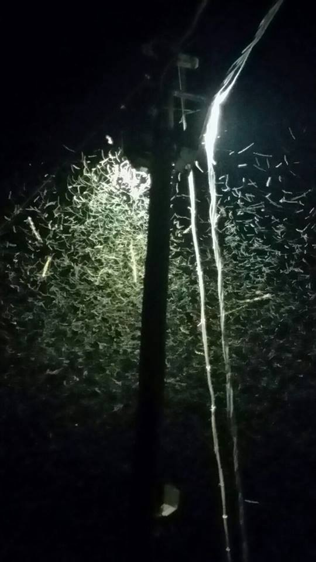

### AYS NEWS DIGEST 23/06 – 4,500 rescued in the Mediterranean\.
#### After a short respite, the Mediterranean is once again picking up as smugglers are taking advantage of the good weather to send as many people over as possible\. 4,500 were picked up by the Italian coast guard in 40 operations — with one body recovered in the process\.

A volunteer helps some of the refugees saved from the vessel\. Photo Credit: Yann Merlin
#### Syria
### Russia inadvertently confirms its usage of incendiary weapons\.

The information was confirmed as a result of a Russia Today broadcast, the Russian state’s organ for broadcasting in other countries\. [The channel, while running a story](http://www.telegraph.co.uk/news/2016/06/22/russia-caught-out-using-incediary-weapons-in-report-by-own-chann/) about the Russian defense minister visiting the Russian airbase in Latakia, showed a plane armed with canisters of what experts say is thermite\. Thermite is a metallic powder which burns at at the highest temperature known for a man\-made substance, and manifests as a fireball\. Using incendiary weapons on civilian\-populated areas are a clear violation of the Convention on Certain Conventional Weapons, of which Russia is a signatory\. Russia has previously denied using these weapons\. Eyewitness reports however suggest that they have been used in Aleppo, where the Syrian army is attempting to retake ground from rebel groups\. The footage of the canisters was cut out soon after the original broadcast, but the original version has been restored to the RT website following backlash\.
#### Greece
### Today’s Numbers

The fully detailed data provided by the Greek government may be [accessed here](http://media.gov.gr/index.php/%CF%85%CF%80%CE%B7%CF%81%CE%B5%CF%83%CE%B9%CE%B5%CF%83/%CF%80%CF%81%CE%BF%CF%83%CF%86%CF%85%CE%B3%CE%B9%CE%BA%CF%8C-%CE%B6%CE%AE%CF%84%CE%B7%CE%BC%CE%B1/summary-statement-of-refugee-flows-23-06-2016) \. A summary is as follows: 56,975 refugees are currently in Greece, 8,556 of whom are on the islands, 23,786 in Northern Greece, 2,122 in Central Greece, 9,960 in Attiki, and 240 in Southern Greece\. A total of 5,896 are currently being accomodated by UNHCR\.
### Trusted sources report that water is being rationed in Nea Kavala and Stonehouse\. Food remains similarly terrible\.

The report states that water distribution is being to reduced one liter per day for every three people\. This comes in the wake of a heatwave striking Greece\. A third of a liter per day per person is nowhere near enough to keep one hydrated, especially in light of 36° Celsius weather\. Residents of other camps such as Cherso have resorted to drinking tap water, but there is anxiety surrounding the water’s potability\. Tests should be run to determine whether the tap water is safe for consumption to allay the refugees’ fears\.

A shameful example of what is being fed to refugees\.

Even if the tap water is proven to be safe however, there remains the problem of access to taps\. In at least 8 of the camps \(Cherso, Skaramagkas, Malakasa, Schisto, Piraeus, Ritsona, Sindos\-Frankapor, and Lavrio\), the water tap per person ratio is horrendous, a situation that requires remedying if the camp authorities continue to limit water distribution\.

Food is similarly an issue in the camps\. In many places, the main meal of the day contains little or no protein, except in the form of worms or ham\. Kwashiorkor, anemia and rickets are part of the devastating consequences of dehydration and malnutrition\- specially among children, who represent 40% of the refugee population\.
### Mosquito swarms at Cherso Camps present a worry\.

Mosquitos at Cherso

It goes without saying that such pests are cause for concern, in addition to the other critters which dwell in the area such as snakes and wild dogs\.
### Tensions mount in reception centers following the killing of a man\.

The man was a 32 year old Egyptian seeking asylum\. The incident occurred on Thursday in the aftermath of a brawl on Chios, [according to Ekathimerini](http://www.ekathimerini.com/209829/article/ekathimerini/news/egyptian-asylum-seeker-dies-in-greek-camp-brawl) \. His attacker, who was also Egyptian, has been arrested, and another Egyptian man was wounded during the fight\. The deceased victim was a third party who intervened as a fight was underway between two men, and the attacker stabbed him in the carotid artery\. Brawls are common in these camps as a result of the difficult position that the refugees find themselves in\. The two men who had been fighting have been in Chios since May, according to [Greek Reporter](http://greece.greekreporter.com/2016/06/23/migrant-stabs-to-death-fellow-migrant-in-greece/#sthash.oXavsznd.dpuf) \.
### On Saturday, Bulgarian authorities forced a Greek train to return to Greece\.

This move came as a result of suspicion that refugees were being smuggled onboard, according to [Greek Reporter](http://greece.greekreporter.com/2016/06/23/bulgaria-forces-greek-train-back-over-border-on-suspicion-of-refugee-smuggling/#sthash.ZGK9gP4u.dpuf) \. Bulgaria is known to be very hostile towards refugees who seek to enter the country from Turkey or Greece in order to continue their journey as part of the Balkan Route\.
#### Hungary
### Refugee Support Serbia, Moving Europe, and Migzsol report on the brutality of the Hungarian police towards refugees attempting to cross the border\.

We received the following email from our comrades detailing the situation:

> _Dear all,_ 

> _Today \[June 22\] in the park in Belgrade we witnessed a huge increase of people who returned from the Hungarian border\. A large group of people told us that they crossed into Hungary several times and were brutally beaten by the police and pushed back through a hole in the fence\. They were discovered by helicopters on the Hungarian side and attacked by police with dogs and pepper\-spray\. Many said that their feet were particularly beaten\. Others said that the Police humiliated them by stepping on their heads and posing for selfies\._ 

> _Although people have told similar stories before, this time it was an exceptionally high number of people returning to Belgrade\. We wonder whether this is the implementation of the new law that all people within 8km from the border fence will be returned to Serbia? Have the Hungarian friends notice a decrease of people in the open camps so far?_ 

> _We will see how the next days will evolve\. If this becomes the normal practices it would mean that the situation in Belgrade and in the border camps will further deteriorate and the onward travels will become even harder\._ 

> _Solidarity,_ 
 

> _Refugee Support Serbia and Moving Europe_ 

We also received an email from Migzsol, further detailing the brutality of the police\.

> _Thank you for this update\. Very worrying, although not very surprising\. **Whenever you meet people with these experiences, it would be great if you could also email the Hungarian Helsinki Committee who can file complaints against the Hungarian police \(you can mail them at andras\.lederer@helsinki\.hu in the cases of police violence at the border\) \.** They take this very seriously\._ 

> _The 8km law is not in effect yet, so that should not officially be the reason, and the camps are still extremely crowded\._ 

> _Regarding the photos: the police often takes pictures and even videos of people they catch, especially if they are being smuggled, and post it on the police website\. In addition, this could be with the Nazis on the border\. Especially the mayor of Asotthalom has been taking a lot of pictures of people at the border lately and posting them on his Facebook page\._ 

[Migszol’s reports](http://www.migszol.com/blog/the-new-8km-law-allows-the-deportation-of-people-to-the-serbian-side-of-the-fence-migszol-update-10-20th-june) on the events state that between June 10 and June 20, 1362 people were caught entering into Hungary without authorization\. According to a new law, which as the email states is not yet in effect, all refugees who are found within 8 kilometers of the borders with Serbia and Croatia are deported by the police to the no\-mans land, where they are by all accounts mistreated, given little food, water, and medicine, and have very limited access to legal resources\. The refugees are then caught in a legal limbo, as the Serbian government declared that it will not take back those refugees deported by Hungary to its no\-mans land\.

As the email states, **ALL INSTANCES OF POLICE BRUTALITY SHOULD BE FILED AND SENT TO andras\.lederer@helsinki\.hu** \.
#### Italy

**4500 refugees were rescued in the Mediterranean today\.**

The influx likely comes as the result of smugglers taking advantage of the good weather, after a spell of bad weather temporarily slowed crossings on the Mediterranean\. Among the people rescued there was also one corpse recovered\. The Italian Coast Guard said that they have conducted approximately 40 rescue operations today\. So far this year, 50,000 have attempted to make the crossing\. There are reports from the refugees of a ship having embarked from Egypt on Sunday, and its whereabouts are currently unknown, according to [The Independent](http://www.independent.com.mt/articles/2016-06-23/local-news/The-Latest-Italy-says-4-000-migrants-rescued-near-Libya-6736159905) \.
#### Sweden
### Sweden has passed a new law which would limit residency permits issued, family reunification\.

The new law will be put in place starting from July 20, but it also seems to apply retroactively, according to [Migrationsverket’s report](http://www.migrationsverket.se/download/18.2d998ffc151ac387159e10e/1466169443440/Infoblad_begr%C3%A4nsningslagen_engelska.pdf) \. Asylum seekers will only be given temporary residency permits, with a period of 13 months for people given subsidiary protection status and 3 years for people with refugee status, both of these being subject to renewal\. Families with children and unaccompanied minors who applied for asylum before November 24, 2015 will be dealt with under the old law\. People with subsidiary protection status will be reunited with their families only in rare cases, and only one’s spouse, cohabiting partner, or children under 18 years of age will be eligible\. Those who apply for family reunification must be able to support themselves and their family members\.

Human Rights Watch warned that the law could lead to violations of the refugees’ rights, particularly those of child refugees\. “Sweden should not sacrifice the well\-being of vulnerable children in an effort to make the country less attractive for asylum seekers,” said Rebecca Riddell, Europe and Central Asia fellow at Human Rights Watch\. Other organizations such as UNHCR and Save the Children have similarly condemned the legislation\.

If you are a refugee in Sweden and are in need of help, be sure to check the [Good Advice for Asylum Seekers in Sweden webpage](http://www.farr.se/sv/in-english/good-advice) , created and maintained by the Swedish Network of Refugee Support Groups\.
#### Canada

**500 Syrian refugee families are unable to come to Canada despite having been approved for relocation\.**

[The Star reported](https://www.thestar.com/news/immigration/2016/06/23/approved-syrian-refugees-still-facing-delays-says-sponsorship-coalition.html) despite them having been approved for many months now, and the accommodations having been set up by their host families, approximately 2,900 Syrian refugees continue to wait, and will likely not be relocated for another three to six months, according to Refugees and Citizenship Canada\. The delay is a result of the undermanning of ministries responsible for processing\. Ottawa sent an additional 40 employees in May to help fill the gap, but this is still not enough\. Canadian groups are saying that it is important for the refugees to be moved as soon as possible, citing the presence of children whose education has been interrupted and who should start schooling with the new school year\.

_Converted [Medium Post](https://areyousyrious.medium.com/ays-news-digest-23-06-f2a127c8d864) by [ZMediumToMarkdown](https://github.com/ZhgChgLi/ZMediumToMarkdown)._
