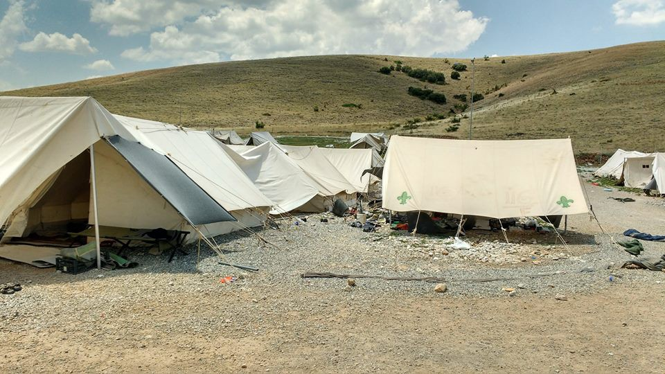
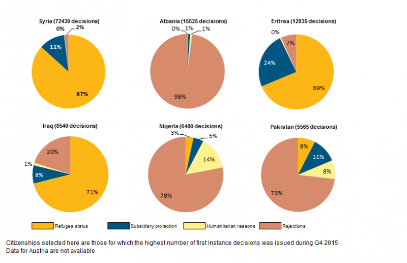
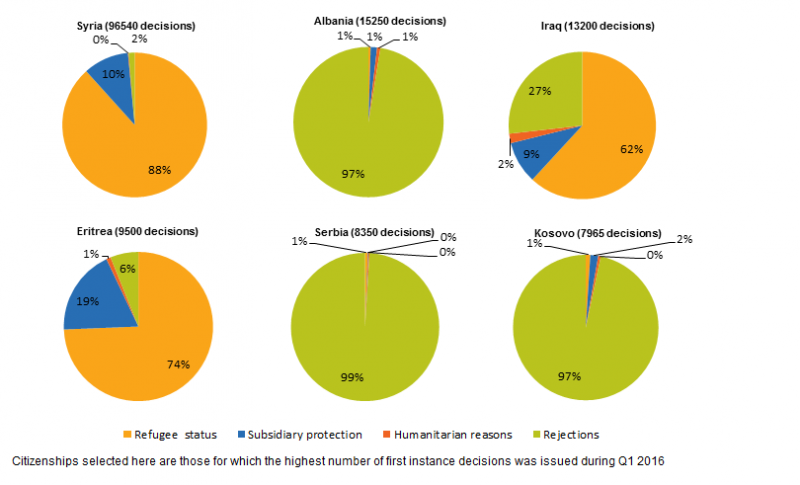
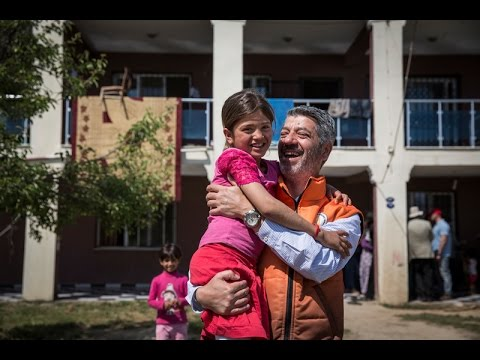
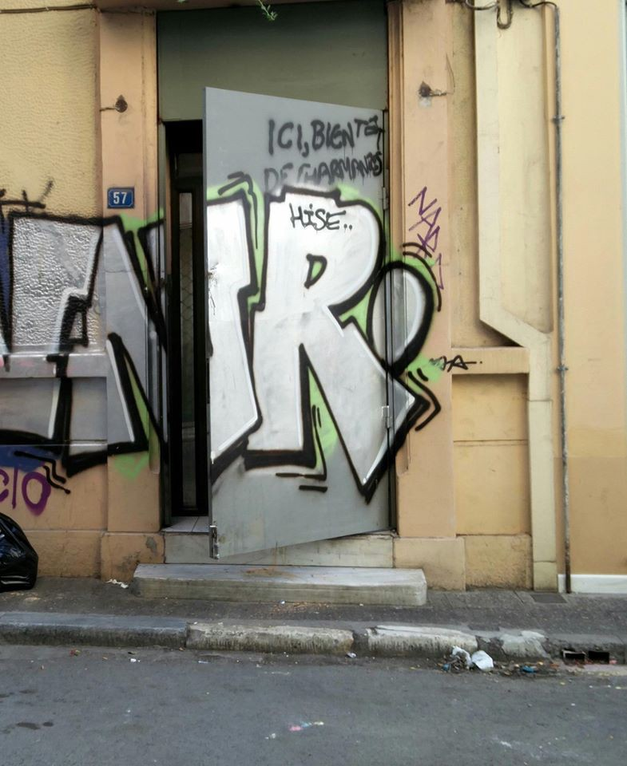
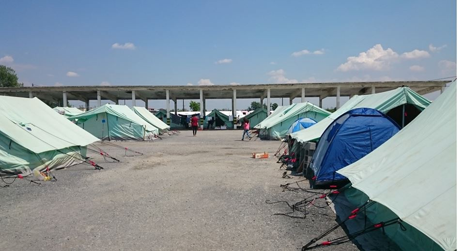
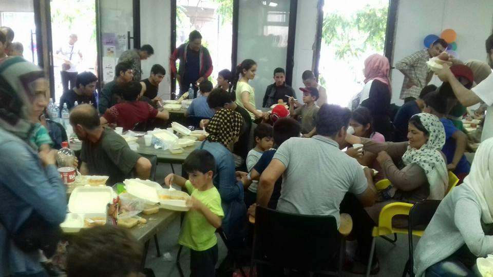
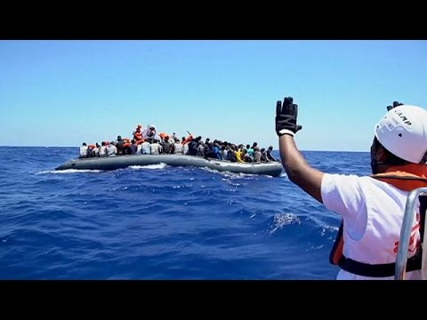

### AYS NEWS DIGEST 24/06: 214,691 people entered Europe by sea this year

_2,861 have died during their journey in 2016\. Percentage of Syrians and Iraqis granted protection in first instance drops in first three months of 2016 compared to last quarter of 2015\. Urgent help needed in Athens and throughout Greece\._

Refugee camp in Greece\. Photo by Dimitris Plastiras
#### General
### **214,691 arrivals by sea in 2016**

[News that Moves](https://newsthatmoves.org/en/almost-four-times-more-arrivals-in-europe-by-sea-in-2016/) reports that the International Organization for Migration \(IOM\) says 214,691 migrants and refugees entered Europe by sea in 2016, compared to 59,000 last year during the same period\.

Greece received over 157,000, while Italy saw more than 55,000 refugees arrive\. 1,352 asylum\-seekers reached Spain and 28 landed on Cyprus\.

An additional 1,020 lives have been lost at sea this year compared to last year\. Total deaths so far this year total 2,861 compared with 1,838 through the first six months of 2015\. This means one in every 20 people who crossed since the beginning of the year have died in the sea between Libya and Italy\.

IOM Libya also reports 153 fatalities were confirmed by Libya’s coast guard, which has recovered the remains of dozens of drowned men, women and at least one child, mostly from Sub\-Saharan African countries\.
### **441,800 asylum applications received by Germany in 2015**

In an analysis of Eurostat data for 2015, the Centre for European Policy Studies says Germany received 441,800 applications, out of a total of 1\.2 million, making them the biggest receiving State\. Hungary received 174,435 and Sweden a total of 156,110\.

In the EU as a whole, the top four countries of asylum applicants were Syria, Afghanistan, Iraq and Iran\. 98% of Syrians were granted protection status in the first instance between October and December 2015, Eritreans 93% and Iraqis 80%\.

Source: Eurostat

_In the first quarter of 2016, these numbers have dropped\. 90% of Syrians were granted protection, 81% of Eritreans and 73% of Iraqis\._

Source: Eurostat
### EU Plan for integration of migrants and refugees

[News that Moves](https://newsthatmoves.org/en/eu-action-plan-for-migrant-integration/) reports on an action plan by the European Commission, that includes a reform of the EU Blue Card system, a work and residence permit for highly skilled non\-EU nationals — the reform will also allow highly skilled beneficiaries of international protection to apply for a Blue Card\.
#### Syria

**900 detained by ISIL in Aleppo province**

The Syrian Observatory for Human Rights says around 900 were detained by ISIL and were transferred either to detention facilities or were forced to dig trenches\. At least 13 were executed by the organization and at least 5 others were killed while trying to flee\.
### Shelling and Injuries in Homs

The regime forces continued to shell areas in the city of Douma, while shells fell in the regime\-controlled village of Ein al\-Dananir\. Clashes continued between regime forces and ISIL in the eastern countryside of Homs\.
#### Lebanon
### Dancer’s suicide highlights misery of Syrian refugees in Lebanon

[Voa](http://m.voanews.com/a/dancers-suicide-highlights-misery-of-syrian-refugees-in-lebanon/3389352.html) reports on the suicide of a famous Syrian refugee dancer —the author says these acts of despair are increasingly prevalent among refugees living in Lebanon\. The article states that many refugees face resentment and discrimination over Syria’s role in Lebanon’s 15\-year civil war and are living in constant fear of deportation — a 2014 UN Population Fund [study](http://reliefweb.int/sites/reliefweb.int/files/resources/YSA-SyriaCrisis-FullReport.pdf) found that 41% of Syrian refugee youth have considered suicide as an option to the hardships they face as refugees in Lebanon\.
#### Turkey
### Syrian teenager shot trying to return from Greece to Turkey

Greek police say a teenage Syrian refugee has been injured after being shot by an unknown man while trying to illegally return to Turkey, from which he had entered Greece months earlier\.

The 16\-year\-old, together with a 21\-year\-old Iraqi, had bought a small inflatable dinghy in which they planned to cross the Evros river, on Greece’s northeastern border with Turkey\.

Police say both men were threatened Thursday by two men in a boat from the Turkish side, who fired at them with a shotgun as they ran away\.
### Turkish entrepreneur helps Syrian refugees

In a bit of good news, [UNHCR](http://www.unhcr.org/news/stories/2016/6/576aa2104/the-man-who-changes-lives.html) reports on Levent Topçu and his association, who has renovated an abandoning building, making it suitable for several families to live in\. He also provided them with food but most importantly, helped them get work permits and employs them inn his factory, paying them the same wages as their Turkish counterparts\.

#### Greece
### Riot in Skaramangas

A riot erupted in Skaramangas camp, resulting in several injuries, including two men who had to be taken to the hospital\. In addition to injuries, there were many broken doors and windows\. Volunteers called the police a number of times, as the only police car that had arrived did not venture into the camp\. We also heard reports that a refugee went to the police station and the 5 officers on duty refused to intervene\.
### Volunteers urgently needed in Athens

A new squat in Athens urgently needs volunteers\. Around 145 people are living there, mostly Syrian and a couple of Afghan families, but there are currently only three volunteers\. If you are already in Athens, you’re help would be greatly appreciated\. A driver is also urgently required for Monday to pick\-up items from the Ellinikon Warehouse\. Donations are also needed, including: Dry foods, glasses \(for drinking\), plates and cutlery\. Fresh fruit and vegetables would also be appreciated\.

If you want to help, you can go directly to the squat at:

Spyrou Trikoupi 57 in Exarchia \(ex Hotel Oniro\) \- ask for Ayman Abo Emad\.

You’ll find the squat behind the door pictured on the photo below\.

Photo of the main entrance
### Volunteers needed in Alexandreia

Refugee Support Greece needs volunteers with a minimum two week commitment from now through to September\. The NGO focuses on distribution of food and non\-food items as well as on childrens’ activities\.

You can find more information on their [Facebook page](https://www.facebook.com/RefugeeSupportGreece?hc_location=ufi)

Photo by Refugee Support Greece

For all other volunteering opportunities throughout Greece, please check out [http://greecevol\.info/](http://greecevol.info/)
### Information about pre\-registration translated to Farsi

Refucomm is doing a great job of providing and translating legal information, including information about deportation, asylum interviews and relocation\. Important information about pre\-registration in Greece has now been translated to Farsi and is available on their [website](http://refucomm.com/greece/) \.
#### Serbia
### Refugee Aid Miksalište provides help in Belgrade

We previously reported that Refugee Aid Miksalište opened its new center on the 1st of June, after the old Miksaliste center was destroyed to make space for the controversial Belgrade Waterfront project\. The center is now operational, and Miksalitse was recently able to provide food for over 500 people\. It will continue to be an important point of support for refugees in Belgrade\.

Photo by Refugee Aid Miksalište
#### Italy

**5000 migrants rescued in one day**

At least 5,000 migrants were rescued in 43 operations across the Mediterranean Sea on Thursday according to the Italian Coast Guard and one body was found aboard one of the vessels\. Médecins sans frontières reported that the people aboard some of the boats were in a “state of panic\.”

[Rai News](http://www.rainews.it/dl/rainews/articoli/ContentItem-053b4bed-0348-4f01-ade7-594891ca819e.html) says that of the 5,000 people, 3,600 will land in Sicily\.
### 7 minors did not return to reception centre

In one of many cases, the minors from Mali, Ivory Coast and Eritrea headed out of the structure after few nights there\. A previous report by [Unicef](http://www.unicef.org.uk/Documents/Campaigns-documents/UNICEF%20CHILD%20ALERT%20Refugee%20Journey.pdf) has shown that unaccompanied children made up over 92% of the 7,567 children who crossed by sea to Italy between January 1 and May 31, 2016
#### Germany
### Merkel and Austrian chancellor Kern say “we know that we need secure escape routes to Europe”

In a meeting with German chancellor Angela Merkel, Austrian chancellor Christian Kern said his country and Germany will work together on refugees, adding “we know that we need secure escape routes to Europe”\. Merkel said “both countries support the agreement with Turkey” and both are “naturally for a fair distribution of refugees within the European Union”\.

_Converted [Medium Post](https://areyousyrious.medium.com/general-62577375e429) by [ZMediumToMarkdown](https://github.com/ZhgChgLi/ZMediumToMarkdown)._
