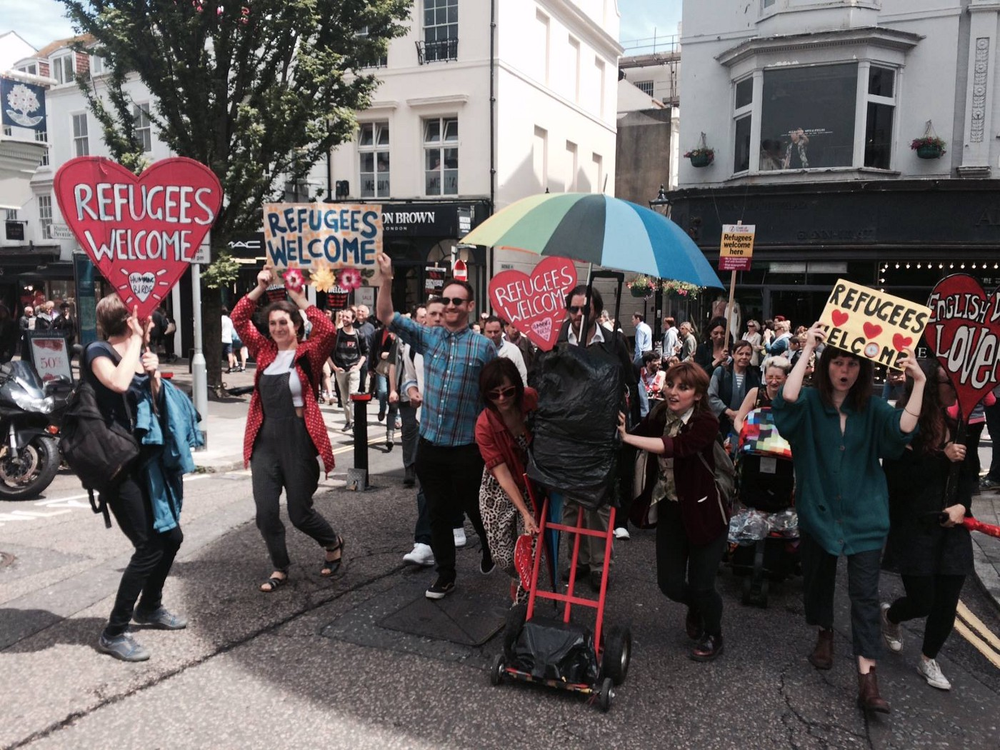

### AYS DAILY DIGEST 25/06: Over 700 people rescued in Mediterranean

MSF Sea

_New arrivals registered in Greece and Italy\. Conditions in military\-run camps in Greece are aggravating with the heat\. Cherso Cultural Center up and running\. After yesterday’s riots, situation in_ Skaramanga was calm\. _People are being detained in the region of Vidin on their way out of Bulgaria\. Local politicians in France are calling for return of border control with UK after Brexit\. People in UK on the streets to welcome refugees\._

_Mediterranean_
### **Two boats rescued from the sea**

Photo MSF Sea

Another two boats, one with 638 and another with 129 people, were rescued from the Mediterranean, according to MSF Sea\. All people are safe and taken care of\. MSF Sea posted the clip on their twitter showing how dangerous a rescue at sea can be\.

\#SAR saves lives but the only \#SAFEPASSAGE will end deaths at sea\.

#### Greece
### People stranded in heat in Softex camp

One boat with 25 people was picked up in the South and brought into Mitilini harbor\. No boats reported in the North\.

People who are in Greece and living in military\-run camps are continuously sending us messages warning about dare life conditions\. In Softex camp, where volunteers have limited access, are people who were relocated from self\-run camps in Northern Greece, including Idomeni\. In this camp, like all others in Greece, UNHCR tend are placed on a rocky ground, and people are given wooden pallets that they used as beds\. There are three areas, two are outside and one is in a big fabric hall\.

> “It is obviously really hot in there and it seems like the people don’t have that many blankets to cover a floor\. Softex is surrounded by industrial ground so there is nothing near for people to buy groceries or do anything\. Softex does not have an educational center or anything like that, which means that people do not have anything to do all day\.” 

Softex camp

Lack of security and safty in camps

After yesterdays riots in the camp Skaramanga, today was calm\. Volunteer Norman Hering informed us that a Syrian went to the caravan of a Yazidi to apologize for the previous night’s problems\. However, volunteers are warning that the lack of security and safety in the camp must be addressed by the authorities before something like events from the last night do happen again and someone dies\. At least one NGO said they will suspend activities until there is a more secure environment within which to work\. The commander asked any group or NGO who felt unsafe working in the camp to send him an email stating this and he would forward them to the police chief\.

In the meantime, people in the camp are not getting any clothes and there is a limited supply of pampers, toilet paper, cleaning supplies, baby milk and powder, and urgent help is needed\.

Today, preregistration started in Skaramangas\. Representatives of the Asylum Service began by wrist banding about 1\.000 residents to give them an appointment time and date\. They will return on Monday to finish wrist banding\. The preregistration will take about 2 weeks to complete\.

](assets/f8f6d1dbd1ef/1*KpM3aSGwNH1gKHywqqBLZg.jpeg)

Photo by [Norman Hering](https://www.facebook.com/norman.hering)
### “I am strong, but I am tired\.”

Cherso Cultural Center, military\-run camp near Kilkis, is up and fun\. Today kids \(but also many adults\) from the camp had two visits, one from the group [Contaminando Sonrisas](http://contaminandosonrisas.wix.com/contaminandosonrisas) \(Contaminating Smiles\) \. They came and brought the wonderful world of circus, interpretation, imagination and entertainment\. Before that, children participated in the workshop making origami and bracelets\.

The Center continues its work trying to make life at least a bit easer for all the people in this camp\. However, the life in this camp, like most others, is hardly bearable with this heat\. One of the refugees living in Cherso already for three months today wrote on his FB profile:

> “I am strong…but I am tired\.” 

Cherso Cultural Center

Photo by Cherso Cultural Center
### WiFi service back in Ritsona

The WiFi hotspot providing the internet service in Ritsona was hacked this week after someone gained unauthorized access to the device and changed the settings disabling the service\. However, the problem was fixed and the new device has been reconfigured and the security settings have been adapted\.
It is broadcasting 2 networks: DTL\_WiFi is open to use for everyone & DTL\_NGO is a secured/password protected network for NGO’s and camp management\. Any NGO who wants to use the latter should email Disaster Teach Lab at [contact@disastertechlab\.org](mailto:contact@disastertechlab.org)
### Important info for all NGO and Voluntary Groups

> “Thank you very much for registering your organization or group on Lesvos Island, at the General Secretariat for the Aegean and Island Policy\. We inform you that the process of issuing the “active volunteer card” has started\. Your members should collect their cards in person by displaying their passport or ID card\. They need to bring with them a face picture \(size: 3cm height×2,5cm width\) \. If your NGO or group is still active on the Island of Lesvos, please let us know by email, which members and when will come to collect their cards in order to have them prepared\. The cards can be collected \(Monday to Friday from 10:00 to 13:00 hours\) from the offices of the Lesvos Coordinating Committee at the building of the General Secretariat for the Aegean and Island Policy\.
 

> Coordination Committee Support Office
 

> General Secretariat for the Aegean and Island Policy
 

> Mikras Asias 2
 

> GR\-81100 Mytilini
 

> GREECE
 

> Tel\. \+302251350241–244” 

#### Bulgaria
### 90 refugees arrested near Vidin

Bulgarian Interior Minister Rumyana Bachvarova announced that fewer refugees and migrants entered the country this year compared to the same period last year\. Unfortunately, the interior ministry is making everything to detain people who are illegally entering the country\. The minister stressed that people are being detained in the region of Vidin on their way out of Bulgaria, which, she said: “shows that the system was functioning more than well”\. This week, on Thursday, around ninety refugees has been detained by Bulgarian authorities\.
#### Croatia
### 50 people to arrive in Croatia

New group of 50 people will arrive from Greece, Italy and Turkey on July 5th to Croatia\. They will spend two weeks in asylum center Porin, and after that will be moved to Split and Rijeka\.

For people in Porin, improvements in living conditions are announced, including new basketball playground, children’s playground, gym, cafe, etc\. Currently, there are nine families with children, four without kids, five single women, five women with children and 108 men are living in Porin\.
#### France
### Right wing politicians are proposing return of border controls with UK

Some local politicians in France are calling for a return of border controls to the UK, but the French foreign minister slams this idea, by now\.

Natacha Bouchart, the mayor of Calais, proposed changes to a deal which allows Britain to carry out immigration checks on the French side of the English Channel, after a UK vote to leave the EU\. “The British must take the consequences of their choice,” Bouchart said\. “We are in a strong position to push, to press this request for a review and we are asking the President \(Francois Hollande\) to bring his weight \(to the issue\) \. Far\-right National Front leader Marine Le Pen has made similar threats\.

The French authorities had warned before the referendum that a vote for leaving the EU could see a camp with thousands of migrants being moved from Calais to British soil\. A French government spokesman Stephane Le Foll said that bilateral immigration treaties between Britain and France would not be affected by Britain’s vote to exit the EU\.

> “On the question of immigration, to be clear, the British exit from the European Union will not lead to changes in terms of immigration treaties with the United Kingdom… These are bilateral treaties\.” 

Head of ‘France terre d’asile’, Pierre Henry, also says Brexit is unlikely to change the situation in Calais, given the economic interests a play and the importance of French export to the UK for the French economy\.

The British authorities have made no public comments on the issue\.
#### UK
### Refugees welcome\!

Photo by Calais Action

Calais Action team reports about protests in support of refugees organized by Hummingbird Project\- Calais and Dunkirk Aid and Solidarity in Brighton\. The message from the protest is:

> “After yesterday’s result, it’s more important than ever to show immigrants and refugees that they are WELCOME in our country and that we value their contributions\. We know that many people with a brown face or European accent are now feeling very nervous and unwelcome, and some are even being subject to harassment from the far right, so it’s vital that we support them and stand up to this racism whenever we see it\. So we took to the streets today in Brighton to say ‘Refugees are Welcome Here’ and met with a representative from the local council, who committed to taking 10 unaccompanied refugee children into the city as a result of the Dubs Amendment, which is fantastic news\! These children will need foster carers, though, so if anyone knows anyone who would be willing then please get in touch, or better still register yourself\!” 

#### General
### Afghani refugees in Pakistan in danger

Filippo Grandi, the UN High Commissioner for Refugees, called on the international community to invest more funds to help Afghani refugees in Pakistan\. He also urged people in Pakistan not to blame refugees for terrorism in their country\.

> “My appeal is that, not only to the authorities but also to the local population: refugees, as you know, are not terrorists\.” 

Recently, media and human rights activist in Pakistan warned about growing public calls for deportation of refugees and worsening relations between the two neighboring countries\.

Roughly 2\.5 million Afghan refugees are in Pakistan\. Pakistani officials also hinted at the possibility of deporting Afghan refugees\. A decision to renew their legal status by June 30 has not yet been announced, although past deadlines have been extended at the last minute\. UNHCR chief pleads to the Pakistani government to extending the deadline\.

So far, about 6,000 Afghans have chosen to return home from Pakistan in 2016, compared with 58,211 voluntary repatriations last year, according to the UNHCR\. Many Afghan refugees say they are being pressured to go back to the authorities\.

Pakistan has the second\-largest refugee population in the world, with more than 1\.5 million registered and about a million unregistered refugees from Afghanistan\.

_Converted [Medium Post](https://areyousyrious.medium.com/ays-daily-digest-25-06-over-700-people-rescued-in-mediterranean-f8f6d1dbd1ef) by [ZMediumToMarkdown](https://github.com/ZhgChgLi/ZMediumToMarkdown)._
