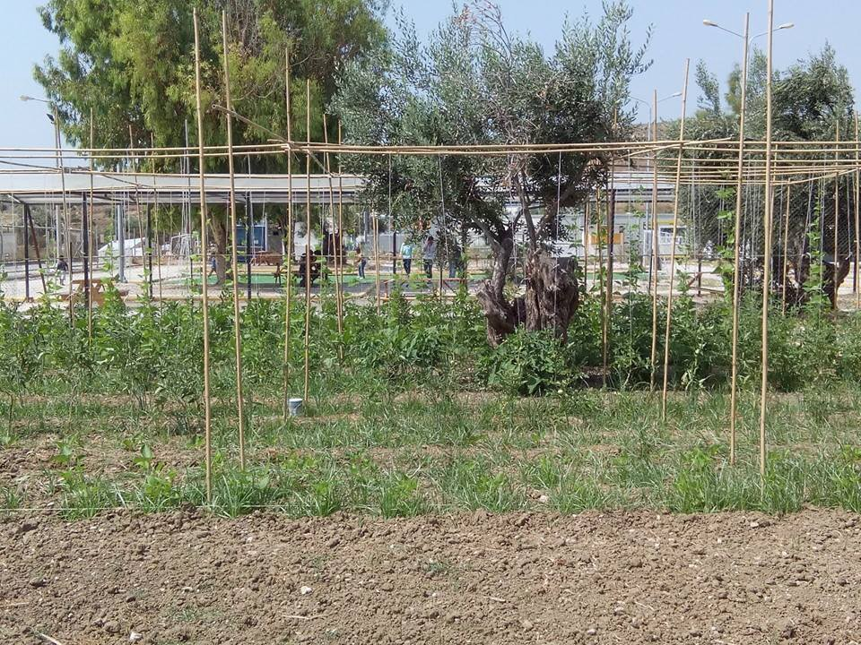
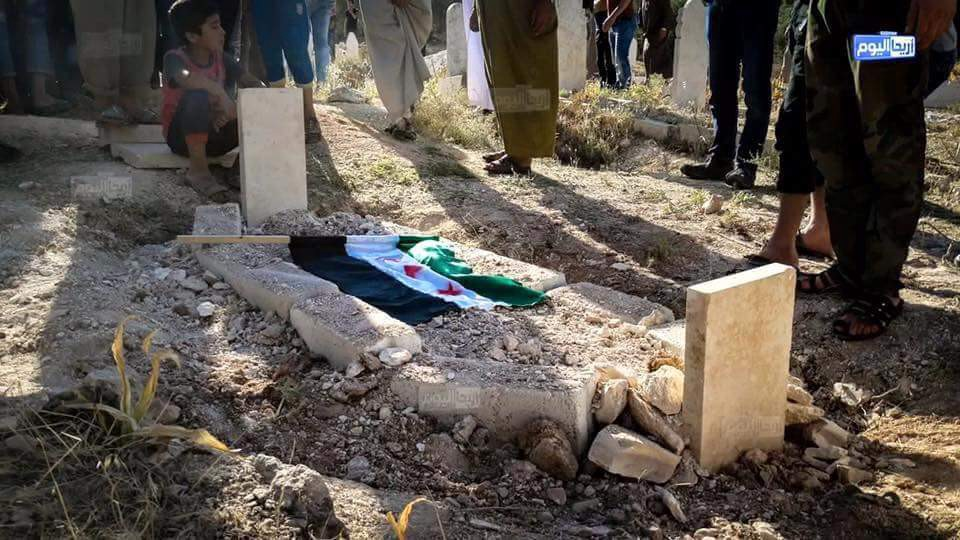
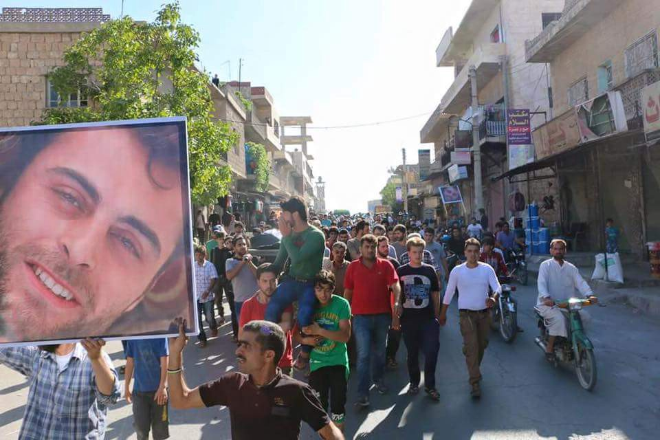
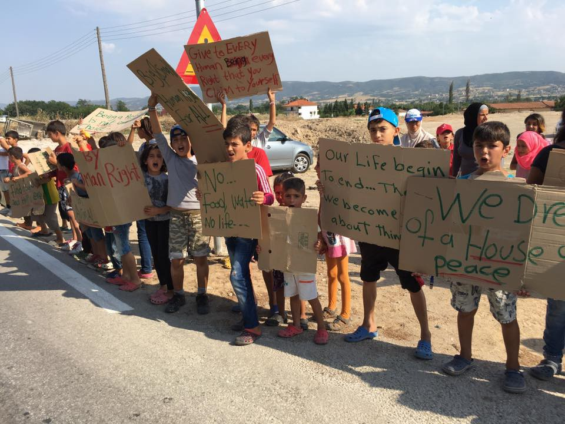
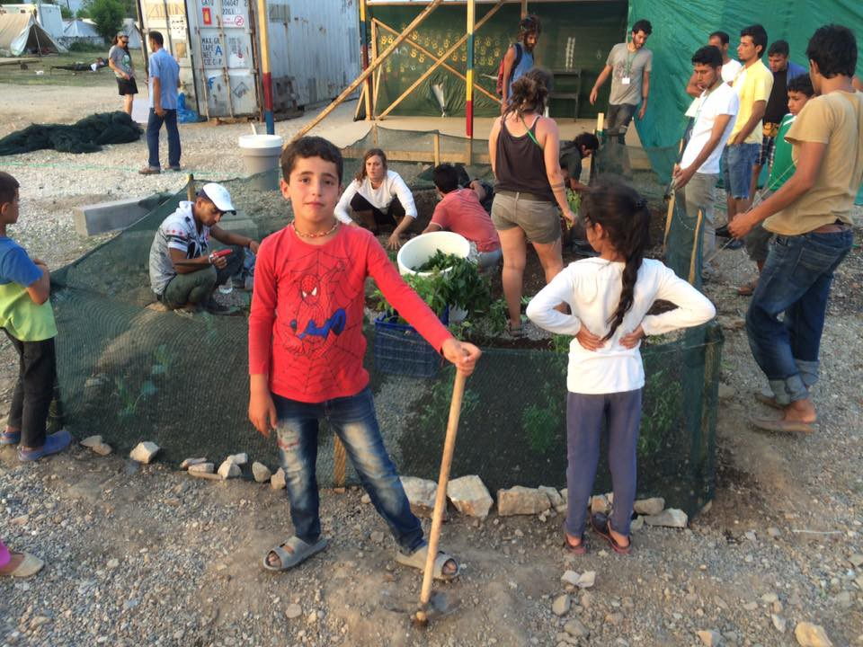
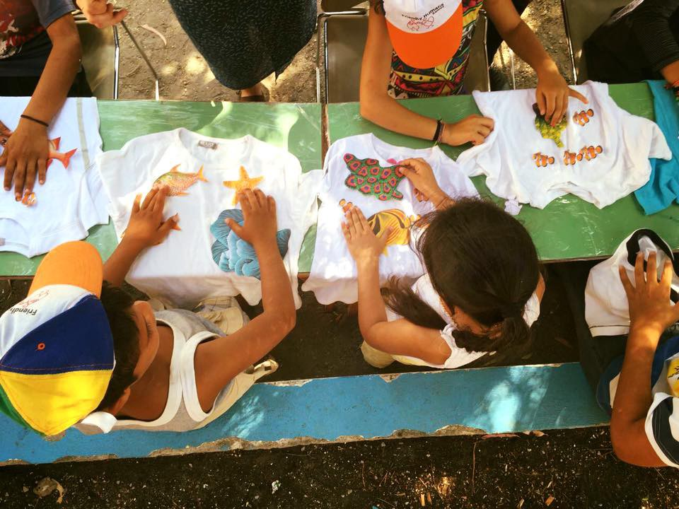
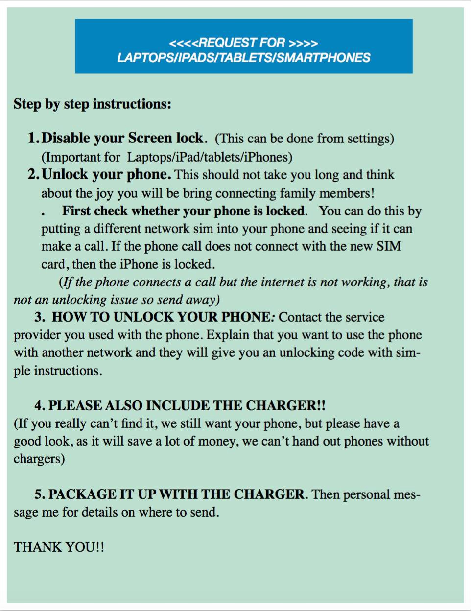

### Refugees speaking out while volunteers take stronger root in camps\.

#### SYRIA
### ISIS is attempting to regain control of territory through terror as it releases the previously\-unseen video showing the execution of five citizen journalists\.

The journalists were kidnapped [from the city of Deir Ezzor in October,](http://www.middleeasteye.net/news/islamic-state-claims-killing-five-citizen-journalists-syria-1137843804) and the executions happened in November and December\.

US\-backed Kurdish Arab forces are continuing to advance on ISIS territory and are within close range of the ISIS\-bastion of Manjib near the Turkish border\.

This release comes subsequent to the report that Syrian citizen journalist Khaled al\-Issa succumbed to injuries sustained in an IED attack that targeted al\-Issa and fellow journalist Hadi al\-Abdullah on June 17th\. Although they were both initially reported in serious danger of death within 36 hours of the attack, both had made a comeback\. However, al\-Issa passed away late Friday and was buried in his hometown of Kafranbel\.

Photos from Khaled al\-Issa’s memorial\. Photos via @arabthmoness
#### IRAQ
### Fallujah wrested from ISIS control as the Iraqi Army takes full control of the city\.

Officially ISIS\-free as of Sunday afternoon, Fallujah had been a stronghold of the so\-called Islamic State for over two years\. [According to Iraqi Prime Minister Haider al\-Abadi](http://www.aljazeera.com/news/2016/06/abadi-visits-fallujah-160626163140621.html) , the next target for liberation is Mosul, which has also been occupied by ISIS for a period of around two years and has long been considered the heart of ISIS territory\.
#### GREECE
### Refugees protest camp in Vasilika\.

Holding signs reinforcing their desire for peace and human treatment, dozens of refugees housed at Vasilika camp in Greece spoke out\.

Photo Credit: Franken Konvoi
### Volunteer opportunities blossom for those with diverse ranges of skill sets

> CALL FOR VOLUNTEERS: Join our teams in \[Thessaloniki and Chios\] \.
 

> Call for midwives, breastfeeding supporters, IBCLCs, translation interns,breastfeeding counselors, lactation consultants, infant nutritionists to providemother, infant and young child support in Greece\. Join our team of volunteers today\. We provide baby bathing, infant feeding support, complementary feeding and pregnancy and birth support in our mother and baby spaces\.
 

> We are accepting applications from volunteers who have the qualifications mentioned above and who can come for at least one week or longer\.
 

> If you can’t volunteer but want to help in some way you can become a sponsor of our work\. We are entirely volunteer run and rely 100% on donations from people like you\. Become a sponsor at : 
 

> [http://nurtureprojectinternational\.org/do](http://l.facebook.com/l.php?u=http%3A%2F%2Fnurtureprojectinternational.org%2Fdo&h=EAQFcFXxi) …/become\-a\-sponsor/
 

> NPI is a totally code compliant NGO focusing on providing breastfeeding support, prenatal education, and newborn care support to refugees in Greece\. We also provide nutrition packs to pregnant and lactating women and children aged 6 months to 2 years\.
 

> We are in desperate need for volunteers asap\. With the closure of the large informal camps and the slowing of the boats the crisis is not so much in the forefront of everyone’s minds\. But over 52,000 people are in Greece, over 60% are women and children\. Many are pregnant\. And our teams are seeing more and more malnourished babies\. We expect more boats to arrive this summer to already overcrowded islands\. We are being asked by other organizations and the military to expand our work to more camps\. Refugees need our help\. We need your help\.
 

> Please share this post among your breastfeeding groups, in your IBCLC groups, and in any public health or nutrition groups\. Please get the word out\.
 

> Come volunteer yourself\. Register with NPI by emailing Benedetta at Volunteer@NurtureProjectInternational\.org\. our teams are based in both Thessaloniki and Chios\. Many of our volunteers fundraise through family and friends and many of them end up with little to no out of pocket costs for their trip\.
 

> There are mothers and babies that need our help\. Please register today\.
 

> Email: Volunteer@NurtureProjectInternational\.org for more information and to register\. 

Photo Credit: Open Cultural Center

In addition to Nurture Project International, Americans for Refugees in Crisis in partnership with Welcome Foundation is setting up shop with new operations in Softex Camp in Thessaloniki\.

If anyone with gardening skills or building skills would like to come down to help with either the community garden or the Online Learning Center, \[ [please be in touch](https://www.facebook.com/groups/refugeecrisis/permalink/1763250700557644/) \. \]

Workshops on Samos\. Photo Credit “Samos Volunteers\.”

Although no boats were reported arriving today on Lesvos, Samos volunteers reported 39 new arrivals today\.

> This includes three pregnant women, considered vulnerable according to the UNHCR\. 

#### GENERAL
### The plight of pregnant refugee women was recently given broader coverage\.

A piece by Huffington Post’s partner blog The World Post, points out that one out of ten refugees is a pregnant woman\. The situation of forced migration and conflict account contribute to a high rate of preventable maternal mortality, with “ [sixty percent of preventable maternal deaths](http://www.huffingtonpost.com/entry/europe-pregnant-refugees_us_575eba7ce4b0ced23ca88e5e) and 53 percent of under\-five fatalities take place in countries affected by, or prone to, conflict, forced displacement or natural disaster\.”

Comprehensive efforts to lower this frightening statistic must include more robust critique of the systems that is trapping women in these dangerous situations, whether they be economic, social, or border\-imposed\.

MSF’s ship Dignity One [conducted six rescues between the hours of 4:30 AM](https://twitter.com/MSF_Sea/status/747027166324473856) and 1:30 PM on Sunday, saving 927 individuals and delivering them to safe ground\.
#### SERBIA
### Twenty\-nine refugees involved in crash\.

According to BalkanNewsbeat, a driver who had crashed in Serbia’s Sićevo Gorge on the highway form Bulgaria fled the scene of the accident, hoping to avoid prosecution for trafficking/smuggling\. According to local news sources, the truck was carrying 29 asylum seekers\. Some injuries were reported, but no fatalities\.
#### AUSTRIA
### Possible new action on the mysterious Austrian “Pushbacks” that occurred in spring\.

Border crossings Spielfeld reports:

> The controversial practice of pushing back Syrian, Iraqi and Afghan families at the Austro\-Slovenian border crossing at Spielfeld during the early months of this year is now for the first time being challenged in an Austrian court\. 

If a negative court decision were to occur, this case could serve as important precedent for future cases, challenging emergency legislation currently in the works\.

> In the 24 days before the closing of the legal route into Austria on 6 March, Austrian police officers “sorted out“ at least 588 people from the 300–1000trying to pass through every day; they were kept in sometimes questionable conditions and then pushed back to Slovenia without appropriate legal procedures\. 

> These push\-backs started on 12 February 2016, which is 6 days before high\-ranking security officials from Austria, Slovenia, Croatia, Serbia andMacedonia \(without the involvement of key players Greece and Germany\)signed the Zagreb accord in an attempt to legitimize \(partly a posteriori\)these practices and to prepare for the eventual complete closure of the Balkan route\. 

For more specific information on the cases and for ways to get involved and support criticism of these “emergency measures,” [check out this post](https://www.facebook.com/RefugeesSpielfeld/posts/1714863438774138) \.
#### FRANCE
### Volunteer action to put digital devices in the hands of refugees as the new WiFi hotspots in Calais promote better information sharing and security\.

> >>CALL OUT FOR IPADS/LAPTOPS/SMARTPHONES<< 

> We have recently installed Wifi into the [Refugee Info Bus](https://www.facebook.com/RefugeeInfoBus/) a mobile information hub in the ‘Jungle’\. The benefits so far have been heart warming\. This last couple of weeks has been full of emotional connections as residence Skype their families back home, many of of whom had spent a long time without communication\. 

> I am collecting Laptops/IPads/Tablets for the growing need of people wanting to get online\. 

> Also Smart\-phones\. It is surprising how many people are without, particularly some of the most vulnerable, including the women and children\. 

> Are you due a cheeky upgrade? Do you have a working Smart\-phone/Laptop/IPad/Tablet lying around the house? All you need to do is follow the very simple list of instructions below\. Personal message me for an address and pop it in the post\. 

> If you would like to set up your own collection from friends/work and send me a few, that would be amazing\! But please be rigorous that everyone follows unlocking instructions, as this would still need to be done for each phone\. 

For contact information, [please see the original post](https://www.facebook.com/photo.php?fbid=10153527742985755&set=gm.1091530990921647&type=3&theater) \.

> “In Paris, refugees are scattered mainly in the North of the city and “refugees camps” are usually a bunch of tents set up somewhere\.” — Carol Moreno 

Read Brazilian Journalist Carol Moreno’s report of reaching out to refugees in Paris, here:

_Converted [Medium Post](https://areyousyrious.medium.com/refugees-speaking-out-while-volunteers-take-stronger-root-in-camps-8040d989386a) by [ZMediumToMarkdown](https://github.com/ZhgChgLi/ZMediumToMarkdown)._
