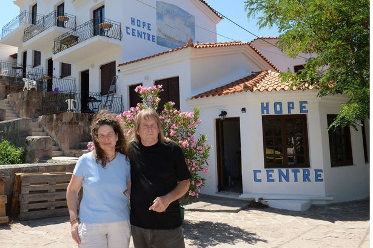

### Volunteers needed on Horgoš and Kelebija border crossings

Refugees from Gaza arriving on Lesvos\. Husband is carrying his blind wife on his back and a baby in his hands\. Photo taken from lesvosnews\.net
#### Greece

**132 new arrivals on Greek islands today**

There were 132 new arrivals on Greek islands today with 57, 046 people still stuck in Greece as numbers are not really changing and relocation program is still not properly functioning\. As Platanos refugee solidarity Lesvos reports: “One rubber boat with 56 refugees from Syria, Afhganistan, Iran, Ethiopia and Eritrea arrived yesterday at 2 pm at the beach of Kayia next to the village of Skala Sykamias\. The boat landed on its own, escaping the blockade imposed by NATO, Frontex, Greek and Turkish coastguard vessels, which are patrolling the sea of Northern Lesvos day and night\. When Greek coastguard appeared, they seemed quite frustrated about losing the boat since their strategy for the past month has been to keep refugees on the water, away from volunteer help and medical assistance, until coastguard buses arrive to take them to the detention centre of Moria\.”

Dhingi that just brought refugees to the shore of Lesvos Photo: Platanos refugee solidarity, Levos
### **Brexit to affect already slow relocation process\.**

Britain’s exit from the European Union will probably curve an already minimal appetite among member\-states to push ahead with the relocation of refugees from Greece to other countries, Alternate Minister for Migration Policy Yiannis Mouzalas [said in an interview](http://greece.greekreporter.com/2016/06/26/brexit-to-hamper-refugee-relocation-in-the-eu-says-migration-minister/#sthash.fO3QTvTb.dpuf) with leftist Avgi newspaper, published on Sunday\. “Before the Brexit, I’d say the EU’s will — and especially that of some countries like Germany, France and the Netherlands — was, at least on a bilateral level, to relocate at least 15,000 to 20,000 refugees\. But after the Brexit, I cannot say how things will develop,” Mouzalas was quoted as telling the paper\.

He also said the ministry is initiating a short\-term plan that includes closing down a significant number of informal camps by September\. “The government’s plan is for these camps to be transformed and for refugees and migrants to be distributed equally throughout Greece, near large cities, in camps and apartments with less than 1,000 people by region, so as to avoid creating ghettos and to start a process of gradual integration, for as long as they remain in the country,”\.
### **Hope center in Lesvos closed**

One informal shelter, run by British expats in Lesvos\. Hope center was closed after majority of local community protested it’s continuation in what was called an effort to “to protect refugees from the greed of NGOs and to protect the local economy”\. On the other side, some of the local residents defended the Hope center, but in the end, it was closed\.

Phillippa and Eric Kempson\. British expats that ran the Hope center in Lesvos
### **Join the volunteers in Samos**

Volunteers from Samos report that they have a new system of distributing necessities and send a message to all that want to join: “Aside from our distribution, we have noticed that it’s the humanitarian aspect of our presence in the camp that’s also greatly appreciated\. It’s amazing how a little kindness can go such a long way when people are having a difficult time\. It’s as if the smallest act — such as a warm embrace — is magnified\.Come join us\!” For more follow the link [https://samosvolunteers\.wordpress\.com/](https://samosvolunteers.wordpress.com/)
### **Mosquitoes pose a real threat**

Distressingly high numbers of mosquitoes plague most of the camps in Greece\. It is important for people to eliminate standing water wherever they can, as well as stay inside during dusk and dawn\. Some camps do not allow insect repellant inside of the camp, but for those that do, education initiatives need to be taken in order to promote correct usage of insect repellant\. Insect repellent contains some toxins that are harmful for human consumption\. It is imperative that people wash their hands after applying insect repellant, as well as to keep it out of eyes, away from the nose, and mouth\. In locations where the military has forbidden the use of insect repellant, volunteers are encouraged to bring in citronella oil, lemon eucalyptus oil, and lavender oil\-based sprays \(not the oils themselves as most essential oils cannot be applied topically\) \. There is conflicting research on the efficacy of essential oil insect repellant\. Regardless, for those opting to use either essential\-oil based or regular insect repellant, reapplication is crucial\.

In 2015, the range of areas afflicted by West Nile Virus in Greece only expanded, and as mosquito season continues, we can expect to see cases showing up in the camp\. The symptoms of West Nile Virus include fever, headache, body aches, rash, and swollen lymph nodes\. Severe symptoms include stiff neck, sleepiness, disorientation, coma, convulsions, and paralysis\. Individuals who suspect they may have West Nile are encouraged to report to medical care immediately\.
#### Italy
### **3,300 migrants in 26 separate operations in the Mediterranean rescued over the weekend**

Italian coastguard and navy ships rescued over 3,300 migrants in 26 separate operations in the Mediterranean over the weekend, a spokesperson for the Italian navy told Reuters on Sunday\.

The people were picked up from 25 dinghies and one boat, all north of the Libyan coast, the Coast Guard said in a separate statement\.

The navy spokesperson said one adult was found dead and another four injured migrants were transported by helicopter to the nearest hospital, on the island of Lampedusa\. About 60,000 boat migrants have been brought to Italy so far this year, according to the Interior Ministry\.

Migrants disembark from a vessel of ONG Medecins sans Frontieres \(MSF\) in the Sicilian harbour of Augusta, Italy, June 24, 2016\. Photo: Reuters
### **Right wing party leading the way in protests blaming migrants for economic hardship in Europe**

While people are risking their lives on this dangerous journey, economic crises still ravages Europe creating a stalemate that shifts the blame once again to those most affected — immigrants\. This time Italy has shown it’s worrisome face with Italian extreme right Forza Nuova party marched two days ago in the main Catania’s tourist boulevard protesting against immigration and economic hardship\. It was a peaceful demonstration\.
#### Hungary / Serbia border
### **Volunteers are urgently needed on the border of Hungary and Serbia, but keep in mind it is a dangerous border and volunteers need either to speak Serbian and/or Hungarian or to have a reliable translator onsite\. Before thinking of going check out the new [FB page](https://www.facebook.com/groups/576116159234354/) and connect with those already working there\.**

On site, at the moment, there are just two volunteers providing electricity, wifi and tea, soon will come iHo \(I’m Human Organization\) \. Would be great to organize a kitchen and distributing clothes\.

If you are an independent volunteer you have to find an organisation with the permission to get to the border area, otherwise you can organize activities and distribution 500 meters far from the border area where there is a shop\. The people are gathering there, you can meet them easily\.

The daily food they get is bread, 1/2 liter of water and tuna or sardines\. Doctors are urgently needed too\. At the border crossing, Kelebija, there is a camp with 300 people\. The conditions are very bad: no doctors, no showers, only 10 toilets for all the people, none come to pick up the trash, the food distribution is not enough for the people and the temperature is around 35° every day\.

The crossing procedure is very slow only 15 people per day, and if you are a young male without family after you enter you have to wait 28 days detained in the transit zone before going to an Hungarian camp\.
#### Hungary
### Trial of the Roeszke 11 starts today\.

Follow this thread and the links for more details\. [https://twitter\.com/VGSchwab/status/747344117693222913](https://twitter.com/VGSchwab/status/747344117693222913)
#### Croatia
### **No border camp held on the Croatian — Slovenian border this weekend**

This weekend No border camp was held on the border of Croatia and Slovenia\. On the final day of the camp, people voiced their clear demands for improving conditions of their stay in Porin center for asylum seekers in Zagreb\. Also during one of the workshops a banner of support for Roszke 11 was made\. The banner is traveling the Balkan route\.

Light brigade crew\. Photo: Tea Vidović

Workshop’s held in Kumrovec, Croatia, No border camp\. Photo: Tea Vidović
### **Croatia expecting relocated people\. Volunteers needed**

Also, as Croatia is expecting relocations soon and more people are returned here there is a need for volunteers based in and around Zagreb and possibly soon in Rijeka and Split in order to help with informing people of their rights as well as Croatian lessons\. If interested, contact the Initiative Welcome crew by sending an email to Sara at sara\.kekus@cms\.com
#### Austria
### **Developments in legal case concerning push backs on Austrian border**

Border crossing Spielfeld are reporting on the legal case concerning push backs on that border crossing: “The much\-quoted professional and standardized procedures in place in Spielfeld are hard to find — the picture painted by the officers questioned today would suggest quite the opposite, different answers concerning who made the decision to push a person back, if the mention of war was enough a reason to be let into Austria, etc\. etc\. There was no detailed training of staff even though duty at Spielfeld had little to do with their normal day\-to\-day work\.

The role of interpreters — all provided by private security firm Group 4, not qualified as interpreters and some of them hardly able to communicate in German — is questionable to say the least, as is the fact that at no point was a record kept as to which interpreter worked on which case\. In some cases interpreters provided the expertise about which region within a country is currently affected by war and which isn’t\. No clear indication that the reason for push\-back was communicated to those concerned in their own language\. The legal possibility of appeal were not communicated at any point\.

Interviews only lasted some minutes — including translation — in one case about 2\. In one case the request to talk to a supervising officer was turned down; also at the moment of signing the interview protocol, there was no translator present who could have explained what exactly was being signed\. While the form contains details about legal options \(in German\), the form was taken off those pushed back by the Slovenian authorities who used this copy to prepare the paperwork for later transfer to the Slovenian internment camps\.

So to sum up — while the verdicts will be communicated in writing at a later stage, we have already established some vital facts about proceedings in Spielfeld in practice and a number of problematic aspects have been highlighted that point to a great need for improvements\.

Next court day is this coming Thursday from 9\.30 am — we will live\-tweet again under [‪\#‎WithRefugees‬](https://www.facebook.com/hashtag/withrefugees?source=feed_text&story_id=1725050577712308) and [‪\#‎pushedback\_spielfeld‬](https://www.facebook.com/hashtag/pushedback_spielfeld?source=feed_text&story_id=1725050577712308) \.”
#### France
### **Interactive Welcome map of Paris**

Wonderful work by French activist\. One 22 year old Sorbonne student made an [interactive Welcome Map](http://www.streetpress.com/sujet/1466676097-welcome-map-carte-aide-refugies-paris) which identifies several hundred Parisian spots for refugees: food distribution, French lessons, wifi hotspots\. All of this is done in 5 languages: Farsi, Turkish, French, English and Arabic\.
#### UK
### **Cast of King Lear to be performing poems written by refugees living in Calais**

Not all is morose in Europe’s biggest island\. News from the Brits comes in many forms and shapes, but solidarity is and will be in the works as long as there are people organizing it\. Calais action published news of one of such actions today: “Calais Action are honoured to be approached by the cast of King Lear who have been touring around the UK\. This week on the 30th June at their last show at the Malvern, the cast will be holding a free pre\-show poetry reading, combining Shakespeare’s sonnets with poems written by refugees living in Calais\. Our buckets will be in attendance to be filled with people’s generosity\. Please go and see this show if you can or donate to their fundraising page below\. All money goes to Calais Action and we are very grateful\.” For more follow the link\.
### **Open Letter concerning Brexit**

Together with Amnesty international, CARE, Refugee council and many others, Calais action wrote an open letter of solidarity\. We bring you their message: “We’re proud to have co\-written this open letter in The Times today standing up for the rights of refugees and asylum seekers after [‪\#‎Brexit‬](https://www.facebook.com/hashtag/brexit?source=feed_text) \. Signed by Calais Action, the Refugee Council, Amnesty, CARE International and many other major organisations dealing with refugees, this letter calls both for a humane policy towards those seeking asylum, and a move away from the tone of fear and mistrust which has poisoned the Brexit debate and the national conversation on immigration\.

Open letter published in today’s Times

On Tuesday this week we have a Parliament group meeting to discuss the fallout of Brexit and the implications for child refugees\.

Don’t let the right wingers and fascists frame the narrative\. We must not let the government surge to the right and break down those hard\-won protections for refugees\. Already Theresa May is challenging the rights of refugee children in the courts and her proposed asylum strategy last year is expected to severely curtail the rights of asylum seekers when it is announced\.

We need to defend the rights of refugees and those who seek sanctuary within our borders\. Human rights will be one of the first things to be eroded under a far\-right government, and those of refugees and asylum seekers will be the first to fall\. We must not let this happen\. [‪\#‎RefugeesWelcome‬](https://www.facebook.com/hashtag/refugeeswelcome?source=feed_text) [‪\#‎LoveWins‬](https://www.facebook.com/hashtag/lovewins?source=feed_text)

Signed by The Refugee Council, CARE International, Calais Action, Amnesty International, Christian Aid, Scottish Refugee Council, Action Aid UK, CAFOD, the IRC, Doctors of the World UK, Refugee Action, Freedom from Torture, and the Jesuit Refugee Service UK\.”

_Converted [Medium Post](https://areyousyrious.medium.com/volunteers-needed-on-horgo%C5%A1-and-kelebija-border-crossings-4c23c2c2f4de) by [ZMediumToMarkdown](https://github.com/ZhgChgLi/ZMediumToMarkdown)._
