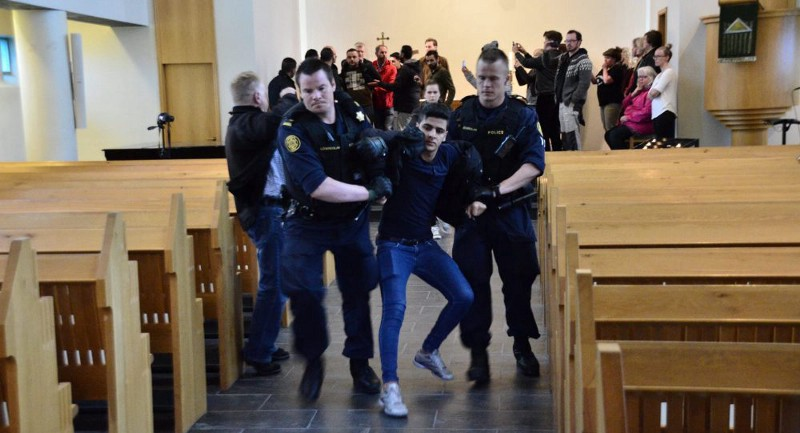
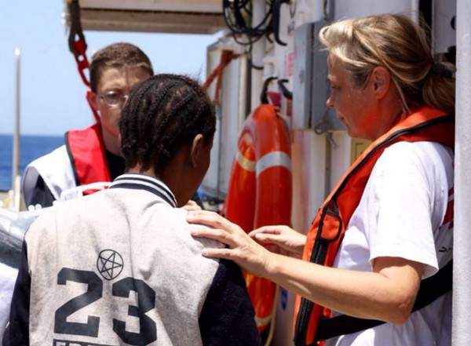
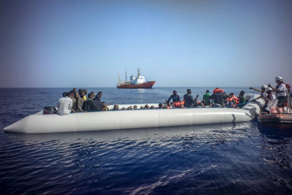
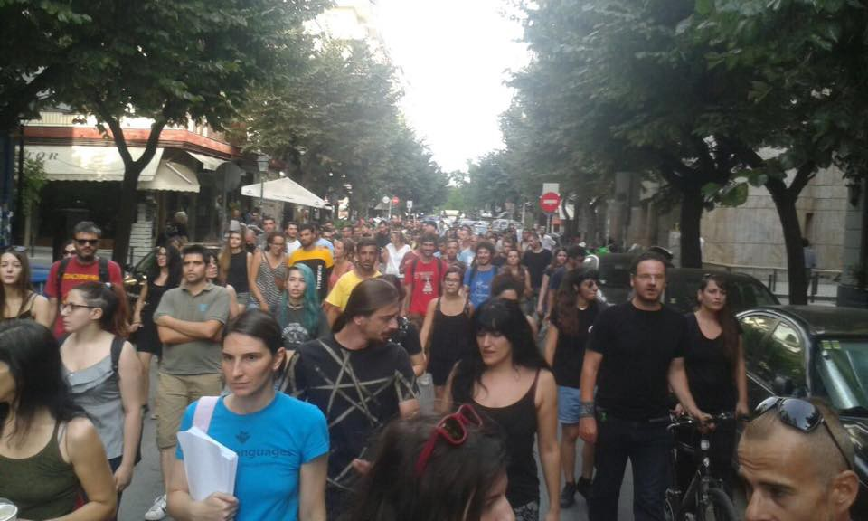
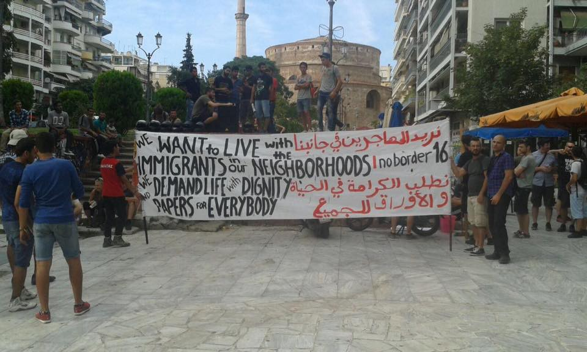
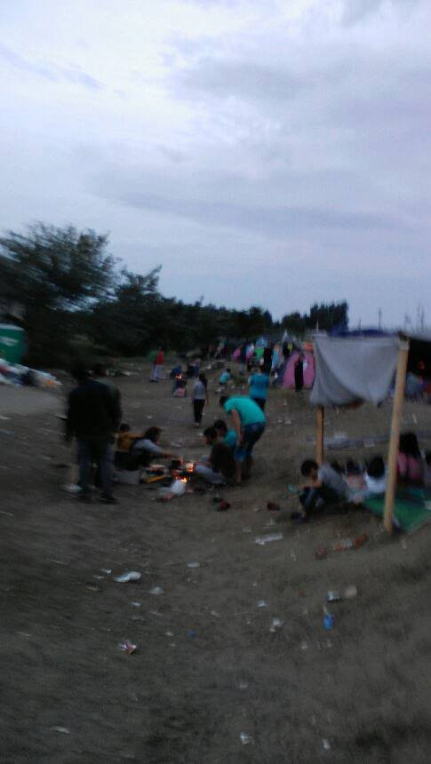
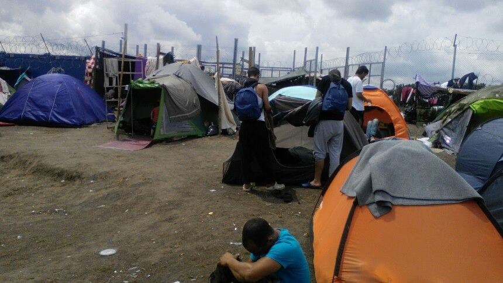

### AYS DAILY DIGEST 28/06: More Injustice for Refugees

_The route into Europe crossing the central Mediterranean is ‘as busy as ever” with 222,291 refugees entering Europe in 2016\. More people are coming on a daily base from Libya to Italy\. This morning another ship with 578 refugees was saved at the sea\. Closed borders and imposed restrictions are helping only to a smuggler who increased their prices\. At the same time, attacks on migrants all over Europe are increasing\. Today’s suicide\-bomb attack at the Istanbul Ataturk airport just adds more fuel to the fire\._

](assets/9bbf3a011fc3/1*OahsDyfzNAsPoiqs8hAX9w.jpeg)

Credits: [Benjamin Julian](https://benjaminjulian.wordpress.com/)
#### General
### Mediterranean route more active that in 2015

According to the International Organization for Migration \(IOM\), 222,291 refugees has entered Europe in 2016 by the sea, arriving in Italy, Greece, Cyprus and Spain\. The same sources warns that a number of deaths in the Mediterranean increased this year to 2,888 compared with 1,838 through the first six months of 2015\. Those who were rescued told IOM staff that during sea crossing, they witnessed the migrants falling overboard from their dinghy\.

> “This month alone, 372 people have lost their lives at sea\. This is 35 times more than in June last year\. The scale of this tragedy will continue to increase unless all world leaders focus on providing safe routes for people seeking sanctuary as well as continuing to address the root causes of migration so that these senseless drownings stop\.” said Simon Missiri, IFRC regional Director for Europe\. 

Reports that the Italian coast guards are confirming that the number of people crossing the sea is increasing\. They have rescued another 3,300 people on Sunday\.

In Vibo Valentia, the Italian coast guard just landed carrying 762 migrants; among them, 153 women and 71 minors\. From Vibo, the migrants will be transferred to other regions: 25 in Abruzzo, 25 in Basilicata, 100 in Calabria, 50 in Campania, 50 in Emilia, 50 in Lazio, 100 in Liguria, 100 in Lombardy, 100 in Piedmont, 50 in Tuscany, 50 in Umbria, 50 in Veneto\.

SOS Mediterranean

Similar reports about rescues at the sea are coming from different sources\. Only this morning, 678 people were rescued from the crew from the Aquarius ship, including many women and children\. Another report says that the Spanish ship Rio Segura landed in Cagliari carrying 619 people, 434 men, 74 women, including 5 who are pregnant, and 111 are minors\. There are 90 possible cases of scabies, but the local health unit is taking care of the situation\. A receiving camp has been set up in Cagliari\. Last Sunday, the Norwegian ship Siem Pilot saved 737 migrants\.

Süddeutsche cites quote Frontex warnings about new arrivals across the sea\. Head of Frontex, Fabrice Leggeri, claims that 13 to 14 times more people come from Libya to Italy than from Turkey to Greece\.

> “The new focus is between North Africa and Italy\. The central Mediterranean route is very busy as ever\. The number of irregular border crossings between Libya and Italy exceeds this year the number of all other illegal border crossings into the EU\. Meanwhile, come from Libya 13 to 14 times more refugees to Italy as migrants from Turkey to Greece\. There are people from West Africa and the Horn of Africa\. In Eritrea, there is persecution and a brutal dictatorship\. These people are in need of protection\. From Senegal, Gambia, Ivory Coast and Niger many fleeing economic prospects…From January to the end of May, we found 330,000 illegal border crossings\. This is twice as much as in the first five months in 2015\. We carry migrants back \[to Turkey\] only when it is certain that these people have exhausted all legal avenues for asylum in Europe\. This applies not only between Greece and Turkey but between all countries outside the EU\. Frontex has no competence to examine whether and to what extent the decision of an EU Member State is justified to refer a foreigner to a third country\.” 

Somebody still profits from this human tragedy and looks like much more is done to keep borders closed fro refugees that for those who profit\. Prices for smuggling migrants into Europe have as much as tripled in the past six months compared with last year, according to the European law enforcement agency Europol\. At the end of last summer, migrants were paying between €2,000 and €5,000 \($2,200 and $5,600\) for the entire trip from their home country to the European Union, Europol said\. Migrants are currently paying up to €3,000 just for one leg of their journey to Europe, it said in a report published Monday\.

This trend is a consequence of the closing\-down of the main migration route via Turkey, Greece and the Balkan countries after the EU and Turkey struck a deal in March and countries north of Greece put border restrictions in place\.
#### Turkey
### So far, 28 dead, over 60 wounded in a suicide bomb attack at the Istanbul Ataturk airport

Explosions and what sounded like gunfire have rocked Istanbul’s international Ataturk airport\. Turkish officials said at least 28 people are dead\. State news agency Anadolu reports 60 wounded\. Turkish media and officials say two attackers detonated their explosives near the security check\-in at Istanbul’s Ataturk airport late on Tuesday\. Videos on social media showed panicked passengers amid sounds of gunfire and the arrival of ambulances\. Roads around the airport were sealed off to regular traffic\.

The private DHA news agency said the wounded, among them police officers, were being transferred to the region’s Bakirkoy State Hospital\.

Ataturk is Turkey’s largest airport and a major transport hub for international travelers\. It ranks as the world’s 11th busiest airport, with 62 million passengers last year\.

Turkey has been hit by a spate of bombings this year, including two suicide attacks in tourist areas of Istanbul blamed on so\-called “Islamic State” \(IS\) militants and one attack attributed to Kurdish militants\.
#### Greece
### Refugees to Leave Piraeus and Elliniko Camps by July 20

Greek Shipping Minister [Thodoris Dritsas announced](http://greece.greekreporter.com/2016/06/28/refugees-to-leave-piraeus-and-elliniko-camps-by-july-20/) that camps in the port of Piraeus and the former Elliniko airport will be relocated f by July 20\. It is not clear where people will be transferred\. Most of the existing military\-run camps are hardly places where people can live\. The food is of poor quality, and the amount is often not substantial, while the heat and mosquitos are making the life of refugees unbearable\.
### NGO’s in Greece are looking for volunteers

Volunteers in Alexandreia are asking for your help\. Alexandreia is the official camp where the group of volunteer builds an innovative shop, clothes boutique and they run the on\-site warehouse\. But, looks like many other projects are in development\.

> “We ask volunteers to stay for 2–3 weeks and have vacancies from 19 July but we currently have an urgent need for people 1st\-7th July so if you;re available that week please get in touch: https://www\.facebook\.com/RefugeeSupportGreece/“ 

### Mosquitoes pose a real threat

We repete our warning about mosquitos in camps\. Distressingly high numbers of mosquitoes plague most of the camps in Greece\. It is important for people to eliminate standing water wherever they can, as well as stay inside during dusk and dawn\. Some camps do not allow insect repellant inside of the camp, but for those that do, education initiatives need to be taken in order to promote correct usage of insect repellant\. Insect repellent contains some toxins that are harmful for human consumption\. It is imperative that people wash their hands after applying insect repellant, as well as to keep it out of eyes, away from the nose, and mouth\. In locations where the military has forbidden the use of insect repellant, volunteers are encouraged to bring in citronella oil, lemon eucalyptus oil, and lavender oil\-based sprays \(not the oils themselves as most essential oils cannot be applied topically\) \. There is conflicting research on the efficacy of essential oil insect repellant\. Regardless, for those opting to use either essential\-oil based or regular insect repellant, reapplication is crucial\.

In 2015, the range of areas afflicted by West Nile Virus in Greece only expanded, and as mosquito season continues, we can expect to see cases showing up in the camp\. The symptoms of West Nile Virus include fever, headache, body aches, rash, and swollen lymph nodes\. Severe symptoms include stiff neck, sleepiness, disorientation, coma, convulsions, and paralysis\. Individuals who suspect they may have West Nile are encouraged to report to medical care immediately\.
### Protest in support of refugees in Thessaloniki

Refugee TV
#### Bulgaria
### Bulgaria Drops Case against Border Police Officer Who Shot Migrant

Prosecutors in Burgas decided to end pretrial proceedings into the death of an Afghan migrant who was killed not far from the Bulgarian border last October\. Border police claim that officers noticed the movement of over 50 people near the border and that after shooting in the air “as a warning sign”, a bullet “rebounded” hitting one of the people on the move in the back of the neck\. Human rights organizations pointed to the development as a possible case of police brutality\.

Burgas District Prosecutor’s Office investigation established that no crime had been committed accepting the version according to which the bullet fired ricocheted off the bridge, changing its movement and hitting the migrant\.
### Bulgarian authorities detained 65 people

According to the Bulgarian media, the bus, bearing Sofia license plate, was traveling on the Rezovo\-Burgas road when it was stopped in the area of the former shipyard located between Varvara and Tsarevo\. None of the people on the bus, who are allegedly from Afghanistan and Iraq, had their identity documents\. Among them were many children of different age\.

The driver of the bus, a 34\-year\-old man from the village of Aldomirovtsi in the municipality of Slivnitsa, has been detained for 24 hours\.
#### Serbia
### Storms worsening the conditions in refugee camps

Alarming reports are still coming from the Serbian\-Hungarian border\. Volunteers are asking for any kind of help\. The storms which occurred the last night drastically affected the camp at Kelebija, and presumably Horgoš “transit zones\.” Everything is not very muddy\.

Thank you Amien Essif

There is a severe shortage of tents, with 360 people in Kelebija staying in about 100 tents\. Some people are charging five euros a night for access to a tent\. Independent volunteers are raising funds specifically for sturdy tents to deliver to these locations in the future\. [You can help by clicking on the following link](https://www.gofundme.com/qc54ns3g) \.
#### Hungary
### New law that allows push backs of people

Hungarian president signed the “8km law” that will be in effect from 5th July\. The law allows pushing back people to the Serbian side of the fence\. Namely, the new amendment of the law allows the police to ‘escort’ all refugees that are caught within 8km of the fence to the ‘no man’s land’ at the other side of the fence where they have to wait for days and weeks in inhumane conditions and almost no legal counseling\. The only independent source of legal assistance in transit zones, the Hungarian Helsinki Committee, but they have limited access and capacity to deal with each case\.

For instance, in the process of application in transit zones, the right to appeal an order of expulsion must be exercised within a few days\. While only a few dozen people are allowed to make an application every day, much more are waiting in makeshift camps without extremely limited access to basic services of food, water, medicine\. There is no sanitary facilities nor shelter for people to sleep or protect from the weather etc, while Hungary allows only 30 people per day through the transit zones\.

In between June 10 and June 20th, there have been 1362 people who were caught crossing the border illegally to Hungary
### A new transit zone is opened in Àsotthalom

The conditions in the detention centers remain very bad, especially from Kiskunhalas immigration detention people report dirty facilities, lack of food and to be denied contact with their families\.
### Volunteers are urgently needed on the border of Hungary and Serbia, but keep in mind it is a dangerous border and volunteers need either to speak Serbian and/or Hungarian or to have a reliable translator onsite\. Before thinking of going check out the new [FB page](https://www.facebook.com/groups/576116159234354/) and connect with those already working there\.

On site, at the moment, there are just two volunteers providing electricity, wifi and tea, soon will come iHo \(I’m Human Organization\) \. Would be great to organize a kitchen and distributing clothes\.

If you are an independent volunteer you have to find an organisation with the permission to get to the border area, otherwise you can organize activities and distribution 500 meters far from the border area where there is a shop\. The people are gathering there, you can meet them easily\.

The daily food they get is bread, 1/2 liter of water and tuna or sardines\. Doctors are urgently needed too\. At the border crossing, Kelebija, there is a camp with 300 people\. The conditions are very bad: no doctors, no showers, only 10 toilets for all the people, none come to pick up the trash, the food distribution is not enough for the people and the temperature is around 35° every day\.

The crossing procedure is very slow only 15 people per day, and if you are a young male without family after you enter you have to wait 28 days detained in the transit zone before going to an Hungarian camp\.
### Roszke trial continues

As volunteers and activist from Szeged are reporting, on Tuesday group of them traveled to Szeged to follow the hearing of one the people accused of the most serious crime relating to the events in Röszke on 16th September 2015\. During the hearing, mostly materials and footage filmed by the police or by the media were shown\.

“To our eyes, in all this footage Ahmed H\. looked much more like a desperate person than a terrorist, one whose aim was not to give an ultimatum to the police but the negotiate with them, pointing out that among the crowd there were children, elderly and ill people\. On the footage, even expressed how he “loves the Hungarian police”, and asked the large crowd to wait and calm down\. Unfortunately, the judge in the Szeged court did not pay attention to this but rather focused on how after being targeted with tear gas and water cannons, Ahmed H\. took part in throwing stones at the police\. Rather, seeing how there were many people voicing opinions in the crowd, he was the one who unlike the others had no way of escaping from the police because he was moving the Balkan route with his family\. His elderly mother and father are also among those accused of starting a mass riot in Röszke, later this week\. To us, the charge of terrorism against Ahmed H\. is incomprehensible and shameful, and we see no reason why him, and the other ten others, are accused\.”

The judge says that the court decision should be made by October, as there are still some witnesses to hear\. The lawyer of the Ahmed H\. considers the trial to be the “test of the Hungarian judicial system”\.

Follow this thread and the links for more details\. [https://twitter\.com/VGSchwab/status/747344117693222913](https://twitter.com/VGSchwab/status/747344117693222913)
### Trials against refugees who are accused of ‘vandalism’

The court in Szeged is hearing the case of a protest in the Nagyfa camp on October 22, 2015\. At that time, detainees of the closed facility started a hunger strike and one window was broken during their protest\. Several people announced the possibility of committing a suicide together\. Seven Iraqis, two Syrians, and one Serbian were singled out during the protest\. The main request from the protesters was for them to be set free\. Two of the people accused are not with the Hungarian authorities anymore, and the police have the order to arrest them\.

Another trial started in the Debrecen District Court, concerning a protest in the Debrecen camp in 2005, the largest camps in Hungary, closed during last that year\. Seven people are accused of “vandalism” and “disturbance of public peace\.” The people indicted are accused of having destroyed parts of the camp property during their protest\. Since the camp was closed and the people inside moved to other facilities, the accused were publicly summoned and the announcement was made public in the mayor’s office\. For now, the case unfolds with only the lawyer of one person in court\. However, the Criminal Code provides for trials in the absence of the accused\. They can receive up to three years imprisonment and be arrested should they be caught on Hungarian territory\.
#### Austria
### Refugees banned from the pool

Some media in Austria are reporting about the incident at the pool in the city of Mistelbach\. Allegedly, the mayor decided to issue a temporary, one day, pool ban for refugees\. The decision was made upon the accusations coming from the 13\-years\-old girl who claimed that a “dark\-skinned’ man followed her to the changing room and try to force her to perform oral sex\.

Following the incident, the mayor temporarily banned all refugees from attending the swimming pool\. The authorities put a poster next the pool entrance reading “Today no entry for refugees,” and two guards were hired to patrol the premises\.

> “This decision was not easy, and I take responsibility for it,” the mayor said\. “The ban on asylum seekers from the swimming pool is temporary until the security is in place,” he added\. 

Police are now investigating the incident and are searching for the suspect\.

There are currently eight facilities housing refugees around Mistelbach\. Police are now checking the camps, Heute news outlet reports\. There is, however, no confirmation on whether an asylum seeker is behind the attack\.
#### Germany
### Rise of far\-right extremists attack

An annual report by Germany’s domestic intelligence agency recorded 1,408 violent crimes by far\-right extremists in 2015\. That compares with 990 such crimes the previous year\.

German Interior Minister Thomas de Maiziere said Tuesday that far\-right extremists targeted asylum seekers in particular last year\.

Far\-right groups have seen a rise in membership and support amid growing anti\-foreigner sentiment last year, as Germany saw an unprecedented influx of refugees from the Middle East and Africa\.
#### France
### Drones deployed to keep migrants and refugees out of Channel Tunnel

Drones equipped with thermal imaging cameras are being deployed on the French side of the Channel Tunnel to track asylum seekers attempting to cross to the UK\. Eurotunnel said the measure had been under consideration since the refugee crisis intensified last year but the deployment today comes amid speculation that there could be a renewed rush by migrants living in Calais following the vote for a Brexit\.

A spokesperson for Eurotunnel told The Independent they will be deployed to respond to alerts on the railway tracks where asylum seekers have been hit by trains and electrocuted attempting to reach England\.

“We already have 500 other cameras and fences with motion sensors, as well as additional security guards of our own and the gendarmerie, and if any of those other security measures alert that there is a presence we will send up the drones to overfly the area and use either their ordinary or thermal imaging cameras,” he said\. “We can survey the situation and then decide on any intervention\.”
#### UK
### Halal shop attacked by petrol bomb near Birmingham

A halal butchers worker was injured when he was hit by a lit bottle of accelerant thrown into his store\. It happened at Kashmir Meat & Poultry on Wednesbury Road, Pleck, when the suspect walked in and threw the weapon\.

The bottle left the man bruised, while the shop was left badly fire damaged\. Today, workers were at the scene restoring the electricity supply to the building\.

Reports of hate crime have risen 57 percent following the UK referendum to leave the EU, according to the National Police Chiefs’ Council\. There were 85 reports of hate crimes to True Vision, a police\-funded reporting site between Thursday and Sunday, compared with 54 reports over the same period four weeks ago, the Independent reported\. Police said it is “monitoring the situation closely”\.
#### Iceland
### Iceland to deport Iraqi teenagers

Shocking images are coming from Iceland where two men from Iraq were arrested at a church, and now they face deportation\. Authorities in Iceland consider Iraq as a safe place\. Two of them were hiding in a small church Laugarneskirkja, in Reykjavík, after the church published a statement saying it would provide them shelter\.

Iceland has a strict policy against refugees\. If they come through Europe, chances are they’ll be deported\. The trick is, there’s no other way in\. Refugees get “processed” and then bounced back to whichever bit of Europe originally registered them\.

The church might continue to offer sanctuary to refugees fleeing the Icelandic state\. But it will take the public pressure, and probably a harder line by the clergy, to make church sanctuary worth more than just the word\.

_Converted [Medium Post](https://areyousyrious.medium.com/ays-daily-digest-28-06-more-injustice-for-refugees-9bbf3a011fc3) by [ZMediumToMarkdown](https://github.com/ZhgChgLi/ZMediumToMarkdown)._
