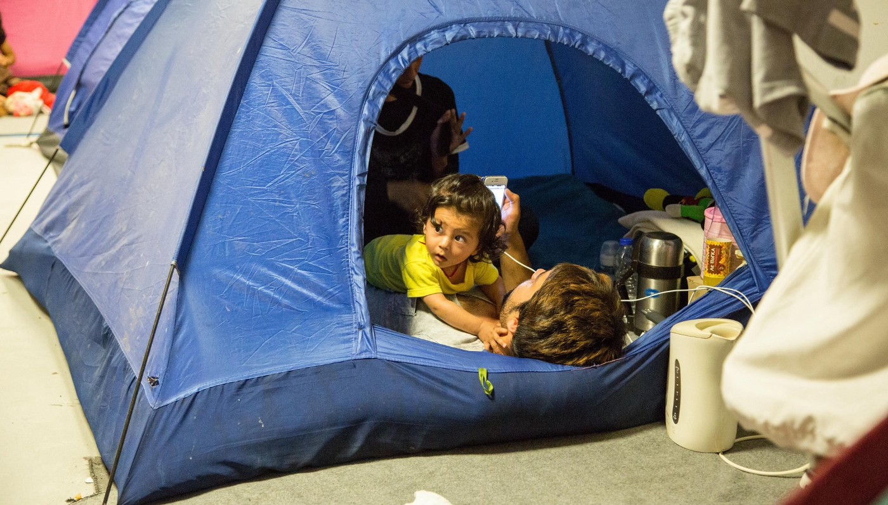
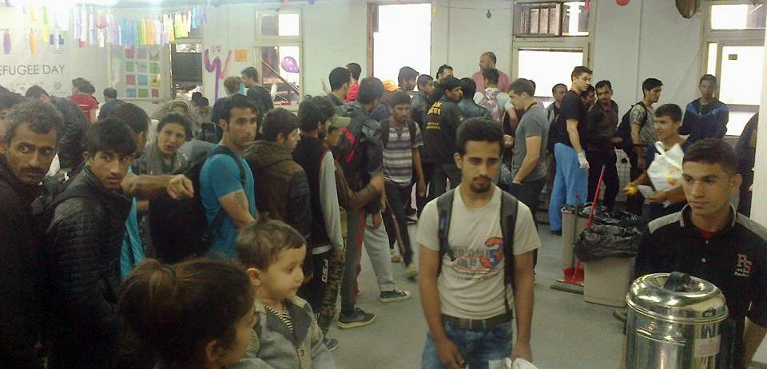
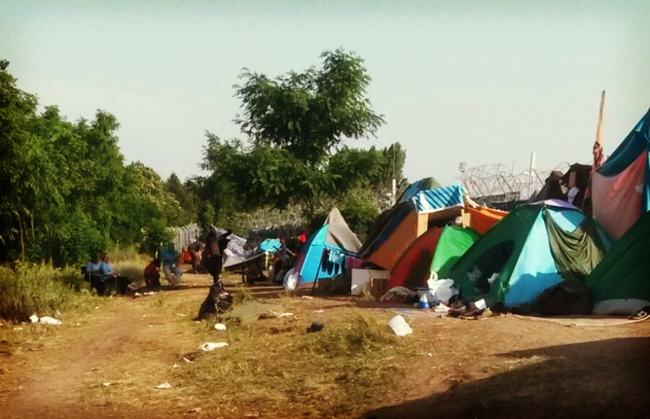
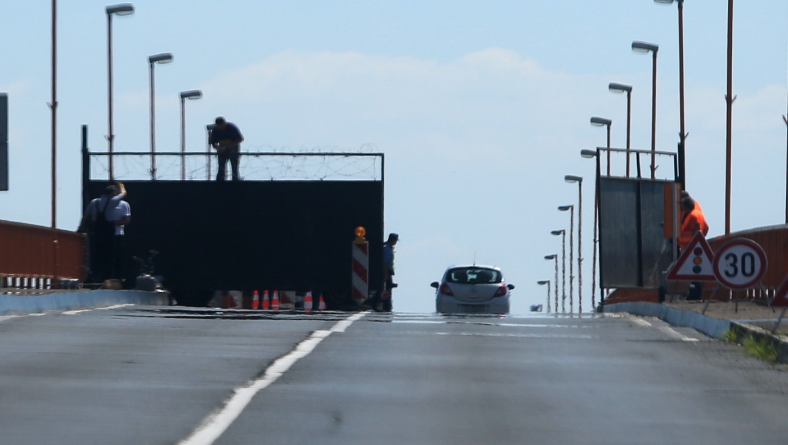
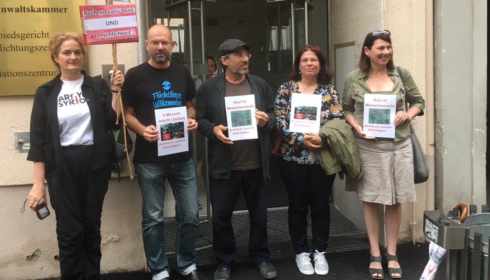
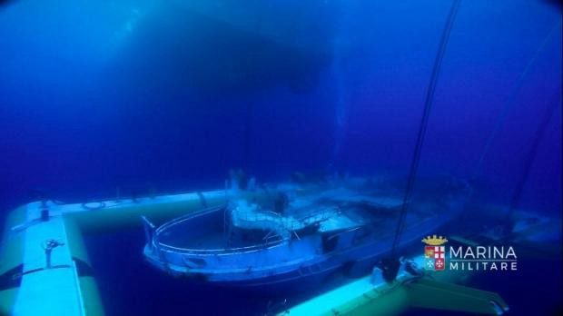

### AYS 30/6: Balkan route very active again, 10 women dead off Italian shore

Every day, hundreds of refugees attempt the dangerous sea crossing on Mediterranean route\. Photo: MSF

_In today’s digest: Comprehensive report from Serbo\-Hungarian border, where volunteers and medical professionals are needed\. Croatia seals off its border with Serbia after the increase of new arrivals\. Italy might finally allow refugees to work: government document attached\. Court case following push\-backs from Austria\. Denmark has started confiscating cash from the refugees\._
#### Mediterranean
### 10 women found dead, 107 rescued after failed attempt to reach Italian coast from Lybia

Ten women have died after the boat full of refugees sunk on its way from Libya to Sicily\. Italian coast guard started an search and rescue mission after receiving a distress call\. They have managed to save 107 people, including small children\. Ten female corpses were salvaged, while some refugees are still considered missing\. Bad sea conditions, including strong wind and waves that reached up to two meters, contributed to the catastrophe\.

578 people also rescued at sea have disembarked from Aquarius in Trapani, Sicily, according to morning report from MSF
#### Greece
### Two boats with 60 refugees arrived to Lesvos

Reminding us how easily the crisis could be intensified if Turkish officials decided to look the other way while refugee boats are departing, two boats have arrived to northern coasts of Lesvos today, carryng 60 refugees in total\.

102 women and children left today from the pot Piraeus to a new camp in Rafina, east from Athens\. According to volunteers on site, there was some trouble to get there because the drivers of the two buses got lost and they took more than two hours to arrive to the location\. Soon none of the refugees wanted to stay in the new camp because they thought it was too far away\. Few hours later, they managed to get back to the port\.
### MSF vaccinated 957 children in Eliniko

After only three days, MSF managed to vaccinate 957 children in Eliniko camp near Athens, which is due to be evicted as soon as the new camps in the area will be ready to accommodate the refugees\. “We would only love to see them living in decent conditions”, said MSF team in a short twitter statement\.
#### Balkans
### Smuggling business flourishing again

Balkan route is very active again, despite the borders being officially closed\. Hundreds of refugees seem to enter Serbia from Macedonia and Bulgaria every day, often with the help of the smugglers, increasing the traffic in Belgrade and adding pressure to Hungarian border\. According to reliable volunteers sources from Macedonia, there are only 13 refugees left in Gevgelija and 80 in Tabanovce refugee camp\. All of the others ran away, probably to Serbia\. Those who have stayed are not allowed to move around freely and are still waiting for their legal situation to be solved\. Meanwhile, smuggling business is flourishing in both Macedonia and Serbia\.
#### Serbia
### With hundreds arriving daily, Miksalište can’t handle the pressure, closing tomorrow

Yesterday, we have published a photo of refugees queuing in front of Miksalište distribution center in Belgrade, stating “every form of help is needed”\. Unable to cope with the pressure, Miksalište has decided to close its doors in Gavrila Principa street tomorrow \(1st of July\), leaving Belgrade without the main refugee support center which has provided aid to approximately 130,000 people during the past year\.

Refugees waiting for food and other necessities in Miksalište distribution center\. Photo: Miksalište

> “Influx of people has risen to more than 500 per day, leaving us unable to continue both financially and logistically\. We will ask for support from Komesariat, UNHCR, City of Belgrade and our partner NGO’s, in an effort to establish an functional and well coordinated system of support for the refugees passing through Belgrade\. In order to reopen, we must be able to meet communal, sanitary and security standards\. We also need to gain support from residents and local businesses who have been complaining about the large flow of refugees in the neighbourhood”, Miksalište [stated](https://www.facebook.com/RefugeeAidMiksaliste/posts/1729253130674637) , announcing the closure\. 

### Report from Kelebija camp: piles of garbage, poor infrastructure, volunteers needed

According to official data, there were at least 700 people in Subotica area yesterday\. Around 40% were children\. Most of the refugees are heading to Subotica going after Belgrade, in a hope of legally passing through one of two nearby border crossings \(Kelebija/Tompa and Horgoš/Röszke\) \. In cooperation with IHA and two Italian volunteers onsite, we have can now elaborate on our first draft reports from Kelebija and we can definitely confirm long\-term volunteers are needed to set up and maintain the infrastructure, while short\-term volunteers are needed to provide urgent support in the area\. There are still around 300 people onsite\. Most of them have been waiting for almost a month to be allowed in, because Hungarians are accepting a maximum of 30 people per day \(15 per each border crossing\) \. Today, volunteers have met four men from Congo who claimed they were beaten and robbed by the military\. One had a broken arm\.

Kelebija border camp suffocating in garbage\. Photo: Volunteers on site

There’s no clear criteria on who gets to pass the border and when\. The priority list that was made is not a guarantee of the passage, resulting in lots of frustration\. Hungarian military and Caritas are distributing canned fish, bread and 0,5l of water per day\. No warm meals are provided\. MSF staff was noticed in the camp today\. Catholic Rescue Services provide health services two hours per week, but only outside of the makeshift camp\. There are lots of mosquitoes\. No shadow whatsoever in the camp\. Sanitary conditions are very bad, with “mountains of rubbish”, as one of the volunteers described\. Ten chemical toilets are situated next to the garbage piles, making sanitary situation even worse\. Two volunteers stationed 500 meters from the camp are currently providing WiFi, electricity and tea, but more volunteer support, including medical support, is needed\. Hygiene kits, clean clothes, warm food, shade, charging stations and showers are completely lacking onsite\. Potential volunteers are warned that entering the border area unannounced can result in detention \(one volunteer was stopped today and had his photo taken by the police\) \. If you want to go to Kelebija, we advise to check the [newly established FB group](https://www.facebook.com/groups/576116159234354/) and ask how you can help\. Hint: a mobile kitchen is needed\.
#### Croatia
### Authorities sealed off Batina border crossing with Serbia to prevent refugees from entering

After last night’s unannounced closure, Croatian authorities have raised a concrete and wire barrier on Batina border crossing, preventing potential refugees to enter from the Serbian side\. According to official government statement issued today, the wall was raised as a precautionary measure “to prevent possible illegal crossings after increased number of refugees has arrived to the area”, but it has also blocked potential asylum seekers, depriving them from their legal right to claim asylum in Croatia\. Oddly enough, the national television claims the barrier was removed later in the day, but there’s still no official or first\-hand confirmation on this\.

Concrete and wire barrier raised on Batina border crossing\. Photo: Vecernji list

In the past weeks, around 50 people have been arriving daily to nearby Serbian town of Sombor, with highest peaks reaching 100 per day\. Yesterday, 39 people from Kelebija refugee center near Belgrade were en route to Sombor\. According to unofficial info, refugees have been trying to enter Croatia near Batina recently, in an attempt to reach Baranjsko Petrovo Selo/Beremend or more distant Goričan/Letenye border crossing with Hungary, in order to avoid queues on Serbo\-Hungarian borders\. Some are also trying to continue their trip illegally, towards western EU countries\.
### Austria sending more refugees back to Croatia on basis of the Dublin agreement?

According to multiple volunteer sources, an unconfirmed number of Syrian, Iraqi and Afghan refugees who have entered Austria after the first of January 2016\. got a letter from BFA, informing them about the possibility of being sent back to Croatia according to Dublin regulation\. AYS volunteers can confirm at least 80–100 people were deported to Croatia from Austria since March, after receiving similar papers, also based on the Dublin agreement\. Some had children who have already started going to school in Austria\.

People campaigning against returns of refugees from Austria to Slovenia and Croatia\. Photo: Spielfeld border crossing

This news comes in the wake of court hearings related to the push\-backs of SIA refugees from Spielfeld border crossing back to Slovenia and Croatia earlier this year, in the days that preceded total border closure\. Detailed volunteer account of the second day of the hearing can be found [here](https://www.facebook.com/RefugeesSpielfeld/posts/1720111464916002:0) \.
### First relocations of refugees from Italy to Croatia scheduled for tomorrow

According to Croatian Ministry of Interior, first group of 8 Syrian and Eritrean refugees are scheduled to arrive to Porin hotel in Zagreb tomorrow\. They will be greeted by Croatian officials and will be provided logistical and educational support by AYS volunteers\. They will be granted fast asylum\-seeking process, with the possibility of being relocated to Croatian towns Split or Rijeka or staying in Zagreb in the case of positive legal outcome\.
#### Italy
### Investigators to remove hundreds of refugee corpses from the salvaged sunken boat

Italy is to begin removing the remains of hundreds of people from a sunken migrant boat after raising it from the Mediterranean seabed and towing it to Sicily, the navy announced Wednesday\. The boat’s sinking off Libya in April 2015 left as many as 800 people dead in the worst maritime tragedy in the Mediterranean since World War II\. The delicate operation to lift the vessel undamaged from 380 metres \(1,245 feet\), which began on May 11 but was repeatedly hampered by poor weather conditions, was completed on Monday, the navy said in a statement\. Fingerprints, DNA samples and distinguishing body marks are to be placed on file in the hope that the data may be of help to relatives seeking missing loved ones, according to [AFP](http://en.rfi.fr/wire/20160629-italy-remove-corpses-salvaged-migrant-boat) \.

Delicate underwater operation finally succeeded\. Photo: Italian navy
### Refugees might finally get professional training to help them find work in Italy

According to [IPS news agency](http://www.ipsnews.net/2016/06/let-there-be-work-italian-ministry-of-the-interior-announces-initiative-on-employment-of-refugees/) , after years of dispute over the rights of refugees in Italy, the Italian Ministry of the Interior has drawn attention to the importance of providing them with sustainable, productive livelihoods by agreeing to an employment initiative for refugees in conjunction with the General Confederation of Italian Industry otherwise known as Confindustria\.

The initiative led by the Italian government agency emphasizes the fact that the refugee crisis is not a one\-time emergency, and it aims to provide refugees with state\-funded professional training, internships and employment by enterprises nationwide\. It will initially be implemented for a three year period and renewed if successful\. Minister Alfano concluded the signing of the agreement \(the entire document in Italian can be found [here](http://www.interno.gov.it/sites/default/files/allegati/accordo_definitivo_min_interno_confindustria.pdf) \) by stating that “We were immigrants and we welcome immigrants, on the integration wager we must have vision and courage”\.
#### Denmark
### Copenhagen Police seized a total of 79,600 Danish kroner from five unlucky refugees

For the first time ever, Danish police applied the controversial law which among other things allows for the confiscation of asylum seekers assets\.
On Wednesday evening, Copenhagen Police seized a total of 79,600 Danish kroner from five asylum seekers who tried to get into Denmark with false travel documents at the airport in Copenhagen, writes the Danish [BT](http://www.bt.dk/krimi/smykkeloven-har-faaet-debut-flygtninge-mistede-80.000-kroner-i-politi-kontrol) \.

The people, three men and two women, were arrested and searched and that was when the police discovered they had large sums of dollars and euros on the total corresponding to 129,600 Danish kroner\. The asylum seekers were allowed to keep 10 000 crowns was while the rest were taken by the police\.

Danish Integration Minister Inger Støjberg, responsible for controversial law\. Photo: Polfoto

\- It is in my opinion quite reasonable that you have to pay to fend for yourself when you come here as asylum seekers\. It shows that there are good reasons why we introduced the law — said Integration Minister Inger Støjberg, which is behind the controversial bill, often compared to Nazi Germany conficsating valuables from Jewish people in WW2, to the [local press\.](http://www.gp.se/nyheter/v%C3%A4rlden/flyktingar-blev-av-med-100-000-kronor-1.3444180)

She points out, however, that this law does not prevent asylum seekers from having large sums of money in foreign bank accounts\. It is only cash that the Danish authorities can take to finance refugee’s stay in Denmark\.

_Converted [Medium Post](https://areyousyrious.medium.com/ays-30-6-balkan-route-very-active-again-10-women-dead-off-italian-shore-afe2eb7ca0e9) by [ZMediumToMarkdown](https://github.com/ZhgChgLi/ZMediumToMarkdown)._
