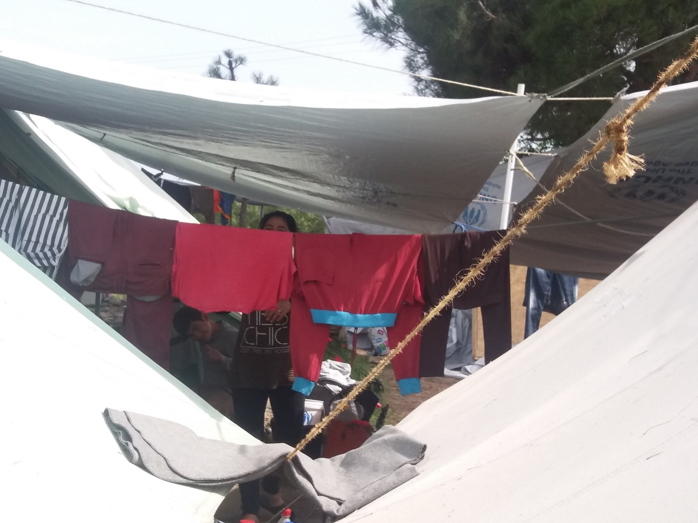
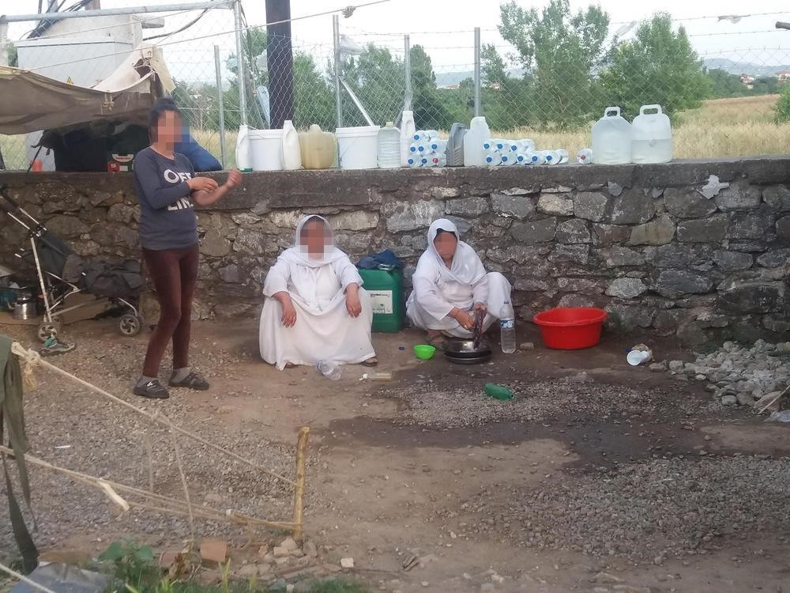
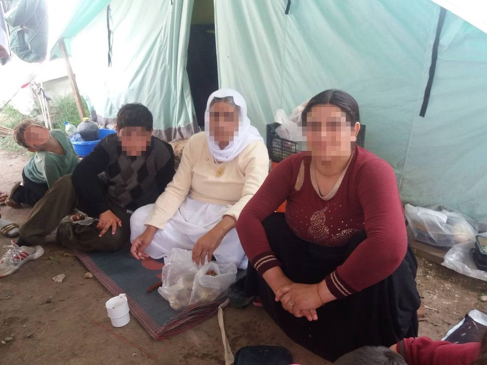

### AYS Special: “We are just alive, but not living\.”

Just alive, not living — Cherso Camp, Greece

> “This is very difficult for all of us\. We are just alive, but not living\. We have nothing\. We do not know where we are going or what is going to happen\. We are suffering a lot on this journey that we do not know how it will end\.” 

These are words of 55 years old Yazidi Sadikah from the city of Sinjar, Iraq, close to Syrian border\. For three months now she is living with about 300 other Yazidis, from 60 families, under tents in military camp Cherso, Northern Greece\. She was introduced to us as grandmother\. Dressed in bright and clean white dress, as customs in Sinjar is \(white is color of Yazidi religion and represents purity\), she sits aside and observes while we are talking with other, younger, women in this area of the camp\.

Among them is Aishan, 20\. We ask her to tell us, if that is possible, if there is something we can try to do for Yazidi women in this camp\. “Can you just tell us how long this will last?” The question almost impossible to answer\.

They are afraid of separation, and keep repeating that they want to go all together, to any other country where they will have a chance to live without prosecution\. “In order to practice our religion and preserve our customs, we need to stay together,” Aishan explains\.

Yazidi women in camp Cherso\. They are too afraid to leave tents and part of the camp where they live

Yazidis are recognised by the UN as a distinct ethnic group and independent religious community with their own unique culture\. Most of them live in Iraq, but many are in Armenia, Georgia, Turkey, Iran, and Syria\. Since the 1990s, a huge wave of Yazidi migration began and now many are living in Germany and other European countries\. From 2014, they have been targeted by ISIS, which considers them “devil\-worshippers” because they worship the angel Melek Taqqus \(Peacock Angel\) which is considered as God’s alter ego\. It is estimated that around 70,000 Yazidi people are on their way to Europe, or 15 percent of the entire population\.

The city of Sindjar, where Aishan is from, was captured by ISIS in August 2014 and about 50,000 Yazidis were forced to flee to the mountains\. What did happen some observers and human rights activists are describing as genocide\. This week, Nadia Murad \(23\), a Yazidi woman from Iraq who was kept for three months as a sex slave by ISIS, and escaped, called for prosecution against perpetrators of genocide against Yazidi\.

“Genocide must be recognized,” [she said for the Agence France Presse](http://www.naharnet.com/stories/en/212301) \.

Aishan was in the group that managed to leave the city\. She speaks good English and helps with children in Open Cultural Center\. Not many women from Yazidi area in Cherso camp leave their tents\. Some have not done that for over three months, or since they arrived\. Mostly out of fear\.

Aishan remembers when ISIS came into her city and when she and her family had to leave and hide in the mountains\. They were saved by Kurdish military that opened the safe passage\.

There are 300 Yazidi in Cherso, mostly women and children

> “We did not have guns and could not protect our selves\. They came to Sinjar and started killing men\. We believe that all those who left behind are dead\. All the girls who stayed, even those 10 years old, are taken by Da’esh\. Some were sold and some they kept for themselves\. We managed to run away, living in mountains\. It was very difficult there\. No water, no food\. Anything\. We are even now very, very afraid they will find us\.” 

From Iraq, Aishan group went to Turkey, than to Greece by boat\.

> “It was very dangerous journey and I was very afraid\. We had to pay 1,000 Euro for each person to some people to get us here\. We sold everything we had for that and now we do not have anything left\. We wanted to go to Europe because we believed we will be safe, that Europe means peace\. And now we are here — in Europe,” she told showing around tent she lives in with five other people\. Grey blankets on the floor made out of wooden pallets, sleeping bags neatly folded up in the corner, just couple of pillows\. And nothing else\. 

It is believed that during this attack, over 8\.000 people were murdered, hundreds of girls captured, brutally raped and kept as sex slaves\. Recently, after liberation of Falluja, Iraqi forces rescued 354 Yazidi women who were abducted by ISIS\. Over the past few months, several mass graves containing bodies of people, including members of the Yazidi group, have been uncovered in Iraq and Syria\.

Aishan and the rest of her family traveled for years only to get to Cherso camp, where they live under tents with minimum living conditions, like all the other in this camp\. It was cold, windy and rainy during the winter, and now it is too hot and hardly bearable\. Like the rest of the camp, even Yazidi part is full of children\. Most of them are dressed in winter close and wear winter shoes, since they have nothing else\. The food they get is modest, and not sufficient\. The only fruit they get are apples and oranges\. Yet, what makes their life the most difficult is uncertainty since they do not have any information about how long they will stay there, or what will happen to them\.

Aishan never got to finish her school, and she dreams that one day she will be able to continue her education\. She wants to become a journalist\. Last time she was in the school was three years ago\. “I am happy to go anywhere where I will be with my community and be able to go to school again,” she told us\. “But we do not know for how long we will stay here\. Some people are telling us for couple of months, some that will take much longer\.”

To stay longer in this camp is becoming every day harder\. Like all the others who are living in military run camps in Greece, Aishan just want peace and security\.

_Written by Nidzara Ahmetasevic, AYS\. Additional research by Ana Jorge_

_Converted [Medium Post](https://medium.com/are-you-syrious/ays-special-we-are-just-alive-but-not-living-dceda508a314) by [ZMediumToMarkdown](https://github.com/ZhgChgLi/ZMediumToMarkdown)._
