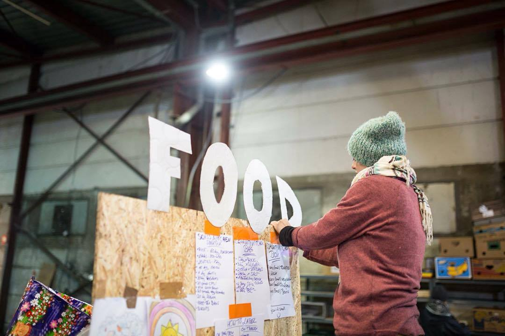

### AYS DAILY NEWS DIGEST 1/7: When Europe treats refugees as criminals
#### Refugees are being arrested and imprisoned at several places along the route\. Elsewhere, they are enclosed in camps with little food\. New camps are being built, especially in Italy where thousands and thousands of refugees are coming by boat every single day\. Donations are needed urgently\.

Credits: Help Refugees
#### General

**580 smuggled refugees and 39 smugglers arrested in a coordinated Europol action**

> Border management restrictions in the South East European region have created demand for criminal networks to offer their services to those refugees who are stranded in various phases of their journey\. Facilitators often appear in refugee camps and offer their services to asylum seekers\. 

> Police and border management forces from Austria, Bulgaria, Croatia, former Yugoslav Republic of Macedonia, Germany, Hungary, Romania, Serbia, Slovenia and Switzerland joined forces for this 36 hour long action\. An operational centre, involving temporary liaison officers from the region, has been set up at the Joint Operational Office in Vienna to support the ongoing cross border operations\. The Mobile Analyst team \(EMAST\) of Europol’s European Migrant Smuggling Centre \(EMSC\) was deployed to the main criminal hubs in Germany, Austria and Hungary to facilitate real time information exchange and perform live cross matching\. 

> Nearly 30 refugee smuggling incidents were detected, 39 refugee smugglers arrested and 580 smuggled refugees were intercepted\. The aim of the action was to trigger real time information exchange and the law enforcement reaction to detect refugee smuggling activities\. Real time information exchange is one of the best law enforcement tools to stop cross border criminal activities\. Due to this technique, a smuggler who attempted to escape from Hungary with 6 Syrian refugees was stopped in Austria after a hot pursuit through Slovakia\. 

> During the implementation of this action increased smuggling activities were detected along the Western\-Balkan route\. The stricter border control measures result in organised crime groups offering their services to refugees\.
 

> “Criminal groups are offering services to refugees to facilitate their journey, making substantial profits\. In 2016 alone, more than 7000 new suspected people smugglers were reported to Europol\. It is expected that the prices for smuggling will continue to rise and exploitation is expected to further increase both in countries of transit and arrival\. Law enforcement in Europe can only fight this phenomenon by joining forces”, concludes Rob Wainwright, Director of Europol\. 

#### Greece
### A costume party in Sounio camp

](assets/d6b3fe032b90/1*gjcC-SIa2Enttonr1VWoWw.jpeg)

Credits: [**Open Cultural Center — OCC — former Idomeni Cultural Center**](https://www.facebook.com/Open-Cultural-Center-OCC-former-Idomeni-Cultural-Center-1302471973114551/?fref=photo)

](assets/d6b3fe032b90/1*r4dKnpPtdVWeySRQbxb8ag.jpeg)

Credits: [**Open Cultural Center — OCC — former Idomeni Cultural Center**](https://www.facebook.com/Open-Cultural-Center-OCC-former-Idomeni-Cultural-Center-1302471973114551/?fref=photo)

](assets/d6b3fe032b90/1*SL7w_PcU4bIos9v2-1WvsQ.jpeg)

Credits: [**Open Cultural Center — OCC — former Idomeni Cultural Center**](https://www.facebook.com/Open-Cultural-Center-OCC-former-Idomeni-Cultural-Center-1302471973114551/?fref=photo)

](assets/d6b3fe032b90/1*NR4wW5CkswpwrDXiU-IiYg.jpeg)

Credits: [**Open Cultural Center — OCC — former Idomeni Cultural Center**](https://www.facebook.com/Open-Cultural-Center-OCC-former-Idomeni-Cultural-Center-1302471973114551/?fref=photo)

](assets/d6b3fe032b90/1*WjzgYfeEd-inmVv3BVOBuw.jpeg)

Credits: [**Open Cultural Center — OCC — former Idomeni Cultural Center**](https://www.facebook.com/Open-Cultural-Center-OCC-former-Idomeni-Cultural-Center-1302471973114551/?fref=photo)
### Violence towards unaccompanied minors in Moria, Lesvos

> Doctors Without Borders reported violence at the Reception and Identification Center of Morias at Lesvos\. The case came to light when 12 Pakistani minors visited the medical center on June 24, accompanied by the center’s chief for an examination\. The young refugees were found to be in a state of shock\. Some of the children had bruises, red\-shot eyes and other marks on their wrists\. A few of the children complained that their heads hurt, whereas one of the children suffered from a nosebleed\. 

> The children stated that there had been rock\-throwing between unaccompanied refugee minors from wards A and B during the night for reasons unknown\. A rock hit one of the police officers on duty who, according to refugees, lost his calm and entered the ward, [punching one of the minors](http://greece.greekreporter.com/2016/06/29/police-brutality-shown-to-unaccompanied-refugee-minors-in-greece/) \. 

### Residents of Idomeni want refugees back

> After the removal of refugees from the Idomeni camp, residents of Idomeni are longing after the vibrant economy which refugees and charity workers had brought with them\. Angry at the local mayor who had a large part in the evacuation process, local business people argue that the town had taken a breather from the economic crisis that has taken hold of Greece since 2008 through the spending done mostly by the charities and aid workers but also by the [refugees themselves](http://www.spiegel.de/politik/ausland/griechenland-eine-stadt-wuenscht-sich-die-fluechtlinge-zurueck-a-1099388.html) \. 

#### Serbia
### Number of refugees rising in Serbia

> According to official info, total number of refugees in Serbia has now risen to 2,200\. The number of refugees in Krnjaca Center near Belgrade is 580, while at least 700 refugees are in the North, in the area around Subotica\. Hungarians are still allowing only 30 refugees per day, so smuggler activity is very high\. 

#### Hungary
### A court on Friday sentenced 10 refugees, mostly Syrians, to between one and three years in jail for illegally crossing the border

> These refugees were charged for crossings during a riot in September 2015, after Hungary built a fence to seal its border with Serbia\. This was the first case tried under a law passed a few days before the incident making illegal border crossing punishable by one to five years in prison\. 

### Donations needed, volunteering opportunities open at Serbian\-Hungarian border

> Oltalom Charity has brought warm meals to Röszke/Horgos at the Hungarian\-Serbian borders for a month now every day\. They are also working on permission to enter the Kelebia/Tompa transit camp, but have not succeeded yet\. Oltalom would be grateful for any kind of support \(monetary, donations at their Budapest centre or even volunteers for 1\-day trips to bring the warm meal, fruits, sanitary items and water from Budapest to Röszke\) \. Connections with local groups at either side of the border who could cook for 1–2 days a week would also be great\. They do not recommend entering border area without a valid permission\. Volunteer relationship with military and police is very sensitive, so it’s best to contact volunteers onsite before your arrival\. Éva Csillag or Sándor Szőke are the best to contact \(via Facebook\) \. 

#### France
### Calais kitchen in desperate need of donations

> This morning [Calais Kitchens](https://www.facebook.com/calaiskitchens/) confirmed that, due to low stock and funds, they will be unable to distribute food packs next week\. 

> The service they offer in the Calais camp is unique and invaluable\. They deliver a food pack to every single shelter and tent, once a week, along with a delivery of wood from the woodyard\. This enables all camp residents the autonomy of cooking for themselves, preparing food with friends and family, eating what they like, when they choose, without having to queue\. 

> Like all of the distribution models that both Help Refugees and our partners operate, Calais Kitchens strives to provide a consistent, reliable source of aid in the camp, in what can be incredibly stressful, challenging living conditions\. A pack of simple ingredients such as rice, oil, kidney beans, tinned tomatoes and spices brings a little normality to 7000 people a week at an average cost of £1 per person per week\. 

> In order to keep up their amazing work, Calais Kitchens must raise £7000 a week to cover costs\. Please click here to send either a one\-off or, better still, a monthly donation and share with your networks\. Help them [here](https://mydonate.bt.com/donation/start.html?charity=152188) \. 

](assets/d6b3fe032b90/1*q6ZlXs-bin8iJeD8amNumg.jpeg)

Credits: [**Help Refugees**](https://www.facebook.com/HelpRefugeesUK/?fref=photo)

](assets/d6b3fe032b90/1*uOpzJ2nUgln5c80KWbdyYA.jpeg)

Credits: [**Help Refugees**](https://www.facebook.com/HelpRefugeesUK/?fref=photo)

](assets/d6b3fe032b90/1*86a1rpCRR-4Dl3iHLhKkXQ.jpeg)

Credits: [**Help Refugees**](https://www.facebook.com/HelpRefugeesUK/?fref=photo)
#### Ireland
### A documentary on life in Idomeni wins an award in Ireland

> The Grand Prize in Irish Council for Civil Liberties \(ICCL\) Human Rights Film Awards was won on Thursday by Caoimhe Butterly for her short documentary The Border — an examination of [life at the Idomeni border](http://www.irishtimes.com/news/social-affairs/religion-and-beliefs/film-on-idomeni-border-wins-award-in-dublin-1.2705930) crossing in Greece\. 

> You can watch the movie here: 

#### Switzerland
### Two teenage girls denied Swiss citizenship because they refused to swim in mixed\-gender pools

> Authorities in Basel have denied two Muslim teenage girls a Swiss passport because they refused to participate in school swimming lessons and residential camps on religious grounds\. The case, which occurred last year but was made public by broadcaster SRF on Monday, involved two sisters, aged 12 and 14\. 

> Speaking to the broadcaster, Stefan Wehrle, president of the naturalization committee involved in the decision, said young people wishing to become Swiss citizens must prove they are meeting the requirements of the Swiss education system\. 

> Since swimming lessons are compulsory in Basel’s schools — and in many other places in Switzerland including Zurich and Bern — failing to attend means a student is not meeting requirements\. 

#### Italy
### MOAS \(Migrant Offshore Aid Station\) humanitarian ship landed today in Augusta with 331 refugees on board

> Gianfilippo Pascolini, coordinator of the NGO Emergency, reported “We have never expected to find refugees with war wounds, the same types of wounds our NGO finds in Afghanistan or Iraq\.” The NGO found a fishing boat with refugees on the border with Libyan waters on Wednesday morning and, thus, they had rescued the refugees\. They found over 500 refugees, 331 of them boarded Responder, while others went on the Italian Navy ship Aliseo\. 

> During the 30\-hour voyage to Augusta, Emergency staff examined 10 Eritrean people wounded by grenade splinters of RPG explosions\. These explosions probably occurred several weeks earlier and refugees’ wounds were old\. Luckily, a medical student among the refugees managed to take care of the others’ wounds for about two weeks before their departure to Europe\. 

> According to Pascolini, the fact indicates two things: “First, the smugglers’ lack of humanitarianism is rising which is, for example, proved by multiple testimonies of refugee women being raped by their smugglers; second, among refugees, there are highly qualified people, which in cases like this can make a difference for their travel\-mates\. 

> Reports speak about 64–69 thousand people escaping to Europe, which is less than in 2015\. Still, 1,300 refugees landing on the Sicilian coasts only yesterday is a huge number\. What is more, the deaths rose from 1,785 \(Jan\-May 2015\) to 2,477 \(Jan\-May 2016\) \. Last week of May 2016 recorded 1,000 deaths\. 

### Gianluca D’Agostino, captain of the ship Diciotti \(coastal guard\), arrived to Catania with the bodies of 10 refugee women that drowned in the June 30th shipwreck\. Here is the captain’s testimony\.

> The dead women were brought along with the other 348 refugees, 108 of which were survivors of the same shipwreck\. 

> Meanwhile, the police mentioned that the two smugglers have been captured\. 

> The captain said “My men risked their lives\. If the dinghy hadn’t made it, my men would have sunk with the refugees\. They found themselves surrounded by floating corpses, and they directed themselves towards the people they thought were still alive\. For some, we found out they were already dead, despite the reanimation on board the Diciotti\. We fought against the time and the dangerous sea, plus the dinghy’s floor crushed\. However, the tragedy was contained, we saved as many lives as possible\. The boys have been very courageous and I’m really proud of their performance and reactions”\. 

### 300 refugees have been finally allocated to pavillon C of Fiera del Mare in Genova

> The accommodation was prepared by the Italian Red Cross\. The Mayor Doria said the structure is adequate, while the opposition complains about the overall management of the situation\. However, the mayor reminds that the situation is only temporary, and that he acts by following pope Francis’s call to welcome refugees with human dignity\. 

### Italian Red Cross fixed a new camp at Via Ramazzini in Rome

> The camp is close to the city center\. The structure is to receive 120 refugees, who are to transit there for a maximum time of one week before being relocated to other refugee centers\. 

> Last night, 50 refugees from Sudan, Nigeria, Somalia, Gambia, Senegal and Ivory Coast \(including 2 families, 6 women, one child\) entered the camp\. These people reported dehydration from the long voyage on the Mediterranean sea\. 

> Protesters from extreme right wing parties \(Forza Nuova\) decided to march in the streets the very same night, also burning a dumpster in front of the camp\. 

### Ragusa police stopped two people accused of being smugglers of the landing refugees that arrived 3 days ago to Pozzallo

> Smugglers in question trafficked 375 refugees\. The smugglers are minors and have been taken to the receiving centre\. In 2016, 21 smugglers have been stopped by the local police in Ragusa; 83 in Italy\. 

_Converted [Medium Post](https://areyousyrious.medium.com/ays-daily-news-digest-1-7-when-europe-treats-refugees-as-criminals-d6b3fe032b90) by [ZMediumToMarkdown](https://github.com/ZhgChgLi/ZMediumToMarkdown)._
