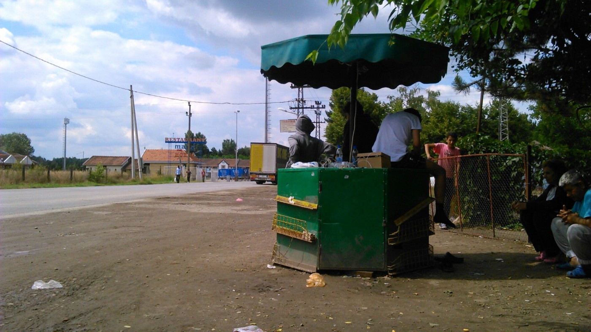
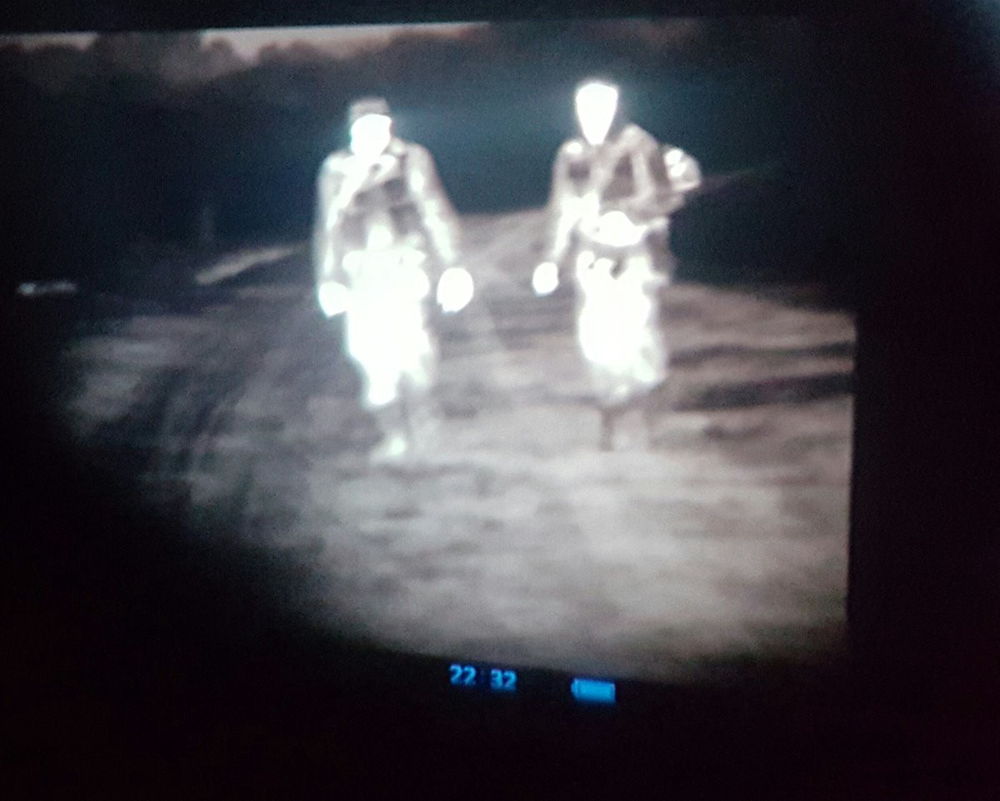
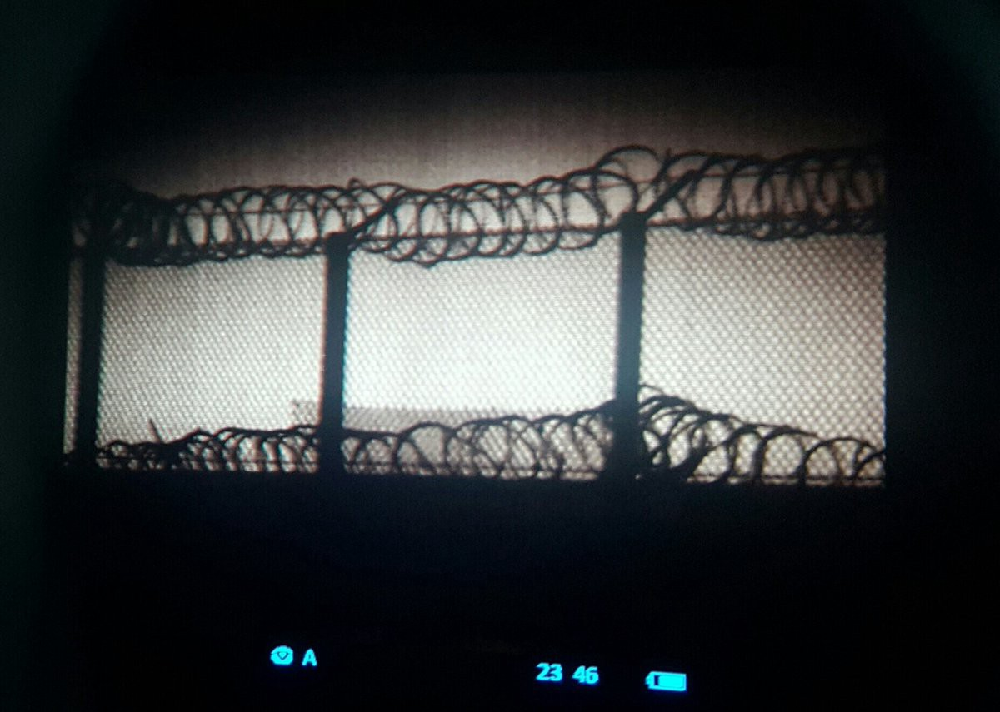
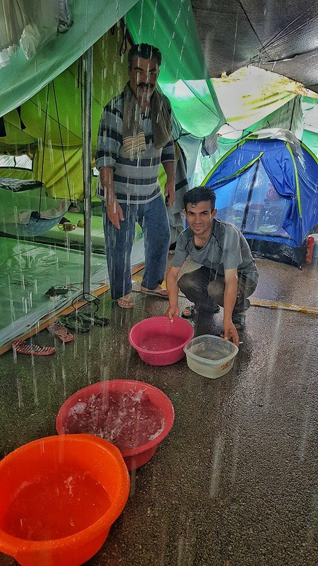
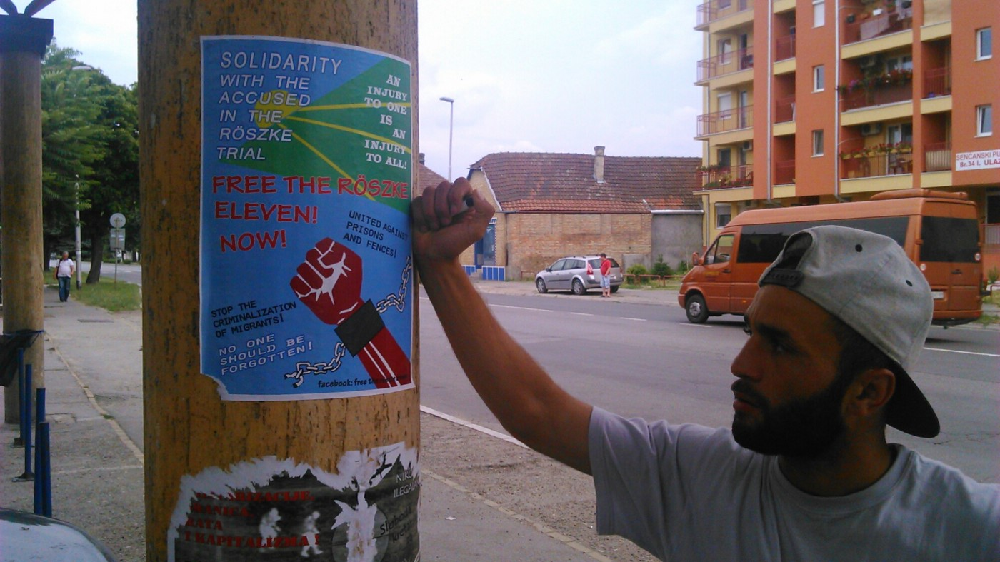

### AYS Daily Digest: Police investigation of abuse of minors in Greece

A Kiosk near a transit zone, Serbia/Hungary border Photo Credit: Amien Essif
#### JORDAN
### Around 70,000 civilians are starving on the border of Jordan\.

Using the excuse of protection against ISIS activity in this area, the Jordanian government has limited air strikes to the region that is a hotspot for Syrian refugees, [according to Al Jazeera](http://www.aljazeera.com/news/2016/07/30000-syrian-children-starving-jordan-border-160701134052305.html) \. It is likely that unless the situation changes, this action will also result in pressing refugees into choosing northern routes towards Europe rather than staying in the vicinity if there is inadequate and life\-threatening conditions closer to home\.
#### GREECE
### Westeros comes to Greece, serious reports of abuse of minors in camps

As part of HBO’s Game of Thrones’ partnership with the International Rescue Committee, several cast members from the popular series visited several refugee camps in Greece, expressing horror over the plight of refugees\. Lena Headey, Maisie Williams, and Liam Cunningham took a break from their imaginary characters’ bloody lives to hear about the equally violent reality of refugees trapped in Greece\. Liam Cunningham had pointed words to say on the crisis: Cunningham heard about the fear felt by Afghan and Syrian fathers\. He said:

> “This is not an earthquake, this is not a tidal wave\. This is a man\-made crisis: 57,000 stranded in Greece\. Refugee camps in Europe? Is this truly the standard EU leaders want to set as the way to respond to the global refugee crisis?” 
 

>  
 

>  Hopefully these celebrity visits will bring proper attention to the continuing escalating refugee crisis throughout the world\. 

This case of torture does not feature Ramsay Bolton but [, as reported in Greek Reporter](http://greece.greekreporter.com/2016/06/29/police-brutality-shown-to-unaccompanied-refugee-minors-in-greece/) , EDIT: Médecins du Monde received a disturbing case on minors in Moria detention facility showing signs of physical abuse, corroborating reports of police brutality against them\. Twelve minors from Pakistan were taken for a routine medical examination and showed signs of bruising, serious headaches, and marks on their wrists, with one child having a nosebleed\. According to the children, their ordeal began when a rock\-throwing scuffle between some of the children resulted in one of the officers accidentally being hit\. The officer then lost his temper and attacked one of the minors, threatening his victim with being returned to Turkey if he reported the incident\. This provoked a response, but the children were forcibly removed to the holding center from 3 a\.m\. to 2 p\.m\., being forced to remain in a stress position under threat of being beaten with a water bottle\.

> Following the examination, the doctor referred the children for further examination to the Bostanio Hospital of Mytilene\. The \[Médecins du Monde\] organization as well as a representative of the UNHCR state that police officers hovered over the emergency ward and intervened during the examination\. 

Fortunately, the police administration has called for an investigation, and we will be following how it is handled for future precedents\.

There is a concrete way to help some other minors trapped in near\-isolation from the world\. Volunteers report that around twenty unaccompanied minors are experiencing isolation and limited opportunity to exercise or engage in stimulating activities\. The facility is understaffed with only one resident counselor; all other staff are either volunteer or barely paid\. With this in mind, any volunteers in the area who are interested in donating school books or books in general should contact Becky Dennison Sakellariou in order to provide these children who are separated from their parents some fun\.
#### MACEDONIA
### Up to eighty\-three refugees caught in sting operations across Macedonia\.

Macedonian news reports that dozens of refugees have been caught in sting operations [targeting smugglers transiting Macedonia](http://kurir.mk/makedonija/hronika/veleshanets-faten-dodeka-prevezuval-73-migranti/) \. As camps have been emptying across Macedonia, activists continue to push for safe passage as Macedonia quickly ascends the list of countries with an extremely dangerous reputation\.

Night vision photos of patrols at Serbia\-Hungary border\. Photo Credit: Balasz Cseckö
#### SERBIA
### Serbia/Hungary: Long lines, unclear protocols, and inadequate services\.

Predicted by Deutsche Welle in May 2016, the transit zones, not to be confused with camps of which there is one in Subotica, are rapidly being considered the new Idomenis, with many NGOs, volunteers and journalists being thoroughly and perplexingly limited from entering and delivering aid\. Although a few more NGOs are on\-site, most volunteer work takes place at the bus station\. 
 
 Volunteers interested in assisting in Kelebija and/or Horgos are strongly encouraged to read and listen to the experiences of volunteers currently on\-site in order to find the best way to deliver aid\. Although the situation remains dire, this new attention in media will surely bring new waves of support and/or volunteer interest, and it is of utmost importance that chaos is kept to a minimum in order to best support the community of refugees there\. A volunteer network has emerged that notifies volunteers on\-site of incoming refugees\. The following [is a report from journalist Amien Essif](https://leftofnorth.co/2016/07/01/staring-at-the-wall/) who ahs been traversing the Balkan route\.

> Then next day I took city bus \# 1 to the border crossing\. The bus goes all the way there, past the last town, Kelebija\. The bus let us off, turned around, and headed back toward Subotica\. Behind the bus stop is farmland, and exactly opposite is a little fruit stand and convenience store, once a place for truckers who line up waiting for passport controls, now functioning kind of like the Subotica bus stop: a place to charge phones and to distribute food and other necessities\. Because there are no necessities inside the camp\. No showers, no running water\. There are 360 people living there by the latest count, and little more than 100 tents…\.Luckily, the transit zone at this crossing is not sealed off and people living there are free to come and go — as far as this little kiosk 

Essif also reports that at times, even representatives from UNHCR are turned away from the transit zone “camp” if they lack the proper paperwork for du jour\. Patience will remain an invaluable asset on the field\.

Oreokastro flooding Photo: Geo Messmer
#### Hungary
### In addition to the conviction of the Roezke eleven, Hungarian authorities also target support agencies\.

Migszol Csoport also experienced discrimination and was prevented from fully covering the event\. As anti\-refugee sentiment hardens, supporters of refugees will come under fire\. Read their experience at the trial below\.

A refugee shows solidarity with those imprisoned in Hungary Photo Credit: Amien Essif
#### SLOVAKIA
### New discussions on immigration in Slovakia

Acknowledging that migration and refugee issues “can be a divisive subject,” president of [Slovakia Robert Fico called for new dialogue](https://euobserver.com/migration/134166) and a “change of narrative” on the subject\. “This is a complex issue that needs a complex political solution rather than an administrative one,” said President Fico\. Despite this call for change, the president held his ground against the perceived centralization of migration decisions, advocating for local change taking precedence over EU\-administered policy\. He furthermore warned that the lack of dialogue and perceived “coercive” policy could only strengthen fascist movements throughout central Europe\.
#### GENERAL
### Amnesty International has joined the chorus of voices decrying the EU\-Turkey deal\.

As the projected start date of July first has come and gone in terms of implementation of the EU\-Turkey deal, more voices have joined up in critiquing it\. Like others before, [Amnesty International highlights](http://www.amnestyusa.org/research/reports/no-safe-refuge-asylum-seekers-and-refugees-denied-effective-protection-in-turkey?page=show) Turkey’s lack of capacity, already struggling under a paperwork load of over two\-million refugees, transparency, and justice for refugees as many are forced into exploitative situations in order to remain in Turkey\. As such, Amnesty International does not consider Turkey to be a safe “third country” in this context\. Until effective protection is delivered, many heavyweights in the human rights community will continue to protest the deal\.
### AYS needs you

Our friend Rando Wagner set up a crowdfunding site for AYS\. Please, consider donating to support our work\.

[https://www\.gofundme\.com/areyousyrious](https://www.gofundme.com/areyousyrious)

_Converted [Medium Post](https://areyousyrious.medium.com/ays-daily-digest-police-investigation-of-abuse-of-minors-in-greece-4ea009660740) by [ZMediumToMarkdown](https://github.com/ZhgChgLi/ZMediumToMarkdown)._
