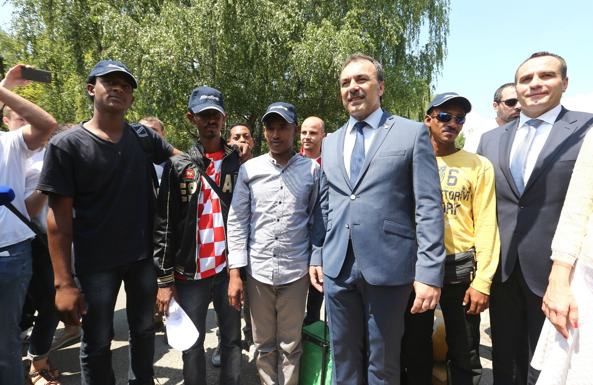

### AYS Digest 4/7: Spiral of violence continues with attacks in three Saudi cities

Car bomb in Medina\. Photo SIRIUS\.NEWS

Suicide bombs hit three cities in Saudi Arabia including the holy city of Medina\. Coordinates for the new camp in Greece with information where to get help in Belgrade now that Miksalište is closing\. Greek forum of refugees published a report on the discrepancies with de jure and de facto situation in Greece\. New volunteers finally came to Kelebija and Migzsol published a report where we can find out what happens once Kelebija and Horgoš are crossed\. Hungarian HHO published a form that can help with conducting interviews with those that were abused inside their borders\. With people constantly arriving in Croatia through either relocations or returns there is a call for better integration policies and less strict asylum approval rate
#### Saudi Arabia
### **Suicide bomb attacks in three cities in Saudi Arabia**

Spiral of violence came to collect lives in three cities in Saudi Arabia today\. What appears to be a coordinated suicide attacks hit the holy city of Medina just as the month of Ramadan is ending\. City of Qatif was also hit, city that is home to many minority Shia Muslims and the blast appeared to target a Shia mosque\. The third attack was carried out in the city of Jeddah just outside the U\.S consulate\. As it seems up until now, not many casualties are reported and nobody claimed responsibility for the attack at the time of writing this digest\. We send our deepest condolences to the families of the victims and hope for the quick recovery of those injured\. Once again we would like to state that violence only breeds violence and without a peaceful resolution to that war that ravages the middle east there is no calm to be had\.
#### Greece
### **Coordinates for Rafina camp in Greece**

There were 42 new arrivals on Greek islands today which makes for a total number of 57076 still stuck in Greece\. There has been some confusion on where is the new camp Rafina where people from Piraeus E 1\.5 were taken last Thursday\. If you have not already found out we bring you fresh coordinates 38\.00796, 23\.99541\. According to the information we were able to obtain people that went last Thursday came back apart from a couple of families and the camp itself seems to be very good and the idea was to get there women and children only, but refugees weren’t convinced of that this is a better solution apparently because of the distance to the services of Athens\. We will try and report more as we get more information\.
### New report by Greek forum of refugees

While we deal with day to day, Greek forum of refugees \(GFR\) has published very interesting [report](http://refugees.gr/en1/wp-content/uploads/2016/07/REPORT-Access-on-International-protection-Annexes-1.pdf) that draws on the implementation of the law and the practices adopted by the authorities\. The present report mainly aims at pointing out the gap between the de jure situation, as it is defined by international law, and the de facto situation in Greece, as up to the EU\-Turkey deal of 18 March 2016\. In doing so, the privileged point of view and focus of research are represented by the series of testimonies provided by asylum seekers, refugees and communities and collected by GFR over 2015\.

Always taking into consideration the fast changing nature of the Greek scenario, the report was edited and updated during the first five months of 2016, in the light of fundamental events such as the entry into force of the aforementioned EU\-Turkey deal as well as the adoption of the new law 4375/2016 \(on “Common procedures for granting and withdrawing international protection”\), on 1st April 2016\.
### **Solidarity campaign for those who teach in camps**

Our friend Amanda Grady, an independent volunteer from the UK recently came back from the camp in Cherso,where she worked together with the ICC team and the members of AYS on setting up of the Cultural centre in Cherso\. Together with a number of young refugees, she also gave lessons as a part of the informal education programme there and just weeks afterwards, she is back with the initiative to find accommodation for these people who, in the midst of their own lives as refugees, devote their days to teach, translate and work for the others\. With several other common projects in mind for the future, we invite you to support Amanda’s first brave initiative of providing decent housing for these young people\.

You can do it by donating to her campaign [https://crowdfunding\.justgiving\.com/amanda\-grady](https://crowdfunding.justgiving.com/amanda-grady)
#### Serbia
### **Where can you get help in Belgrade now that Miksalište is closing?**

With Miksalište closing it’s doors due to inability to handle the pressure as we reported in earlier reports, refugees and migrants passing through Belgrade can go to the center for asylum seekers in Krnjača, where they may stay overnight\. Many people are sleeping in the city park but there is a lack of toilets and showers\. Those who are staying in the park can reach out for basic aid to Info Park, a network of refugee information aid centers in Serbia, provides very essential services, mostly food\.

The number of refugees and migrants currently in Belgrade has risen to above 1,000, with over 570 are sheltered in the Asylum Center of Krnjača\.
#### Hungary / Serbia border
### **New volunteers finally coming to Kelebija\!**

Finally experienced volunteers arrive to the border of Serbia and Hungary where only two independent volunteers were working for some time now\. Experienced IHO team finally are on their way to Kelebija border crossing, we wish for them to stay safe and support their efforts as the UNHCR report shows the number of asylum seekers waiting near Subotica rose to 910\. The number includes 300 asylum seekers \(of which 40% were children\) continued to wait on Serbian territory each day for admission to Hungary via the two transit zones at the border\. Hungarian authorities reported to UNHCR that 637 people were apprehended inside the country for irregular entry, while 2,091 persons were prevented from entering the country\.

IHO volunteers and their caravan arrive to Subotica, Serbia
#### Hungary
### **All you wanted to know about Hungary in Migszol report published today**

In the midst of turmoil with the trial with Roszke 11, there is a new camp built in Kiskunhalas in Southern Hungary\. Also, Hungarian prosecutors have [opened](http://uk.reuters.com/article/uk-europe-migrants-hungary-death-idUKKCN0Z72EW) an investigation into whether police can be held criminally responsible for abuse over the death of a [Syria](http://uk.reuters.com/places/syria) n man who [drowned](http://uk.reuters.com/article/uk-europe-migrants-hungary-death-idUKKCN0YS1AU) in the Tisza river as he was trying to cross into Hungary from Serbia in June\. On this and many more our friends from Migszol published a report that brings updates of the situation in Hungary in the period between 20th of June and 4th of July\. [Report](http://www.migszol.com/blog/why-are-hungarian-border-guards-practicing-shooting-to-kill-migszol-update-from-hungary-20-june-4-july) brings very useful information and an overview of the situation in Hungary which can be very useful for both volunteers informing people on the move as well for research and understanding\.

Policeforce receiving prizes at the end of a borderguard competition in eastern Hungary, June 24
### **Very useful form for collecting people’s testimonies of abuse in Hungary**

Also, for all those working with people heading to Hungary, or have encountered those that faced abuse inside Hungarian borders, please turn your attention to the [form](https://docs.google.com/forms/d/1TEYVCk68olvAUM2MPhGPcgkbPz2SvHCybLQhl45Xr-Q/viewform?c=0&w=1) that Hungarian HHO has put together

Here, there is a guide on how to conduct interviews with people that have been in any way abused in order to collect data so as to put pressure on Hungarian institutions to end abuse practices\. All the personal data is highly confidential and will not be used in any way or form\.
#### Croatia
### **Croatia received 4 people under relocation and quotas deal last week, but the process should move more quickly since there are 1613 more that should come**

As first relocations were carried out and four people arrived in Croatia last week under the provisions of the deal on relocations and quotas, Sara Kekuš from Center for peace studies and Welcome initiative said in an [interview](http://hr.n1info.com/a134694/Vijesti/Sara-Kekus-o-uvjetima-migranata-u-Hrvatskoj.html) with N1 TV that the reception up until now seems fine, but also stated that there should be many more people coming, 1617 to be precise\. Relocations were carried out under the media spotlight with ministers talking an opportunity for a photo op, when the reality is that people are being returned to Croatia from other EU countries almost on weekly basis\.

Photo: Željko Lakunić
### **Only 183 approved asylums out of 5000 requested in 10 years**

Kekuš stated that Croatia has been very strict in its asylum procedures with only 183 approved asylums of 5000 requested in the last 10 years\. For all those who are in position to advise people on relocations, Croatia offers accommodation and basic health care to all asylum seekers, legally people are entitled to education and right to work, but all those integration processes are hindered in practice more often than not and Croatia has a long way to go on other integration policies and hopefully with more people arriving and with dedicated groups such as Center for peace studies, Are you syrious?, Welcome initiative and others these practices can be changed for better\. For all additional information on rights of asylum seekers in Croatia turn to above mentioned groups\.
#### **Switzerland**
### **Argument over handshake halted a citizenship procedure for one Syrian family\.**

It seems to be hard for European bureaucrats to learn that integration does not mean assimilation\. Syrian family faces an uncertain future after their citizenship process was halted in Switzerland — all because of an argument over a handshake\. Kids that lived most of their life in Switzerland refused to handshake with a female teacher over religious reasons prompting the reaction of those in charge, even though the school itself had nothing against it\. For more, see the video

### AYS needs you

Our friend Rando Wagner set up a crowdfunding site for AYS\. Please, consider donating to support our work\.

[https://www\.gofundme\.com/areyousyrious](https://www.gofundme.com/areyousyrious)

_Converted [Medium Post](https://areyousyrious.medium.com/spiral-of-violence-continues-with-attacks-in-three-saudi-cities-9484a868d25b) by [ZMediumToMarkdown](https://github.com/ZhgChgLi/ZMediumToMarkdown)._
