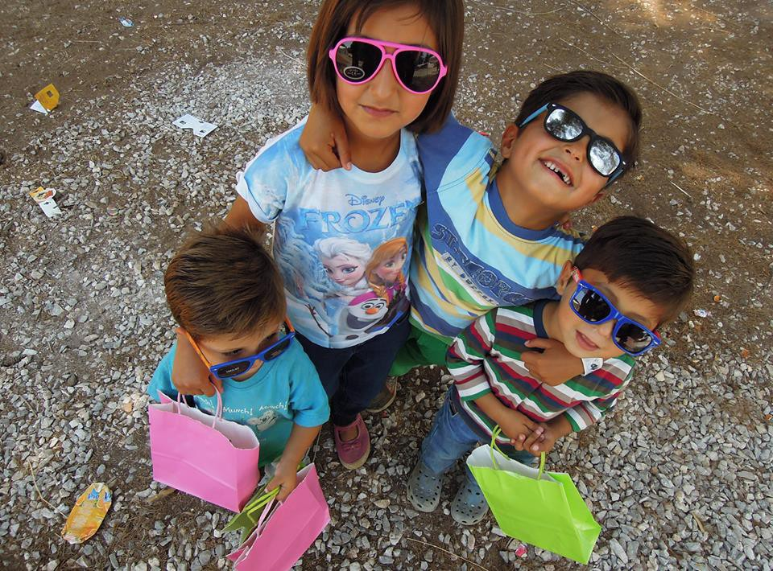
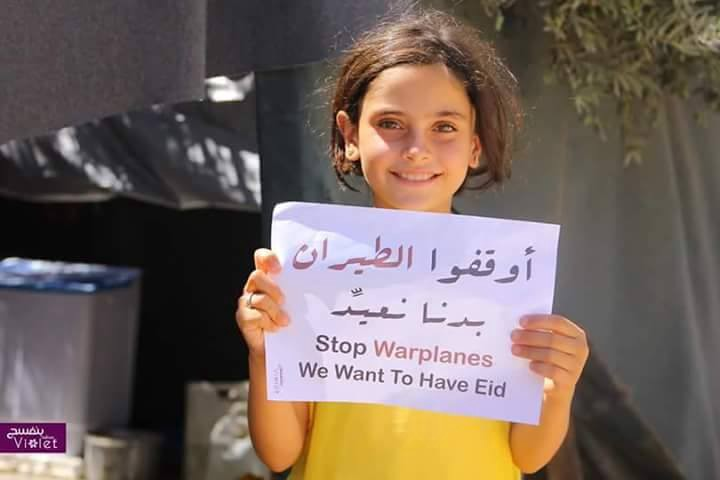
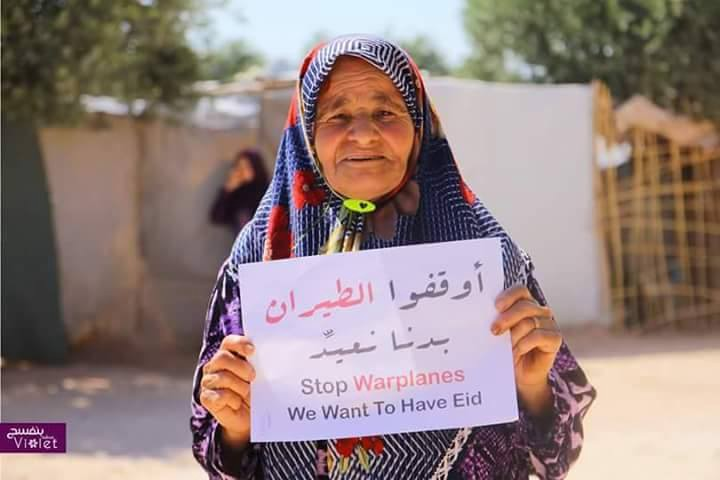
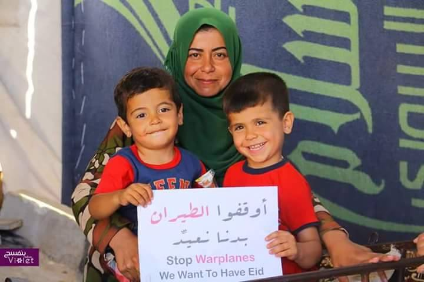
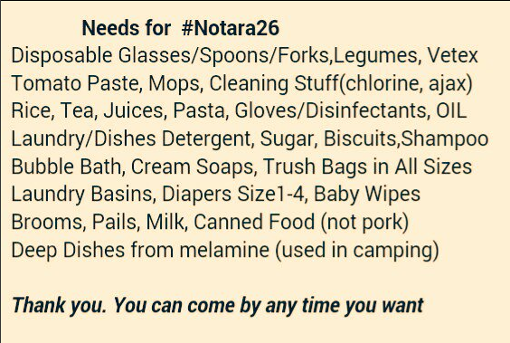
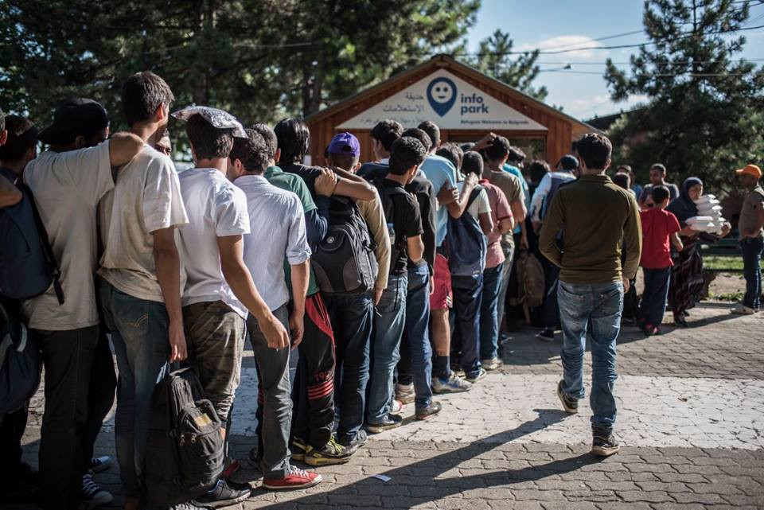
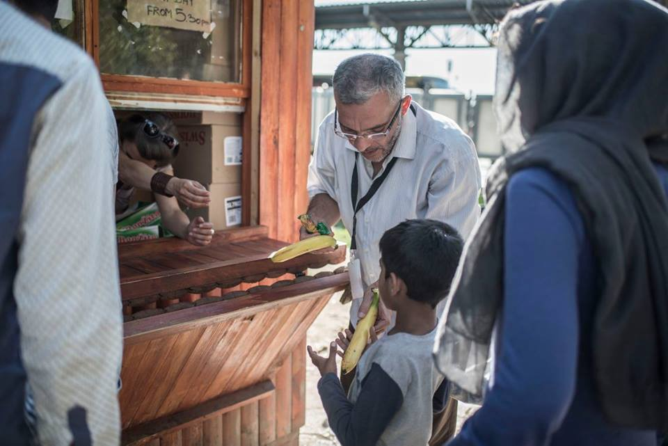
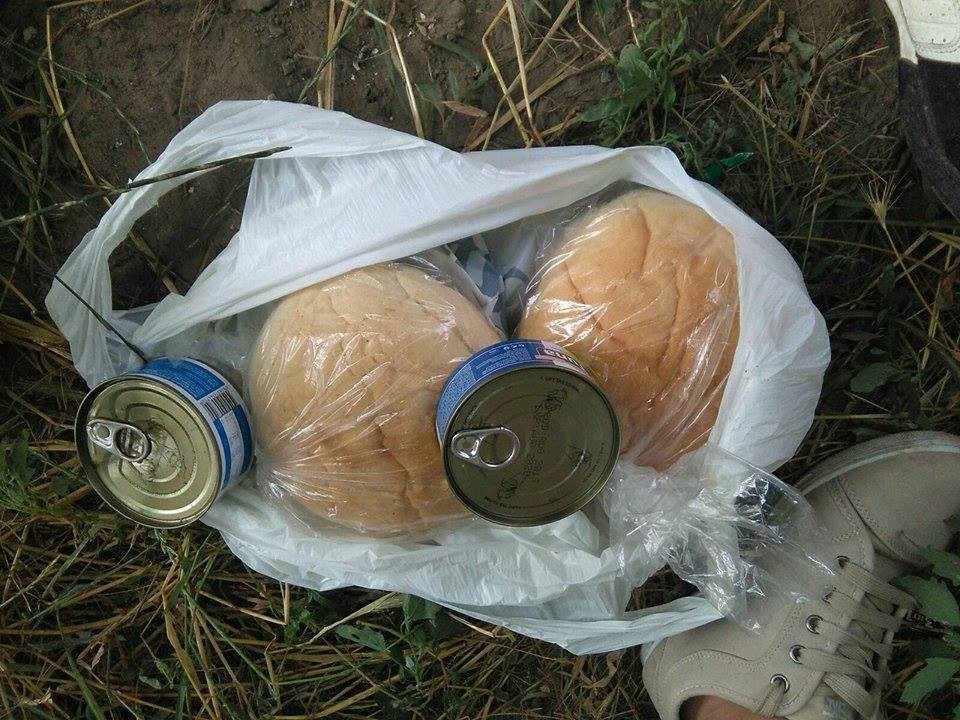
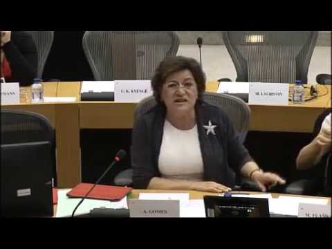

### AYS 6/7: Hungarian police allowed to push back refugees behind the border fence

Kids in Ritsona camp, Greece\. Photo by Lighthouse Relief

_In today’s digest: Syrian military declares truce but airstrikes continue\. Hungarian police allowed to push back refugees apprehended within 8km of its border to the external side of the border fence\. Miksaliste reopens today, will serve families, women and children\._
#### Syria
### Syrian military declares 72h truce but airstrikes continue

The Syrian military has unilaterally declared a 72\-hour truce covering the whole country according to state media\.
The “regime of calm” is supposed to start at 01:00 on Wednesday \(22:00 GMT on Tuesday\) and is supposed to last until midnight on Friday\. Meanwhile, the Local Coordination Committees of Syria says Assad’s helicopters have dropped barrel bombs in the east of Aleppo City, while warplanes launched airstrikes in the north\.

Violet Syria launched a campaign from inside Syria, looking to stop airstrikes on civilian areas and residential places, at least during the end of Ramadan\.

### 45 media activists killed in 2016

The Syrian Network for Human Rights says 45 media activists were killed, 27 abducted and arrested, and 38 injured in the first half of 2016\. The report also states that media activism in Syria is continuously deteriorating as many international organizations are not paying enough attention to what is happening in Syria and as media coverage is declining compared to previous years\.
### Distribution of Eid parcels in honor of Syrian journalist Khaled Al\-Essa

One of those media activists killed in Syria is Khaled Al\-Essa, who was killed by an explosive device hidden behind a door in his home in Aleppo on June 16\. The Karam Foundation will be distributing Eid meat parcels and boxes of sweets to hundreds of Syrian families in honor of Khaled’s memory\. You can donate and support their efforts on this [website](https://give.karamfoundation.org/checkout/donation?eid=86456$) \.
### Poverty rises for Syrian refugees in Lebanon and Jordan

The number of Syrian refugees living in poverty continues to rise in host countries in the surrounding region according to the UNHCR\. It reports that the number of people living below the poverty line has risen to 70% compared to 50% in 2014\. In Jordan, 90% of registered Syrian refugees in urban areas are below the national poverty line, while over 67% of families are living in debt\. In Egypt, some 62,000 refugees are living in poverty\. UNHCR also reports some positive news, as work permits are now issued to Syrians in Jordan and a new regulation allows Syrian refugee access to employment in Turkey\.
#### Lebanon
### American plastic surgeons in Lebanon first week of August

The Palestinian Child Relief Fund in association with the Palestinian red crescent and the Syrian American medical association announces that American plastic surgeons will be working in Lebanon throughout the first week of August in support of refugees\.

The surgeons will be able to cover plastic surgery, reconstructive surgery, hand surgery, including post burn cases\.

For information you can contact Mahmoud Al Hajj: 03–945461
#### Turkey
### Explosion kills two refugees in Turkish town at the border with Syria

An explosion on Wednesday rocked a house used by refugees in the town of Reyhanli in southern Turkey, killing two people in the process according to the private Dogan news agency\. The news further undermines the status of Turkey as a safe country for refugees, in particular for refugees forced to stay in camps near the Syrian border\.

In 2013, twin car bombs in Reyhanli killed 46 people in attacks that were blamed on pro\-Damascus forces\. The Syrian government denied involvement\.
#### Greece
### Fights in Mazaraki camp

Fights broke out at the Mazaraki camp in Cherso yesterday, pitting a small group of young Arab men against Yazidis according to volunteers in the camp\.
Today, while some Syrian young people were distributing sweets for Eid and congratulating everyone at the camp, a group of young men started to fight again and soon the fight spread out all through the camp\. They were throwing rocks, wood and makeshift wooden daggers, almost completely destroying some of the tents\. Six police cars appeared outside the camp, at the official entrance, but nothing was done to stop the fight or help those who got in the middle of it\. A young Kurdish man got his head seriously injured while trying to stop the fight and was taken to the hospital in Kilkis, where he received immediate medical assistance\. Eight other people were brought to the hospital later on\. Some young refugees and volunteers ran to the police to ask them to help the people inside, but got no reaction\.

Volunteers speculate that the fight could have been fueled by the move of half of the Yazidi refugees to Petra camp, a move that was not properly explained and could have exacerbated tensions among people at the Mazaraki camp\. Tomorrow the rest of the Yazidis will be transferred to the same camp, leaving only Syrians, Iraqi and Kurdish people in Mazaraki\.
### Surviving, rather than living in Greek refugee camps

[Global voices](https://globalvoices.org/2016/07/06/for-refugees-at-katsikas-camp-life-remains-in-limbo/) reports on the situation in Katsikas camp, where life has come to a standstill\. One resident, Mohanad, says “we didn’t leave because we wanted to\. We had homes, we had jobs, we had cars”, adding “now I just wait\. They might take months, or years, of my life\. I don’t know”\. The article describes poor living conditions, despite the volunteers best efforts, but also insists that children are “perpetually bored”\. The website argues refugees are being punished through a “perpetual state of limbo and uncertainty” in order to deter other refugees from making the journey\. The article shows that refugees do not only suffer from material discomforts, but also from the continuous waiting and lack of activity, transforming refugee camps into a “warehouse of souls”\.
### Shabab radio in Athens, for refugees and friends

Refugees are now stuck in Greece, which means that the role of volunteers changes as well\. Now that refugees will be staying in the country for weeks or months, it is also important to support people with legal advice, education and entertainment, on top of food and clothes, so that people are able to live, rather than just survive\.

[The Greek Reporter](http://greece.greekreporter.com/2016/07/06/shabab-web-radio-in-athens-caters-to-migrants-and-refugees/) reports on one of these projects, the Shabab Web Radio in Athens, that provides not only important information, but also entertainment and music to refugees and Greeks alike\. The radio has been founded by people from all over Europe and the Middle East and allows refugees like Tariq Wadi, a Syrian rapper, to display his talents\. Interesting recent pieces also include an interview with Cezaro from Syria, who describes his failed relocation process to Lithuania\.

The group is seeking sponsors in order to expand its programming\. They also seek sponsorship to organize concerts, festivals and other events\. You can listen to them [here](http://www.shababradio.net/) \.
### Team Bananas looking for volunteers

Team Bananas is looking for volunteers in Greece\. The job includes “handing out bananas, playing and dancing with kids and talking and listening to people”\. The team works in several government camps near Thessaloniki and is looking for teams of 3 or 4 people with a car, available for a minimum of 1 week and able to pay for their own expenses\. 
If you’re interested, please send a message to : info@teambananas\.org

Other volunteering opportunities are still available throughout Greece, including roles for teachers, medics and much more\. You can find out where you can be useful on [http://greecevol\.info/](http://greecevol.info/) \.
### Donations needed for the Notara 26 squat

The Notara 26 squat provides shelter to refugees and needs donations\. Their address is Navarchou Notara 26, Athina 106 83
#### Serbia
### Miksalište reopens today, will serve families, women and children

Since the Miksalište centre, the main distribution centre for refugees in Belgrade, closed its doors on the 2nd of July, other humanitarian organizations have been overwhelmed by the needs of refugees\. Miksalište will reopen tomorrow and will continue to provide its valuable help but the centre will only be open for families, women and children\.

Photo by Info Park

Photo by Info Park

Miksalište’s closure came not out of nowhere, as it stated that the influx of people had risen to “more than 500 per day”, leaving them ‘unable to continue both financially and logistically”\.

This increase can be explained by many newcomers crossing Macedonia and Bulgaria illegally after learning the Hungary is allowing a small number of people in, but hundreds are also continuing their trip with smugglers all the way to Germany and other destination countries\. Now that people have realized they’ll be stuck in Greece indefinitely and that the route still works illegally, they have started to make their way across the Balkan route in bigger numbers again\. After the border closure we have also witnessed refugees leaving Macedonian reception centers for Serbia, as volunteers in Macedonia told us six days ago that there are only 13 refugees left in Gevgelija and 80 in the Tabanovce refugee camp\.

Many refugees are waiting in Belgrade, since the city is one of the Balkan route’s main smuggling hubs\. Europol itself has stated during an action against smugglers a week ago that “increased smuggling activities were detected along the Western\-Balkan route” while “the stricter border control measures result in organized crime groups offering their services to migrants”\. There were multiple accounts of police intercepting smuggling vehicles full of refugees in Serbia recently\.
#### Hungary
### Police allowed to push back refugees behind the border fence

Refugees in Serbia rely very much on smugglers, given Hungary’s border fence with Serbia and its tough stance against refugees in general\. Since yesterday, the Hungarian police is also allowed to automatically push back asylum seekers who are apprehended within 8 km of the border, to the external side of the border fence, at the entrance of Hungarian transit zones\. They will then have a choice between going back to Serbia, which is not considered a safe country by the UNHCR, or try to reenter Hungary through one of its transit zones \(Tompa and Röszke\) \. However, as was confirmed by Amnesty International, only 15 refugees are allowed to enter each transit zone per day, “thus denying the right to seek asylum, as well as humane conditions and treatment, for the hundreds of people regularly stranded there”\.

[Der Spiegel](http://www.spiegel.de/politik/ausland/fluechtlinge-ungarn-will-migranten-mit-neuen-regeln-abschrecken-a-1101406.html) says the Hungarian police’s actions will not constitute an illegal pushback, as refugees will be brought behind Hungarian fences, but will still be on Hungarian territory\. The paper also says Hungary will increase its border patrols from 3,000–4,000 to 6,000–10,000 soldiers\. It believes the number of refugees waiting in front of the Hungarian border could massively increase in the next few days, given this new policy, adding this could lead to the creation of a new Idomeni\. Volunteers say that around 150 to 400 people have arrived in the Horgos camp, in front of the Röszke transit zone, in the last four days\.

Amnesty International also says that hundreds of asylum seekers, including families with children, pregnant women and nursing mothers, as well as people requiring medical treatment, are forced to wait for days and sometimes weeks on end in these camps, without reliable information and support to access asylum procedures in Hungary\. They have not been provided with anything but a single water tap in each of these transit zones, and only a few humanitarian organizations are tasked to deliver limited aid and support services\.

IHO confirms similar conditions in Kelebija, in front of the Tompa transit zone, saying that volunteer support is limited by the police and people get the same food, bread and tuna, twice a day\. IHO says this place is “worse than Idomeni”, as there are “no NGOs, no offices of UNHCR, no medical assistance”, with one mobile medical team providing support for only 2 hours per week\. At least 300 people are stuck in Kelebija at the moment\.

Photo by “I’m Human Organization”
#### Croatia

Following yesterday’s visit of Mayor of Zagreb Milan Bandic to Porin Hotel, where 228 refugees are accommodated, today it was officially confirmed that all of the asylum seekers are now granted free public transport, which was one of the biggest obstacles in the first stage of their integration to Croatian society\. From now on, showing the asylum seeker’s card to drivers will be enough to get a free seat in a bus or a tram in the Zagreb area\.
#### Italy

227, **316 people arrived in Europe from 1st January to July 2016**

IOM says 227,316 arrived in the first six months of 2016, compared to 141,969 in the first six months of 2015\. 67,538 people reached Italy, while 158,938 entered Greece\. The number of deaths rose to 2,920 this year, against 1,838 recorded in the same period in 2015\. The most represented nationalities in Italy are Eritrean \(6,067 people in 2016\), Nigerian \(5,967\) and Somali \(5,064\) \.

Italy’s coastguard also says it rescued 4,500 people on Tuesday alone\.
### 800 migrants have found refuge in Ventimiglia

800 migrants have found refuge in Ventimiglia, a city 7km away from the French\-Italian border according to [Riviera 24](http://www.riviera24.it/2016/07/migranti-alle-gianchette-ora-gli-abitanti-salgono-sulle-barricate-228491/) \. The paper says locals are protesting against their presence, because of the occupation of the church and of public spaces\. Containers are expected to arrive, hosting 200 people — the remaining 600 will have to continue sleeping in a public park\.
#### Germany
### 6,000 immigrants repatriated between January and March

6,000 people left Germany for their home country voluntarily from Frankfurt airport between January and March according to the [Frankfurter Neue Presse](http://www.faz.net/aktuell/rhein-main/6000-fluechtlinge-reisen-freiwillig-vom-frankfurter-flughafen-aus-14326909.html#GEPC;s6) \. Most of these people came from Albania or the Persian region , with many saying their life in Germany didn’t fulfill their expectations\.
#### Ireland
### 260 additional refugees to be resettled from Lebanon to Ireland

Tánaiste and Minister for Justice and Equality, Frances Fitzgerald says a selection team will be sent to Lebanon to select an additional 260 refugees under the Refugee Resettlement Programme, adding that 260 refugees have already arrived from Lebanon\.

She says the decision to increase the number of refugees takes account of the slower than anticipated arrival of asylum seekers from Greece and Italy as a result of administrative issues in those countries\.

It is telling that the relocation from Lebanon to Ireland is easier than from Greece or Italy\. Up to the 26th of June, only 1,849 refugees have been relocated from Greece through the EU relocation scheme\. Severaklcountries, including Portugal, have indicated their desire to relocate more refugees but have faced bureaucratic roadblocks along the way\.

More information about the relocation process is now available on [EASO’s website](https://www.easo.europa.eu/about-us/what-relocation/questions-and-answers-relocation) \.

_Converted [Medium Post](https://areyousyrious.medium.com/ays-7-7-hungarian-police-allowed-to-push-back-refugees-behind-its-border-fence-ee2afc593334) by [ZMediumToMarkdown](https://github.com/ZhgChgLi/ZMediumToMarkdown)._
