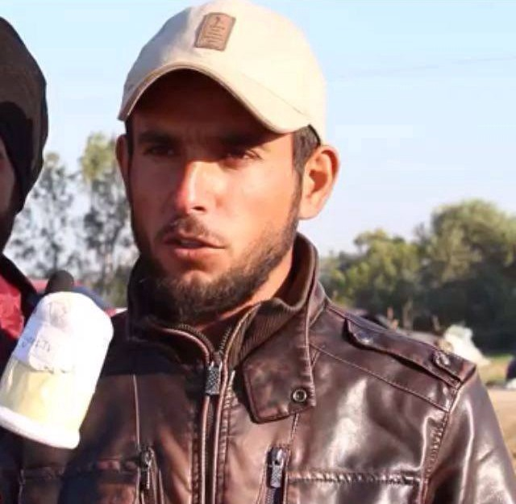

### AYS with Refugees\.tv: “Since we left Idomeni we realized that no more border will open\.”

Refugees\.tv team, 1\. Mahmoud Abdul Rahim, 24 years old, from Aleppo Syria \( the reporter \)
2\. Basil Alyatkan, 28 years old, from Damascus Syria \( the imaginary cameraman \)
3\. Mustafa Alhamoud, 24 years old, Aleppo Syria \( translator and real cameraman \)
4\. Sameer Tatan, 23 years old, Idleb Syria \( Facebook page admin \)

Mustafa Alhamoud is the cameraman of [refugees\.tv](https://www.facebook.com/refugees.tv/) \. They began their work with a plastic bottle as microphone and wood as camera and interviewed refugees in Idomeni to record the situation in the camp, when almost no media was there\. Since then they got professional equipment, with the help from friends in Germany, and give inside reports of the life of refugees on Greek mainland\. And they continue their mission\.

> “We want to show the world this tragic situation with sick children, and educated and talented people hopelessly sleeping on the roads that has become a reality of our lives\. Our aim is to record this sarcastically as the international politic news keeps talking about us yet without any actions\. 

> We also interviewed some of the volunteers from Europe and other countries, our first question to all of them was: “imagine you are a Syrian refugee in this camp, what would you be able to do?” Most of the answers after a long “hmmmm” were, “I do not know and I can not imagine” others simply could not give any answer to this question\.” 

Alhamoud answered the questions for AYS:

Mustafa Alhamoud, “The hardest part is that we are waiting for unclear information when and where we will go to\. When the border was opened and we plan to go EU we were knowing that where we are going to but now we don’t know\.”

**Idomeni has been closed one month ago\. Do the military camps now have better conditions than Idomeni had?**

From the place side here is better\. But Idomeni had more freedom and it was open camp: We could do whatever we want to and a lot of press were there, but here not\.

**Would you go back to Idomeni camp, if you could?**

Yes I would like to go there… We feel that we still have hope at there\.

**How is the atmosphere in the military camps?**

Here it is more clean and close place but it is small… The place doesn’t matter for refugees\. The most important thing is the date of leaving here\.

**What do you think about the Pre\-registration?**

It is working but it takes long time — as I think more than 5 months\. But we have no other option\. So we have to wait\.

**What does the everyday life look like?**

Here is too boring and there’s no activities for the refugees even for children\. People don’t have money to go to the centre to other places so they stay all the time in the camps\.

**What are the hardest parts?**

The hardest part is that we are waiting for unclear information when and where we will go to\. When the border was opened and we plan to go EU we were knowing that where we are going to but now we don’t know

**Do you know, if children have the opportunity to go to school or kindergartens?**

Just now they prepare to open a school

**Are there any offers or possibilities for refugees to get in touch with locals and to participate in public life?**

Not that much, because all the time the refugees stay at the camp and never go out just few people who have money\.

**Do the refugees you talk to still have hope, that the borders will open?**

Since we left Idomeni we realized that no more border will open\.

**Do they know what will happen next?**

No, we just know that they will relocate people to EU but which country we don’t know…it’s up to your luck\.

**Have you heard of refugees going back to Turkey or Syria?**

Yes, there are people going back to Turkey, because the relocation program takes to long and people can’t what that long time\.
#### Follow their [facebook page](https://www.facebook.com/refugees.tv/?fref=ts) for information about life of refugees in camps around Greece\.

_Converted [Medium Post](https://areyousyrious.medium.com/since-we-left-idomeni-we-realized-that-no-more-border-will-open-806ab6d360c5) by [ZMediumToMarkdown](https://github.com/ZhgChgLi/ZMediumToMarkdown)._
