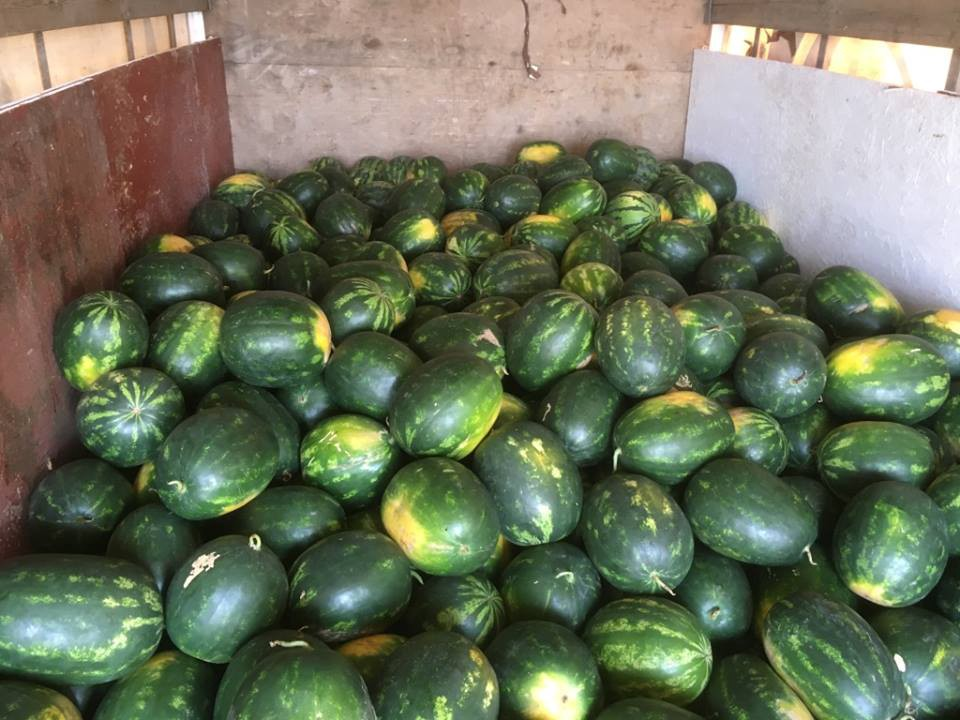

### AYS Daily News Digest 7/7: Hungary’s border war on refugees

> More people forced to seek refuge as fighting in South Sudan escalates\. Volunteers at many places surprised refugees with Ramadan celebrations\. Violence against refugees at Serbian\-Hungarian border is catastrophic and authorities are doing nothing about it\. We bring refugee testimonies of what happened to them at the Serbian\-Hungarian border\. A refugee was murdered in Italy, others facing many other dangers sleeping outdoors in the nights\. Italy is overflown with refugees\. 

](assets/d9116fcbe163/1*Z0qrPOf0LRdeHfcAAPKUiQ.jpeg)

Hungarian right wing zealots patrolling the border with Serbia, catching and threatening refugees\. Credits: [**Toroczkai László**](https://www.facebook.com/laszlo.toroczkai/)
#### South Sudan
### Renewed fighting in Wau forces another refugee exodus

> _Renewed fighting in one of South Sudan’s largest cities, Wau, has forced tens of thousands of people to flee\._ 

> _South Sudan erupted into civil war in 2013 when President Salva Kiir sacked his deputy Riek Machar barely two years after it seceded from Sudan\. Machar has since been reappointed as part of a peace deal\._ 

> _The renewed fighting has fuelled rumours of further attacks, with Sudanese people fearful that the peace deal could easily fall apart\._ 

> _“There was fighting\. They were killing women, they were killing children\. They destroyed houses and looted everything,” said Bakhita Tagia, who left her home\._ 

> _Thousands were displaced when the new fighting started\. Some sleep at a UN compound, others are in churches and schools\. Many more are hiding in the bush\._ 

> _“The estimate is around 150,000 people\. The entire town has been deserted,” said Vincent Taban, a local doctor\. Read more and watch a video by [Aljazeera](http://www.aljazeera.com/news/2016/07/south-sudan-renewed-fighting-wau-forces-exodus-160707100223125.html) \._ 

#### Iraq
### Yanar Mohammed’s powerful commentary on violence in Baghdad

> [_Yanar Mohammed_](http://www.vday.org/anniversary-events/superlove/bios/mohammed.html#.VdyjidNViko) _is the founder of [Organization of Women’s Freedom in Iraq \(OWFI\)](http://www.owfi.info/) , an organization fighting to stop atrocities against women and advocate for women’s social, political and economic rights, and a V\-Day/ One Billion Rising activist\. She shared the following message about the recent bombing in Baghdad:_ 

> “There are no words to express the anger, sadness, and helplessness\. A huge explosion takes place in the heart of Baghdad in Karrada, where families were shopping for new clothes to celebrate the Eid\! Hundreds of mostly young victims were that day’s price to pay for the Islamic religious wars between the Shia government and the Sunni opposition\. What the mourning mothers in Karrada shouted outloud was: We do not want your religion … take it away, and go to hell with it\. 

> We in OWFI are shocked while some of our colleagues are still looking for their young relatives among the missing and the rubble in Karrada\. 

> Shame on a government whose ideology of bigotry keeps us all in danger\. Shame on the US initiators of occupation who opened a can of worms and are watching us on their TVs as an entertainment show\. 

> As for ISIS, there is no shame as they aren’t even human\! Shame on every government which supported ISIS for years, and all Iraqis know that such huge explosion needs governmental resources to maintain\. It is no secret that all the governments who support\\ed ISIS were the main allies of the US in the region\. Damn imperialism and its monstrous laboratories and ways of creating human beasts like ISIS and making destruction and death our long\-time verdict\. Was the Iraqi oil, or the control of the capitalist world worth the lives of more than a million of innocent people of Iraq\. Shame\!” 

#### Lebanon
### Support the Salam LADC volunteer platform in Bekaa

> _These volunteers are doing a noble and dedicated work; it is our honour to promote their efforts and ask for your help\._ 

> _The organization’s two volunteers, Martin and Igor, shared with us that, since they came to Lebanon in January, the organization has distributed more than 10,000 pairs of shoes, spent 80,000 USD on direct aid to refugee families, as well as another 20,000 USD for refugees needing medical attention\. What is more, the organization has made numerous food distributions among Syrian refugees living in the Bekaa settlements\. In that, they have not forgotten vulnerable Palestinian and Lebanese families living in poverty; they have visited their homes with food and other basic necessities, thus providing aid these families cannot get anywhere else\._ 

> _The organization has went out of their way and many obstacles to improvise a small cinema in the refugee settlements\. They have also organized several education projects that are ongoing\. Importantly, refugees can count on their help in the future as well — another five containers of aid is expected to arrive from Europe this summer\. Hereby, the organization distributes livestock, fixes roofs, provides kitchen supplies, buys medicine and does basically whatever it takes to levitate the poor conditions refugees have endured in Bekaa for years\._ 

> _Since February, over 100 amazing volunteers has helped make this happen\! Please help them secure the continuation of this platform as it has become bigger than they have ever imagined and it really provides a positive impact to the poorest of poor in Bekaa\. With close to two million refugees in Lebanon, the challenges are huge and the tasks are many, but these brave volunteers are willing to try and they are more than succeeding\. Please help them in this effort and let us all see the potential of volunteer work in Bekaa come to life\. We thank you all\! Help here at catch [YouCaring](https://www.youcaring.com/salam-ladc-international-volunteer-platform-aid-and-relief-597470#.V311xFfcqj8.facebook) domain\. ’Cause, if you are reading this, you know you do care\!_ 

#### Turkey
### Food and hygiene supplies were distributed to refugees who lives in Salihli and Gölmarmara today

](assets/d9116fcbe163/1*ZIqx2LNXh7xA8GcRCM4ELQ.jpeg)

Refugee children having fun learning about teeth hygiene\. Credits: [**İmece İnisiyatifi Çeşme**](https://www.facebook.com/imeceinisiyatifi/)

](assets/d9116fcbe163/1*UinypGdcdXaAwUVwDuCZWA.jpeg)

Credits: [**İmece İnisiyatifi Çeşme**](https://www.facebook.com/imeceinisiyatifi/)

](assets/d9116fcbe163/1*TQPB7Oi0Mi3GD7ZuROfPJQ.jpeg)

Credits: [**İmece İnisiyatifi Çeşme**](https://www.facebook.com/imeceinisiyatifi/)

](assets/d9116fcbe163/1*yo2bWmH6OVgeIt3FdPqpzg.jpeg)

Credits: [**İmece İnisiyatifi Çeşme**](https://www.facebook.com/imeceinisiyatifi/)

](assets/d9116fcbe163/1*8eDTTqkJWgzrqkPLChC0Ew.jpeg)

Credits: [**İmece İnisiyatifi Çeşme**](https://www.facebook.com/imeceinisiyatifi/)
#### Greece
### Volunteer places directory available

> _This is a very helpful tool as it locates all volunteer efforts in Greece and is really user\-friendly\. You can use the filters to search the list, hen click “Show result on map” and you will see a Google map with all the pins on locating efforts you need\. Check it out [here](http://www.greecevol.info/place.list.php) \!_ 

### Call for long\-term volunteers at Piraeus port

> _Volunteers are letting us know that there is an urgent need for serious and trustworthy volunteers, above all, people who have volunteered at Port before and who are experienced to help manage and co\-ordinate activities for refugees\._ 

> _Some donation items are urgently needed as well, if anyone can help in material ways\. Volunteers are asking for:_ 

> Pre\-paid fuel cards \(to help with transport to warehouse, hospitals and other areas of Athens\) 

> Phone cards\-Vodafone and Cosmote 

> Internet sticks 

> Power banks to help charge phones 

> Free accommodation near the Port 

> _Please let us know if you are able to provide anything from the above list\._ 

### Syrian refugees outside the Vagiochori camp need help

> _These refugees, including children, are not allowed in camp since last night and they are desperate\. They have no access to food and water\. They stay outside the whole night, are cold and hungry\. Urgent intervention is needed\!_ 

### For Refugees at Katsikas Camp, Life Remains in Limbo

> _In Katsikas, each large tent is given a letter\-number combination, and the rows and sections of tents coincide with ethnic and linguistic communities: Palestinian\-Syrians, Iraqi Kurds, Yazidis, Afghans, and so on\. The weather in the region is volatile and intense, alternating between clear blue skies with punishing sun, and incessant heavy rain, usually for two or more days in a row\._ 

> _Through creativity and tenacity, the volunteers at Katsikas have managed to improve the day\-to\-day conditions for those living at the camp\. They have set up equitable distribution systems for clothing and basic supplies, they lead language classes and movie nights, they cook hearty meals to supplement the barely edible and nutritionally inadequate military rations, and they have built communal spaces and private bathing cabins for women, among many other initiatives\._ 

> _Despite these efforts, however, the living conditions at the camp remain poor\. Tents flood when it rains and are stiflingly hot on warm days; toilets, of the portable variety, are extremely unsanitary; drainage systems are inadequate, with puddles of standing water providing a breeding ground for insects\. There is a lack of communal spaces for women\. Children, who make up about one\-third of the camp’s population, are especially vulnerable to diseases — and are perpetually bored\._ 

> _Still, Katsikas is far from the worst of Greece’s military\-run camps\. Especially since Greek police [evacuated the enormous improvised refugee camp at Idomeni](http://www.aljazeera.com/news/2016/05/greece-begins-idomeni-refugee-camp-evacuation-160524051404401.html) in late May and dispersed the thousands of refugees remaining there to new, official sites, reports have surfaced of [extremely poor](https://www.theguardian.com/world/2016/may/28/greece-refugee-warehouses-not-fit-for-animals) conditions in many of the camps across the mainland\._ 

> _In late May, the UNHCR announced that it would be collaborating with the Greek Asylum Service to begin [pre\-registration](http://asylo.gov.gr/en/wp-content/uploads/2016/06/W001-2-What-is-Pre-Registration-Poster.pdf) of refugees at camps across the mainland, a necessary part of the protracted process of applying for asylum in Greece or elsewhere in Europe\. By late June, no one at Katsikas has been able to pre\-register yet; the latest indication is that this will start in mid\-July, but official predictions are rarely taken seriously anymore\. In a multi\-step process that moves at a glacial pace, the refugees at Katsikas are still at Step 0\. As many enter their fourth month at the camp and the Greek summer intensifies, they will continue to be pushed to their limits — and beyond\. For them, as for some 50,000 other refugees stuck across Greece, there is still no end in sight\._ 

> _Read more personal stories from Katsikas [here](https://globalvoices.org/2016/07/06/for-refugees-at-katsikas-camp-life-remains-in-limbo/) \._ 

### Ramadan celebrations organized in Karamanlis, Sindos and Thessaloniki

](assets/d9116fcbe163/1*4eiCUb_TuommkggFfxc4OQ.jpeg)

Credits: [Michael Räber](https://twitter.com/iwatnew)
### Amazing Rampack project ensured refugees celebrate Ramadan

> _Hot Food Idomeni sends a big thank you to everyone who participated in and supported their Rampack project\! During the holy month of Ramadan, over 50,000 Rampacks were produced and distributed over 30 days covering 10,000 people a day in 6 camps at a cost of approximately €100,000\!_ 

> _Yesterdays final Eid distribution included Baklava sweet stickiness and a water melon for every family in Softex, as well as Rampacks and their regular evening chai stand\._ 

> _While things are slowly improving in some of the military camps as volunteers establish infrastructure, including schooling and medical facilities, in other camps the situation is deteriorating with abuse, sickness, poverty and depression on the rise\. In many places, the ethnic tensions, violence, drug dealing and criminality are on the rise, leading to families getting more and more desperate about their apparently hopeless situation\._ 

> _Hot Food Idomeni continues to support the refugees stuck in these appalling conditions\._ 

> _They have already set up a field kitchen in a new camp being built near Thessaloniki and during the coming week they will establish their main base in Thessaloniki in order to continue their mission of support for the refugees in Northern Greece and beyond\._ 

> _Your continuing support enables them to be effective\!_ 

](assets/d9116fcbe163/1*vFyWxOWWQ0IuKY24xc5n1g.jpeg)

Watermelons and rampacks for refugees\. Credits: [**Hot Food Idomeni**](https://www.facebook.com/Hotfoodidomeni/)

](assets/d9116fcbe163/1*UIuDJYTAB_e9PdMzCXNrTw.jpeg)

Ramadan celebration preparations taking place\. Credits: [**Hot Food Idomeni**](https://www.facebook.com/Hotfoodidomeni/)
#### Macedonia
### FYROM police find 96 migrants in truck near Greek border

> _Police in Former Yugoslav Republic of Macedonia \(FYROM\) say they have discovered 96 migrants from Syria, Afghanistan, Iran and Pakistan in an abandoned truck near the southern border town of Gevgelija\._ 

> _Authorities on Tuesday said the migrants had entered the country illegally from neighboring Greece and were discovered by a police patrol on the country’s main highway\. The driver was not present when the vehicle was searched\._ 

> _Cross\-border smuggling has increased rapidly in the Balkans since countries in the region closed their borders to migrants in March\._ 

> _Last month, Greek authorities cleared a sprawling refugee camp near the Macedonian border at Idomeni, where dwellers had held out hope for months that the border closures might be reversed\._ 

#### Serbia
### 500 refugees from Syria, Afghanistan and Pakistan are holding a hunger strike in Belgrade against border closures and Hungarian police violence

> _At a park beside the Belgrade’s main bus terminal, 500 refugees from Syria, Afghanistan and Pakistan have decided to take desperate measures against border closures and police brutality and start a hunger strike\._ 

> _Since the borders closed, refugees live in a great insecurity of when and whether they will be able to continue their trip to safety\. Many have tried crossing the Serbian\-Hungarian border by foot, and the majority of those refugees were brutally beaten by the police and returned to Serbia\. Here are their statements and photographic proof\._ 

](assets/d9116fcbe163/1*YMw5XrrkFqjvUan8EDIygg.jpeg)

Zar Mohamman from Afghanistan\. Upon an attempt of crossing to Hungary, the police let the dogs on him and returned him to Serbia\. Credits: [**JRS SouthEast Europe**](https://www.facebook.com/JRSsee/)

](assets/d9116fcbe163/1*DZ1UGb9lbBvTa-zNFylM0A.jpeg)

Zahad from Pakistan: Zahad tried crossing the Hungarian border with his wife and three children\. The Hungarian police let the dogs on the whole family and all of them, including the children, suffered dog bites\. His wife and children are now in Krnjača camp, while he is waiting in Belgrade to hear any information on borders opening\. Credits: [**JRS SouthEast Europe**](https://www.facebook.com/JRSsee/)

](assets/d9116fcbe163/1*bdEymO99b6Bgpl4zAHWZbQ.jpeg)

Abdol from Afghanistan: He is showing his broken arm, which suffered beatings from multiple police officers who were hitting him with their hands, feet and batons\. Credits: [**JRS SouthEast Europe**](https://www.facebook.com/JRSsee/)
### Asylum assistance available in Serbia

> _The [**Asylum Protection Center \(APC\)**](http://www.apc-cza.org/en/) is an independent, non\-profit NGO providing services to migrants and refugees in **Serbia** \._ 

> _APC representatives, including lawyers, psychologists, social workers, political scientists, sociologists, and medical doctors, provide:_ 

> _Legal counselling and representation in courts during the asylum procedure;_ 

> _Translations in Farsi, Arabic and other languages;_ 

> _Psychosocial and other support and protection to asylum seekers, refugees and displaced persons;_ 

> _Medical help\._ 

> _Based in Belgrade, APC is active in all asylum centers in Serbia, in the transit centers of Preševo and Šid, in Subotica, and in the centers for unaccompanied minors in Belgrade and Niš\._ 

> **_To get help from APC in Serbia:_** 

> _Call the office in Belgrade at \+381 11 323 30 70, \+381 11 2457–376 or \+381 11 407 94 65\. People can also dial \+381 63 704 7080 \(mobile\);_ 

> _Women, children and people with special needs can contact a representative of APC on \+381 69 267 0503;_ 

> _Visit the [website](http://www.apc-cza.org/en/) for more information\._ 

#### Hungary
### New legislation allows for the automatic pushback of refugees caught crossing the Hungarian border

> _News That Moves published a succinct summary of the legislation as well as the responses of various human\-rights groups in the country\. The new amendments, which went into effect on July 5, allow for the following:_ 

> _Allo\[w\] authorities to automatically **push back** to outside the [border fence](https://newsthatmoves.org/en/unhcr-hungarian-policies-may-violate-refugee-rights/) , those asylum seekers who are apprehended [**within 8 km**](http://www.kormany.hu/en/news/in-depth-border-defence-to-be-introduced) of the Serbian\-Hungarian or the Croatian\-Hungarian border;_ 

> _The new legislation does not provide safeguards to inform asylum seekers about their rights\. Therefore, apprehended asylum seekers may be **denied the possibility to claim for asylum** ;_ 

> _Legal entry into Hungary is permitted only through the so\-called **transit zones** \. According to UNHCR, only [15–20 people a day](https://newsthatmoves.org/en/unhcr-concerns-over-hungary-restrictive-approach/) are allowed to pass through these areas, leaving hundreds more in “ [difficult conditions”](http://data.unhcr.org/mediterranean/download.php?id=1605) outside the zones\._ 

> _Hungary as a country is perhaps the most hostile to refugees out of those along the former Balkan Route\. Even though most refugees do not intend to remain in Hungary and are simply crossing the country in order to make it to other countries such as Germany or Austria, the ruling right\-wing party has capitalized on the image of a Christian nation defending Europe from the invading Islamic hordes\. Stories about the violation of refugees’ rights in the country are regularly reported on in this digest and by other groups such as our comrades in [Migszol](http://www.migszol.com/) and in the [Hungarian Helsinki Committee](http://www.helsinki.hu/en/) \._ 

### Hungarian right wing zealots patrolling the border with Serbia

> _Toroczkai Laszlo, the Mayor of Asotthalom, reports again from the Serbian border with many picture of people him and his “field guards” have caught\._ 

> _Altogether, according to him, they caught 320 people during the past month\. Moreover, he argues that he would need 200 fieldguards in order to restructure the guarding of the Hungarian\-Serbian border — because the police are ineffective\._ 

> _We suspect that many refugees who are pushed back violently from Serbian\-Hungarian borer have, in fact, not met the police but these right wing field guards\. How is this sadism not punished?_ 

 **\(credits\)**](assets/d9116fcbe163/1*Z0qrPOf0LRdeHfcAAPKUiQ.jpeg)

Right wing taking law in their hands, catching and threatening refugees, under leadership of [**Toroczkai László**](https://www.facebook.com/laszlo.toroczkai/) **\(credits\)**

](assets/d9116fcbe163/1*59Vz7RK-INCm2fhje4Nr-Q.jpeg)

Credits: [**Toroczkai László**](https://www.facebook.com/laszlo.toroczkai/)

](assets/d9116fcbe163/1*VO9-Q7dwFJbH6NnBgGt5WA.jpeg)

Credits: [**Toroczkai László**](https://www.facebook.com/laszlo.toroczkai/)

](assets/d9116fcbe163/1*xD0k5fTozY8HrqATPZG-0w.jpeg)

Credits: [**Toroczkai László**](https://www.facebook.com/laszlo.toroczkai/)

](assets/d9116fcbe163/1*b83XtH2v5J5MHA976yTM1Q.jpeg)

Credits: [**Toroczkai László**](https://www.facebook.com/laszlo.toroczkai/)

](assets/d9116fcbe163/1*vVEQFY67Rykm_2LyLr-AMg.jpeg)

Credits: [**Toroczkai László**](https://www.facebook.com/laszlo.toroczkai/)

](assets/d9116fcbe163/1*mEEC3CgjYRUZx6WqCtSlxw.jpeg)

Credits: [**Toroczkai László**](https://www.facebook.com/laszlo.toroczkai/)

](assets/d9116fcbe163/1*dMIbHhx4oCmvrQeZ68mjlg.jpeg)

Credits: [**Toroczkai László**](https://www.facebook.com/laszlo.toroczkai/)
#### France
### Camp de la Liniere Grande Synthe is looking for volunteers for their kitchen

> _Volunteers are letting us know that there are also 6 free seats on 23rd of July from Basel, Switzerland via Strasbourg\-Saarbrücken\-Metz\-Luxemburg\-Mons to their kitchen\! Rideshare contact: bruder\_p@hotmail\.com or 0041 79 315 01 02 \(Philippe\)_ 

> _Volunteering info:_ 
 

> _volunteer@keshaniya\.org_ 

#### Italy
### Rome is overflowing in new arrivals with no help in sight

> _The streets and parks of Rome are packed with new arrivals, women and children included\. Italy is under immense pressure since the closing of the Balkan route, just on Tuesday 4,500 souls were saved from the Mediterranean by rescue teams\._ 

> _Europe must find a better, coordinated solution, rather than merely sacrificing some countries, like it did with impoverished Greece and is repeating now with Italy\._ 

> _Help is urgently needed in Italy\. We hope other foreign NGO\`s are aware of this and are planning some volunteer assistance in near future\._ 

](assets/d9116fcbe163/1*v7DZLXYTuszCSgaZoovhMw.jpeg)

Refugees jam\-packed together on the streets of Rome\. Credits: [**Human intercultures**](https://www.facebook.com/Human-intercultures-1648187688731665/)

](assets/d9116fcbe163/1*d0NZPHsh2FXmITztqtTzJA.jpeg)

Refugees sleeping rough, some still under blankets they received upon disembarking from the boat\. Credits: [**Human intercultures**](https://www.facebook.com/Human-intercultures-1648187688731665/)
### Volunteer in Rome

> _If you are interested in volunteering or sending donations to Rome, we strongly suggest contacting wonderful Baobab experience team\. They would love to hear from you\! Contact them [here](https://www.facebook.com/BaobabExperience/) \._ 

### A refugee has been murdered in the streets of Fermo while taking a walk with his girlfriend

> _A 36\-year\-old Nigerian asylum seeker has become one more victim in the migration crisis\. [Emmanuel Chidi Namdi](http://www.ansa.it/english/news/general_news/2016/07/06/migrant-dies-after-ultra-attack-2_efbc87df-7f63-4a6d-b3e1-f95433042f96.html) died after being beaten up outside the Italian refuge where he’d been staying\._ 

> _Namdi who had fled the violence of extremists Boko Haram was attacked on Tuesday by a football ultra who had first insulted his wife\._ 

> _The incident happened in the coastal town of Fermo\. Read more in [Euronews](http://www.euronews.com/2016/07/06/asylum-seeker-is-murdered-in-italy/) or [GMX](http://www.gmx.net/magazine/panorama/fussballfan-erschlaegt-fluechtling-31670390) news articles\._ 

### Weather warning

> _All refugee docking points are experiencing extremely strong gusts and big waves, and any travel on the sea is dangerous\. The severe warnings are issued for Leros North \(Alinda\), Leros South \(Xirokampos\), Kos North and Kos South \(Kardamena\), with very strong gusts and waves more than 2m high\._ 

> _Detailed information for all docking points can be found [here](https://sao.ngo/weather) \._ 

_Converted [Medium Post](https://areyousyrious.medium.com/ays-daily-news-digest-7-7-hungarys-border-war-on-refugees-d9116fcbe163) by [ZMediumToMarkdown](https://github.com/ZhgChgLi/ZMediumToMarkdown)._
