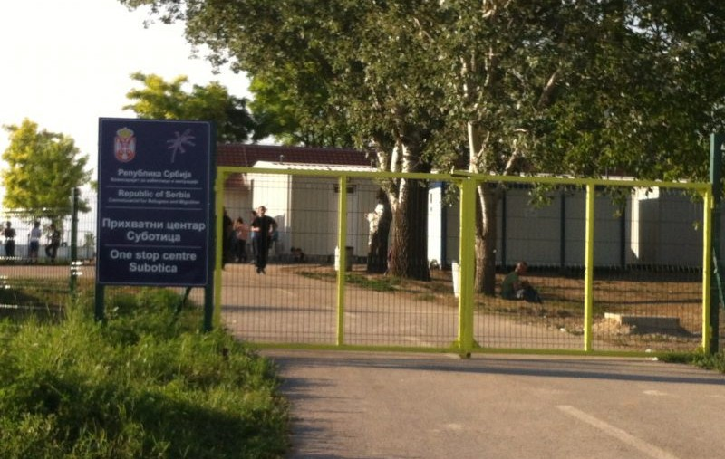

### AYS 8/7: Fear of more violence in Cherso and Leros, refugees beaten in Hungary

Refugees have returned to Belgrade after being beaten by Hungarian police\. Photo: Info Park

_In today’s digest: Anatolian hospitals refusing to admit refugee children with urgent medical conditions\. Shelter in Athens urgently needed for a vulnerable Syrian family of six\. Increasing numbers of pushbacks from Hungary to Serbia, tents urgently needed\. Government and Baobab negotiating relocation of the refugees in Rome\. Cities Pordenone and Udine blocking public WiFi to get rid of the refugees who are trying to contact their families\._
#### Syria
### Government forces encircle rebel\-held areas: No one can get in or out of Aleppo anymore

According to [Reuters agency](http://mobile.reuters.com/article/idUSKCN0ZN0U2?feedType=RSS&feedName=topNews&utm_source=twitter&utm_medium=Social) , Syrian government forces took a step toward completely encircling rebel\-held parts of Aleppo on Thursday, capturing ground overlooking the only road into the opposition half of the city and effectively putting those areas under siege\. “Currently nobody can get in or out of Aleppo,” Zakaria Malahifji of the Aleppo\-based rebel group Fastaqim told Reuters\. According to Syrian Observatory for Human Rights, the regime forces also advance in the area of Jabal al\-Akrad in the northern countryside of Latakia\. Aerial bombardment kills 23 civilians, including women and children, in the town of Darkush, in Idlib countryside\.
#### Turkey
### Anatolian hospitals refusing to admit refugee children with urgent medical conditions

Turned down by the doctors: 14\-year old Rihan\. Photo: Gerard Kennedy‎, KKIP

Speaking out about living conditions of Syrian refugees in Turkey, Kas Kastellorizo International Platform [has described a case](https://www.facebook.com/photo.php?fbid=10155001291929867&set=gm.1616550845322940&type=3&theater) of diabetic refugee girl with urgent medical condition who was turned down by hospitals in Anatolia in May, despite having exceptionally high levels of toxicity in her liver\. 14\-years old Rihan, whose family lives in extreme poverty and often can’t afford basic medication for her, was saved thanks to the timely intervention by Medecins Sans Frontieres, but thousands of refugees remain without adequate medical support because Syrian nationals are not entitled to medical support in Antalya province\.
#### Greece
### In the aftermath of riot and destruction on Leros, refugees afraid for their safety

Trashed reception office container in Leros hotspot\. Photo: Source from the gound

Yesterday, a big riot broke out in Leros hotspot, where 650 refugees are located\. According to refugee sources, violence exploded as a result of frustration of young Pakistani people who have lost all hope in being allowed to continue their trip\. After realising they might be returned to their country, they rioted and clashed with police, throwing stones and destroying the administrative container inside the hotspot\. It seems other groups of young refugees also participated in the fight against severely outnumbered police forces, all of them asking to be allowed to leave Leros and travel towards their destination countries\. UNHCR and other staff evacuated immediately after the figh started\. Coast Guard officers rushed in to support the police\. Families and other scared refugees who didn’t want to participate in the violence managed to escape to the town, but returned to the hotspot after the riot\. Today, refugees say officials didn’t give out food as usual, and they also weren’t allowed to go to the marked because of alledged theft that happened recently\. Today, local press jumped to the opportunity to raise concernes about the safety of people on Leros, while New Democracy’s shadow immigration minister Vassilis Kikilias spoke out about „uncontrolled situation in Leros hotspot“ claiming thart „migrants attacked police with axes“ and „local solidarity groups ignited the riot“\. Refugees who remain in the hotspot say they fear for their safety\. Police reinforcements were unofficially announced following the violence\. Updates from Leros are highly apprecieted — you can send them to [our Facebook inbox](https://www.facebook.com/areyousyrious/) \.
### **65 refugees have arrived to Lesvos today**

A volunteer welcoming a boat full of refugees early in the morning\. Photo: Lighthouse releif

The first boat was spotted at 5\.30am outside the Lighthouse camp in Skala Sikamineas, while the other arrived shortly afterwards, on the neighbouring beach of Kagia\. Both were escorted by Proactiva without the presence of Frontex\. Experienced [Lighthouse Relief](https://www.facebook.com/lighthouserelief/) team welcomed the refugees, giving out dry clothes, food and other necessities\.
### Shelter in Athens urgently needed for a vulnerable Syrian family of six\!

According to international volunteers on Chios, many vulnerable cases are currently being processed and sent from the island without accommodation provided in the mainland\. Today, volunteer Gabrielle Tan is calling for help to accommodate a Syrian family of six, due to be sent to the mainland this week\. If you can contribute, please [contact her directly on Facebook](https://www.facebook.com/gabrielle.tan?fref=nf) \.
### Eviction of Eliniko postponed, Pireaus scheduled to be cleared out soon

According to MSF, around 1,300 people live in “horrific conditons” inside the old Elliniko airport\. Photo: MSF

The eviction of some 4,000 refugees from a makeshift settlements at the site of the old Athens international airport and two other locations in Elliniko area is being postponed until after the end of July, as an alternative venue has yet to be found\. Eviction of port Piraeus is the current priority, government sources say\. They aim to move out some 1,500 migrants, currently residing in E1\.5 terminal, most of whom are in legal limbo as their residence permits have expired\. They are likely to be moved to one of several venues being prepared in the Peloponnese\.
### Yazidis moved away, Kurdish and Arab people to be separated in Cherso after fights

All Yazidis have been transferred to another camp and there are only Kurdish and Arab people left in Cherso\. Sources from the camp claim the plan is to separate the two groups, following the recent fights that broke out in the camp during the Eid celebration\. Everyone who was treated at the local hospital is back in the camp and situation is calm now\. Two families had left the camp due to the fights and they have repeatedly tried to access other camps in the Thessaloniki area, so far with no success\. They would be free to come back to the camp in Cherso, would they decide so\. We are informed that those who took part in the fight were taken to another camp and are not allowed back in Mazaraki to ensure safety of the others staying in the camp\. The IRC team recently made a new site management proposal for the Mazaraki camp that includes new infrastructure: a big tent for informal educational programme, electricity for hot water in a number of new toilets and showers that will be built, as well as communal kitchens and a hygiene kiosk\. If the plan gets the government officials’ and the UNHCR approval, it is planned to start as soon as possible\.
#### Serbia
### Refugees returning to Belgrade beaten up after trying to enter Hungary

Following our yesterday’s news about right\-wing militias patrolling Hungarian side of the border and catching those who try to cross the border, Info Park has published photos of severely beaten refugees who have returned to Belgrade after being attacked, allegedly by police, at Hungarian border\. Talking to the press, refugees said they were also bitten by police dogs\.

Refugees showing wounds after the alleged encounter with Hungarian police\. Photo: Info Park

> We were busy whole day trying to help all the injured and vulnerable returnees from the borders whom were not only tortured physically\. Those people are now also in a very bad mental state that demands a serious, professional work and we are glad to share the information that we are working on the return of NATAN psycho\-social team to Serbia\. If everything goes according to the plan, the Belgrade parks will soon have the new, super\-professional service for the refugees with a need for the psychological wounds to be healed, said Info Park crew\. 

### Increasing numbers of pushbacks from Hungary to Serbia, tents urgently needed

Moving Europe has confirmed our reports about people waiting up to four weeks in order to enter Hungary legally, via Horgoš and Kelebija border crossings\. Many are therefore resorting to irregular crossings of the border, resulting in attacks by the police or right\-wing militias\.

> I crossed with my husband and our four small children from Serbia into Hungary through a small hole in the fence\. We had already walked for several kilometres when the Hungarian police stopped us\. They sprayed pepper\-spray at us, even at my small children\. They put us all into their car and we had to exit back through the same hole we entered\. It was 3am in the morning\. We slept next to the fence on the bare ground that night, said a refugee in her statement to Moving Europe\. 

Apart from makeshift border camps, refugees in Northern Serbia can make use of a state\-run One stop refugee center in Subotica\. According to the report, due to the increased number of pushbacks from Hungary, the camp is overcrowded at the moment and people have to sleep in tents outside\.

One stop centre in Subotica, where refugees can rest for a day before continuing their trip\. Photo: Moving Europe

According to [UNHCR](http://rs.one.un.org/content/unct/serbia/en/home/presscenter/the-un-in-serbia-warns-of-further-deterioration-of-the-situation.html) , the number of refugees on the Serbian side of the border has doubled over the last few days as a result of new legislative measures in Hungary, which took effect on 5 July\. There are now above 1,300 refugees in the area, the majority of them women and children\. While several hundred are sheltered in One stop center, close to 800 asylum\-seekers are waiting in the open on Serbian territory outside the Hungarian “transit zone” near HorgošI border\-crossing, where overall conditions, particularly lack of shelter, health and sanitation represent major challenges\.

Due to many new arrivals, tents are urgently needed on both Kelebija and Horgoš border crossings: If you can donate, [please contact IHO team](https://www.facebook.com/imhumanIHO/?fref=ts) \.
#### Croatia
### Refugees held a press conference: “We want to stay here, Iraq is not a safe country”

Iraqi refugees staying at the Porin hotel in Zagreb held a press conference today, warning about situation in their homeland\.

Iraqi refugees standing in front of the journalists outside of Porin hotel\. Photo: Welcome initiative

> “I want to tell all people: help my country because it is bleeding, nodoby is helping, everyone just talks\. I would like to stay in Croatia, a safe country, so my children can go to school and live happily\. Many families want the same thing — a safe country to live in\. How is Iraq a safe country when 2600 people die there in a single day?”, asked the refugees gathered in front of Porin\. 

#### Italy
### “The problem is Europe, not Lampedusa”

„Europe begins or ends on Lampedusa“, said the president of the Senate, Pietro Grasso, during his visit to the hotspot in Lampedusa, where he met the refugees staying at the welcome centre\. He stressed out the importance of a change in the European policies, saying: „Either the European idea will become more concrete here or we will no longer be able to imagine this idea of Europe\. This is the test of the European idea\. The problem is not Lampedusa, it is Europe\. The problem lies in convincing Europe of the importance of showing solidarity to those who are in need of being welcomed\. „ He continued saying that the Dublin standards need to be changed so as to create a common political strategy that would enable relocation not only of the refugees running from war, but also of those fleeing poverty\.
### Government and Baobab negotiating relocation of the refugees in Rome

The new mayor of Italy’s capital, Virginia Raggi, met with social politics councillor, the prefect and the chief of local police, to discuss the issue of refugees in Rome’s Via Cupa, according to [Il Giornale](http://www.ilgiornale.it/news/cronache/mossa-raggi-i-migranti-cupa-1281403.html) \. Hundreds of people who have been landing in Sicily have settled in Rome, in a street tent camp managed by the Baobab Experience volunteers\. Their refugee centre was forced to close last December, following a decision by the City officials\. The volunteers, therefore, set up the tents in the street in order to welcome all the people\. Due to a large number of arrivals, big part of the street recently turned into a provisional refugee camp\. Police tried to empty it out a month ago, but refugees and volunteers opposed the eviction\. The mayor has now expressed her wish to find a solution together with associations involved that would include bringing the street back into its original state, thus also answering the locals’ demands to clear out the neighborhood, and finding a proper place to relocate the people staying there\. The proposal made by the Baobab volunteers, to relocate the refugees to the abandoned building of the ex Istituto Ittiogenico \(previously [occupied](http://roma.repubblica.it/cronaca/2016/04/16/news/roma_attivisti_occupano_il_nuovo_baobab_la_polizia_li_sgombera-137759006/) by the volunteers\), will be considered at the meeting with the officials from the Office for social politics\. The deadline for a solution to the problem, agreed by all parties, is next week\.

Police already tried to empty out Baobab’s street camp a month ago\. Photo: Baobab Experience
### Pordenone and Udine blocking public WiFi to get rid of refugees who are using it

Mayors of two cities in the Friuli region of Italy introduced, as they said, “new practical measures to improve security in the city centers”\. They plan to fully \(in the city of Pordenone\) or partially \(Udine\) disable the use of public WiFi so as to reduce the number of refugees gathering in public parks and other areas of free wireless network, in order to get in touch with their families online\. This way less people are expected to gather in the city centre as the connection will only allow a small number of people to connect\. The concern once again came from the locals of these cities\. The new measures include police patrols in city areas where refugees stay, during which they regulary take away their sleeping bags, blankets and street beds\. The homeless and refugees protested against this practice because their personal belongings have also been taken away, as the [Rete Solidale Portanone](https://www.facebook.com/retesolidalepn/?hc_location=ufi) reports\. With the help of those local volunteers, they were later able to retreive their possesions\. In spite of such happenings, as in other cities, another side of Portanone is strongly present and in favour of welcoming the others\.
### Three smugglers caught at the border, one alledged smuggler arrested in Palermo

According to the Italian press, 3 drivers were arrested in an operation by the Italian and French police forces, on the border between the two countries\. The people involved were trafficking 27 migrants in two vehicles\. The migrants, all from Sub Saharan Africa and Pakistan, were found in bad condition\. It is reported that they each paid from 100 to 150 euro to cross the border\. They were given a meal and taken to migration centres in the South of Italy\.

People found in a smuggler’s van on Italian\-French border\- Photo: ANSA

In Palermo, [the police stopped a Senegalese citizen](http://livesicilia.it/2016/07/08/lultimo-sbarco-di-migranti-a-palermo-fermato-un-presunto-scafista_766379/) , accused of being the smuggler of a vessel rescued offshore the Libyan coasts that carried 1,038 refugees \(including 12 pregnant women and over 200 minors\) \. According to the authorities, the young Senegalese belongs to a criminal organization managing the illegal access to Italy\. The refugees reported cases of abuse\.
#### Germany
### Number of new asylum applications 122% higher than in the same period last year

Applications for asylum in Germany in the first six months of this year hit 396,947, according to statistics released on Friday by Germany’s minister of interior\. The figure represents a 121\.7 percent increase compared to the same time last year\. Many of the applications are backlogs\. Following official closing of the Balkan route, asylum claims dropped from 92\.000 in January to 16\.000 in June, but new applications are still being registered\.
#### France
### Humanitarians urging French government to abandon the Touquet agreement

National Commission on Human Rights has released a report stating a need for an urgent action to help people who are still stranded in unhumane living conditions in the Jungle of Calais\. They made a list of 48 recommendations to improve conditions and respect human dignity in the camp\. In their release they urge the French government to abandon the Touquet agreement, which not only prevents migrants from seeking asylum in the UK, but it enabled the UK to impose their borders on the French soil, thus making France “a police fist of the migration politics of Great Britain”\. The report also gives homage to the “remarkable work done by associations”\.
#### Great Britain
### Syrian refugees not accepted in British councils “because of expensive housing”

More than a third of British councils are refusing to accept Syrian refugees mainly because of the high costs of housing them, [The Times](http://www.thetimes.co.uk/article/third-of-councils-refuse-to-take-in-syrian-refugees-n7v3ddsnp?awc=5684_1468009163_b48db1889f913bbb98280de37ba8f7d0) reports\. So far, they have only committed to taking 8,146 refugees out of the 20,000 that David Cameron has pledged that Britain will accept under the resettlement programme\. At the same time, The Church of England’s spiritual leader, Archbishop of Canterbury Justin Welby, announced he will house a family of Syrian refugees at his official London residence from next month, following a similar gesture by pope Francis\.
### AYS needs you\! :\)

Our friend Rando Wagner set up a crowdfunding site for AYS\. Please, consider donating to support our work\. [https://www\.gofundme\.com/areyousyrious](https://www.gofundme.com/areyousyrious)

_Converted [Medium Post](https://areyousyrious.medium.com/ays-8-7-fear-of-more-violence-in-cherso-and-leros-refugees-beaten-in-hungary-1414ba1431ce) by [ZMediumToMarkdown](https://github.com/ZhgChgLi/ZMediumToMarkdown)._
