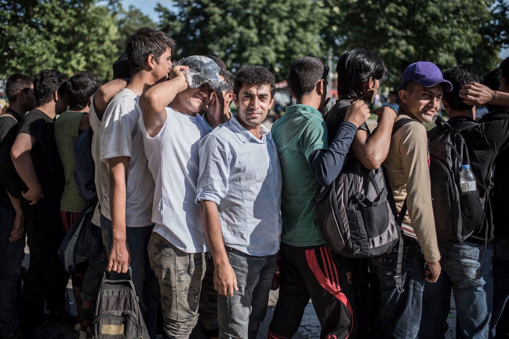
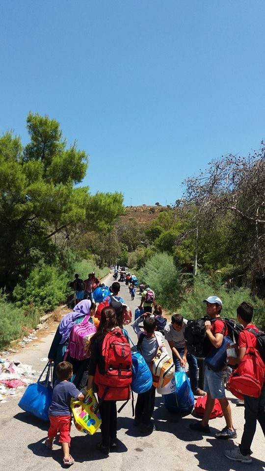
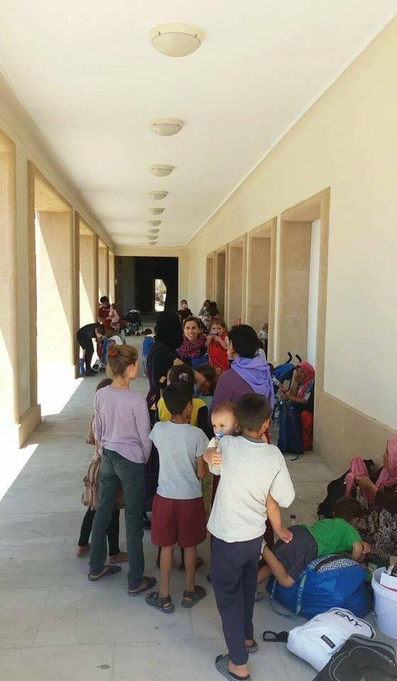
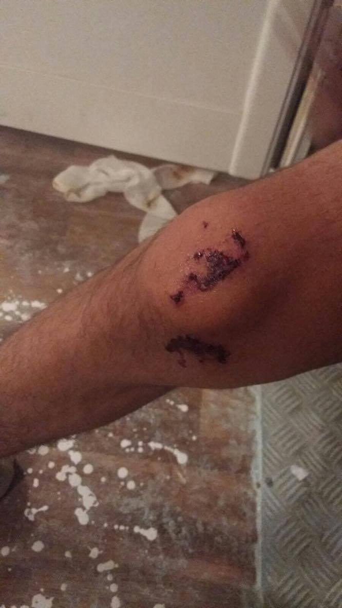
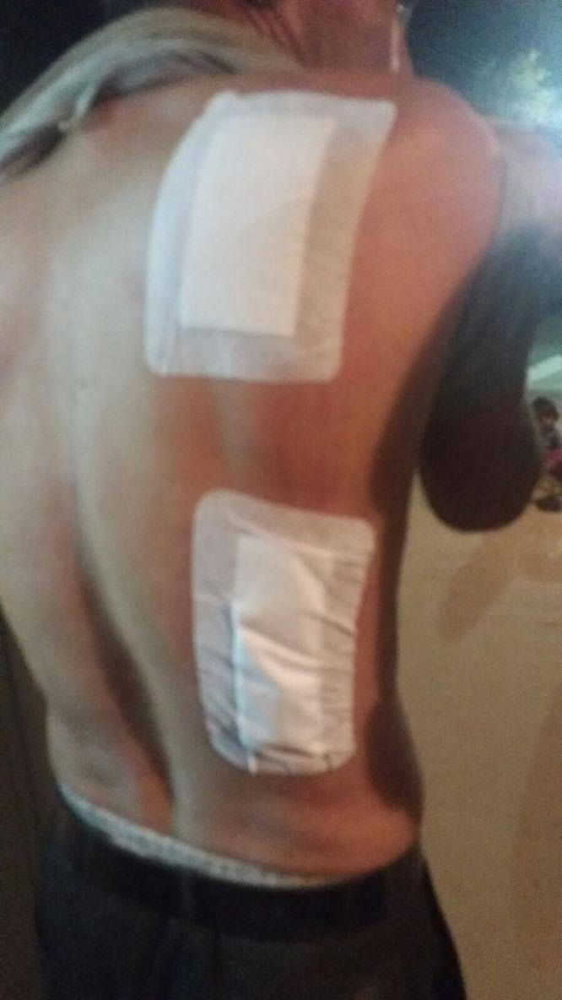
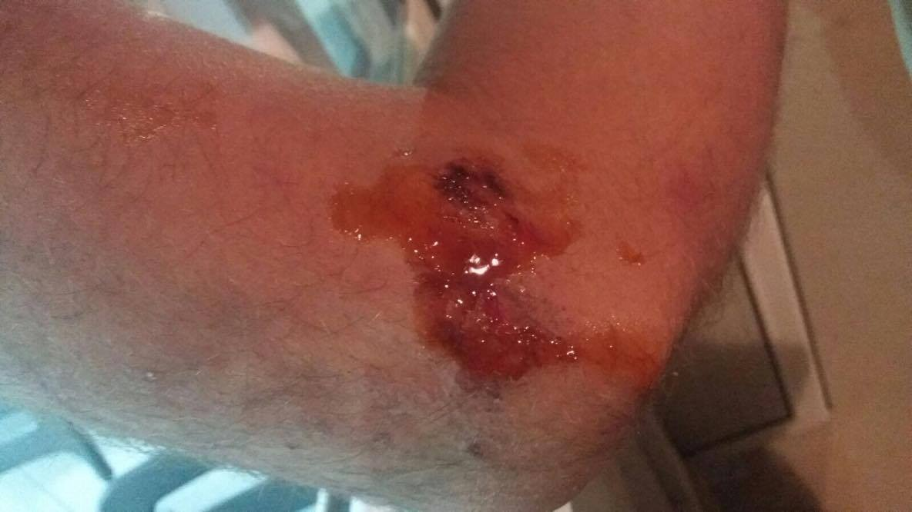
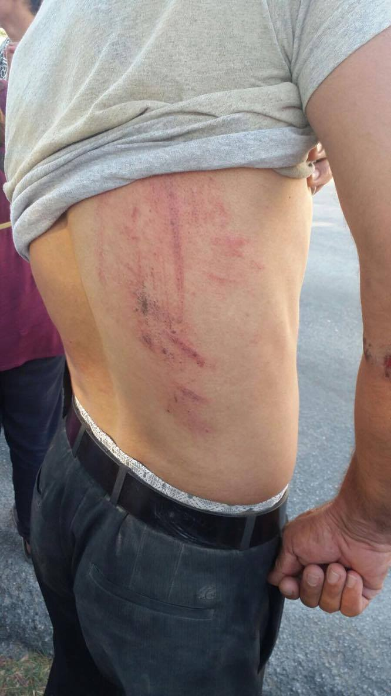
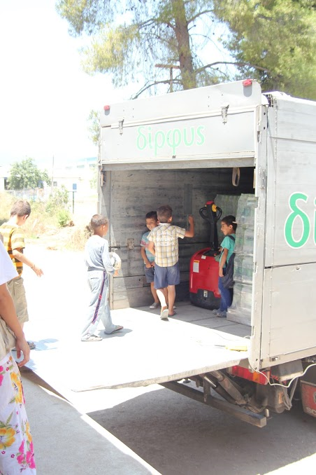
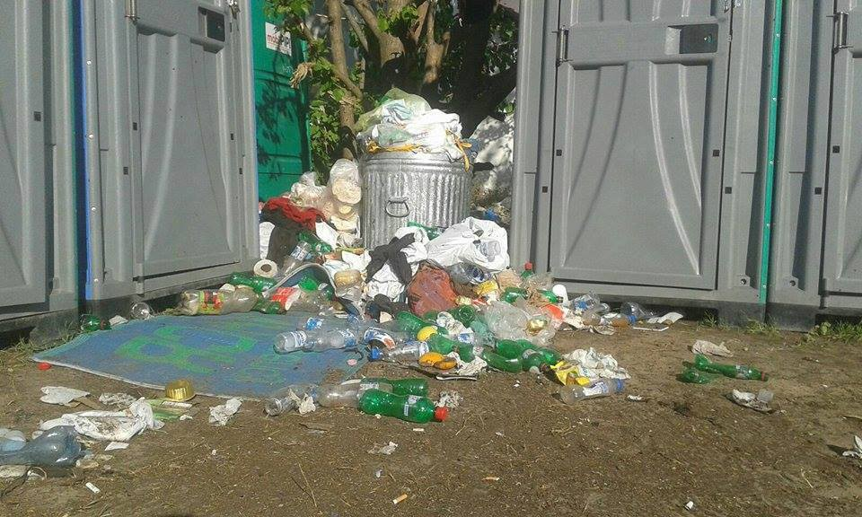
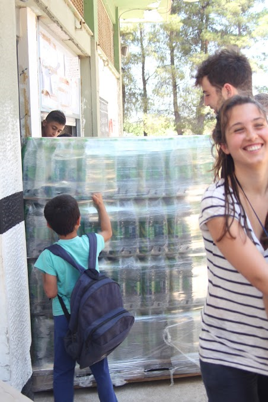

### AYS 9/7 Refugees, police and locals clash as frustration explodes on Leros

Leros: from war zone to war zone\. Syria: “We are nothing but bugs being crushed and the world has abandoned us\.” Starfish Foundation helps narrowly avert disaster in Ristona with water\. Refugees and activists sit\-in in Athens\. Thessaloniki refugees in need of support\. Italian organization Baobab and government continue back\-and\-forth\. Bulgarian asylum numbers increase\. UN Decries Hungarian refugee policy\. Border camps squalid\. Calais NOT closed and needs help\. Iceland makes returnee regulation revisions\.

#### Leros, GREECE
### From war zone to war zone\.

The aftermath of Thursday’s events only showcased the terrifying and dangerous stalemate of the situation faced by many refugees along the Balkan route\. As support structures solidify and innovation stagnates, dangerous structures of power gain more and more authority\.

In retaliation for [the tension and disruptions](https://medium.com/@AreYouSyrious/ays-8-7-fear-of-more-violence-in-cherso-and-leros-refugees-beaten-in-hungary-1414ba1431ce#.5fhfgc856) on Thursday, police isolated all Syrian refugees in the camp, locking them in the camp and threatening them, demanding to know the responsible culprits for Thursday’s events\. Despite reports from residents of the camp saying that Syrians were not responsible for the dramatic events, police activity only heightened tension within the camp, where people weren’t fed since Thursday’s riots\. As a result, the Yazidis in the camp, who are regularly targeted during tense situations, decided to evacuate\. Over one hundred men, women, and children headed to the port at Lakki\. However, the day had more horror in store\.

Yazidis leaving the camp and arriving in town\.

During their flight, the Yazidis were targeted, being attacked by a group\. There are conflicting reports of who the attackers are — if they are police or citizens\. However, what does remain clear are the bruises and injuries sustained by men, children, women, even pregnant women\. Below you can see the injuries sustained by those involved in the clashes

All photos courtesy of Advocates Abroad

Eventually, the group was returned to the camp\. This is video of the unrest\.

Volunteers seeking to initiate projects that would work towards reaffirming the humanity of refugees have been regularly stonewalled by authorities\. When hopeless communities lash out in desperation, this is often responded to with violence and further restriction, leading only to despondence\. This horrific cycle is one that will not be broken without concerted effort to advocate for and thoughtfully reflect on how volunteers should innovate our methods in order to stand with refugees in solidarity\. Otherwise, we risk being complicit with a toxic, cyclical, dehumanizing system that targets the already traumatized\.

Furthermore, it is of great import to note the role of media in this equation\. Throughout the previous unrest of days past, [propaganda reframing this tumult](http://sputniknews.com/europe/20160708/1042641879/migrants-attack-police-camp-greece.html?utm_source=https%3A%2F%2Ft.co%2FWQ2nACh4De&utm_medium=short_url&utm_content=bCQa&utm_campaign=URL_shortening) as an “attack” by “migrants” on Greek institutions has been spread through social media\. The shocking violence may well be the result of this propaganda taking seed, and blossoming into the most disturbing fruit\.

_Our partner organisation Advocates Abroad currently does not have a lawyer based on Leros, so any individual with [relevant experience is encouraged to contact them](https://www.facebook.com/advocatesabroad/) in order to see where they could be useful, whether on Leros or elsewhere\. Do consider supporting their work\._
#### Aleppo, SYRIA
### “We are nothing but bugs being crushed and the world has abandoned us\.”

An American surgeon working with the [SAMS program in Syria](http://www.abc.net.au/news/2016-07-09/inside-an-aleppo-hospital-after-airstrikes-in-syrian-war/7582926) recently spoke to ABC\.net about their experiences in a hospital in Aleppo\. The scene described is one of absolute nightmare as limbs, the dead and dying, and the living are all scattered across the emergency center\. Exhausted staff catch a brief nap not knowing who will be dead and who alive when they awake\.

> I saw so many people die\. 

What else can be said\. Doctors from SAMS USA report further casualties today in Aleppo despite the supposed institution of an “extended truce\.”
#### GREECE
#### Ritsona
### Starfish Foundation has helped narrowly avert disaster in Ristona with deliveries of pallets of water to the camp\.

The initial delivery was voluntary, based on reports of inadequate water supplies to help residents cope with the searing summer heat\. Starfish Foundation sent 15 pallets of water, which were greatly welcomed\. So greatly welcomed, in fact, that the ECHO coordinator on\-site called upon Starfish Foundation in an emergency situation when water supplies on\-site were still in limbo due to required testing\. Another 15 pallets were sent\. Follow their initiatives [here](https://www.facebook.com/HelpForRefugeesInMolyvos/) \.

Water delivery, Ritsona\. Photo Credit: Starfish Foundation
#### Athens
### Refugees were joined by activists in a sit\-in across from NGO Praxis headquarters in Athens, Greece\.

These [peaceful protests are occurring](https://insurrectionnewsworldwide.com/2016/07/09/greece-the-struggle-of-homeless-refugee-families-in-athens/) in order to bring awareness and urgency to the plight of refugees trapped in camps and interminable waiting lines in Greece\. When these refugees made any inquiry, they were referred to Praxis, so to Praxis they went\. There was a temporary road block, but as it was deemed unsafe, terminated it some time later\. Despite this, they remain at their sit\-in, waiting for a response from the closed blinds across the street\.

This video from the housing project gives some hint as to why refugees are unwilling to remain silent about their conditions\.

#### Thessaloniki
### For many refugees across Europe the street is home\.

Independent volunteers have been distributing food and other necessities to a group of hundreds of refugees, with two\-hundred arriving yesterday, for a while now\. Many refugees are sleeping in the park across from the train station, so volunteers there call on the network to reach out and considering running some distributions to this underserved community\.

> CAREER OPPORTUNITIES: Volunteer coordinator vacancy on legal services team:
 

> Do you have a connection or interest in refugee law? Do you enjoy working with social media and making people feel appreciated? [HIAS Greece is seeking a staff Volunteer Coordinator](http://www.hias.org/career-and-internship-opportunities) to welcome and work with our volunteer attorneys\. Those with legal backgrounds as well as those with Arabic and Greek language skills are especially encouraged to apply\. 

#### ITALY
### In the on\-going discussion between Italian officials and Baobab volunteers, the government responded\.

To this response, Baobab has provided a summary with commentary/response, which is translated below:

> It all started on 11th May 2015, when police pushed migrants in the area of Ponte Mammolo to find shelter in Baobab centre: almost 40,000 people transited there, instead of wandering around the city, without any problem of public order\. The current answer from the ministry accuses the Roman citizens who volunteered in the centre to have “deliberately led the migrants to via Cupa, in order to obtain the right to occupy ex Istituto Ittiogenico, a location close to station Tiburtina, property of region Lazio, abandoned since 2007\.” Actually, the ministry ignores that the centre has been identified only after a meeting with the town hall on 6th December 2015, when the assessor mentioned the necessity to find a public building close to the station, able to represent a stable solution for the “emergency of transiting migrants”: Baobab volunteers found the institute a possible solution, and they got their proposal co\-signed by Intersos, MEDU and ARCI\. So, region Lazio stated its availability in turning it into an innovative receiving centre, open to citizens’ participation, including a museum of migration and a teaching space\. 

> Hence, the ministry is wrong and offensive about the whole case, since it is accusing the citizens after all the work they did instead of the institutions\. Baobab urges the ministry to realize the existence of transiting migrants, in order to guarantee care and dignity\. On its side, Baobab will keep on working for a possible model of innovative… solution\[s\] for migrants\. 

The statement, in Italian, is linked [here](https://baobabexperience.org/2016/07/09/rispondiamo-ad-alfano/) \.
#### BULGARIA
### The number of asylum seekers in Bulgaria increased by 300 in June\.

The [State Agency for Refugees recorded that 1474 people](http://www.novinite.com/articles/175354/Number+of+Asylum+Seekers+in+Bulgaria+Increased+by+300+in+June) from sixteen different countries applied for asylum in Bulgaria\. These were the lucky ones who made it past now\-famed vigilante Dinko Valev, who made [headlines as citizen arrest\-maker extraordinaire in early 2016](http://www.novinite.com/articles/175348/Bulgarian+Vigilante+Migrant+Hunter+Charged+with+Instigation+of+Violence,+Hatred) \. Valev is being charged with instigating discrimination in response to the evidence that during these arrests, he behaved in an exceptionally discriminatory and violent manner towards the group of 16 men, women, and children that he called in in February\. The Bulgarian government has dismissed the rash of citizen arrests of refugees at Bulgarian border zones as unlawful\.

Serbian\-Hungarian border\. Photo Credit: I’m Human Organization
#### SERBIA
### The plight of around 1,500 refugees trapped at the Hungarian\-Serbian border is cracking international headlines\.

[BBC covers UN criticism of Hungarian refugee policy](http://www.bbc.com/news/world-europe-36753648) , which is now doubling down on measures to push back and return refugees who do not cross over at designated transit zones\. With volunteers at transit zones continuing to report a pitiful trickle of refugees being allowed through, conditions continue to be squalid\. 
A report from I’m Human Organization says:

> The living conditions are very bad: 10 toilets with no maintenance no showers on site\. No doctors, no organizations\. Rubbish everywhere\. 

> The tents are too small for the families and a lot of people arrived in the past three days, most of them sleeping in the open air because there are no tents for everyone\. We are highly concerned about the conditions inside and we are sending a call for Human rights and legal assistance associations to come and follow up the violence happening against all the people here whether pushed back or not\! 

As such, tents are in urgent need at the border\. Those who cannot provide tents directly, are also encouraged to contact the [I’m Human Organization](https://www.facebook.com/imhumanIHO/) , among other volunteer organizations in order to donate\.
#### GENERAL
### Refugees hub gives volunteers some clarity on where to go\!

For those interested in lending a hand, but who don’t know where to start, consider checking out the Refugees Hub, which is an integrated platform designed to help match volunteers with projects that mesh with their capabilities and interests\. The opportunities can be filtered by cause and by location, allowing volunteers to target options the most convenient for them\. Check it out, [here](http://refugeeshub.org/) \!

Ritsona camp\. Photo Credit: Starfish Foundation
#### FRANCE
### Despite what the media would have you think, Calais is not dead, and needs you\!

Ever since the bulldozing of the southern part of the camp, wider public opinion seems to be that the 6000 people living in dire conditions in Calais have disappeared\. The unfortunate news is that they haven’t, and, furthermore, due to this media misunderstanding, the volunteers that are helping them are running out of life\-saving items to distribute\. Care4Calais is running a distribution operation not only to Calais but to several other under\-served refugee communities around France\.

> Supplies in our warehouse have never been so low\. We are desperate to carry on with our work but we need your help\. The priority needs list on our website is updated every two weeks, so please share as much as you can\. 

> Please get the message out that the Calais camp is not only still here but we are receiving new arrivals every day\. We urgently need clothes, food and camping equipment\. If you have any questions at all just ask and we will be happy to help you can email us at clare@care4calais\.org\. 

Once again, the need is ongoing, and as mentioned above, the need for innovative, durable solutions is ever\-present\.
#### ICELAND
### Rejected asylum\-seekers provided some dignity as Iceland determines an interference\-free return policy\.

After headline\-making news about refugee deportations from Iceland, new information about legislation regarding refugees\. Although this news is not what we would fully hope for, those who have sought asylum in Iceland, but are found not to have right to stay are able to return to safe countries without police or authority intervention\. The local Directorate of Immigration and IOM released an agreement on the sixth ensuring this, furthermore stating that asylum seekers may even be eligible for financial amelioration to pay for the return trip\. Although these moves are signs of positive direction in terms of protecting refugees when they are, perhaps, at their most vulnerable, as in exiting a potential sphere of support, we would still hold out and advocate for more durable and humane immigration and refugee placement solutions in order to get more people moved from harm\.

_Converted [Medium Post](https://areyousyrious.medium.com/ays-9-7-refugees-police-and-locals-clash-as-frustration-explodes-on-leros-deee94d951ff) by [ZMediumToMarkdown](https://github.com/ZhgChgLi/ZMediumToMarkdown)._
