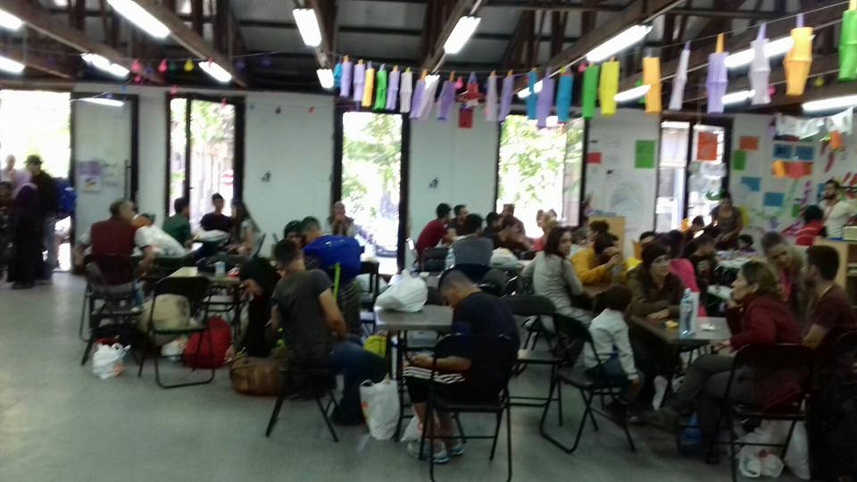

### AYS 10/7: Chauvinism rears its ugly head in Greece once more, part of a long series of attacks against the vulnerable\.
#### Today’s clashes on Cherso in Mazaraki Camp took place between Arab and Kurdish refugees, after a group of Arabs said yesterday that they will kill Kurds\. The situation looks quite grave and it is likely that the solution will be similar to the one applied to the Yazidis, who were relocated after being attacked in the same camp on Thursday\. Such tensions are greatly exacerbated owing to poor living conditions\.

[![My Brother's Keeper | Athens, Greece | 7.10.16 Abdul Jalil and his younger brother escaped from Syria after a mortar blast blinded Mohamed in his left eye. They are not living in Athens and applying for asylum. Abdul Jalil wanted to be a mathematician like his father. At the university in Homs, Syria he studied alongside his younger brother Mohamed, who wanted to be an engineer. School was everything to the brothers, the oldest siblings of seven. "We went to school and then home, nothing else" said Abdul. As the war intensified, their studies took on a new importance because it delayed their conscription into the Syrian army. But they couldn't shut the war out completely. The family was forced to flee their home as bombing intensified in their neighborhood. They found out later their house was destroyed. This crushed their father. He became ill. Shortly after in 2014, a mortar shell exploded in front of Mohamed while he was leaving class. A piece of sharpel struck him just under his left eye rendering it sightless. Mohamed was treated at the Homs hospital, but was told that without surgical procedures only available in Europe. Without it, he would lose the eye. There was a fear of more complications. Jalil knew his brother couldn't make the journey on his own. But his father had become bedridden and the family's eldest felt the tug of responsibility to care for the family. Their mother encouraged them to go. They failed to cross the border into Turkey twice. Their mother encouraged them to keep trying. They succeeded on the third attempt. They haggled with smugglers in Turkey to take them by boat to Greece. Abdul knew his mother was lying when she said her father was doing well, just like he lied about where he and his brother were sleeping at night and how much they were eating; brave faces for hard times. The only person he could be honest with was his sister in messages on WhatsApp, he said. They managed to pay their way onto a boat bound for the Greek island of Chios but were detained, forced into a new asylum "hotspot" system that expedited applications that carried a high risk of deportation. During their detention, Abdul Jalil and Mohamed's father]( "My Brother's Keeper | Athens, Greece | 7.10.16 Abdul Jalil and his younger brother escaped from Syria after a mortar blast blinded Mohamed in his left eye. They are not living in Athens and applying for asylum. Abdul Jalil wanted to be a mathematician like his father. At the university in Homs, Syria he studied alongside his younger brother Mohamed, who wanted to be an engineer. School was everything to the brothers, the oldest siblings of seven. "We went to school and then home, nothing else" said Abdul. As the war intensified, their studies took on a new importance because it delayed their conscription into the Syrian army. But they couldn't shut the war out completely. The family was forced to flee their home as bombing intensified in their neighborhood. They found out later their house was destroyed. This crushed their father. He became ill. Shortly after in 2014, a mortar shell exploded in front of Mohamed while he was leaving class. A piece of sharpel struck him just under his left eye rendering it sightless. Mohamed was treated at the Homs hospital, but was told that without surgical procedures only available in Europe. Without it, he would lose the eye. There was a fear of more complications. Jalil knew his brother couldn't make the journey on his own. But his father had become bedridden and the family's eldest felt the tug of responsibility to care for the family. Their mother encouraged them to go. They failed to cross the border into Turkey twice. Their mother encouraged them to keep trying. They succeeded on the third attempt. They haggled with smugglers in Turkey to take them by boat to Greece. Abdul knew his mother was lying when she said her father was doing well, just like he lied about where he and his brother were sleeping at night and how much they were eating; brave faces for hard times. The only person he could be honest with was his sister in messages on WhatsApp, he said. They managed to pay their way onto a boat bound for the Greek island of Chios but were detained, forced into a new asylum "hotspot" system that expedited applications that carried a high risk of deportation. During their detention, Abdul Jalil and Mohamed's father")](https://www.instagram.com/p/BHsToe5BVe2/)

#### Syria
### Journalist in Syria was targeted by the regime, according to her family\.

Marie Colvin in Tahrir Square in 2012\. Photographer: Ivor Prickett

Marie Colvin was an American war correspondent who was killed in Homs in 2012\. In a civil law suit filed by her family against Syria alleges that she was deliberately targeted for her outspoken reporting of civilian casualties, [The Washington Post reports](https://www.washingtonpost.com/world/national-security/war-reporter-marie-colvin-was-tracked-targeted-and-killed-by-assads-forces-family-says/2016/07/09/62968844-453a-11e6-88d0-6adee48be8bc_story.html) \. It claims that Colvin was under surveillance, and that the assault was one in a series of attacks designed to orchestrate a media \. blackout on atrocities committed by the Syrian army\. At least 100 journalists have been killed in Syria as a result of the war\. Should the family win the suit, a judge may rule that compensation be paid to the family out of frozen Syrian funds\.
#### Turkey
### Aftermath of a Turkish man’s death sparks outrage\.

In the Beysehir district of Konya province, [a protest took place](http://www.euronews.com/2016/07/10/turkey-outrage-after-deadly-fight-between-residents-and-refugees/) in the aftermath of a fight that broke out on Saturday between locals and refugees\. The fight was the result of the kicking of a stray dog, and among the dead are one Syrian and one Turk\. An additional three people were wounded\. The tragic deaths have sparked a strong response on social media among locals, many of whom are saying that they want Syrians out of their district\.
#### Greece
### Another big fight broke out on Cherso today, this time provoked by anti\-Kurdish racism\.

In Mazaraki Camp, a big fight has once again broken out among the inhabitants\. A fight already happened on Wednesday, [as we reported](https://medium.com/@AreYouSyrious/ays-7-7-hungarian-police-allowed-to-push-back-refugees-behind-its-border-fence-ee2afc593334?source=rss-------1) , which was anti\-Yazidi in nature\. This attack also comes in light of the recent violence on Leros, in during which local fascists attacked inhabitants, with Yazidi refugees facing the brunt of the violence\. There are no longer Yazidis in Mazaraki camp, as they have been resettled in the aftermath of last week’s brutal attacks\. This round of violence came as a result of the Arab refugees’ antipathy towards Kurds\. A group of Arabs had threatened yesterday to kill Kurds, and today a group including residents of other camps entered the camp and sparked a fight between the inhabitants\. The violence will likely result in the further separation of refugees of different ethnicities\.

The attacks attest to the anti\-Yazidi and anti\-Kurdish sentiments which are widespread enough among Arab refugees to cause a very tense atmosphere, but also to the difficulties of living in camps, and the increased likelihood proliferation of sectarian and chauvinist attitudes in conditions of deficit, during which people become more likely to look out for “their own” at the expense of others\. Better living conditions would surely help to alleviate such tensions, but it does not seem likely that Greek authorities will make such a move, given the ineffective responses following previous such incidents\.

**40 refugees were rescued northeast of Korakas\.**

The refugees were picked up by the British vessel HMC Protector\. Volunteers were refused access to the newcomers, who were subsequently taken to Moria camp\. They were given water and protection from the sun\.
### Volunteers be advised: there will be a power outage in Athens and Attica tomorrow\!

This comes as the result of a work stoppage by DEH employees\. The stoppage is to take place from 10 AM to 1 PM\. Be sure to have your devices charged in the morning and advise refugees to do the same\. It may be a short period, but it is long enough to potentially cause confusion and misunderstandings, so do keep this in mind\!
### A family is in desperate need of help after losing everything to smugglers\.

The story comes to us [via Team Humanity](https://www.facebook.com/TeamHumanityDK/photos/a.531021640400184.1073741829.529364240565924/638931949609152/?type=3) , who report that yesterday a Yazidi family paid all of their money to a smuggler who subsequently forced them out of the car and told them to walk on their own, and they were caught by border police and deported back to Thessaloniki\. They are now living in the streets\. If you are able to donate, you may do so via [http://cash\.me/$AmberSafa](http://cash.me/$AmberSafa) with your card or through your bank account by sending it to:

MobilePay \( \+45\) 22 94 03 94
 Bank Transfer to Danske Bank
 Reg\. no 4400 
 Account no\. 4845953600
 SWIFT: DABADKK
 IBAN: DK1830004845953600
 Mark: “Team Humanity Donation”

Every little bit helps\!
### Solar power harnessed to allow refugees to charge their phones\.

[Sam Kellerhals reported](https://www.facebook.com/photo.php?fbid=10210178054477262&set=gm.296463980699902&type=3&hc_location=ufi) that his team made a mobile solar\-powered charging station so that refugees will have a place to charge their phones\. Refugees often have trouble keeping their phones charged, which these days is proving to be quite indispensable\. Three have been installed so far, in Kara Tepe, Malakasa, and Ritsona\. Kellerhals asks that people in those camps where such a device is needed contact him\.
#### Serbia
### Serbia continues to serve as a gateway who risk everything to come to Europe\.

Despite the closing of the Balkan Route, Serbia continues to be a very lively crossing point, according to Serbian authorities\. They claim that 102,000 refugees have been registered in the country since January 2016, meaning that roughly 500 arrive each day\. Very few refugees intend to remain in Serbia, the goal is mainly to travel through Hungary and hopefully reach another EU country such as Germany\. There are currently 1,300 people, a majority of whom are women and children and who are often living in squalor, camped on the Serbo\-Hungarian border wishing to make the trip, but Hungarian authorities let only 30 people into the country each day\. With such an agonizing pace of operation, the refugees have little choice but to look for other means to cross\. According to the Helsinki Council, Hungarian authorities have detained 17,000 refugees crossing the border illegally\. The situation is so inhumane that UNICEF has voiced its concerns\.

Photo from Mikaliste today\.
### Miksalište continues to be a vital resource for refugees in Belgrade\.

There are currently hundreds of refugees in Belgrade, many of whom are in the city because it has become somewhat of a hub for refugees wishing to continue their journey north despite the closing of the Balkan Route\. Among the most valuable resources for refugees in the city is the Miksalište center, which provides vital facilities, food, clothing, and healthcare for those in need\. A total of 289 people were present today, 170 children, 44 women, and 65 men according to the group\.
#### Croatia
### Receiving asylum in the Croatia remains difficult\.

An Iftar dinner in Kutina Camp in Croatia\. Picture Credit: Merahmet

[Novilist has published](http://www.novilist.hr/Vijesti/Hrvatska/Zivot-u-prihvatilistu-na-periferiji-Sto-Hrvatska-daje-traziteljima-azila?meta_refresh=true) \(in Croatian\) an interesting overview of the refugees’ situation in Croatia\. It may be summarized as follows: since 2004, over 5,000 asylum requests have been made, of which 182 were approved\. As of June, 226 asylum seekers were living in Croatia\. 174 in Zagreb, 52 in Kutina, 45 in Jezevo, 35 in private accommodations, and 5 are in jail\. From January until June of this year, a total of 523 asylum applications were submitted, 6 of which were approved and 247 of which are currently being processed\. Croatia is rarely the place where refugees would like to stay in the long term, but many have no choice\. Refugees found in other EU countries are sometimes deported back to Croatia because that was where their fingerprints were collected, at which point many try to declare asylum in the hope that by doing so they will be able to relocate themselves to a more prosperous EU country at a later date\. Prospects in Croatia are not good, as there are few jobs available\.
#### Germany
### The German parliament passed an integration bill making study of German mandatory\.

The government will be subsidizing German language courses, and those who do not attend these courses will be denied residency permits\. [“The acquisition of the language is also necessary for provisional right to remain,”](http://www.thelocal.de/20160708/germany-passes-historic-law-on-refugee-integration) states the law\. The legislation will also make it much easier for asylum seekers to gain meaningful employment, temporarily suspending laws which make it so that asylum seekers may only be employed assuming there are no suitable German or EU citizen candidates who may take the post up\. The bill also includes provisions for anti\-terror legislation to be drafted in the near future\.
### The man behind the EU\-Turkey deal\.

[Die Zeit](http://www.zeit.de/2016/27/gerald-knaus-fluechtlinge-eu-tuerkei-abkommen) published the piece \(in German\) revealing many fascinating details surrounding the EU\-Turkey deal and the man who invented it, an advisor of Angela Merkel by the name of Gerald Knaus\. For those interested in an in\-depth explanation, an outline of the plan may be found [here](http://www.esiweb.org/index.php?lang=en&id=597) \.

One particularly shocking statistic is that there are approximately 8,500 refugees on Lesvos at any given moment, but there are only 16 officials responsible for processing them\. The EU had promised to send 600 officials to Greece as part of the Turkey deal to expedite the process, but as of now only 65 have arrived\. Not shocking but very sad is that Albrecht Brömme, the president of the Federal Agency for Technical Relief, went to a meeting of EU officials in Athens with satellite photos of islands in the Aegean marked to show where new camps may be built, causing some to fear that the EU may be planning to create a situation similar to that on Nauru, a small island where refugees are who wish to settle in Australia are housed\. About the specifics of the EU\-Turkey deal, the article mentions that 711 refugees were resettled from Turkey to the EU, and 465 deported to Turkey\. Knaus is reported as saying that, “if the deal fails, then Europe fails,” quite a grave prognosis\.
#### UK
### The UK has not lived up to its promise of welcoming unaccompanied refugee children\.

[The Guardian](https://www.theguardian.com/world/2016/jul/09/unaccompanied-child-refugees-dubs-amendment) reported on the progress made towards James Cameron’s plan to bring child refugees living in camps in the Middle East and EU countries into the UK: absolutely none\. Cameron made the promise two months ago, and a refugee child has yet to step foot in the nation\. This is unfortunately unsurprising in the aftermath of Brexit\. Trends on social media show that fearmongering about immigration played a major factor in convincing people to vote to leave the EU, and in such a tense atmosphere it is no surprise that little work is being done to help the most vulnerable of the refugees\.
### Hosts are urgently needed in the UK to house refugees\!

The situation is quite desperate, and one person posted the following message in the hope that people will volunteer to support minors in the country\.

> There is a shortage of Foster Carers and Supported Lodgings Hosts in the UK\. Please read the following and share with anyone who might consider hosting a refugee or asylum seeker in the UK\. 

> In Hampshire, where I live, the council has just confirmed that they plan to support 163 Unaccompanied Refugee Minors starting this month as part of the National Transfer scheme from Kent where there is a disproportionate number of Unaccompanied Minors being registered\. Counties across the UK are being asked to support the scheme as well as accepting children from the Syrian Vulnerable Persons Resettlement Scheme and those from northern European refugee camps\. 

> There is a shortage of hosts and our council is now saying that they suspect 90% of these children to be 16–18 years old and eligible for SUPPORTED LODGINGS\. Supported lodgings are a service which can allow an individual to live in a family home, experiencing domestic life in a shared and supportive environment\. The young person has their own room and shares the kitchen and bathroom facilities with the family or householder — or ‘host’\. Similar to Foster carers, hosts can be families, couples or single people\. 

> The accommodation is a furnished bedroom in a domestic house, with use of WC, bathing, cooking and laundry facilities as a member of the household\. The householder/host is resident full time in the property but pursues their own lifestyle \(including daily routine, absence at work, holidays and weekends away\) \. They provide a home\-like environment and domestic routine consistent with the young person engaging in education, training or work, including the provision of some meals\. They establish an appropriate and consistent personal relationship with the young person, including non\-intrusive practical help and advice\. 

> The service provider \(an LA or independent organisation e\.g\. Barnardos\) undertakes recruitment, scrutiny and approval of hosts’ accommodation and suitability to work with vulnerable young people in an unsupervised home environment\. They typically provide general skills development, training and experience\-sharing events for host families\. 

> Hosts have a tenancy agreement and the council pays £75 per week plus £20 for food\. These figures may vary from county to county\. 

> Many of the children coming into care in Kent are vulnerable and will need a really caring and supportive household\. If you’ve volunteered at the camps you’ll know what most of these kids have been through on their journey across Europe to find a better life\. Please consider being a host and spread the word\.
 

>  For more details of Fostering or offering Supported Lodging, contact your local council\. 

> Please spread the word\. Assessment can take a few months and the children need homes now\. 

_Converted [Medium Post](https://areyousyrious.medium.com/ays-daily-news-digest-10-7-16-1237df3fa6c2) by [ZMediumToMarkdown](https://github.com/ZhgChgLi/ZMediumToMarkdown)._
