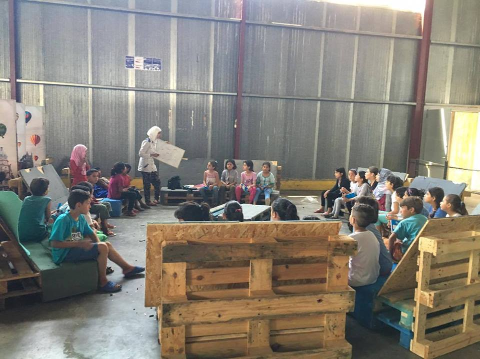

### AYS Daily News Digest 12/7: Far\-right racist terror surges in Europe

> The anger and fear of locals takes barbaric form as they attack and threaten refugees; we invite more people to express their solidarity in these difficult moments\. Let’s make Europe safe for human differences\! 

](assets/d2e58a9494cd/1*sG5nD9PznOH3z--qZhCScg.jpeg)

Credits: [**Refugee Solidarity Community**](https://www.facebook.com/rscntwrk/)
#### Greece
### A group of Leros locals threatening refugees

Presenting themselves as the “Indignant citizens,” a group of about 20–30 people, some of whom are reportedly active members of the Golden Dawn and others known to the locals for their fascist views, started threatening refugees\.

The group was established following the recent intra\-ethnic violence between scared and frustrated refugees\. The Indignant citizens’ group took advantage of the legitimate concern of the inhabitants over the refugee situation on their island, thus depicting themselves as the peace\-bringing “militia\.”

Starting this Saturday, the Indignant citizens have reportedly been threatening and attacking refugees and even those involved with refugees, such as volunteers and NGO workers\.

Together with the police, the “militia” escorted refugees by guiding them on foot outside their hotspot\.

The refugees have now returned to the area of the detention center, however, as they make clear, that they do not want to stay there because they fear for their lives\. The groups of the Indignant citizens spend every day patrolling the island, threatening refugees and NGO members\.

Credits: Theodore Manolopoulos
### Pikpa humanitarian hostel for families and vulnerable adults has demonstration planned against it tomorrow 5pm

A statement in response many people’s justified anxiety about the rumored anti\-PIKPA gathering to take place tomorrow, Wednesday, July 13, 2016, by [Elektra Kostopoulou](https://www.facebook.com/elektra.kostopoulou) \.

“The rumored instigators are limited to a handful of well\-known troublemakers in the local community\. Still, we all take these threats very seriously\. The Greek Government, Regional Prefecture, local police and representatives of First Reception have all been officially informed about the situation and are now responsible for taking the necessary measures in order to ensure the security of residents and volunteers alike\. Not to forget that PIKPA is a public building under the direct management of the Greek state\. The issue is also followed closely by the national and international press\. These justified mobilizations notwithstanding, it needs to be mentioned that the small, racist minority of instigators by no means represents the majority of locals\. In fact, many of them expressed their wish to come to PIKPA tomorrow, in solidarity with the residents\. At the same time, the mayor Mihalis Kolis has been on record targeting PIKPA, falsely accusing volunteers, NGOS, and the Greek government for the riots that took place at the Hot Spot\. Moreover, some of the members of his municipal council are allegedly leading the anti\-refugee movement, trying to divide the locals\. Hopefully, they won’t be successful\. Please do know that the great majority of locals are on your side\! If you are or feel threatened by anybody please report this immediately and try to learn the identity \(or take a picture\) of those involved\. We have the right to and will take legal action against them\. The residents remain the most vulnerable group\. Please protect them and prevent them from engaging with likely instigators\. Also, please advice them against leaving PIKPA unaccompanied for a couple of days, until we are sure that they are safe again\.”

500 Afghan families are to be moved tomorrow \(13/07\) from Pireus port\. The buses will come to the port at 10:30, and all refugees should be boarded by 17:00 o’clock\. The refugees will be taken to Oinofita camp, which is about 2 hours north of Athens\.

Yesterday, last of the Vasilika refugee camp residents were interviewed and pre\-registered\. This is a positive step, but ther eis still a long wait ahead until the right to asylum\.
### LSN lost the right to use the building which housed “Villa Artemis”, temporary home for women and children refugees

The Mayor of Leros has, since its inception, created difficulties for this refuge, dedicated to bring comfort to the most vulnerable refugees: women and children\. Since the day one, the Mayor has tried to close the housing facility\.

In this house, thousands of women and children found peace after the horror of war\. As volunteers write, “The house is where mothers slept deep in the house’s arms, their babies safe at their sides; where children discovered the buried memory of laughter\. This house\!”

And how will you sleep tonight, Mayor Michalis Kolias?

](assets/d2e58a9494cd/1*Y-nKjU6Z8XjGj0iBWQ1r_Q.jpeg)

Credits: [**Refugee Solidarity Community**](https://www.facebook.com/rscntwrk/)

](assets/d2e58a9494cd/1*yDYC4MccwhyiAfp6am-IHQ.jpeg)

Credits: [**Refugee Solidarity Community**](https://www.facebook.com/rscntwrk/)

](assets/d2e58a9494cd/1*sG5nD9PznOH3z--qZhCScg.jpeg)

Credits: [**Refugee Solidarity Community**](https://www.facebook.com/rscntwrk/)

](assets/d2e58a9494cd/1*lsov95nAF7_SnaJiFxPODw.jpeg)

Credits: [**Refugee Solidarity Community**](https://www.facebook.com/rscntwrk/)

](assets/d2e58a9494cd/1*aCdzrWAZOtTY6ZGY52P_ng.jpeg)

Credits: [**Refugee Solidarity Community**](https://www.facebook.com/rscntwrk/)

](assets/d2e58a9494cd/1*tutV3K9keWJhM4B89eq2Rg.jpeg)

Credits: [**Refugee Solidarity Community**](https://www.facebook.com/rscntwrk/)

](assets/d2e58a9494cd/1*67zUHipsUaK-nRZ1BYfmag.jpeg)

Credits: [**Refugee Solidarity Community**](https://www.facebook.com/rscntwrk/)
### Praksis is refusing to go to camps due to bad conditions for refugees, thus protesting the politics of refugee handling in Greece

The organization also announced a protest march to the Ministry to be held soon
### Greek Parliament demanding answers regarding the beatings of unaccompanied minors on Lesvos

The Greek parliament hold a discussion on the issue of the beatings of unaccompanied refugee minors in Lesvos, with questions put forward by SYRIZA MPs, including the C\. Pallis, for Interior and Administrative Reconstruction Minister\.

The question text reads:
“According to the public letter, MDM express their deep condemnation of the incident of police violence against unaccompanied minors detained in the Reception Center and Identification substation in Lesvos Moria\.

The public letter informs that, in the afternoon of June 24, 2016, twelve \(12\) Pakistani origin unaccompanied minors came to the substation’s clinic\. These minors were examined by the doctor and the psychologist\.

From the testimonies of unaccompanied minors and the related reports of the physician and the psychologist, during a quarrel between unaccompanied minors, one stone accidentally a shift’s policeman who then entered inside the wing in rage and punched one of the minors, while simultaneously threatening other minors detained at the site\. The minors reacted, resulting in twelve of them being transferred in handcuffs to detention centers of the police department in Mytilene\.

The refugee minors were kept detained from 3:00 a\.m\. until 14:00 the next day\. During that period, the minors were tortured by the police\.

During the clinical examination by the doctor of the step, it was obvious that the minors were in a state of shock and physical / psychological depression\.
Some of them brought abrasions on the wrists because of the handcuffs and others had injuries on other parts of their body\. Some reported headaches due to beatings, while one of them had a nosebleed\.

Based on the above and following the examination of twelve minors, the physician of the Médecins du Monde refers mnots to Vostaneio Mytilini Hospital for further assessment by specialists there\.”

This incident draws once again attention to the burning issue of detention of unaccompanied refugee minors within the Centre of Moria\.
### Team Humanity educational activities for refugees of all ages at Oraiókastron, Thessaloniki

Credits: Team Humanity

Credits: Team Humanity
### Refugees fighting heat in Vasilika camp

](assets/d2e58a9494cd/1*fCeA5B6xqEF1950FEBi6Ig.jpeg)

Credits: [**Seamend Ahmed**](https://www.facebook.com/profile.php?id=100011305625233)

](assets/d2e58a9494cd/1*mBAsJrXlbiITRCLQxWbjvA.jpeg)

Credits: [**Seamend Ahmed**](https://www.facebook.com/profile.php?id=100011305625233)
### 50 Jobs with fixed\-term contract for Thessaloniki locals

The [ARSIS](http://arsis.gr/) — Social Support of Youth launches 50 jobs with fixed\-term contract under the program “Support to Refugees in Greece through Integrated Shelter Model — Rapid Mobility Solution \(ISM — RMS\)”\. The program will be implemented in Thessaloniki in cooperation with the ASB and WAHA and funded by the European Union\. Interested / are invited to send via email to infothes@arsis\.gr CV and motivation letter, with the indication “POSITION” time, until 19/07/2016 at 15:00 \.
### Volunteer in Greece

ERCI — Emergency Response Centre International is growing its presence in Greece\! If you are interested to help in regards to the refugee crisis, either in the field, in the office or remotely please check below our recently opened volunteer positions and apply [here](http://www.ercintl.org/volunteer/ #ERCIaid #ERCIgr) \.
### If you are a volunteer team that needs laptops, tablets or phones to improve your work, please list them on this Google Sheet

Ioanna Theodorou will spend the next few days putting out calls to various groups of techies, developers and other that might have equipment to donate and match them to what you need\. Indeed many of us have these \(still functional\) tech at home and this could be a way to turn waste into help\.

Equipment [needed](https://docs.google.com/document/u/0/?showDriveBanner=true#) \.

Equipment to [donate](https://docs.google.com/forms/d/e/1FAIpQLScb659pXcXizoYxY-ct0xy2wbVKX87CURauKsGwcnFfkU1bew/viewform?c=0&w=1) \.
### New refugee information webpage

Available [here](http://refucomm.com/) \. Information for refugees on asylum, reunification, relocation, asylum interview preparation, how to appeal and assisted voluntary returns\.
### Pre\-registration for refugees not residing in refugee camps

There will be the possibility to pre\-register for refugees who do not reside in official camps\. This will start on Thursday the 14th of July and will take last until the end of July, from Monday until Friday each week, from 8\.30 until 17\.00\.

The location will be at the back of the regional asylum office in Thessaloniki which is located in Kalochori, in the west of Thessaloniki\. This is the same place where all the people living in camps were pre\-registered\.
It is expected to be very busy and it advised to come early\. If you come from outside Thessaloniki keep in mind that the process could take multiple days\.
#### Macedonia
### Amazing Legis volunteers organizing table tennis competitions for refugees

](assets/d2e58a9494cd/1*5Y-CSwBLa_9rq349bLSnvA.jpeg)

Credits: [**Legis**](https://www.facebook.com/legis.mk/)

](assets/d2e58a9494cd/1*CgkBbYxi_GWQN0O9dkxoCQ.jpeg)

Credits: [**Legis**](https://www.facebook.com/legis.mk/)
#### Bulgaria
### Migrant Detention in Bulgaria: Numbers

As part of the [_Who Gets Detained?_](http://detainedinbg.com/about/sub-page/) project, over the course of 10 months starting in August 2016, the team of the [Center of Legal Aid](http://detainedinbg.com/about/about-us/) — Voice in Bulgaria collected statistics on the number and characteristics of the people who end up behind the walls of the closed centres for foreigners, and of those who are arrested and found to be “illegal” and are issued deportation and/or detention orders\.

Some of the highlights are the following:

Number of persons placed in the Busmantsi and Lyubimets detention centres for foreigners has grown from 2,477 in 2012 to 11,902 in 2015\.

Top 5 refugee return countries, in the cases of deportation, are Turkey, Greece, Iraq, Algeria and Afghanistan\.

Read the full statistical report [here](http://detainedinbg.com/statistics/research-reports/) \. Read highlights [here](http://detainedinbg.com/blog/2016/06/22/migrant-detention-in-bulgaria-numbers-and-graphs/) \.
#### Serbia
### 3 buses with refugee single men arrived to a camp in Sid
#### Hungary
### This week, the Hungarian parliament in Budapest approved a further tightening of asylum laws

The law changes authorized the country’s security forces to deport refugees to Serbia and Croatia without due process\. Refugees caught within an eight\-kilometer\-wide strip along the border will now be summarily deported\. In addition, border security is being massively strengthened\. The number of soldiers and border guards will be increased from 4,000 to 10,000, and they will be equipped with additional vehicles, thermal imaging cameras and other devices\.
### A nationwide referendum on October 2 on the European Union’s \(EU\) mandatory migrant quotas

The public will be asked whether they want to accept any future EU quota system for resettling migrants\.

The question will be: “Do you want the European Union to be entitled to prescribe the mandatory settlement of non\-Hungarian citizens in Hungary without the consent of parliament?”

Now a poll has suggested that more than three quarters of the population will use the referendum to reject the EU quota of 1,294 refugees, causing a major headache for Brussels\.

The EU has warned that any country refusing to accept the quota will be liable to pay fines of up to £212,000 per refugee — which could see Hungary saddled with a debt of £255million\.
### Key refugee figures

Despite the construction of the border fence on the Serbian and Croatian border sections, the number of irregular migrants apprehended by the Hungarian police has been constantly on the rise since the beginning of 2016\. While there were only 533 refugees coming in January, this number has jumped to 3,768 refugees in June\.

The same trend could be observed with regard to the number of asylum claims registered in Hungary\. While there were 433 asylum applicants in January, there were 4,745 of them in June\. In the first four months of the year, only 228 asylum\-seekers were granted protection\.

Read the full report [here](http://www.helsinki.hu/wp-content/uploads/HHC-Hungary-asylum-figures-1-July-2016.pdf) \.
#### Austria
### The border management between Hungary and Austria is underway

Austria is about to declare the state of emergency for migration\. They foresee to reach the “emergency number” of 37,500 refugees by September\. Austria has reached a number of 22,435 refugees by the end of May already\.

After reaching the “Obergrenze” or the upper limit of 37\.500 refugees, all asylum applications for Austria will be rejected and refugees will be stuck in Hungary\. Most likely, the Austrian authorities will try to send the migrants back to safe third countries\. However, the authorities at the borders would check the asylum seekers if they have serious reasons for staying in Austria — such as having close family members already in Austria — because in such cases sending them back to other country would be against EU and human rights laws\. All others are supposed to be denied access to asylum in Austria and returned

The legacy of such practices of denying access to asylum would be based on claiming a “state of emergency” for Austria, where the domestic security would be in danger if the numbers exceeded the limit\.
#### Germany
### Refugees protesting in Berlin for better living conditions

Since last Friday, the former residents of the Jahnsporthalle have been fighting against their relocation to the hangars in the mass camp at the former Tempelhof Airport\. The refugees have been living in a gym on Columbiadamm for ten months\. This gym was cleared out on the orders of the Senate last week\. Since Friday night, the refugees along with their supporters have been sleeping in front of the hall on the street to protest inhumane housing

On Monday, the dissidents communicated their demands to local politicians during a demonstration at the Rathaus Neukölln city hall\. Bernd Szczepanski, member of the district council, and Sascha Langenbach, Senate Department of Health and Welfare, were encountered by the refugees and confronted with their demand \. Both the politician from the district and the bureaucrat from the Senate didn’t want to make any concessions\. On the contrary, Langebach said that the warehouses at Tempelhof were getting “more beautiful, more professional and even psychologists” would now work in the halls\.

For the people of Jahnsporthalle, it’s clear: “We will continue to protest”

Therefore, the former residents of the Jahnsporthalle call for an assembly\.

Wednesday, July 13th, 7pm, Room 3, Bethanien, Mariannenplatz 2, Berlin Kreuzberg
### German Economy Minister Sigmar Gabriel urged the 30 biggest listed companies to follow the example of small\- and medium\-sized firms and hire more refugees

In a letter to the chief executives of the 30 DAX companies, seen by Reuters on Monday, Gabriel said big companies seemed far less committed than the thousands of Mittelstand firms that form the backbone of Europe’s largest economy\.

According to a survey by newspaper Frankfurter Allgemeine Zeitung, the 30 DAX companies have hired 54 refugees of whom 50 were employed by Deutsche Post\.

Gabriel, who is leader of the centre\-left Social Democrats \(SPD\), pointed to the efforts of many small\- and medium\-sized companies as well as the DIHK chambers of industry and commerce to build bridges into the labour market\.

“But without the flagships of corporate Germany, without you, the bridge isn’t complete,” Gabriel told the CEOs in the letter, adding integrating the record\-influx of migrants was Germany’s most demanding task since reunification\.
#### France
### Yesterday, the Mayor of Calais, Natacha Bouchart, informed journalists that the eviction of the Northern part of the camp would be carried out ‘very soon’

Over the past ten months there have been many rumours about the future of the camp and possible evictions\. Ultimately the decision about the future of the camp will come from the Prefecture\.

The latest census tells us that there are a total of 7,000 people living in the Calais camp\. Of these, 5,270 people are living in the Northern part of the camp, 425 of whom are unaccompanied minors\. In addition to the 5,270 who would be affected by an eviction there are 1,500 people living in the container camp and 230 in the Jules Ferry Centre \(the two government facilities\) \.
#### Italy
### Early this morning, the NGO “Migrants Offshore Aid Station” rescued about 400 refugees offshore of Malta, while 4 people perished

According to the rescuers, the migrants got trapped underneath the boat deck; they were in critical condition at the time of their rescue\. 352 people were on board\.

NGO Emergency, which reported these news and participated in the operation, states that the vessel was intercepted at 03:30, 17 miles from the Libyan coasts\. Most migrants were Eritrean\.

Meanwhile, 241 refugees landed in Trapani, after having been rescued in the Mediterranean Sea by coastal guard’s ship “Peluso”
### The Reintegrated Apple

In front of Milan Central Station, an art piece of a huge white apple with a bit\-off piece being sewed back with steel string has been installed\. It’s the “Reintegrated apple” \(la “Mela reintegrata”\), last masterpiece by the artist Michelangelo Pistoletto, who donated it to Milan for the occasion of Expo\.

Soon after its installing, a few refugees slept under it\. According to Pistoletto, “People found shade and shelter there; they might not know about its meaning, but this is anyway a symbolic image of welcoming outsiders”\.

The initial meaning of the artwork was the need for humanity, which surpasses technology and science\. Now, the meaning also includes an apple as a mother’s womb for the migrants, the artists says\.

Neither the location is random: Pistoletto wanted it to be in a crowded crucial point for a big city, and a place where different cultures meet, like in Milan Central Station\. “It’s a place of meeting, to overcome the clash”\.
### A group of citizens protested in Fiumicino’s streets against the arrival of dozens of refugees

In Nettuno, the two paper bombs were thrown at the ex\-factory hosting 150 refugees\.

Meanwhile, the situation in via Cupa, next to Tiburtina station in Rome, seems quite, with 300 migrants camping there\.
### A protest of refugees in Milan

The protest occurred in the refugees’ centre in via Corelli 28, where 500 refugees are hosted\. Early in the morning, 40 refugees occupied the buildings of the ex\-CIE \(identification centre\), now destined to the refugees’ housing\. The migrants locked four operators inside a room, who remained there up until the police intervention\.

The protest was against the long waiting times for the refugee status recognition and, according to assessor Majorino, this episode is symptomatic of the urgency of a solution\.

No harm and no incidents were reported at the conclusion of the protest\.
### The situation on Italian\-Swiss border is becoming tense as hundred of refugees are waiting to cross the border

About 10 days ago, Swiss authorities were letting about 100 migrants through each night, thus relocating them to receiving centres and defining their statuses immediately\.

Now, the border has been closed, and the news reached Milan where hundreds of asylum seekers were waiting to leave\. A lot of refugees are still leaving to Como, hoping to be accepted\. The guards do not let them in, so they camp in Como station\. Caritas’ chief, Roberto Bernasconi, declared that the organization is helping these refugees with food, clothes and showers’ installments, but Caritas cannot help all these people; more than 2,000 refugees have been already received to the parishes’ structures and there is no more place available\. Moreover, it seems these people do not intend to leave Como, because they are waiting to cross the border\.

A group of citizens protested in Fiumicino’s streets \(province of Rome\), against the arrival of dozens of migrants

In Nettuno, not far from there, two paper bombs have been thrown against an ex factory hosting 150 migrants\. Meanwhile, the situation in via Cupa, next to Tiburtina station in Rome, seems quite, with 300 migrants camped there\. The police headquarters intend to check these areas, to avoid the creation of no man’s lands, but the local government intends to find a structural solution in agreement with the other stakeholders, in order to avoid the nth buck passing\.

_Converted [Medium Post](https://areyousyrious.medium.com/ays-daily-news-digest-12-7-far-right-racist-terror-surges-in-europe-d2e58a9494cd) by [ZMediumToMarkdown](https://github.com/ZhgChgLi/ZMediumToMarkdown)._
